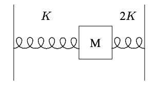

(ch-1)=

# 1. Harmonic Oscillation

Oscillators are the basic building blocks of waves. We begin by discussing the harmonic oscillator. We will identify the general principles that make the harmonic oscillator so special and important. To make use of these principles, we must introduce the mathematical device of complex numbers. But the advantage of introducing this mathematics is that we can understand the solution to the harmonic oscillator problem in a new way. We show that the properties of linearity and time translation invariance lead to solutions that are complex exponential functions of time.

::::{admonition} Chapter Preview
:class: preview

In this chapter, we discuss harmonic oscillation in systems with only one degree of freedom.

1. We begin with a review of the simple harmonic oscillator, noting that the equation of motion of a free oscillator is linear and invariant under time translation;

2. We discuss linearity in more detail, arguing that it is the generic situation for small oscillations about a point of stable equilibrium;

3. We discuss time translation invariance of the harmonic oscillator, and the connection between harmonic oscillation and uniform circular motion;

4. We introduce complex numbers, and discuss their arithmetic;

5. Using complex numbers, we find solutions to the equation of motion for the harmonic oscillator that behave as simply as possible under time translations. We call these solutions “irreducible.” We show that they are actually complex exponentials.

6. We discuss an $LC$ circuit and draw an analogy between it and a system of a mass and springs.

7. We discuss units.

8. We give one simple example of a nonlinear oscillator.
::::

## 1.1: The Harmonic Oscillator

When you studied mechanics, you probably learned about the harmonic oscillator. We will begin our study of wave phenomena by reviewing this simple but important physical system. Consider a block with mass, m, free to slide on a frictionless air-track, but attached to a $light^1$ Hooke’s law spring with its other end attached to a fixed wall. A cartoon representation of this physical system is shown in [figure 1.1](#fig-1-1).

$^1$ "Light" here means that the mass of the spring is small enough to be ignored in the analysis of the motion of the block. We will explain more precisely what this means in chapter 7 when we discuss waves in a massive spring.

:::{figure} ../images/lt-23883-screen_shot_2021-03-24_at_9.35.31_pm.png
:label: fig-1-1
:enumerator: 1.1
:alt: A mass on a spring

A mass on a spring
:::

This system has only one relevant degree of freedom. In general, the number of **degrees of freedom** of a system is the number of coordinates that must be specified in order to determine the configuration completely. In this case, because the spring is light, we can assume that it is uniformly stretched from the fixed wall to the block. Then the only important coordinate is the position of the block. In this situation, gravity plays no role in the motion of the block. The gravitational force is canceled by a vertical force from the air track. The only relevant force that acts on the block comes from the stretching or compression of the spring. When the spring is relaxed, there is no force on the block and the system is in equilibrium. Hooke’s law tells us that the force from the spring is given by a negative constant, −K, times the displacement of the block from its equilibrium position. Thus if the position of the block at some time is x and its equilibrium position is $x_0$, then the force on the block at that moment is:

$$
F=-K(x-x_0) \tag{1.1} \label{eq-1-1}
$$

The constant, K, is called the “spring constant.” It has units of force per unit distance, or $MT^{−2}$ in terms of M (the unit of mass), L (the unit of length) and T (the unit of time). We can always choose to measure the position, x, of the block with our origin at the equilibrium position. If we do this, then $x_o = 0$ in (1.1.1) and the force on the block takes the simpler form.

$$
F=-Kx \tag{1.2} \label{eq-1-2}
$$

Harmonic oscillation results from the interplay between the Hooke’s law force and Newton’s law, $F = ma$. Let x(t) be the displacement of the block as a function of time, t. Then Newton’s law implies

$$
m\frac{d^2}{dt^2}x(t) = -K x(t) \tag{1.3} \label{eq-1-3}
$$

An equation of this form, involving not only the function x(t), but also its derivatives is called a “differential equation.” The differential equation, (1.1.3), is the “equation of motion” for the system of [figure 1.1](#fig-1-1). Because the system has only one degree of freedom, there is only one equation of motion. In general, there must be one equation of motion for each independent coordinate required to specify the configuration of the system. The most general solution to the differential equation of motion, (1.1.3), is a sum of a constant times cos ωt plus a constant times sin ωt,

$$
x(t) = a \cos(ωt) + b \sin (ωt) \tag{1.4} \label{eq-1-4}
$$

where

$$
ω ≡ \sqrt{\frac{K}{m}} \tag{1.5} \label{eq-1-5}
$$

is a constant with units of $T^{-1}$ called the “angular frequency.” The angular frequency will be a very important quantity in our study of wave phenomena. We will almost always denote it by the lower case Greek letter, ω (omega).

Because the equation involves a second time derivative but no higher derivatives, the most general solution involves two constants. This is just what we expect from the physics, because we can get a different solution for each value of the position and velocity of the block at the starting time. Generally, we will think about determining the solution in terms of the position and velocity of the block when we first get the motion started, at a time that we conventionally take to be t=0 For this reason, the process of determining the solution in terms of the position and velocity at a given time is called the “initial value problem.” The values of position and velocity at t = 0 are called initial conditions. For example, we can write the **most general solution**, (1.1.4), in terms of x(0) and x'(0), the displacement and velocity of the block at time t = 0. Setting t = 0 in (1.1.4) gives a = x(0). Differentiating and then setting t = 0 gives $b = ω x'(0)$. Thus

$$
x(t) = x(0)\cosωt +\frac{1}{w}x'(0)\sinωt \tag{1.6} \label{eq-1-6}
$$

For example, suppose that the block has a mass of 1 kilogram and that the spring is 0.5 meters $long^2$ with a spring constant K of 100 newtons per meter. To get a sense of what this spring constant means, consider hanging the spring vertically (see [problem 1.1](#prb-1-1)). The gravitational force on the block is

$^2$(The length of the spring plays no role in the equations below, but we include it to allow you to build a mental picture of the physical system)

$$
mg ≈ 9.8 newtons \tag{1.7} \label{eq-1-7}
$$

In equilibrium, the gravitational force cancels the force from the spring, thus the spring is stretched by

$$
\frac{mg}{K} ≈ 0.098 meters = 9.8 centimeters \tag{1.8} \label{eq-1-8}
$$

For this mass and spring constant, the angular frequency, ω, of the system in [figure 1.1](#fig-1-1) is

$$
ω = \sqrt{\frac{K}{m}} = \sqrt{\frac{100\frac{N}{m}}{1 kg}} = 10\frac{1}{s} \tag{1.9} \label{eq-1-9}
$$

If, for example, the block is displaced by 0.01 m (1 cm) from its equilibrium position and released from rest at time, t = 0, the position at any later time t is given (in meters) by

$$
x(t) = 0.01 \cdot \cos(10t) \tag{1.10} \label{eq-1-10}
$$

The velocity (in meters per second) is

$$
x'(t) = -0.1 \cdot \sin(10t) \tag{1.11} \label{eq-1-11}
$$

The motion is periodic, in the sense that the system oscillates — it repeats the same motion over and over again indefinitely. After a time

$$
τ = \frac{2π}{ω} ≈ 0.628 s \tag{1.12} \label{eq-1-12}
$$

the system returns exactly to where it was at t = 0, with the block instantaneously at rest with displacement 0.01 meter. The time, τ (Greek letter tau) is called the “period” of the oscillation. However, the solution, (1.1.6), is more than just periodic. It is “simple harmonic” motion, which means that only a single frequency appears in the motion. The angular frequency, ω, is the inverse of the time required for the phase of the wave to change by one radian. The “frequency”, usually denoted by the Greek letter, $ν$ (nu), is the inverse of the time required for the phase to change by one complete cycle, or $2π$ radians, and thus get back to its original state. The frequency is measured in hertz, or cycles/second. Thus the angular frequency is **larger** than the frequency by a factor of $2π$,

$$
\omega\text{ (in radians/second)} = 2\pi\text{ (radians/cycle)} \cdot \nu\text{ (cycles/second)} \tag{1.13} \label{eq-1-13}
$$

The frequency, $ν$, is the inverse of the period, τ , of (1.1.12),

$$
ν = \frac{1}{τ} \tag{1.14} \label{eq-1-14}
$$

Simple harmonic motion like (1.1.6) occurs in a very wide variety of physical systems. The question with which we will start our study of wave phenomena is the following: **Why do solutions of the form of (1.1.6) appear so ubiquitously in physics? What do harmonically oscillating systems have in common?** Of course, the mathematical answer to this question is that all of these systems have equations of motion of essentially the same form as [1.3](#eq-1-3). We will find a deeper and more physical answer that we will then be able to generalize to more complicated systems. The key features that all these systems have in common with the mass on the spring are (at least approximate) linearity and time translation invariance of the equations of motion. It is these two features that determine oscillatory behavior in systems from springs to inductors and capacitors. Each of these two properties is interesting on its own, but together, they are much more powerful. They almost completely determine the form of the solutions. We will see that if the system is linear and time translation invariant, we can always write its motion as a sum of simple motions in which the time dependence is either harmonic oscillation or exponential decay (or growth).

## 1.2: Small Oscillations and Linearity

A system with one degree of freedom is **linear** if its equation of motion is a linear function of the coordinate, $x$, that specifies the system’s configuration. In other words, the equation of motion must be a sum of terms each of which contains at most one power of $x$. The equation of motion involves a second derivative, but no higher derivatives, so a linear equation of motion has the general form:

$$
α\frac{d^2}{dt^2}x(t) + β\frac{d}{dt}x(t) + γx(t) = f(t) \tag{1.15} \label{eq-1-15}
$$

If all of the terms involve exactly one power of x, the equation of motion is “homogeneous.” Equation (1) is not homogeneous because of the term on the right-hand side. The “inhomogeneous” term, f(t), represents an external force. The corresponding homogeneous equation would look like this:

$$
α\frac{d^2}{dt^2}x(t) + β\frac{d}{dt}x(t) + γx(t) = 0 \tag{1.16} \label{eq-1-16}
$$

In general, $α$, $β$ and $γ$ as well as $f$ could be functions of $t$. However, that would break the time translation invariance that we will discuss in more detail below and make the system much more complicated. We will almost always assume that $α$, $β$ and $γ$ are constants. The equation of motion for the mass on a spring, $m\frac{d^2}{dt^2}x(t) = -Kx(t)$, is of this general form, but with β and f equal to zero. As we will see in chapter 2, we can include the effect of frictional forces by allowing nonzero β, and the effect of external forces by allowing nonzero f. The linearity of the equation of motion, (1), implies that if $x_1(t)$ is a solution for external force $f_1(t)$,

$$
α\frac{d^2}{dt^2}x_1(t) + β\frac{d}{dt}x_1(t) + γx_1(t) = f_1(t) \tag{1.17} \label{eq-1-17}
$$

and $x_2(t)$ is a solution for external force $f_2(t)$,

$$
α\frac{d^2}{dt^2}x_2(t) + β\frac{d}{dt}x_2(t) + γx_2(t) = f_2(t) \tag{1.18} \label{eq-1-18}
$$

then the sum,

$$
x_{12}(t) = Ax_1(t) + Bx_2(t) \tag{1.19} \label{eq-1-19}
$$

for constants A and B is a solution for external force $Af_1 + Bf_2$,

$$
α\frac{d^2}{dt^2}x_{12}(t) + β\frac{d}{dt}x_{12}(t) + γx_{12}(t) = Af_1(t) + Bf_2(t) \tag{1.20} \label{eq-1-20}
$$

The sum $x_{12}(t)$ is called a “linear combination” of the two solutions, $x_1(t)$ and $x_2(t)$. In the case of “free” motion, which means motion with no external force, if $x_1(t)$ and $x_2(t)$ are solutions, then the sum, $A x_1(t) + B x_2(t)$ is also a solution.

The most general solution to any of these equations involves two constants that must be fixed by the initial conditions, for example, the initial position and velocity of the particle, as in $x(t) = x(0)\cos(ωt) + \frac{1}{ω}x'(0)\sin(ωt)$. It follows from (6) that we can always write the most general solution for any external force, f(t), as a sum of the “general solution” to the homogeneous equation, (2), and any “particular” solution to (1).

No system is exactly linear. “Linearity” is never exactly “true.” Nevertheless, the idea of linearity is extremely important, because it is a useful approximation in a very large number of systems, for a very good physical reason. In almost any system in which the properties are smooth functions of the positions of the parts, the small displacements from equilibrium produce approximately linear restoring forces. The difference between something that is “true” and something that is a useful approximation is the essential difference between physics and mathematics. **In the real world, the questions are much too interesting to have answers that are exact. If you can understand the answer in a well-defined approximation, you have learned something important.**

To see the generic nature of linearity, consider a particle moving on the x-axis with potential energy, $V (x)$. The force on the particle at the point, $x$, is minus the derivative of the potential energy,

$$
F = -\frac{d}{dx}V(x) \tag{1.21} \label{eq-1-21}
$$

A force that can be derived from a potential energy in this way is called a “conservative” force. At a point of equilibrium, $x_0$, the force vanishes, and therefore the derivative of the potential energy vanishes:

$$
F = -\frac{d}{dx}V(x)|_{x=x_0} = -V'(v_o) = 0 \tag{1.22} \label{eq-1-22}
$$

We can describe the small oscillations of the system about equilibrium most simply if we redefine the origin so that $x_0 = 0$. Then the displacement from equilibrium is the coordinate x. We can expand the force in a Taylor series:

$$
F(x) = -V'(x) = -V'(0) - xV''(0) - \frac{1}{2}x^2V'''(0) + ... \tag{1.23} \label{eq-1-23}
$$

The first term in (9) vanishes because this system is in equilibrium at x = 0, from (8). The second term looks like Hooke’s law with

$$
K = V''(0) \tag{1.24} \label{eq-1-24}
$$

The equilibrium is stable if the second derivative of the potential energy is positive, so that $x = 0$ is a local minimum of the potential energy. The important point is that for sufficiently small x, the third term in (9), and all subsequent terms will be much smaller than the second. The third term is negligible if

$$
|xV'''(0)| <<V''(0) \tag{1.25} \label{eq-1-25}
$$

Typically, each extra derivative will bring with it a factor of 1/L, where L is the distance over which the potential energy changes by a large fraction. Then (11) becomes

$$
x<<L \tag{1.26} \label{eq-1-26}
$$

There are only two ways that a force derived from a potential energy can fail to be approximately linear for sufficiently small oscillations about stable equilibrium:

1. If the potential is not smooth so that the first or second derivative of the potential is not well defined at the equilibrium point, then we cannot do a Taylor expansion and the argument of (9) does not work. We will give an example of this kind at the end of this chapter.

2. Even if the derivatives exist at the equilibrium point, x = 0, it may happen that $V''(0) = 0$. In this case, to have a stable equilibrium, we must have $V'''(0) = 0$ as well, otherwise a small displacement in one direction or the other would grow with time. Then the next term in the Taylor expansion dominates at small $x$, giving a force proportional to $x^3$.

:::{figure} ../images/lt-23881-screen_shot_2021-03-24_at_9.08.50_pm.png
:label: fig-1-2
:enumerator: 1.2
:alt: The potential energy of (13)

The potential energy of (13)
:::

Both of these exceptional cases are very rare in nature. Usually, the potential energy is a smooth function of the displacement and there is no reason for V''(0) to vanish. The generic situation is that small oscillations about stable equilibrium are linear.

An example may be helpful. Almost any potential energy function with a point of stable equilibrium will do, so long as it is smooth. For example, consider the following potential energy

$$
V(x) = E(\frac{L}{x} + \frac{x}{L}) \tag{1.27} \label{eq-1-27}
$$

This is shown in [figure 1.2](#fig-1-2). The minimum (at least for positive $x$) occurs at $x=L$, so we first redefine $x= X + L$, so that

$$
V(X) = E(\frac{L}{X+L} + \frac{X+L}{L}) \tag{1.28} \label{eq-1-28}
$$

The corresponding force is

$$
F(X) = E(\frac{L}{(X+L)^2} - \frac{1}{L}) \tag{1.29} \label{eq-1-29}
$$

we can look near $X = 0$ and expand in a Taylor Series:

$$
F(X) = -2\frac{E}{L}(\frac{X}{L}) + 3\frac{E}{L}(\frac{X}{L})^2 + ... \tag{1.30} \label{eq-1-30}
$$

Now, the ratio of the first nonlinear term to the linear term is

$$
\frac{3X}{2L} \tag{1.31} \label{eq-1-31}
$$

which is small if X<<L.

In other words, the closer you are to the equilibrium point, the closer the actual potential energy is to the parabola that we would expect from the potential energy for a linear, Hooke’s law force. You can see this graphically by blowing up a small region around the equilibrium point. In [figure 1.3](#fig-1-3), the dotted rectangle in [figure 1.2](#fig-1-2) has been blown up into a square. Note that it looks much more like a parabola than [figure 1.3](#fig-1-3). If we repeated the procedure and again expanded a small region about the equilibrium point, you would not be able to detect the cubic term by eye.

:::{figure} ../images/lt-23882-screen_shot_2021-03-24_at_9.17.43_pm.png
:label: fig-1-3
:enumerator: 1.3
:alt: The small dashed rectangle in [figure 1.2](#fig-1-2) expanded

The small dashed rectangle in [figure 1.2](#fig-1-2) expanded
:::

Often, the linear approximation is even better, because the term of order $x^2$ vanishes by symmetry. For example, when the system is symmetrical about x = 0, so that $V(x) = V(-x)$, the order $x^3$ term (and all $x^n$ for $n$ odd) in the potential energy vanishes, and then there is no order $x^2$ term in the force.

For a typical spring, linearity (Hooke’s law) is an excellent approximation for small displacements. However, there are always nonlinear terms that become important if the displacements are large enough. Usually, in this book we will simply stick to small oscillations and assume that our systems are linear. However, you should not conclude that the subject of nonlinear systems is not interesting. In fact, it is a very active area of current research in physics.

## 1.3: Time Translation Invariance

1.3: Time Translation Invariance

1.3.1 Uniform Circular Motion

When $α$, $β$ and $γ$ in $α\frac{d^2}{dt^2}x(t) + β\frac{d}{dt}x(t) + γx(t) = f(t)$ do not depend on the time, t, and in the absence of an external force, that is for free motion, time enters in ($α\frac{d^2}{dt^2}x(t) + β\frac{d}{dt}x(t) + γx(t) = f(t)$ only through derivatives. Then the equation of motion has the form.

$$
α\frac{d^2}{dt^2}x(t) + β\frac{d}{dt}x(t) + γx(t) = 0 \tag{1.32} \label{eq-1-32}
$$

The equation of motion for the undamped harmonic oscillator, [1.3](#eq-1-3), has this form with α = m, β = 0 and γ = K. Solutions to [1.32](#eq-1-32) have the property that

If x(t) is a solution, x(t + a) will be a solution also.

$$
\frac{d}{dt}x(t + a) = [\frac{d}{dt}(t + a)] [\frac{d}{dt'}x(t')]_{t'=t+a} = [\frac{d}{dt'}x(t')]_{t'=t+a} \tag{1.33} \label{eq-1-33}
$$

The physical reason for [1.33](#eq-1-33) is that we can change the initial setting on our clock and the physics will look the same. The solution $x(t + a)$ can be obtained from the solution $x(t)$ by changing the clock setting by a. The time label has been “translated” by a. We will refer to the property, [1.33](#eq-1-33), as**time translation invariance.**

Most physical systems that you can think of are time translation invariant in the absence of an external force. To get an oscillator without time translation invariance, you would have to do something rather bizarre, such as somehow making the spring constant depend on time.

For the free motion of the harmonic oscillator, although the equation of motion is certainly time translation invariant, the manifestation of time translation invariance on the solution, [1.6](#eq-1-6) is not as simple as it could be. The two parts of the solution, one proportional to $\cos (ωt)$ and the other to $\sin (ωt)$, get mixed up when the clock is reset. For example,

$$
\cos[ω(t + a)] = (\cos ωa) (\cos ωt) − (\sin ωa) (\sin ωt). \tag{1.34} \label{eq-1-34}
$$

It will be very useful to find another way of writing the solution that behaves more simply under resetting of the clocks. To do this, we will have to work with complex numbers.

To motivate the introduction of complex numbers, we will begin by exhibiting the relation between simple harmonic motion and uniform circular motion. Consider uniform circular motion in the x-y plane around a circle centered at the origin, $x = y = 0$, with radius R and with clockwise velocity $v = Rω$. The x and y coordinates of the motion are

$$
x(t) = R \cos(ωt − φ), y(t) = −R \sin(ωt − φ), \tag{1.35} \label{eq-1-35}
$$

where $φ$ is the counterclockwise angle in radians of the position at $t = 0$ from the positive x axis. The $x(t)$ in [1.36](#eq-1-36) is identical to the $x(t)$ in [1.6](#eq-1-6) with

$$
x(0) = R \cos φ , x'(0) = ωR \sin φ . \tag{1.36} \label{eq-1-36}
$$

Simple harmonic motion is equivalent to **one component** of uniform circular motion. This relation is illustrated in [figure 1.4](#fig-1-4) and in program 1-1 on the programs disk. As the point moves around the circle at constant velocity, $Rω$, the $x$ coordinate executes simple harmonic motion with angular velocity $ω$. If we wish, we can choose the two constants required to fix the solution of [1.3](#eq-1-3) to be $R$ and $φ$, instead of $x(0)$ and $x'(0)$. In this language, the action of resetting of the clock is more transparent. Resetting the clock changes the value of $φ$ without changing anything else.

(fig-1-4)=

*The relation between uniform circular motion and simple harmonic motion.*

**But we would like even more.** The key idea is that linearity allows us considerable freedom. We can add solutions of the equations of motion together and multiply them by constants, and the result is still a solution. We would like to use this freedom to choose solutions that behave as simply as possible under time translations.

The simplest possible behavior for a solution $z(t)$ under time translation is

$$
z(t + a) = h(a) z(t). \tag{1.37} \label{eq-1-37}
$$

That is, we would like find a solution that reproduces itself up to an overall constant, $h(a)$ when we reset our clocks by $a$. Because we are always free to multiply a solution of a homogeneous linear equation of motion by a constant, the change from $z(t)$ to $h(a) z(t)$ doesn’t amount to much. We will call a solution satisfying [1.38](#eq-1-38) an “irreducible3 solution” with respect to time translations, because its behavior under time translations (resettings of the clock) is as simple as it can possibly be.

It turns out that for systems whose equations of motion are linear and time translation invariant, as we will see in more detail below, we can always find irreducible solutions that

*________________________*

*3The word “irreducible” is borrowed from the theory of group representations. In the language of group theory, the irreducible solution is an “irreducible representation of the translation group.” It just means “as simple as possible.”*

have the property, [1.38](#eq-1-38). However, for simple harmonic motion, this requires complex numbers. You can see this by noting that changing the clock setting by $π/ω$ just changes the sign of the solution with angular frequency $ω$, because both the $\cos$ and $\sin$ terms change sign:

$$
\cos(ωt + π) = − \cos ωt, \sin(ωt + π) = − \sin ωt. \tag{1.38} \label{eq-1-38}
$$

But then from [1.38](#eq-1-38) and [1.39](#eq-1-39), we can write

$$
−z(t) = z(t + π/ω) = z(t + π/2ω + π/2ω) \tag{1.39} \label{eq-1-39}
$$

$$
= h(π/2ω) z(t + π/2ω) = h(π/2ω)^2 z(t). \tag{1.40} \label{eq-1-40}
$$

Thus we cannot find such a solution unless $h(π/2ω)$ has the property

$$
[h(π/2ω)]^2 = −1. \tag{1.41} \label{eq-1-41}
$$

The square of $h(π/2ω)$ is −1! Thus we are forced to consider complex numbers.4 When we finish introducing complex numbers, we will come back to [1.38](#eq-1-38) and show that we can **always** find solutions of this form for systems that are linear and time translation invariant.

*________________________*

*4The connection between complex numbers and uniform circular motion has been exploited by Richard Feynman in his beautiful little book, **QED**.*

## 1.4: Complex Numbers

The square root of −1, called $i$, is important in physics and mathematics for many reasons. Measurable physical quantities can always be described by real numbers. You never get a reading of $i$ meters on your meter stick. However, we will see that when $i$ is included along with real numbers and the usual arithmetic operations (addition, subtraction, multiplication and division), then algebra, trigonometry and calculus all become simpler. While complex numbers are not necessary to describe wave phenomena, they will allow us to discuss them in a simpler and more insightful way.

### Some Definitions

**An imaginary number** is a number of the form $i$ times a real number.

**A complex number**, $z$, is a sum of a real number and an imaginary number: $z = a + ib.$

**The real and “imaginary” parts**, $Re (z)$ and $Im (z)$, of the complex number $z = a+ib:$

$$
Re (z) = a , Im (z) = b. \tag{1.42} \label{eq-1-42}
$$

Note that the imaginary part is actually a real number, the real coefficient of $i$ in $z = a + ib.$

**The complex conjugate**, $z^*$, of the complex number $z$, is obtained by changing the sign of $i$:

$$
z^* = a − ib. \tag{1.43} \label{eq-1-43}
$$

Note that $Re (z) = (z + z^*)/2$ and $Im (z) = (z − z^*)/2i.$

**The complex plane:**Because a complex number $z$ is specified by two real numbers, it can be thought of as a two-dimensional vector, with components $(a, b)$. The real part of $z$, $a = Re (z)$, is the $x$ component and the imaginary part of $z$, $b = Im (z)$, is the $y$ component. The diagrams in figures 1.5 and 1.6 show two vectors in the complex plane along with the corresponding complex numbers:

**The absolute value,** $|z|$, of $z$, is the length of the vector $(a, b)$:

$$
|z| = \sqrt{a^2 + b^2} = \sqrt{z^* z}. \tag{1.44} \label{eq-1-44}
$$

The absolute value $|z|$ is always a real, non-negative number.

(fig-1-5)=

*A vector with positive real part in the complex plane.*

**The argument or phase, arg$(z)$,** of a nonzero complex number $z$, is the angle, in radians, of the vector $(a, b)$ counterclockwise from the $x$ axis:

$$
\arg(z) = \begin{cases}
\arctan(b/a) & \text{for } a \geq 0, \\
\arctan(b/a) + \pi & \text{for } a < 0.
\end{cases} \tag{1.45} \label{eq-1-45}
$$

Like any angle, $arg(z)$ can be redefined by adding a multiple of $2π$ radians or 360◦ (see [figure 1.5](#fig-1-5) and 1.6).

(fig-1-6)=

*A vector with negative real part in the complex plane.*

### Arithmetic

The arithmetic operations addition, subtraction and multiplication on complex numbers are defined by just treating the $i$ like a variable in algebra, using the distributive law and the relation $i^2 = −1.$ Thus if $z = a + ib$ and $z' = a' + ib'$, then

$$
z + z' = (a + a') + i(b + b'), \tag{1.46} \label{eq-1-46}
$$

$$
z − z' = (a − a') + i(b − b'), \tag{1.47} \label{eq-1-47}
$$

$$
zz' = (aa' − bb' ) + i(ab' + ba'). \tag{1.48} \label{eq-1-48}
$$

For example:

$$
(3 + 4i) + (−2 + 7i) = (3 − 2) + (4 + 7)i = 1 + 11i , \tag{1.49} \label{eq-1-49}
$$

$$
(3 + 4i) · (5 + 7i) = (3 · 5 − 4 · 7) + (3 · 7 + 4 · 5)i = −13 + 41i. \tag{1.50} \label{eq-1-50}
$$

It is worth playing with complex multiplication and getting to know the complex plane. At this point, you should check out program 1-2.

Division is more complicated. To divide a complex number $z$ by a real number $r$ is easy, just divide both the real and the imaginary parts by $r$ to get $z/r = a/r + ib/r.$ To divide by a complex number, $z'$, we can use the fact that $z'^* z' = |z'|^2$ is real. If we multiply the numerator and the denominator of $z/z' by z'^*$, we can write:

$$
z/z' = z'^*z/|z'|^2 = (aa' + bb' )/(a'^2 + b'^2) + i(ba' − ab' )/(a'^2 + b'^2). \tag{1.51} \label{eq-1-51}
$$

For example:

$$
(3 + 4i)/(2 + i) = (3 + 4i) · (2 − i)/5 = (10 + 5i)/5 = 2 + i . \tag{1.52} \label{eq-1-52}
$$

With these definitions for the arithmetic operations, the absolute value behaves in a very simple way under multiplication and division. Under multiplication, the absolute value of a product of two complex numbers is the product of the absolute values:

$$
|z z' | = |z| |z' | . \tag{1.53} \label{eq-1-53}
$$

Division works the same way so long as you don’t divide by zero:

$$
|z/z' | = |z|/|z' | **if z'=0** . \tag{1.54} \label{eq-1-54}
$$

Mathematicians call a set of objects on which addition and multiplication are defined and for which there is an absolute value satisfying [1.51](#eq-1-51) and [1.52](#eq-1-52) a division algebra. It is a peculiar (although irrelevant, for us) mathematical fact that the complex numbers are one of only four division algebras, the others being the real numbers and more bizarre things called quaternions and octonians obtained by relaxing the requirements of commutativity and associativity (respectively) of the multiplication laws.

The wonderful thing about the complex numbers from the point of view of algebra is that all polynomial equations have solutions. For example, the equation $x^2 − 2x + 5 = 0$ has no solutions in the real numbers, but has two complex solutions, $x = 1 ± 2i.$ In general, an equation of the form $p(x) = 0$, where $p(x)$ is a polynomial of degree $n$ with complex (or real) coefficients has $n$ solutions if complex numbers are allowed, but it may not have any if $x$ is restricted to be real.

Note that the complex conjugate of any sum, product, etc, of complex numbers can be obtained simply by changing the sign of $i$ wherever it appears. This implies that if the polynomial $p(z)$ has real coefficients, the solutions of $p(z) = 0$ come in complex conjugate pairs. That is, if $p(z) = 0$, then $p(z^*) = 0$ as well.

### Complex Exponentials

Consider a complex number $z = a + ib$ with absolute value 1. Because $|z| = 1$ implies $a^2 + b^2 = 1$, we can write $a$ and $b$ as the cosine and sine of an angle $θ$.

$$
z = \cos θ + i\sin θ for |z| = 1 . \tag{1.55} \label{eq-1-55}
$$

Because

$$
\tan θ = \frac{\sin θ}{\cos θ} = \frac{b}{a} \tag{1.56} \label{eq-1-56}
$$

the angle $θ$ is the argument of $z$:

$$
arg(\cos θ + i\sin θ) = θ . \tag{1.57} \label{eq-1-57}
$$

Let us think about $z$ as a function of $θ$ and consider the calculus. The derivative with respect to $θ$ is:

$$
\frac{∂}{∂θ} (\cos θ + i\sin θ) = − \sin θ + i \cos θ = i(\cos θ + i\sin θ) \tag{1.58} \label{eq-1-58}
$$

A function that goes into itself up to a constant under differentiation is an exponential. In particular, if we had a function of $θ$, $f(θ)$, that satisfied $\frac{∂}{∂θ} f(θ) = kf(θ)$ for real $k$, we would conclude that $f(θ) = e^{kθ}.$ Thus if we want the calculus to work in the same way for complex numbers as for real numbers, we must conclude that

$$
e^{iθ} = \cos θ + i\sin θ. \tag{1.59} \label{eq-1-59}
$$

We can check this relation by noting that the Taylor series expansions of the two sides are equal. The Taylor expansion of the exponential, cos, and sin functions are:

$$
e^x = 1 + x + \frac{x^2}{2} + \frac{x^3}{3!} + \frac{x^4}{4!} + … \tag{1.60} \label{eq-1-60}
$$

$$
\cos(x) = 1 - \frac{x^2}{2} + \frac{x^4}{4!} + … \tag{1.61} \label{eq-1-61}
$$

$$
\sin(x) = x - \frac{x^3}{3!} + … \tag{1.62} \label{eq-1-62}
$$

Thus the Taylor expansion of the left side of [1.57](#eq-1-57) is

$$
1 + iθ + (iθ)^2/2 + (iθ)^3/3! + ... \tag{1.63} \label{eq-1-63}
$$

while the Taylor expansion of the right side is

$$
(1 − θ^2/2 + ...) + i(θ − θ^3/6 +...) \tag{1.64} \label{eq-1-64}
$$

The powers of $i$ in [1.59](#eq-1-59) work in just the right way to reproduce the pattern of minus signs in [1.60](#eq-1-60).

Furthermore, the multiplication law works properly:

$$
e^{iθ}e^{iθ'} = (\cos θ + i\sin θ)(\cos θ' + i\sin θ' ) \tag{1.65} \label{eq-1-65}
$$

$$
= (\cos θ \cos θ' − \sin θ \sin θ' ) + i(\sin θ \cos θ' + \cos θ \sin θ' ) \tag{1.66} \label{eq-1-66}
$$

$$
= \cos(θ + θ' ) + i\sin(θ + θ' ) = e^{i(θ + θ')} . \tag{1.67} \label{eq-1-67}
$$

Thus [1.57](#eq-1-57) makes sense in all respects. This connection between complex exponentials and trigonometric functions is called Euler’s Identity. It is extremely useful. For one thing, the logic can be reversed and the trigonometric functions can be “defined” algebraically in terms of complex exponentials:

$$
\cosθ = \frac{e^{iθ} + e^{-iθ}}{2} \tag{1.68} \label{eq-1-68}
$$

$$
\sinθ = \frac{e^{iθ} - e^{-iθ}}{2i} = -i \frac{e^{iθ} - e^{-iθ}}{2} \tag{1.69} \label{eq-1-69}
$$

Using [1.62](#eq-1-62), trigonometric identities can be derived very simply. For example:

$$
\cos 3θ = Re (e^{3iθ}) = Re ((e^{iθ})^3) = \cos^3 θ − 3 \cos θ \sin^2 θ . \tag{1.70} \label{eq-1-70}
$$

Another example that will be useful to us later is:

$$
\cos(θ + θ') + \cos(θ - θ') = (e^{i(θ+θ')} + e^{−i(θ+θ')} + e^{i(θ-θ')} + e^{−i(θ-θ')}) / 2 \tag{1.71} \label{eq-1-71}
$$

$$
= (e^{iθ} + e^{-iθ})(e^{iθ'} + e^{-iθ'}) / 2 = 2 \cosθ \cosθ'. \tag{1.72} \label{eq-1-72}
$$

Every nonzero complex number can be written as the product of a positive real number (its absolute value) and a complex number with absolute value 1. Thus

$$
z = x + iy = R e^{iθ} where R = |z| , and θ = arg(z). \tag{1.73} \label{eq-1-73}
$$

In the complex plane, [1.65](#eq-1-65) expresses the fact that a two-dimensional vector can be written either in Cartesian coordinates, $(x, y)$, or in polar coordinates, $(R, θ)$. For example, $\sqrt{3}+i = 2e^{i\pi/6}$; $1 + i = \sqrt{2}e^{i\pi/4}$; $-8i = 8e^{3i\pi/2} = 8e^{-i\pi/2}$. [Figure 1.7](#fig-1-7) shows the complex number $1 + i = \sqrt{2}e^{i\pi/4}$.

The relation, [1.65](#eq-1-65), gives another useful way of thinking about multiplication of complex numbers. If

$$
z_1 = R_1e^{iθ_1} and z_2 = R_2e^{iθ_2} , \tag{1.74} \label{eq-1-74}
$$

then

$$
z_1z_2 = R_1R_2e^{i(θ_1+θ_2)} . \tag{1.75} \label{eq-1-75}
$$

In words, to multiply two complex numbers, you multiply the absolute values and add the arguments. You should now go back and play with program 1-2 with this relation in mind.

Equation [1.57](#eq-1-57) yields a number of relations that may seem surprising until you get used to them. For example: $e^{iπ} = −1; e^{iπ/2} = i; e^{2iπ} = 1.$ These have an interpretation in the complex plane where $e^{iθ}$ is the unit vector $(\cos θ,\sin θ),$

## 1.5: Exponential Solutions

We are now ready to translate the conditions of linearity and time translation invariance into mathematics. What we will see is that the two properties of linearity and time translation invariance lead automatically to irreducible solutions satisfying [1.38](#eq-1-38), and furthermore that

(fig-1-8)=

*Some special complex exponential in the complex plane.*

these irreducible solutions are just exponential. We do not need to use any other details about the equation of motion to get this result. Therefore our arguments will apply to much more complicated situations, in which there is damping or more degrees of freedom or both. **So long as the system has time translation invariance and linearity, the solutions will be sums of irreducible exponential solutions.**

We have seen that the solutions of homogeneous linear differential equations with constant coefficients, of the form,

$$
M\frac{d^2}{dt^2} x(t) + K x(t) = 0, \tag{1.76} \label{eq-1-76}
$$

have the properties of linearity and time translation invariance. The equation of simple harmonic motion is of this form. The coordinates are real, and the constants $M$ and $K$ are real because they are physical things like masses and spring constants. However, we want to allow ourselves the luxury of considering complex solutions as well, so we consider the same equation with complex variables:

$$
M\frac{d^2}{dt^2} z(t) + K z(t) = 0. \tag{1.77} \label{eq-1-77}
$$

Note the relation between the solutions to [1.68](#eq-1-68) and [1.69](#eq-1-69). Because the coefficients $M$ and $K$ are real, for every solution, $z(t)$, of [1.69](#eq-1-69), the complex conjugate, $z(t)^*$, is also a solution. The differential equation remains true when the signs of all the $i$’s are changed.

From these two solutions, we can construct two real solutions:

$$
x_1(t) = Re (z(t)) = (z(t) + z(t)^*) /2 ; \tag{1.78} \label{eq-1-78}
$$

$$
x_2(t) = Im (z(t)) = (z(t) − z(t)^*) /2i. \tag{1.79} \label{eq-1-79}
$$

All this is possible because of linearity, which allows us to go back and forth from real to complex solutions by forming linear combinations, as in [1.70](#eq-1-70). These are solutions of [1.68](#eq-1-68). Note that $x_1(t)$ and $x_2(t)$ are just the real and imaginary parts of $z(t)$. **The point is that you can always reconstruct the physical real solutions to the equation of motion from the complex solution. You can do all of the mathematics using complex variables, which makes it much easier. Then at the end you can get the physical solution of interest just by taking the real part of your complex solution.**

Now back to the solution to [1.69](#eq-1-69). What we want to show is that we are led to irreducible, exponential solutions for any system with time translation invariance and linearity! Thus we will understand why we can always find irreducible solutions, not only in [1.69](#eq-1-69), but in much more complicated situations with damping, or more degrees of freedom.

There are two crucial elements:

1. Time translation invariance, [1.33](#eq-1-33), which requires that $x(t + a)$ is a solution if $x(t)$ is a solution;

2. Linearity, which allows us to form linear combinations of solutions to get new solutions.

We will solve [1.68](#eq-1-68) using only these two elements. That will allow us to generalize our solution immediately to **any** system in which the properties, [1.71](#eq-1-71), are present.

One way of using linearity is to choose a “basis” set of solutions, $x_j (t)$ for $j = 1$ to $n$ which is “complete” and “linearly independent.” For the harmonic oscillator, two solutions are all we need, so $n = 2.$ But our analysis will be much more general and will apply, for example, to linear systems with more degrees of freedom, so we will leave $n$ free. What “complete” means is that any solution, $z(t)$, (which may be complex) can be expressed as a linear combination of the $x_j (t)$’s,

$$
z(t) = \displaystyle \sum_{j=1}^n c_jx_j(t). \tag{1.80} \label{eq-1-80}
$$

What “linearly independent” means is that none of the $x_j (t)$’s can be expressed as a linear combination of the others, so that the only linear combination of the $x_j (t)$’s that vanishes is the trivial combination, with only zero coefficients,

$$
\displaystyle \sum_{j=1}^n c_jx_j(t) = 0 ⇒ c_j = 0. \tag{1.81} \label{eq-1-81}
$$

Now let us see whether we can find an irreducible solution that behaves simply under a change in the initial clock setting, as in [1.38](#eq-1-38),

$$
z(t + a) = h(a) z(t) \tag{1.82} \label{eq-1-82}
$$

for some (possibly complex) function $h(a)$. In terms of the basis solutions, this is

$$
z(t + a) = h(a) \displaystyle \sum_{k=1}^n c_kx_k(t). \tag{1.83} \label{eq-1-83}
$$

But each of the basis solutions also goes into a solution under a time translation, and each new solution can, in turn, be written as a linear combination of the basis solutions, as follows:

$$
x_j(t + a) = \displaystyle \sum_{k=1}^n R_{jk}(a)x_k(t). \tag{1.84} \label{eq-1-84}
$$

Thus

$$
z(t + a) = \displaystyle \sum_{j=1}^n c_jx_j(t+a) = \displaystyle \sum_{j,k=1}^n c_jR_{jk}(a)x_k(t). \tag{1.85} \label{eq-1-85}
$$

Comparing [1.75](#eq-1-75) and [1.77](#eq-1-77), and using [1.73](#eq-1-73), we see that we can find an irreducible solution if and only if

$$
\displaystyle \sum_{j=1}^n c_jR_{jk}(a) = h(a) c_k for all k. \tag{1.86} \label{eq-1-86}
$$

This is called an “eigenvalue equation.” We will have much more to say about eigenvalue equations in chapter 3, when we discuss matrix notation. For now, note that [1.78](#eq-1-78) is a set of $n$ homogeneous simultaneous equations in the $n$ unknown coefficients, $c_j$. We can rewrite it as

$$
\displaystyle \sum_{j=1}^n c_jS_{jk}(a) = 0 for all k, \tag{1.87} \label{eq-1-87}
$$

where

$$
S_{jk}(a) = \begin{cases} R_{jk}(a) for **j =/ k**, \\ R_{jk}(a) - h(a) for j = k. \end{cases} \tag{1.88} \label{eq-1-88}
$$

We can find a solution to [1.78](#eq-1-78) if and only if there is a solution of the determinantal equation[^1-5-5]

$$
det S_{jk}(a) = 0. \tag{1.89} \label{eq-1-89}
$$

___________________________

[^1-5-5]: We will discuss the determinant in detail in chapter 3, so if you have forgotten this result from algebra, don’t worry about it for now.

[1.81](#eq-1-81) is an $n$th order equation in the variable $h(a)$. It may have no real solution, but it always has $n$ complex solutions for $h(a)$ (although some of the $h(a)$ values may appear more than once). For each solution for $h(a)$, we can find a set of $c_j$s satisfying [1.78](#eq-1-78). The different linear combinations, $z(t)$, constructed in this way will be a linearly independent set of irreducible solutions, each satisfying [1.74](#eq-1-74), for some $h(a)$. If there are $n$ different $h(a)$s, the usual situation, they will be a complete set of irreducible solutions to the equations of motions. Then we may as well take our solutions to be irreducible, satisfying [1.74](#eq-1-74). We will see later what happens when some of the $h(a)$s appear more than once so that there are fewer than $n$ different ones.

Now for each such irreducible solution, we can see what the functions $h(a)$ and $z(a)$ must be. If we differentiate both sides of [1.74](#eq-1-74) with respect to $a$, we obtain

$$
z' (t + a) = h' (a) z(t). \tag{1.90} \label{eq-1-90}
$$

Setting $a = 0$ gives

$$
z' (t) = H z(t) \tag{1.91} \label{eq-1-91}
$$

where

$$
H ≡ h' (0). \tag{1.92} \label{eq-1-92}
$$

This implies

$$
z(t) ∝ e^{Ht} . \tag{1.93} \label{eq-1-93}
$$

Thus the irreducible solution is an exponential! **We have shown that [1.71](#eq-1-71) leads to irreducible, exponential solutions, without using any of details of the dynamics!**

### Building Up The Exponential

There is another way to see what [1.74](#eq-1-74) implies for the form of the irreducible solution that does not even involve solving the simple differential equation, [1.83](#eq-1-83). Begin by setting $t=0$ in [1.74](#eq-1-74). This gives

$$
h(a) = z(a)/z(0). \tag{1.94} \label{eq-1-94}
$$

$h(a)$ is proportional to $z(a)$. This is particularly simple if we choose to multiply our irreducible solution by a constant so that $z(0) = 1$. Then [1.86](#eq-1-86) gives

$$
h(a) = z(a) \tag{1.95} \label{eq-1-95}
$$

and therefore

$$
z(t + a) = z(t) z(a). \tag{1.96} \label{eq-1-96}
$$

Consider what happens for very small **$t =**ϵ**<< 1$**. Performing a Taylor expansion, we can write

**
$$
z(**ϵ**) = 1 + H**ϵ**+ O(**ϵ**^2) \tag{1.97} \label{eq-1-97}
$$
**

where H = z'(0) from [1.84](#eq-1-84) and [1.87](#eq-1-87). Using [1.88](#eq-1-88), we can show that

**
$$
z(N**ϵ**) = [z(**ϵ**)]^N. \tag{1.98} \label{eq-1-98}
$$
**

**Then for any $t$ we can write (taking t = N?)**

$$
z(t) = \displaystyle \lim_{N \to \infty}[z(t/N)]^N = \displaystyle \lim_{N\to \infty}[1+H(t/N)]^N = e^{(Ht)} \tag{1.99} \label{eq-1-99}
$$

Thus again, we see that the irreducible solution with respect to time translation invariance is just an exponential! 6

$$
z(t) = e^{Ht} \tag{1.100} \label{eq-1-100}
$$
.

### What is H?

When we put the irreducible solution, $e^{Ht}$, into [1.69](#eq-1-69), the derivatives just pull down powers of H so the equation becomes a purely algebraic equation (dropping an overall factor of $e^{Ht}$)

$$
MH^2 + K = 0 \tag{1.101} \label{eq-1-101}
$$

Now, finally, we can see the relevance of complex numbers to the above discussion of time translation invariance. For positive M and K, the equation [1.93](#eq-1-93) has no solutions at all if we restrict H to be real. We cannot find any real irreducible solutions. But there are always two solutions for H in the complex numbers. In this case, the solution is

$$
H=±iw \tag{1.102} \label{eq-1-102}
$$
 where 
$$
w=sqrt{\frac{K}{M}} \tag{1.103} \label{eq-1-103}
$$

It is only in this last step, where we actually compute H, that the details of [1.69](#eq-1-69) enter. Until [1.93](#eq-1-93), everything followed simply from the general principles, [1.71](#eq-1-71).

Now, as above, from these two solutions, we can construct two real solutions by taking the real and imaginary parts of $z(t) = e^{±iωt}$

$$
x_1(t) = Re (z(t)) = \cos ωt \tag{1.104} \label{eq-1-104}
$$
 , 
$$
x_2(t) = Im (z(t)) = ± \sin ωt \tag{1.105} \label{eq-1-105}
$$

Time translations mix up these two real solutions. That is why the irreducible complex exponential solutions are easier to work with. The quantity ω is the angular frequency that we saw in [1.5](#eq-1-5) in the solution of the equation of motion for the harmonic oscillator. Any linear combination of such solutions can be written in terms of an “amplitude” and a “phase” as follows: For real c and d

$$
c \cos(w) + d\sin(wt) = c(e^{iwt} +e^{-iwt})/2 - id((e^{iwt} +e^{-iwt})/2 \tag{1.106} \label{eq-1-106}
$$

$$
=Re ((c+id)(e^{=iwt}) = Re (Ae^{iθ}e^{-iwt}) \tag{1.107} \label{eq-1-107}
$$

$$
=Re (A e^{−i(ωt−θ)} ) = A \cos(ωt − θ) \tag{1.108} \label{eq-1-108}
$$

where A is a positive real number called the amplitude,

$$
A=sqrt{c^2+d^2} \tag{1.109} \label{eq-1-109}
$$

and θ is an angle called the phase,

These relations are another example of the equivalence of Cartesian coordinates and polar coordinates, discussed after [1.65](#eq-1-65). The pair, c and d, are the Cartesian coordinates in the complex plane of the complex number, c + id. The amplitude, A, and phase, θ, are the polar coordinate representation of the same complex [1.96](#eq-1-96) shows that c and d are also the coefficients of cos ωt and sin ωt in the real part of the product of this complex number with −iωt e . This relation is illustrated in [figure 1.9](#fig-1-9) (note the relation to [figure 1.4](#fig-1-4)). As z moves clockwise with constant angular velocity, ω, around the circle, |z| = A, in the complex plane, the real part of z undergoes simple harmonic motion, A cos(ωt − θ). Now that you know about complex numbers and complex exponentials, you should go back to the relation between simple harmonic motion and uniform circular motion illustrated in [figure 1.4](#fig-1-4) and in supplementary program 1-1. The uniform circular motion can interpreted as a motion in the complex plane of the

$$
z(t) = e^{-iwt} \tag{1.110} \label{eq-1-110}
$$

As t changes, z(t) moves with constant clockwise velocity around the unit circle in the complex plane. This is the clockwise motion shown in program 1-1. The real part, cos ωt, executes simple harmonic motion.

Note that we could have just as easily taken our complex solution to be $e^{+iwt}$. This would correspond to counterclockwise motion in the complex plane, but the real part, which is all that matters physically, would be unchanged. It is **conventional** in physics to go to complex solutions proportional to $e^{−iωt}$. This is purely a convention. There is no physics in it. However, it is sufficiently universal in the physics literature that we will try to do it consistently here.

:::{figure} ../images/lt-24242-screen_shot_2021-04-27_at_11.53.30_pm.png
:label: fig-1-9
:enumerator: 1.9
:alt: Figure

:::

## 1.6: LC Circuits

One of the most important examples of an oscillating system is an LC circuit. You probably studied these in your course on electricity and magnetism. Like a Hooke’s law spring, this system is linear, because the relations between charge, current, voltage, and the like for ideal inductors, capacitors and resistors are linear. Here we want to make explicit the analogy between a particular LC circuit and a system of a mass on a spring. The LC circuit with a resistance less inductor with an inductance L and a capacitor of capacitance C is shown in [figure 1.10](#fig-1-10). We might not ordinarily think of this as a circuit at all, because there is no battery or other source of electrical power. However, we could imagine, for example, that the capacitor was charged initially when the circuit was put together. Then current would flow when the circuit was completed. In fact, in the absence of resistance, the current would continue to oscillate forever. We shall see that this circuit is analogous to the combination of springs and a mass shown in [figure 1.11](#fig-1-11). The oscillation frequency of the mechanical system is

$$
w=\sqrt{\frac{K}{M}} \tag{1.111} \label{eq-1-111}
$$

:::{figure} ../images/lt-24243-screen_shot_2021-04-27_at_11.55.19_pm.png
:label: fig-1-10
:enumerator: 1.10
:alt: Figure

:::

We can describe the configuration of the mechanical system of [figure 1.10](#fig-1-10) in terms of x, the displacement of the block to the right. We can describe the configuration of the LC circuit of [figure 1.10](#fig-1-10) in terms of Q, the charge that has been “displaced” through the inductor from the equilibrium situation with the capacitor uncharged. In this case, the charge displaced through the inductor goes entirely onto the capacitor because there is nowhere else for it to go, as shown in [figure 1.12](#fig-1-12). The current through the inductor is the time derivative of the charge that has gone through,

$$
I=\frac{dQ}{dt} \tag{1.112} \label{eq-1-112}
$$

To see how the LC circuit works, we can examine the voltages at various points in the system, as shown in [figure 1.13](#fig-1-13). For an inductor, the voltage drop across it is the rate of:::{figure} ../images/lt-24244-screen_shot_2021-04-27_at_11.56.15_pm.png
:label: fig-1-11
:enumerator: 1.11
:alt: Figure

:::

change of current through it, or

$$
-L\frac{dI}{dt}=V \tag{1.113} \label{eq-1-113}
$$

For the capacitor, the stored charge is the voltage times the capacitance, or

$$
V=\frac{Q}{C} \tag{1.114} \label{eq-1-114}
$$

Putting [1.101](#eq-1-101), [1.102](#eq-1-102) and [1.103](#eq-1-103) together gives

$$
L\frac{dI}{dt}=L\frac{d^2Q}{dt^2} = -\frac{1}{C}Q \tag{1.115} \label{eq-1-115}
$$

The correspondence between the two systems is the following:

:::{figure} ../images/lt-24245-screen_shot_2021-04-27_at_11.58.17_pm.png
:label: fig-1-12
:enumerator: 1.12
:alt: Figure

:::

When we make the substitutions in [1.105](#eq-1-105), the equation of motion, [1.3](#eq-1-3), of the mass on a spring goes into [1.104](#eq-1-104). Thus, knowing the solution, [1.6](#eq-1-6), for the mass on a spring, we can immediately conclude that the displaced charge in this LC circuit oscillates with frequency

$$
w=\frac{1}{LC} \tag{1.116} \label{eq-1-116}
$$

## 1.7: Units - Displacement and energy

We have now seen two very different kinds of physical systems that exhibit simple harmonic oscillation. Others are possible as well, and we will give another example below. This is a good time to discuss the units of the equations of motions. The “generic” equation of motion for simple harmonic motion without damping looks like this

$$
M\frac{d^2X}{dt^2} = −K X \tag{1.117} \label{eq-1-117}
$$

where X is the generalized coordinate, M is the generalized mass, K is the generalized spring constant

In the simple harmonic motion of a point mass, X is just the displacement from equilibrium, x, M is the mass, m, and K is the spring constant, K. The appropriate units for M and K depend on the units for X . They are conventionally determined by the requirement that

$$
\frac{1}{2}M({\frac{dX}{dt}})^2 \tag{1.118} \label{eq-1-118}
$$

is the “kinetic” energy of the system arising from the change of the coordinate with time, and

$$
\frac{1}{2}KX^2 \tag{1.119} \label{eq-1-119}
$$

is the “potential” energy of the system, stored in the generalized spring. It makes good physical sense to grant the energy a special status in these problems because in the absence of friction and external forces, the total energy, the sum of the kinetic energy in [1.109](#eq-1-109) and the potential energy in [1.110](#eq-1-110), is constant. In the oscillation, the energy is alternately stored in kinetic energy and potential energy. When the system is in its equilibrium configuration, but moving with its maximum velocity, the energy is all kinetic. When the system instantaneously comes to rest at its maximum displacement, all the energy is potential energy. In fact, it is sometimes easier to identify M and K by calculating the kinetic and potential energies than by finding the equation of motion directly. We will use this trick in chapter 11 to discuss water waves. For example, in an LC circuit in SI units, we took our generalized coordinate to be a charge, $Q$, in Coulombs. Energy is measured in Joules or Volts×Coulombs. The generalized spring constant has units of

$$
\dfrac{\text{Joules}}{\text{Coulombs}^2} = \dfrac{\text{Volts}}{\text{Coulombs}} \tag{1.120} \label{eq-1-120}
$$

which is one over the unit of capacitance, Coulombs per Volt, or farads. The generalized mass has units of

$$
\dfrac{\text{Joules} \times \text{seconds}^2}{\text{Coulombs}^2} = \dfrac{\text{Volts} \times \text{seconds}^2}{\text{Amperes}} \tag{1.121} \label{eq-1-121}
$$

which is a unit of inductance (Henrys). This is what we used in our correspondence between the LC circuit and the mechanical oscillator, [1.105](#eq-1-105). We can also add a generalized force to the right-hand side of [1.107](#eq-1-107). The generalized force has units of energy over generalized displacement. This is right because when the equation of motion is multiplied by the displacement, [1.109](#eq-1-109) and [1.110](#eq-1-110) imply that each of the terms has units of energy. Thus for example, in the LC circuit example, the generalized force is a voltage.

### Constant Energy

The total energy is the sum of kinetic plus potential energy from [1.109](#eq-1-109) and [1.110](#eq-1-110),

$$
E=\frac{1}{2}M(\frac{dX}{dt})^2 +\frac{1}{2}KX^2 \tag{1.122} \label{eq-1-122}
$$

If there are no external forces acting on the system, the total energy must be constant. You can see from [1.113](#eq-1-113) that the energy can be constant for an oscillating solution only if the angular frequency, ω, is $/sqrt{\frac{K}{M}}$. Suppose, for example, that the generalized displacement of the system has the form

$$
X(t) = A\sin(wt) \tag{1.123} \label{eq-1-123}
$$

where A is an amplitude with the units of X . Then the generalized velocity, is

$$
\frac{d}{dt}X(t) = Awcos(wt) \tag{1.124} \label{eq-1-124}
$$

To make the energy constant, we must have

$$
K=w^2M
$$

Then, the total energy, from [1.109](#eq-1-109) and [1.110](#eq-1-110) is

$$
\frac{1}{2}Mw^2A^2\cos^2(wt) + \frac{1}{2}KA^2\sin^2(wt) = \frac{1}{2}KA^2
$$

### Torsion Pendulum

One more example may be useful. Let us consider the torsion pendulum, shown in [figure 1.14](#fig-1-14).

:::{figure} ../images/lt-24246-screen_shot_2021-04-28_at_12.10.53_am.png
:label: fig-1-14
:enumerator: 1.14
:alt: Figure

:::

A torsion pendulum is a simple but very useful oscillator consisting of a dumbbell or rod supported at its center by a wire or fiber, hung from a support above. When the dumbbell is twisted by an angle θ, as shown in the top view in [figure 1.14](#fig-1-14), the wire twists and provides a restoring torque on the dumbbell. For a suitable wire or fiber, this restoring torque is nearly linear even for rather large displacement angles. In this system, the natural variable to use for the displacement is the angle θ. Then the equation of motion is

$$
I\frac{d^2θ}{dt^2} = −αθ
$$

where I is the moment of inertia of the dumbbell about its center and −αθ is the restoring force. Thus the generalized mass is the moment of inertia, I, with units of length squared times mass and the generalized spring constant is the constant α, with units of torque. As expected, from [1.109](#eq-1-109) and [1.110](#eq-1-110), the kinetic energy and potential energy are (respectively)

$$
\frac{1}{2}(\frac{dθ}{dt})^2 and \frac{1}{2}αθ^2
$$

## 1.8: A Simple Nonlinear Oscillator

To illustrate some of the differences between linear and nonlinear oscillators, we will give one very simple example of a nonlinear oscillator. Consider the following nonlinear equation of motion:

$$
m \frac{d^{2}}{d t^{2}} x=\left\{\begin{array}{l}-F_{0} \text { for } x>0 \\ F_{0} \text { for } x<0 \\ 0 \text { for } x=0\end{array}\right.
$$

This describes a particle with mass, $m$, that is subject to a force to the left, $−F_0$, when the particle is to the right of the origin ($x(t) > 0$), a force to the right, $F_0$, when the particle is to the left of the origin ($x(t) < 0$), and no force when the particle is sitting right on the origin. The potential energy for this system grows linearly on both sides of x = 0. It cannot be differentiated at $x = 0$, because the derivative is not continuous there. Thus, we cannot expand the potential energy (or the force) in a Taylor series around the point $x = 0$, and the arguments of [1.21](#eq-1-21)-[1.24](#eq-1-24) do not apply. It is easy to find a solution of [1.120](#eq-1-120). Suppose that at time, $t = 0$, the particle is at the origin but moving with positive velocity, $v$. The particle immediately moves to the right of the origin and decelerates with constant acceleration, $\frac{−F_0}{m}$, so that

$$
x(t) = vt - \frac{F_o}{2m}t^2
$$

for $t ≤ τ$.

where

$$
τ=\frac{2mv}{F_o}
$$

is the time required for the particle to turn around and get back to the origin. At time, $t = τ$, the particle moves to the left of the origin. At this point it is moving with velocity, $−v$, the process is repeated for negative $x$ and positive acceleration $\frac{F_0}{m}$ Then the solution continues in the form

$$
x(t) = −v(t − τ ) + \frac{F_o}{2m}(t − τ )^2 for τ ≤ t ≤ 2τ
$$

Then the whole process repeats. The motion of the particle, shown in [figure 1.15](#fig-1-15), looks superficially like harmonic oscillation, but the curve is a sequence of parabolas pasted together, instead of a sine wave. The equation of motion, [1.120](#eq-1-120), is time translation invariant. Clearly, we can start the particle at the origin with velocity, v, at any time, t0. The solution then looks like that shown in [figure 1.15](#fig-1-15) but translated in time by $t_0$. The solution has the form

$$
x_{t0}(t) = x(t-t_o)
$$

where $x(t)$ is the function described by [1.121](#eq-1-121), [1.123](#eq-1-123), etc. This shown in [figure 1.16](#fig-1-16) for $t = t_0 = \frac{3τ}{4}$. The dotted curve corresponds to $t_0 = 0$

:::{figure} ../images/lt-24248-screen_shot_2021-04-28_at_12.18.41_am.png
:label: fig-1-15
:enumerator: 1.15
:alt: Figure

:::

Like the harmonic oscillator, this system oscillates regularly and indefinitely. However, in this case, the period of the oscillation, the time it takes to repeat, 2τ , depends on the amplitude of the oscillation, or equivalently, on the initial velocity, v. The period is proportional to v, from [1.122](#eq-1-122). The motion of the particle started from the origin at $t = t_0$, for an initial velocity v/2 is shown in [figure 1.17](#fig-1-17). The dotted curve corresponds to an initial velocity, v. While the nonlinear equation of motion, [1.120](#eq-1-120), is time translation invariant, the symmetry is much less useful because the system lacks linearity. From our point of view, the important thing about linearity (apart from the fact that it is a good approximation in so many important physical systems), is that it allows us to choose a convenient basis for the solutions to the equation of motion. We choose them to behave simply under time translations.

:::{figure} ../images/lt-24249-screen_shot_2021-04-28_at_12.19.36_am.png
:label: fig-1-16
:enumerator: 1.16
:alt: Figure

:::

Then, because of linearity, we can build up any solution as a linear combination of the basis solutions. In a situation like [1.120](#eq-1-120), we do not have this option.

(fig-1-13)=

(fig-1-17)=

(fig-1-7)=

::::{admonition} Chapter Checklist
:class: checklist

You should now be able to:

1. Analyze the physics of a harmonic oscillator, including finding the spring constant, setting up the equation of motion, solving it, and imposing initial conditions;

2. Find the approximate “spring constant” for the small oscillations about a point of equilibrium and estimate the displacement for which linearity breaks down;

3. Understand the connection between harmonic oscillation and uniform circular motion;

4. Use complex arithmetic and complex exponentials;

5. Solve homogeneous linear equations of motion using irreducible solutions that are complex exponentials;

6. Understand and explain the difference between frequency and angular frequency;

7. Analyze the oscillations of LC circuits;

8. Compute physical quantities for oscillating systems in SI units

9. Understand time translation invariance in nonlinear systems.
::::

## Problems

::::{exercise}
:label: prb-1-1
:enumerator: 1.1

For the mass and spring discussed [1.1](#eq-1-1)-[1.8](#eq-1-8), suppose that the system is hung vertically in the earth’s gravitational field, with the top of the spring held fixed. Show that the frequency for vertical oscillations is given by [1.5](#eq-1-5). Explain why gravity has no effect on the angular frequency.

::::

::::{exercise}
:label: prb-1-2
:enumerator: 1.2

a. Find an expression for cos 7θ in terms of cos θ and sin θ by using complex exponentials and the binomial expansion.

b. Do the same for sin 5θ.

c. Use complex exponentials to find an expression for $\sin(θ_1 + θ_2 + θ_3)$ in terms of the sines and cosines of the individual angles.

d. Do you remember the “half angle formula,”

$$
\cos^2\frac{θ}{2}=\frac{1}{2}(1+\cosθ)?
$$

Use complex exponentials to prove the "fifth angle formula,"

$$
\cos^5\frac{θ}{5}=\frac{10}{16}\cos\frac{θ}{5}+\frac{5}{16}\cos\frac{3θ}{5}+\frac{1}{16}\cosθ
$$
.

e. Use complex exponentials to prove the identity

$$
\sin6x=sinx(32\cos^5x - 23\cos^3x + 6cosx)
$$

::::

::::{exercise}
:label: prb-1-3
:enumerator: 1.3

a. Write $i+\sqrt{3}$ in the form $Re^{iθ}$. Write θ as a rational number times π

Do the same for $i-\sqrt{3}$

c. Show that the two square roots of $Re^{iθ} are ±\sqrt{Re^{\frac{iθ}{2}}}$. Hint: This is easy! Don’t work too hard.

d. Use the result of c. to find the square roots of 2i and $2 +2i\sqrt{3}$.

::::

::::{exercise}
:label: prb-1-4
:enumerator: 1.4

Find all six solutions to the equation $z^6 = 1$ and write each in the form A + iB and plot them in the complex plane. Hint: write $z = Re^{iθ}$ for R real and positive, and find R and θ.

::::

::::{exercise}
:label: prb-1-5
:enumerator: 1.5

Find three independent solutions to the differential equation

$$
\frac{d^3}{dt^3}f(t)+f(t) = 0
$$

You should use complex exponentials to derive the solutions, but express the results in real form.

::::

::::{exercise}
:label: prb-1-6
:enumerator: 1.6

A block of mass M slides without friction between two springs of spring constant K and 2K, as shown. The block is constrained to move only left and right on the paper, so the system has only one degree of freedom.

Calculate the oscillation angular frequency. If the velocity of the block when it is at its equilibrium position is v, calculate the amplitude of the oscillation.

::::

::::{exercise}
:label: prb-1-7
:enumerator: 1.7

A particle of mass m moves on the x axis with potential energy

$$
V(x)=\frac{E_o}{a^4}(x^4+4ax^3-8a^2x^2)
$$

Find the positions at which the particle is in stable equilibrium. Find the angular frequency of small oscillations about each equilibrium position. What do you mean by small oscillations? Be quantitative and give a separate answer for each point of stable equilibrium.

::::

::::{exercise}
:label: prb-1-8
:enumerator: 1.8

For the torsion pendulum of [figure 1.14](#fig-1-14), suppose that the pendulum consists of two 0.01 kg masses on a light rod of total length 0.1 m. If the generalized spring constant, α, is $5 × 10^{−7}$ N m. Find the angular frequency of the oscillator.

::::
