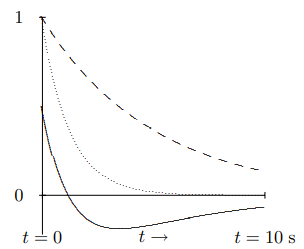
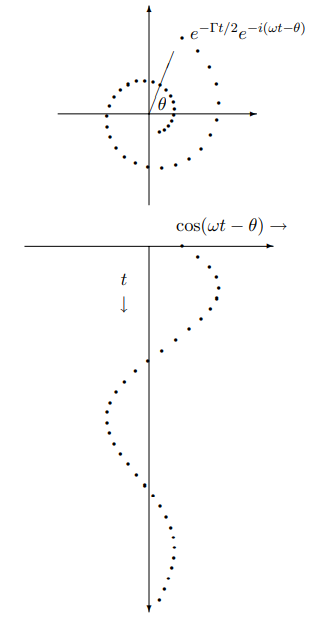
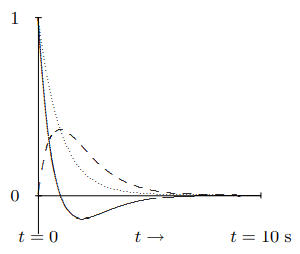
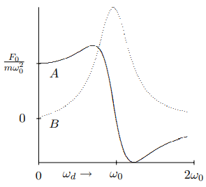
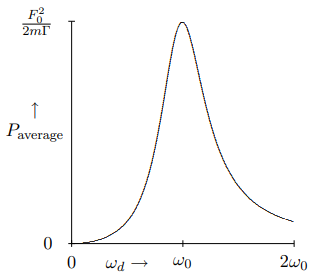
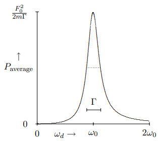
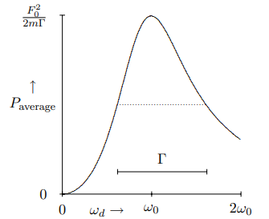
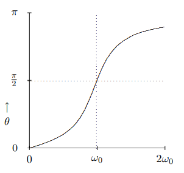
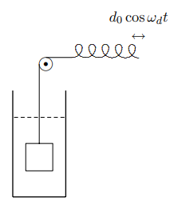
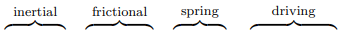

(ch-2)=

# 2. Forced Oscillation and Resonance

## 2.1: Damped Oscillators

Consider first the free oscillation of a damped oscillator. This could be, for example, a system of a block attached to a spring, like that shown in Figure $1.1$, but with the whole system immersed in a viscous fluid. Then in addition to the restoring force from the spring, the block experiences a frictional force. For small velocities, the frictional force can be taken to have the form 
$$
-m \Gamma v ,
$$

where $\Gamma$ is a constant. Notice that because we have extracted the factor of the mass of the block in (2.1), $1 / \Gamma$ has the dimensions of time. We can write the equation of motion of the system as 
$$
\frac{d^{2}}{d t^{2}} x(t)+\Gamma \frac{d}{d t} x(t)+\omega_{0}^{2} x(t)=0 ,
$$

where $\omega_{0}=\sqrt{K / m}$. This equation is linear and time translation invariant, like the undamped equation of motion. In fact, it is just the form that we analyzed in the previous chapter, in (1.16). As before, we allow for the possibility of complex solutions to the same equation, 
$$
\frac{d^{2}}{d t^{2}} z(t)+\Gamma \frac{d}{d t} z(t)+\omega_{0}^{2} z(t)=0 .
$$

Because (1.71) is satisfied, we know from the arguments of of chapter 1 that we can find irreducible solutions of the form 
$$
z(t)=e^{\alpha t} ,
$$

where $\alpha$ (Greek letter alpha) is a constant. Putting (2.4) into (2.2), we find 
$$
\left(\alpha^{2}+\Gamma \alpha+\omega_{0}^{2}\right) e^{\alpha t}=0 .
$$

Because the exponential never vanishes, the quantity in parentheses must be zero, thus 
$$
\alpha=-\frac{\Gamma}{2} \pm \sqrt{\frac{\Gamma^{2}}{4}-\omega_{0}^{2}} .
$$

From (2.6), we see that there are three regions for $\Gamma$ compared to $\omega_{0}$ that lead to different physics.

### Overdamped Oscillators

If $\Gamma / 2>\omega_{0}$, both solutions for $\alpha$ are real and negative. The solution to (2.2) is a sum of decreasing exponentials. Any initial displacement of the system dies away with no oscillation. This is an **overdamped oscillator**.

The general solution in the overdamped case has the form, 
$$
x(t)=z(t)=A_{+} e^{-\Gamma_{+} t}+A_{-} e^{-\Gamma_{-} t},
$$

where 
$$
\Gamma_{\pm}=\frac{\Gamma}{2} \pm \sqrt{\frac{\Gamma^{2}}{1}-\omega_{0}^{2}} .
$$

Figure $2.1$: Solutions to the equation of motion for an overdamped oscillator.

An example is shown in Figure $2.1$. The dotted line is $e^{-\Gamma+t}$ for $\Gamma = 1 s^{-1}$ and $\omega_{0}=.4 \mathrm{~s}^{-1}$. The dashed line is $e^{-\Gamma_{-} t}$. The solid line is a linear combination, $e^{-\Gamma_{+} t}-\frac{1}{2} e^{-\Gamma_{-} t}$.

In the overdamped situation, there is really no oscillation. If the mass is initially moving very fast toward the equilibrium position, it can overshoot, as shown in Figure $2.1$. However, it then moves exponentially back toward the equilibrium position, without ever crossing the equilibrium value of the displacement a second time. Thus in the free motion of an overdamped oscillator, the equilibrium position is crossed either zero or one times.

### Underdamped Oscillators

If $\Gamma / 2<\omega_{0}$, the expression inside the square root is negative, and the solutions for $\alpha$ are a complex conjugate pair, with negative real part. Thus the solutions are products of a decreasing exponential, $e^{-\Gamma t / 2}$, times complex exponentials (or sines and cosines) $e^{\pm i \omega t}$, where 
$$
\omega^{2}=\omega_{0}^{2}-\Gamma^{2} / 4 .
$$

This is an **underdamped oscillator**.

Most of the systems that we think of as oscillators are underdamped. For example, a system of a child sitting still on a playground swing is an underdamped pendulum that can oscillate many times before frictional forces bring it to rest.

The decaying exponential $e^{-\Gamma t / 2} e^{-i(\omega t-\theta)}$ spirals in toward the origin in the complex plane. Its real part, $e^{-\Gamma t / 2} \cos (\omega t-\theta)$, describes a function that oscillates with decreasing amplitude. In real form, the general solution for the underdamped case has the form, 
$$
x(t)=A e^{-\Gamma t / 2} \cos (\omega t-\theta),
$$

or 
$$
x(t)=e^{-\Gamma t / 2}(c \cos (\omega t)+d \sin (\omega t)),
$$

where $A$ and $\omega$ are related to $c$ and $d$ by (1.97) and (1.98). This is shown in Figure $2.2$ (to be compared with Figure $1.9$). The upper figure shows the complex plane with $e^{-\Gamma t / 2} e^{-i(\omega t-\theta)}$ plotted for equally spaced values of $t$. The lower figure is the real part, $\cos (\omega t-\theta) \rightarrow$, for the same values of $t$ plotted versus $t$. In the underdamped case, the equilibrium position is crossed an infinite number of times, although with exponentially decreasing amplitude!

Figure $2.2$: A damped complex exponential.

### Critically Damped Oscillators

If $\Gamma / 2=\omega_{0}$, then (2.4), gives only one solution, $e^{-\Gamma t / 2}$. We know that there will be two solutions to the second order differential equation, (2.2). One way to find the other solution is to approach this situation from the underdamped case as a limit. If we write the solutions to the underdamped case in real form, they are $e^{-\Gamma t / 2} \cos \omega t$ and $e^{-\Gamma t / 2} \sin \omega t$. Taking the limit of the first as $\omega \rightarrow 0$ gives $e^{-\Gamma t / 2}$, the solution we already know. Taking the limit of the second gives 0. However, if we first divide the second solution by $\omega$, it is still a solution because $\omega$ does not depend on $t$. Now we can get a nonzero limit: 
$$
\lim _{\omega \rightarrow 0} \frac{1}{\omega} e^{-\Gamma t / 2} \sin \omega t=t e^{-\Gamma t / 2} .
$$

Thus $t e^{-\Gamma t / 2}$ is also a solution. You can also check this explicitly, by inserting it back into (2.2). This is called the **critically damped** case because it is the boundary between overdamping and underdamping.

A familiar system that is close to critical damping is the combination of springs and shock absorbers in an automobile. Here the damping must be large enough to prevent the car from bouncing. But if the damping from the shocks is too high, the car will not be able to respond quickly to bumps and the ride will be rough.

The general solution in the critically damped case is thus 
$$
c e^{-\Gamma t / 2}+d t e^{-\Gamma t / 2} .
$$

This is illustrated in Figure $2.3$. The dotted line is $e^{-\Gamma t}$ for $\Gamma=1 \mathrm{~s}^{-1}$. The dashed line is $t e^{-\Gamma t}$. The solid line is a linear combination, $(1-t) e^{-\Gamma t}$.

Figure $2.3$: Solutions to the equation of motion for a critically damped oscillator.

As in the overdamped situation, there is no real oscillation for critical damping. However, again, the mass can overshoot and then go smoothly back toward the equilibrium position, without ever crossing the equilibrium value of the displacement a second time. As for overdamping, the equilibrium position is crossed either once or not at all.

## 2.2: Forced Oscillations

The damped oscillator with a harmonic driving force, has the equation of motion 
$$
\frac{d^{2}}{d t^{2}} x(t)+\Gamma \frac{d}{d t} x(t)+\omega_{0}^{2} x(t)=F(t) / m ,
$$

where the force is 
$$
F(t)=F_{0} \cos \omega_{d} t .
$$

The $\omega_{d} / 2 \pi$ is called the driving frequency. Notice that it is not necessarily the same as the natural frequency, $\omega_{0} / 2 \pi$, nor is it the oscillation frequency of the free system, (2.9). It is simply the frequency of the external force. It can be tuned completely independently of the other parameters of the system. It would be correct but awkward to refer to $\omega_{d}$ as the driving angular frequency. We will simply call it the driving frequency, ignoring its angular character.

The angular frequencies, $\omega_{d}$ and $\omega_{0}$, appear in the equation of motion, (2.15), in completely different ways. You must keep the distinction in mind to understand forced oscillation. The natural angular frequency of the system, $\omega_{0}$, is some combination of the masses and spring constants (or whatever relevant physical quantities determine the free oscillations). The angular frequency, $\omega_{d}$, enters only through the time dependence of the driving force. This is the new aspect of forced oscillation. To exploit this new aspect fully, we will look for a solution to the equation of motion that oscillates with the same angular frequency, $\omega_{d}$, as the driving force.

We can relate (2.14) to an equation of motion with a complex driving force 
$$
\frac{d^{2}}{d t^{2}} z(t)+\Gamma \frac{d}{d t} z(t)+\omega_{0}^{2} z(t)=\mathcal{F}(t) / m ,
$$

where 
$$
\mathcal{F}(t)=F_{0} e^{-i \omega_{d} t} .
$$

This works because the equation of motion, (2.14), does not involve $i$ explicitly and because 
$$
\operatorname{Re} \mathcal{F}(t)=F(t) .
$$

If $z(t)$ is a solution to (2.16), then you can prove that $x(t)=\operatorname{Re} z(t)$ is a solution (2.14) by taking the real part of both sides of (2.16).

The advantage to the complex exponential force, in (2.16), is that it is irreducible, it behaves simply under time translations. In particular, we can find a steady state solution proportional to the driving force, $e^{-i \omega_{d} t}$, whereas for the real driving force, the $\cos \omega_{d} t$ and $\sin \omega_{d} t$ forms get mixed up. That is, we look for a steady state solution of the form 
$$
z(t)-\mathcal{A} e^{-i \omega_{d} t}
$$

The steady state solution, (2.19), is a particular solution, not the most general solution to (2.16). As discussed in chapter 1, the most general solution of (2.16) is obtained by adding to the particular solution the most general solution for the free motion of the same oscillator (solutions of (2.3)). In general we will have to include these more general contributions to satisfy the initial conditions. However, as we have seen above, all of these solutions die away exponentially with time. They are what are called “transient” solutions. It is only the steady state solution that survives for a long time in the presence of damping. Unlike the solutions to the free equation of motion, the steady state solution has nothing to do with the initial values of the displacement and velocity. It is determined entirely by the driving force, (2.17). You will explore the transient solutions in problem (2.4).

Putting (2.19) and (2.17) into (2.16) and cancelling a factor of $e^{-i \omega_{d} t}$ from each side of the resulting equation, we get 
$$
\left(-\omega_{d}^{2}-i \Gamma \omega_{d}+\omega_{0}^{2}\right) \mathcal{A}=\frac{F_{0}}{m} ,
$$

or 
$$
\mathcal{A}=\frac{F_{0} / m}{\omega_{0}^{2}-i \Gamma \omega_{d}-\omega_{d}^{2}} .
$$

**Notice that we got the solution just using algebra. This is the advantage of starting with the irreducible solution, (2.19).**

The amplitude, (2.21), of the displacement is proportional to the amplitude of the driving force. This is just what we expect from linearity (see problem (2.2)). But the coefficient of proportionality is complex. To see what it looks like explicitly, multiply the numerator and denominator of the right-hand side of (2.21) by $\omega_{0}^{2}+i \Gamma \omega_{d}-\omega_{d}^{2}$, to get the complex numbers into the numerator 
$$
\mathcal{A}=\frac{\left(\omega_{0}^{2}+i \Gamma \omega_{d}-\omega_{d}^{2}\right) F_{0} / m}{\left(\omega_{0}^{2}-\omega_{d}^{2}\right)^{2}+\Gamma^{2} \omega_{d}^{2}} .
$$

The complex number $\mathcal{A}$ can be written as $A+i B$, with $A$ and $B$ real: 
$$
A=\frac{\left(\omega_{0}^{2}-\omega_{d}^{2}\right) F_{0} / T n}{\left(\omega_{0}^{2}-\omega_{d}^{2}\right)^{2}+\Gamma^{2} \omega_{d}^{2}} ;
$$

$$
B=\frac{\Gamma \omega_{d} F_{0} / m}{\left(\omega_{0}^{2}-\omega_{d}^{2}\right)^{2}+\Gamma^{2} \omega_{d}^{2}}
$$

Then the solution to the equation of motion for the real driving force, (2.14), is 
$$
x(t)=\operatorname{Re} z(t)=\operatorname{Re}\left(\mathcal{A} e^{-i \omega_{d} t}\right)=A \cos \omega_{d} t+B \sin \omega_{d} t .
$$

Thus the solution for the real force is a sum of two terms. The term proportional to $A$ is in phase with the driving force (or $180^{\circ}$ out of phase), while the term proportional to $B$ is $90^{\circ}$ out of phase. The advantage of going to the complex driving force is that it allows us to get both at once. The coefficients, $A$ and $B$, are shown in the graph in Figure $2.4$ for $\Gamma=\omega_{0} / 2$.

Figure $2.4$: The elastic and absorptive amplitudes, plotted versus $\omega_{d}$. The absorptive amplitude is the dotted line.

**The real part of** $\mathcal{A},$**,** $A=\operatorname{Re} \mathcal{A})**, is called the elastic amplitude and the imaginary part of** \(\mathcal{A}$**,** $B=\operatorname{Im} \mathcal{A}$**, is called the absorptive amplitude.** The reason for these names will become apparent below, when we consider the work done by the driving force.

## 2.3: Resonance

The $\left(\omega_{0}^{2}-\omega_{d}^{2}\right)^{2}$ term in the denominator of (2.22) goes to zero for $\omega_{d} = \omega_{0}$. If the damping is small, this behavior of the denominator gives rise to a huge increase in the response of the system to the driving force at $\omega_{d} = \omega_{0}$. The phenomenon is called resonance. The angular frequency $\omega_{0}$ is the resonant angular frequency. When $\omega_{d} = \omega_{0}$, the system is said to be “on resonance”.

The phenomenon of resonance is both familiar and spectacularly important. It is familiar in situations as simple as building up a large amplitude in a child’s swing by supplying a small force at the same time in each cycle. Yet simple as it is, it is crucial in many devices and many delicate experiments in physics. Resonance phenomena are used ubiquitously to build up a large, measurable response to a very small disturbance.

Very often, we will ignore damping in forced oscillations. Near a resonance, this is not a good idea, because the amplitude, (2.22), goes to infinity as $\Gamma \rightarrow 0$ for $\omega_{d} = \omega_{0}$. **Infinities are not physical.** This infinity never occurs in practice. One of two things happen before the amplitude blows up. Either the damping eventually cannot be ignored, so the response looks like (2.22) for nonzero $\Gamma$, or the amplitude gets so large that the nonlinearities in the system cannot be ignored, so the equation of motion no longer looks like (2.16).

### Work

It is instructive to consider the work done by the external force in (2.16). **To do this we must use the real force, (2.14), and the real displacement (2.25), rather than their complex extensions, because, unlike almost everything else we talk about, the work is a nonlinear function of the force.** The power expended by the force is the product of the driving force and the velocity, 
$$
P(t)=F(t) \frac{\partial}{\partial t} x(t)=-F_{0} \omega_{d} A \cos \omega_{d} t \sin \omega_{d} t+F_{0} \omega_{d} B \cos ^{2} \omega_{d} t .
$$

The first term in (2.26) is proportional to $\sin 2 \omega_{d} t$. Thus it is sometimes positive and sometimes negative. It averages to zero over any complete half-period of oscillation, a time $\pi / \omega_{d}$, because 
$$
\int_{t_{0}}^{l_{0}+\pi / \omega_{d}} d t \sin 2 \omega_{d} t=-\left.\frac{1}{2} \cos 2 \omega_{d} t\right|_{t_{0}} ^{t_{0}+\pi / \omega_{d}}=0 .
$$

This is why $A$ is called the elastic amplitude. If $A$ dominates, then energy fed into the system at one time is returned at a later time, as in an elastic collision in mechanics.

The second term in (2.26), on the other hand, is always positive. It averages to 
$$
P_{\text {average }}=\frac{1}{2} F_{0} \omega_{d} B .
$$

This is why $B$ is called the absorptive amplitude. It measures how fast energy is absorbed by the system. The absorbed power, $P_{\text {average }$, reaches a maximum on resonance, at $\omega_{0} = \omega_{d}$. This is a diagnostic that is often used to find resonances in experimental situations. Note that the dependence of $B$ on $\omega_{d}$ looks qualitatively similar to that of $P_{\text {average }$, which is shown in Figure $2.5$ for $\Gamma = \(\omega_{0} / 2$. However, they differ by a factor of $\omega_{d}$. In particular, the maximum of $B$ occurs slightly below resonance.

Figure $2.5$: The average power lost to the frictional force as a function of $\omega_{d}$ for $\Gamma=\omega_{0} / 2$.

### Resonance Width and Lifetime

Both the height and the width of the resonance curve in Figure $2.5$ are determined by the frictional term, $\Gamma$, in the equation of motion. The maximum average power is inversely proportional to $\Gamma$, 
$$
\frac{F_{0}^{2}}{2 m \Gamma} .
$$

The width (for fixed height) is determined by the ratio of $\Gamma$ to $\omega_{0}$. In fact, you can check that the values of $\omega_{d}$ for which the average power loss is half its maximum value are 
$$
\omega_{1 / 2}=\sqrt{\omega_{0}^{2}+\frac{\Gamma^{2}}{4}} \pm \frac{\Gamma}{2} .
$$

The $\Gamma$ is the “full width at half-maximum” of the power curve. In Figure $2.6$ and Figure $2.7$, we show the average power as a function of $\omega_{d}$ for $\Gamma = \omega_{0} / 4$ and $\Gamma = \omega_{0}$. The linear dependence of the width on $\Gamma$ is clearly visible. The dotted lines show the position of half-maximum.

Figure $2.6$: The average power lost to the frictional force as a function of $\omega_{d}$ for $\Gamma = \omega_{0} / 4$.

Figure $2.7$: The average power lost to the frictional force as a function of $\omega_{d}$ for $\Gamma = \omega_{0}$.

This relation is even more interesting in view of the relationship between $\Gamma$ and the time dependence of the free oscillation. The lifetime of the state in free oscillation is of order $1 / \Gamma$. In other words, the width of the resonance peak in forced oscillation is inversely proportional to the lifetime of the corresponding normal mode of free oscillation. This inverse relation is important in many fields of physics. An extreme example is particle physics, where very short-lived particles can be described as resonances. The quantum mechanical waves associated with these particles have angular frequencies proportional to their energies, 
$$
E=\hbar \omega
$$

where $\hbar$ is Planck’s constant divided by $2 \pi$, 
$$
h \approx 6.626 \times 10^{-34} \mathrm{Js} .
$$

The lifetimes of these particles, some as short as $10^{-24}$ seconds, are far too short to measure directly. However, the short lifetime shows up in the large width of the distribution of energies of these states. That is how the lifetimes are actually inferred.

### Phase Lag

We can also write (2.25) as 
$$
x(t)=R \cos \left(\omega_{d} t-\theta\right)\)

for \[R=\sqrt{A^{2}+B^{2}}, \quad \theta=\arg (A+i B) .
$$

The phase angle, $\theta$, measures the **phase lag** between the external force and the system’s response. The actual time lag is $\theta / \omega_{d}$. The displacement reaches its maximum a time $\theta / \omega_{d}$ after the force reaches its maximum.

Note that as the frequency increases, $\theta$ increases and the motion lags farther and farther behind the external force. The phase angle, $\theta$, is determined by the relative importance of the restoring force and the inertia of the oscillator. At low frequencies (compared to $\omega_{0}$), inertia (an imprecise word for the $ma$ term in the equation of motion) is almost irrelevant because things are moving very slowly, and the motion is very nearly in phase with the force. Far beyond resonance, the inertia dominates. The mass can no longer keep up with the restoring force and the motion is nearly $180^{\circ}$ out of phase with the force. We will work out a detailed example of this in the next section.

The phase lag goes through $\pi / 2$ at resonance, as shown in the graph in Figure $2.8$ for $\Gamma = \omega_{0} / 2$. A phase lag of $\pi / 2$ is another frequently used diagnostic for resonance.

Figure $2.8$: A plot of the phase lag versus frequency in a damped forced oscillator.

## 2.4: An Example

### Feeling It In Your Bones

2-1

We will discuss the physics of forced oscillations further in the context of the simple system shown in Figure $2.9$. The block has mass $m$. The block moves in a viscous fluid that provides a frictional force. We will imagine that the fluid is something like a thick silicone oil, so that the steady state solution is reached very quickly. The block is attached to a cord that runs over a pulley and is attached to a spring, as shown. The spring has spring constant $K$. You hold on to the other end of the spring and move it back and forth with displacement 
$$
d_{0} \cos \omega_{d} t .
$$

d0 cos ωdt . (2.35) In this arrangement, you don’t have to be in the viscous fluid with the block — this makes it a lot easier to breathe.

Figure $2.9$: An oscillator that is damped by moving in a viscous fluid.

The question is, how does the block move? This system actually has exactly the equation of motion of the forced, damped oscillator. To see this, note that the change in the length of the spring from its equilibrium length is the difference, 
$$
x(t)-d_{0} \cos \omega_{d} t .
$$

Thus the equation motion looks like this: 
$$
m \frac{d^{2}}{d t^{2}} x(t)+m \Gamma \frac{d}{d t} x(t)=-K\left[x(t)-d_{0} \cos \omega_{d} t\right] .
$$

Dividing by $m$ and rearranging terms, you can see that this is identical to (2.14) with 
$$
F_{0} / m=K d_{0} / m=\omega_{0}^{2} d_{0} .
$$

Moving the other end of the spring sinusoidally effectively produces a sinusoidally varying force on the mass.

Now we will go over the solution again, stressing the physics of this system as we go. Try to imagine yourself actually doing the experiment! It will help to try to feel the forces involved in your bones. It may help to check out program 2-1 on the supplementary programs disk. This allows you to see the effect, but you should really try to **feel** it!

The first step is to go over to the complex force, as in (2.16). The result looks like

$$
\frac{d^{2}}{d t^{2}} z(t)+\Gamma \frac{d}{d t} z(t)+\omega_{0}^{2} z(t)=\omega_{0}^{2} d_{0} e^{-i \omega_{d} t}
$$

We have labeled the terms in (2.39) to remind you of their different physical origins.

The next step is to look for irreducible steady state solutions of the form of (2.19): 
$$
z(t)=\mathcal{A} e^{-i \omega_{d} t} .
$$

Inserting (2.40) into (2.39), we get 
$$
\left[-\omega_{d}^{2}-i \Gamma \omega_{d}+\omega_{0}^{2}\right] \mathcal{A} e^{-i \omega_{d} t}=\omega_{0}^{2} d_{0} e^{-i \omega_{d} t} .
$$

What we will discuss in detail is the phase of the quantity in square brackets on the left-hand side of (2.41). Each of the three terms, inertial, frictional and spring, has a different phase. Each term also depends on the angular frequency, $\omega_{d}$ in a different way. The phase of $\mathcal{A}$ depends on which term dominates.

For very small $\omega_{d}$, in particular for 
$$
\omega_{d} \ll \omega_{0}, \Gamma ,
$$

the spring term dominates the sum. Then $\mathcal{A}$ is in phase with the driving force. This has a simple physical interpretation. If you move the end of the spring slowly enough, both friction and inertia are irrelevant. When the block is moving very slowly, a vanishingly small force is required. The block just follows along with the displacement of the end of the spring, $\mathcal{A} \approx d_{0}$. You should be able to feel this dependence in your bones. If you move your hand very slowly, the mass has no trouble keeping up with you.

For very large $\omega_{d}$, that is for 
$$
\omega_{d} \gg \omega_{0}, \Gamma,
$$

the inertial term dominates the sum. The displacement is then $180^{\circ}$ out of phase with the driving force. It also gets smaller and smaller as $\omega_{d}$ increases, going like 
$$
\mathcal{A} \approx-\frac{\omega_{0}^{2}}{\omega_{d}^{2}} d_{0} .
$$

Again, this makes sense physically. When the angular frequency of the driving force gets very large, the mass just doesn’t have time to move.

In between, at least two of the three terms on the left-hand side of (2.41) contribute significantly to the sum. At resonance, the inertial term exactly cancels the spring term, leaving only the frictional term, so that the displacement is $90^{\circ}$ out of phase with the driving force. The size of the damping force determines how sharp the resonance is. If ¡ is much smaller than $\omega_{0}$, then the cancellation between the inertial and spring terms in (2.39) must be very precise in order for the frictional term to dominate. In this case, the resonance is very sharp. On the other hand, if $\Gamma \gg \omega_{0}$, the resonance is very broad, and the enhancement at resonance is not very large, because the frictional term dominates for a large range of $\omega_{d}$ around the point of resonance, $\omega_{d} = \omega_{0}$.

Try it! There is no substitute for actually doing this experiment. It will really give you a feel for what resonance is all about. Start by moving your hand at a very low frequency, so that the block stays in phase with the motion of your hand. Then very gradually increase the frequency. If you change the frequency slowly enough, the contributions from the transient free oscillation will be small, and you will stay near the steady state solution. As the frequency increases, you will first see that because of friction, the block starts to lag behind your hand. As you go through resonance, this lag will increase and go through $90^{\circ}$. Finally at very high frequency, the block will be $180^{\circ}$ out of phase with your hand and its displacement (the amplitude of its motion) will be very small.

## 2.5: Chapter Checklist

You should now be able to:

1. Solve for the free motion of the damped harmonic oscillator by looking for the irreducible complex exponential solutions;

2. Find the steady state solution for the damped harmonic oscillator with a harmonic driving term by studying a corresponding problem with a complex exponential force and finding the irreducible complex exponential solution;

3. Calculate the power lost to frictional forces and the phase lag in the forced harmonic oscillator;

4. Feel it in your bones!

### Problems

**2.1.** Prove that an overdamped oscillator can cross its equilibrium position at most once.

**2.2.** Prove, just using linearity, without using the explicit solution, that the steady state solution to (2.16) must be proportional to $F_{0}$.

**2.3.** For the system with equation of motion (2.14), suppose that the driving force has the form 
$$
f_{0} \cos \omega_{0} t \cos \delta t
$$

where 
$$
\delta \ll \omega_{0} \quad \text { and } \quad \Gamma=0 .
$$

As $\delta \rightarrow 0$, this goes on resonance. What is the displacement for $\delta$ nonzero to **leading order in** $\delta / \omega_{0}$**?** Write the result in the form 
$$
\alpha(t) \cos \omega_{0} t+\beta(t) \sin \omega_{0} t
$$

and find $\alpha(t)$ and $\beta(t)$. Discuss the physics of this result. **Hint:** First show that 
$$
\cos \omega_{0} t \cos \delta t=\frac{1}{2} \operatorname{Re}\left(e^{-i\left(\omega_{0}+\delta\right) t}+e^{-i\left(\omega_{0}-\delta\right) t}\right) .
$$

**2.4.** For the system shown in Figure $2.9$, suppose that the displacement of the end of the wire vanishes for $t < 0$, and has the form 
$$
d_{0} \sin \omega_{d} t \quad \text { for } \quad t \geq 0 .
$$

1. Find the displacement of the block for $t > 0$. Write the solution as the real part of complex solution, by using a complex force and exponential solutions. Do not try to simplify the complex numbers. **Hint:** Use (2.23), (2.24) and (2.6). If you get confused, go on to part **b.**

2. Find the solution when $\Gamma \rightarrow 0$ and simplify the result. Even if you got confused by the complex numbers in **a.**, you should be able to find the solution in this limit. When there is no damping, the “transient” solutions do not die away with time!

**2.5.** For the $LC$ circuit shown in Figure $1.10$, suppose that the inductor has nonzero resistance, $R$. Write down the equation of motion for this system and find the relation between friction term, $m \Gamma$, in the damped harmonic oscillator and the resistance, $R$, that completes the correspondence of (1.105). Suppose that the capacitors have capacitance, $C \approx 0.00667 \mu F$, the inductor has inductance, $L \approx 150 \mu H$ and the resistance, $R \approx 15 \Omega$. Solve the equation of motion and evaluate the constants that appear in your solution in units of seconds.
