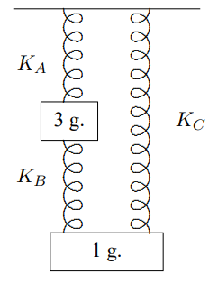
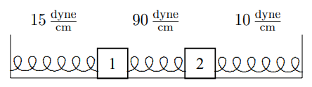
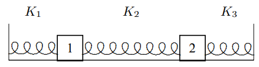

(ch-3)=

# 3. Normal Modes

Systems with several degrees of freedom appear to be much more complicated than the simple harmonic oscillator. What we will see in this chapter is that this is an illusion. When we look at it in the right way, we can see the simple oscillators inside the more complicated system.

::::{admonition} Chapter Preview
:class: preview

In this chapter, we discuss harmonic oscillation in systems with more than one degree of freedom.

1. We will write down the equations of motion for a system of particles moving under general linear restoring forces without damping.

2. Next, we introduce matrices and matrix multiplication and show how they can be used to simplify the description of the equations of motion derived in the previous section.

3. We will then use time translation invariance and find the irreducible solutions to the equations of motion in matrix form. This will lead to the idea of “normal modes.” We then show how to put the normal modes together to construct the general solution to the equations of motion.

4. * We will introduce the idea of “normal coordinates” and show how they can be used to automate the solution to the initial value problem.

5. * We will discuss damped forced oscillation in systems with many degrees of freedom.
::::

## 3.1: More than One Degree of Freedom

In general, the number of degrees of freedom of a system is the number of independent coordinates required to specify the system’s configuration. The more degrees of freedom the system has, the larger the number of independent ways that the system can move. The more possible motions, you might think, the more complicated the system will be to analyze. In fact, however, using the tools of linear algebra, we will see that we can deal with systems with many degrees of freedom in a straightforward way.

### Coupled Oscillators

:::{figure} ../images/lt-33727-clipboard_eac0540b25108edde502eecaae6d56c9e.png
:label: fig-3-1
:enumerator: 3.1
:alt: Two pendulums coupled by a spring.

Two pendulums coupled by a spring.
:::
Consider the system of two pendulums shown in [Figure 3.1](#fig-3-1). The pendulums consist of rigid rods pivoted at the top so they oscillate without friction in the plane of the paper. The masses at the ends of the rods are coupled by a spring. We will consider the free motion of the system, with no external forces other than gravity. This is a classic example of two “coupled oscillators.” The spring that connects the two oscillators is the coupling. We will assume that the spring in [Figure 3.1](#fig-3-1) is unstretched when the two pendulums are hanging straight down, as shown. Then the equilibrium configuration is that shown in [Figure 3.1](#fig-3-1). This is an example of a system with two degrees of freedom, because two quantities, the displacements of each of the two blocks from equilibrium, are required to specify the configuration of the system. For example, if the oscillations are small, we can specify the configuration by giving the horizontal displacement of each of the two blocks from the equilibrium position.

Suppose that block 1 has mass $m_{1}$, block 2 has mass $m_{2}$, both pendulums have length $\ell$ and the spring constant is $\kappa$ (Greek letter kappa). Label the (small) horizontal displacements of the blocks to the right, $x_{1}$ and $x_{2}$, as shown in [Figure 3.2](#fig-3-2). We could have called these

:::{figure} ../images/lt-33728-clipboard_ec444b301110fb34320c23302888ac93f.png
:label: fig-3-2
:enumerator: 3.2
:alt: Two pendulums coupled by a spring displaced from their equilibrium positions.

Two pendulums coupled by a spring displaced from their equilibrium positions.
:::
masses and displacements anything, but it is very convenient to use the same symbol, $x$, with different subscripts. We can then write Newton’s law, $F = m a$, in a compact and useful form. 
$$
m_{j} \frac{d^{2}}{d t^{2}} x_{j}=F_{j} , \tag{3.1} \label{eq-3-1}
$$

for $j$ = 1 to 2, where $F_{1}$ is the horizontal force on block 1 and $F_{2}$ is the horizontal force on block 2. Because there are two values of $j$, [3.1](#eq-3-1) is **two equations**; one for $j$ = 1 and another for $j$ = 2. These are the two equations of motion for the system with two degrees of freedom. We will often refer to all the masses, displacements or forces at once as $m_{j}$, $x_{j}$ or $F_{j}$, respectively. For example, we will say that $F_{j}$ is the horizontal force on the $j$th block. This is an example of the use of “indices” ($j$ is an index) to simplify the description of a system with more than one degree of freedom.

When the blocks move horizontally, they will move vertically as well, because the length of the pendulums remains fixed. Because the vertical displacement is second order in the $x_{j}$s, 
$$
y_{j} \approx \frac{x_{j}^{2}}{2} , \tag{3.2} \label{eq-3-2}
$$

we can ignore it in thinking about the spring. The spring stays approximately horizontal for small oscillations.

To find the equation of motion for this system, we must find the forces, $F_{j}$, in terms of the displacements, $x_{j}$. It is the approximate linearity of the system that allows us to do this in a useful way. The forces produced by the Hooke’s law spring, and the horizontal forces on the pendulums due to the tension in the string (which in turn is due to gravity) are both approximately linear functions of the displacements for small displacements. Furthermore, the forces vanish when both the displacements vanish, because the system is in equilibrium. Thus each of the forces is some constant (different for each block) times $x_{1}$ plus some other constant times $x_{2}$. It is convenient to write this as follows: 
$$
F_{1}=-K_{11} x_{1}-K_{12} x_{2}, \quad F_{2}=-K_{21} x_{1}-K_{22} x_{2} , \tag{3.3} \label{eq-3-3}
$$

or more compactly, 
$$
F_{j}=-\sum_{k=1}^{2} K_{j k} x_{k} \tag{3.4} \label{eq-3-4}
$$

for $j$ = 1 to 2. We have written the four constants as $K_{11}$, $K_{12}$, $K_{21}$ and $K_{22}$ in order to write the force in this compact way. Later, we will call these constants the matrix elements of the $K$ matrix. In this notation, the equations of motion are 
$$
m_{j} \frac{d^{2}}{d t^{2}} x_{j}=-\sum_{k=1}^{2} K_{j k} x_{k} \tag{3.5} \label{eq-3-5}
$$

:::{figure} ../images/lt-33729-clipboard_e9792e093fc35ce8fbf2197b009940d6a.png
:label: fig-3-3
:enumerator: 3.3
:alt: Two pendulums coupled by a spring with block 2 displaced from an equilibrium position.

Two pendulums coupled by a spring with block 2 displaced from an equilibrium position.
:::
Because of the linearity of the system, we can find the constants, $K_{jk}$, by considering the displacements of the blocks one at a time. Then we find the total force using [3.4](#eq-3-4). For example, suppose we displace block 2 with block 1 held fixed in its equilibrium position and look at the forces on both blocks. This will allow us to compute $K_{12}$ and $K_{22}$. The system with block two displaced is shown in [Figure 3.3](#fig-3-3). The forces on the blocks are shown in [Figure 3.4](#fig-3-4), where $T_{j}$ is the tension in the $j$th pendulum string. $F_{12}$ is the force on block 1 due to the displacement of block 2. $F_{22}$ is the force on block 2 due to the displacement of block 2. For small displacements, the restoring force from the spring is nearly horizontal and equal to $\kappa x_{2}$ on block 1 and $-\kappa x_{2}$ on block 2. Likewise, in the limit of small displacement, the vertical component of the force from the tension $T_{2}$ nearly cancels the gravitational force on block 2, $m_{2}g$, so that the horizontal component of the tension gives a restoring force $-x_{2} m_{2} g / \ell$ on block 2. For block 1, the force from the tension $T_{1}$ just cancels the gravitational force $m_{1}g$. Thus 
$$
F_{12} \approx \kappa x_{2}, \quad F_{22} \approx-\frac{m_{2} g x_{2}}{\ell}-\kappa x_{2}, \tag{3.6} \label{eq-3-6}
$$

and 
$$
K_{12} \approx-\kappa, \quad K_{22} \approx \frac{m_{2} g}{\ell}+\kappa . \tag{3.7} \label{eq-3-7}
$$

An analogous argument shows that 
$$
K_{21} \approx-\kappa, \quad K_{11} \approx \frac{m_{1} g}{\ell}+\kappa . \tag{3.8} \label{eq-3-8}
$$

Notice that 
$$
K_{12}=K_{21} . \tag{3.9} \label{eq-3-9}
$$

We will see below that this is an example of a very general relation.

:::{figure} ../images/lt-33730-clipboard_edc3d4152acd0eb7c7e9545e731ad41a2.png
:label: fig-3-4
:enumerator: 3.4
:alt: The forces on the two blocks in [Figure 3.3](#fig-3-3).

The forces on the two blocks in [Figure 3.3](#fig-3-3).
:::
### Linearity and Normal Modes

3-1

We will see in this chapter that the most general possible motion of this system, and of any such system of oscillators, can be decomposed into particularly simple solutions, in which all the degrees of freedom oscillate with the same frequency. These simple solutions are called “normal modes.” The displacements for the most general motion can be written as sums of the simple solutions. We will study how this works in detail later, but it may be useful to see it first. A possible motion of the system of two coupled oscillators is animated in program 3-1. Below the actual motion, we show the two simple motions into which the more complicated motion can be decomposed. For this system, the normal mode with the lower frequency is one in which the displacements of the two blocks are the same: 
$$
x_{1}(t)=x_{2}(t)=b_{1} \cos \left(\omega_{1} t-\theta_{1}\right) . \tag{3.10} \label{eq-3-10}
$$

The other normal mode is one in which the displacements of the two blocks are opposite 
$$
x_{1}(t)=-x_{2}(t)=b_{2} \cos \left(\omega_{2} t-\theta_{2}\right) . \tag{3.11} \label{eq-3-11}
$$

The sum of these two simple motions gives the much more complicated motion shown in program 3-1.

### $n$ Coupled Oscillators

Before we try to solve the equations of motion, [3.5](#eq-3-5), let us generalize the discussion to systems with more degrees of freedom. Consider the oscillation of a system of $n$ particles connected by various springs with no damping. Our analysis will be completely general, but for simplicity, we will talk about the particles as if they are constrained to move in the $x$ direction, so that we can measure the displacement of the $j$th particle from equilibrium with the coordinate $x_{j}$. Then the equilibrium configuration is the one in which all the $x_{j}$s are all zero.

Newton’s law, $F = ma$, for the motion of the system gives 
$$
m_{j} \frac{d^{2} x_{j}}{d t^{2}}=F_{j} \tag{3.12} \label{eq-3-12}
$$

where $m_{j}$ is the mass of the $j$th particle, $F_{j}$ is the force on it. Because the system is linear, we expect that we can write the force as follows (as in [3.4](#eq-3-4)): 
$$
F_{j}=-\sum_{k=1}^{n} K_{j k} x_{k} \tag{3.13} \label{eq-3-13}
$$

for $j = 1$ to $n$. The constant, $-K_{j k}$, is the force per unit displacement of the $j$th particle due to a displacement $x_{k}$ of the $k$th particle. Note that all the $F_{j}$s vanish at equilibrium when all the $x_{j}$s are zero. Thus the equations of motion are 
$$
m_{j} \frac{d^{2} x_{j}}{d t^{2}}=-\sum_{k} K_{j k} x_{k} \tag{3.14} \label{eq-3-14}
$$

for $j = 1$ to $n$.

**To measure** $K_{jk}$**, make a small displacement,** $x_{k}$**, of the** $k$**th particle, keeping all the other particles fixed at zero, assumed to be an equilibrium position. Then measure the force,** $F_{jk}$ **on the** $j$**th particle with only the** $k$**th particle displaced. Since the system is linear (because it is made out of springs or in general, as long as the displacement is small enough), the force is proportional to the displacement,** $x_{k}$**. The ratio of** $F_{jk}$ **to** $x_{k}$ **is** $-K_{jk}$**:** 
$$
K_{j k}=-F_{j k} / x_{k} \text { when } x_{\ell}=0 \text { for } \ell \neq k . \tag{3.15} \label{eq-3-15}
$$

Note that $K_{jk}$ is defined with a $-$ sign, so that a positive $K$ is a force that is opposite to the displacement, and therefore tends to return the system to equilibrium.

Because the system is linear, the total force due to an arbitrary displacement is the sum of the contributions from each displacement. Thus 
$$
F_{j}=\sum_{k} F_{j k}=-\sum_{k} K_{j k} x_{k} \tag{3.16} \label{eq-3-16}
$$

Let us now try to understand [3.9](#eq-3-9). If we consider systems with no damping, the forces can be derived from a potential energy, 
$$
F_{j}=-\frac{\partial V}{\partial x_{j}} . \tag{3.17} \label{eq-3-17}
$$

But then by differentiating equation [3.16](#eq-3-16) we find that 
$$
K_{j k}=\frac{\partial^{2} V}{\partial x_{j} \partial x_{k}} . \tag{3.18} \label{eq-3-18}
$$

The partial differentiations commute with one another, thus equation [3.18](#eq-3-18) implies 
$$
K_{j k}=K_{k j} . \tag{3.19} \label{eq-3-19}
$$

In words, the force on particle $j$ due to a displacement of particle $k$ is equal to the force on particle $k$ due to the displacement of particle $j$.

## 3.2: Matrices

It is very useful to rewrite equation [3.14](#eq-3-14) in a matrix notation. Because of the linearity of the equations of motion for harmonic motion, it will be very useful to have the tools of linear algebra at hand for our study of wave phenomena. If you haven’t studied linear algebra (or didn’t understand much of it) in math courses, **DON’T PANIC**. We will start from scratch by describing the properties of matrices and matrix multiplication. The important thing to keep in mind is that matrices are nothing very deep or magical. They are just bookkeeping devices designed to make your life easier when you deal with more than one equation at a time.

A matrix is a rectangular array of numbers. An $N \times M$ matrix has $N$ rows and $M$ columns. Matrices can be added and subtracted simply by adding and subtracting each of the components. The difference comes in multiplication. It is very convenient to define a multiplication law that defines the product of an $N \times M$ matrix on the left with a $M \times L$ matrix on the right (the order is important!) to be an $N \times L$ matrix as follows:

Call the $N \times M$ matrix $A$ and let $A_{jk}$ be the number in the $j$th row and $k$th column for $1 \leq j \leq N$ and $1 \leq k \leq M$. These individual components of the matrix are called matrix elements. In terms of its matrix elements, the matrix $A$ looks like: 
$$
A=\left(\begin{array}{cccc}
A_{11} & A_{12} & \cdots & A_{1 M} \\
A_{21} & A_{22} & \cdots & A_{2 M} \\
\vdots & \vdots & \ddots & \vdots \\
A_{N 1} & A_{N 2} & \cdots & A_{N M}
\end{array}\right) . \tag{3.20} \label{eq-3-20}
$$

Call the $M \times L$ matrix $B$ with matrix elements $B_{kl}$ for $1 \leq k \leq M$ and $1 \leq l \leq L$: 
$$
B=\left(\begin{array}{cccc}
B_{11} & B_{12} & \cdots & B_{1 L} \\
B_{21} & B_{22} & \cdots & B_{2 L} \\
\vdots & \vdots & \ddots & \vdots \\
B_{M 1} & B_{M 2} & \cdots & B_{M L}
\end{array}\right) . \tag{3.21} \label{eq-3-21}
$$

Call the $N \times L$ matrix $C$ with matrix elements $C_{jl}$ for $1 \leq j \leq N$ and $1 \leq l \leq L$. 
$$
C=\left(\begin{array}{cccc}
C_{11} & C_{12} & \cdots & C_{1 L} \\
C_{21} & C_{22} & \cdots & C_{2 L} \\
\vdots & \vdots & \ddots & \vdots \\
C_{N 1} & C_{N 2} & \cdots & C_{N L}
\end{array}\right) . \tag{3.22} \label{eq-3-22}
$$

Then the matrix $C$ is defined to be the product matrix $A B$ if 
$$
C_{j l}=\sum_{k=1}^{M} A_{j k} \cdot B_{k l} . \tag{3.23} \label{eq-3-23}
$$

Equation [3.23](#eq-3-23) is the algebraic statement of the “row-column” rule. To compute the $j \ell$ matrix element of the product matrix, $AB$, take the $j$th row of the matrix $A$ and the $\ell$th column of the matrix $B$ and form their dot-product (corresponding to the sum over $k$ in [3.23](#eq-3-23)). This rule is illustrated below: 
$$
\left(\begin{array}{ccccc}
A_{11} & \cdots & A_{1 k} & \cdots & A_{1 M} \\
\vdots & \ddots & \vdots & \ddots & \vdots \\
\hline A_{j 1} & \cdots & A_{j k} & \cdots & A_{j M} \\
\hline \vdots & \ddots & \vdots & \ddots & \vdots \\
\Lambda_{N 1} & \cdots & \Lambda_{N k} & \cdots & \Lambda_{N M}
\end{array}\right)\left(\begin{array}{cc|c|cc}
B_{11} & \cdots & B_{1 \ell} & \cdots & B_{1 L} \\
\vdots & \ddots & \vdots & \ddots & \vdots \\
B_{k 1} & \cdots & B_{k \ell} & \cdots & B_{k L} \\
\vdots & \ddots & \vdots & \ddots & \vdots \\
B_{M 1} & \cdots & B_{M \ell} & \cdots & B_{M L}
\end{array}\right) \tag{3.24} \label{eq-3-24}
$$

$$
=\left(\begin{array}{ccccc}
C_{11} & \cdots & C_{1 \ell} & \cdots & C_{1 L} \\
\vdots & \ddots & \vdots & \ddots & \vdots \\
C_{j 1} & \cdots & C_{j \ell} & \cdots & C_{j L} \\
\vdots & \ddots & \vdots & \ddots & \vdots \\
C_{N 1} & \cdots & C_{N \ell} & \cdots & C_{N L}
\end{array}\right) . \tag{3.25} \label{eq-3-25}
$$

For example, 
$$
\left(\begin{array}{cc}
2 & 3 \\
0 & 1 \\
2 & -1
\end{array}\right) \cdot\left(\begin{array}{lll}
1 & 0 & 2 \\
0 & 1 & 3
\end{array}\right)=\left(\begin{array}{ccc}
2 & 3 & 13 \\
0 & 1 & 3 \\
2 & -1 & 1
\end{array}\right) . \tag{3.26} \label{eq-3-26}
$$

It is easy to check that the matrix product defined in this way is associative, $(AB)C = A(BC)$. However, in general, it is not commutative, $A B \neq B A$. In fact, if the matrices are not square, the product in the opposite order may not even make any sense! The matrix product $AB$ only makes sense if the number of columns of $A$ is the same as the number of rows of $B$. Beware!

Except for the fact that it is not commutative, matrix multiplication behaves very much like ordinary multiplication. For example, there are “identity” matrices. The $N \times N$ identity matrix, called $I$, has zeros everywhere except for 1’s down the diagonal. For example, the $3 \times 3$ identity matrix is 
$$
I=\left(\begin{array}{lll}
1 & 0 & 0 \\
0 & 1 & 0 \\
0 & 0 & 1
\end{array}\right) . \tag{3.27} \label{eq-3-27}
$$

The $N \times N$ identity matrix satisfies 
$$
\begin{aligned}
I A=A I=A &\text{ for any } N \times N \text{ matrix } A \\
I B=B &\text{ for any } N \times M \text{ matrix } B \text{ ; } \\
C I=C &\text{ for any } M \times N \text{ matrix } C \text{ . }
 \tag{3.28} \label{eq-3-28}
\end{aligned}
$$

We will be primarily concerned with “square” (that is $N \times N$) matrices.

**Matrices allow us to deal with many linear equations at the same time.**

An $N$ dimensional column vector can be regarded as an $N \times 1$ matrix. We will call this object an “$N$-vector.” It should not be confused with a coordinate vector in three-dimensional space. Likewise, we can think of an $N$ dimensional row vector as a $1 \times N$0 matrix. Matrix multiplication can also describe the product of a matrix with a vector to give a vector. The particularly important case that we will need in order to analyze wave phenomena involves square matrices. Consider an $N \times N$ matrix $A$ multiplying an $N$-vector, $X$, to give another $N$-vector, $F$. The square matrix $A$ has $N^{2}$ matrix elements, $A_{jk}$ for $j$ and $k = 1$ to $N$. The vectors $X$ and $F$ each have $N$ matrix elements, just their components $X_{j}$ and $F_{j}$ for $j = 1$ to $N$. Then the matrix equation: 
$$
A X-F \tag{3.29} \label{eq-3-29}
$$

actually stands for $N$ equations: 
$$
\sum_{k=1}^{N} A_{j k} \cdot X_{k}=F_{j} \tag{3.30} \label{eq-3-30}
$$

for $j=1$ to $N$. In other words, these are $N$ simultaneous linear equations for the $N$ $X_{j}$’s. You all know, from your studies of algebra how to solve for the $X_{j}$’s in terms of the $F_{j}$’s and the $A_{jk}$’s but it is very useful to do it in matrix notation. Sometimes, we can find the “inverse” of the matrix $A$, $A^{-1}$, which has the property 
$$
A A^{-1}=A^{-1} A=I , \tag{3.31} \label{eq-3-31}
$$

where $I$ is the identity matrix discussed in [3.26](#eq-3-26) and [3.27](#eq-3-27). If we can find such a matrix, then the $N$ simultaneous linear equations, [3.29](#eq-3-29), have a unique solution that we can write in a very compact form. Multiply both sides of [3.29](#eq-3-29) by $A^{-1}$. On the left-hand side, we can use [3.30](#eq-3-30) and [3.27](#eq-3-27) to get rid of the $A^{-1}A$ and write the solution as follows: 
$$
X=A^{-1} F . \tag{3.32} \label{eq-3-32}
$$

### Inverse and Determinant

We can compute $A^{-1}$ in terms of the “determinant” of $A$. The determinant of the matrix $A$ is a sum of products of the matrix elements of $A$ with the following properties:

- There are $N!$ terms in the sum;

- Each term in the sum is a product of $N$ different matrix elements;

- In each product, every row number and every column number appears exactly once;

- Every such product can be obtained from the product of the diagonal elements, $A_{11} A_{22} \cdots A_{N N}$, by a sequence of interchanges of the column labels. For example, $A_{12} A_{21} A_{33} \cdots A_{N N}$ involves one interchange while $A_{12} A_{23} A_{31} A_{44} \cdots A_{N N}$ requires two.

- The coefficient of a product in the determinant is +1 if it involves an even number of interchanges and −1 if it involves an odd number of interchanges.

Thus the determinant of a $2 \times 2$ matrix, $A$ is 
$$
\operatorname{det} A=A_{11} A_{22}-A_{12} A_{21} . \tag{3.33} \label{eq-3-33}
$$

The determinant of a $3 \times 3$ matrix, $A$ is 
$$
\begin{gathered}
\operatorname{det} A=A_{11} A_{22} A_{33}+A_{12} A_{23} A_{31}+A_{13} A_{21} A_{32} \\
-A_{11} A_{23} A_{32}-A_{13} A_{22} A_{31}-A_{12} A_{21} A_{33} .
 \tag{3.34} \label{eq-3-34}
\end{gathered}
$$

Unless you are very unlucky, you will never have to compute the determinant of a matrix larger than $3 \times 3$ by hand. If you are so unlucky, it is best to use an inductive procedure that builds it up from the determinants of smaller submatrices. We will discuss this procedure below.

If $\operatorname{det} A=0$, the matrix has no inverse. It is not “invertible.” In this case, the simultaneous linear equations have either no solution at all, or an infinite number of solutions. If $\operatorname{det} A \neq 0$, the inverse matrix exists and is uniquely given by 
$$
A^{-1}=\frac{\tilde{A}}{\operatorname{det} A} \tag{3.35} \label{eq-3-35}
$$

where $\tilde{A}$ is the **cofactor** matrix defined by its matrix elements as follows: 
$$
(\tilde{A})_{j k}=\operatorname{det} A(j k) \tag{3.36} \label{eq-3-36}
$$

with 
$$
\begin{aligned}
&A(j k)_{l m}=1 \text { if } m=j \text { and } l=k \\
&A(j k)_{l m}=0 \text { if } m=j \text { and } l \neq k \\
&A(j k)_{l m}=0 \text { if } m \neq j \text { and } l=k \\
&A(j k)_{l m}=A_{l m} \text { if } m \neq j \text { and } l \neq k
 \tag{3.37} \label{eq-3-37}
\end{aligned}
$$

In other words, $A(jk)$ is obtained from the matrix $A$ by replacing the $kj$ matrix element by 1 and all other matrix elements in row $k$ or column $j$ by 0. Thus if 
$$
A=\left(\begin{array}{cc|ccc}
A_{11} & \cdots & A_{1 j} & \cdots & A_{1 N} \\
\vdots & \ddots & \vdots & \ddots & \vdots \\
\hline A_{k 1} & \cdots & A_{k j} & \cdots & A_{k N} \\
\hline \vdots & \ddots & \vdots & \ddots & \vdots \\
A_{N 1} & \cdots & A_{N j} & \cdots & A_{N N}
\end{array}\right) , \tag{3.38} \label{eq-3-38}
$$

$$
A(j k)=\left(\begin{array}{cc|ccc}
A_{11} & \cdots & 0 & \cdots & A_{1 N} \\
\vdots & \ddots & \vdots & \ddots & \vdots \\
\hline 0 & \cdots & 1 & \cdots & 0 \\
\hline \vdots & \ddots & \vdots & \ddots & \vdots \\
A_{N 1} & \cdots & 0 & \cdots & A_{N N}
\end{array}\right) . \tag{3.39} \label{eq-3-39}
$$

Note the sneaky interchange of $j \leftrightarrow k$ in this definition, compared to [3.23](#eq-3-23).

For example if 
$$
A=\left(\begin{array}{ll}
4 & 3 \\
5 & 2
\end{array}\right) \tag{3.40} \label{eq-3-40}
$$

then 
$$
\begin{aligned}
&A(11)=\left(\begin{array}{ll}
1 & 0 \\
0 & 2
\end{array}\right) & A(12)=\left(\begin{array}{ll}
0 & 3 \\
1 & 0
\end{array}\right) \\
&A(21)=\left(\begin{array}{ll}
0 & 1 \\
5 & 0
\end{array}\right) & A(22)=\left(\begin{array}{ll}
4 & 0 \\
0 & 1
\end{array}\right) .
 \tag{3.41} \label{eq-3-41}
\end{aligned}
$$

Thus, 
$$
\bar{A}=\left(\begin{array}{cc}
2 & -3 \\
-5 & 4
\end{array}\right) \tag{3.42} \label{eq-3-42}
$$

and since $\operatorname{det} A=4 \cdot 2-5 \cdot 3=-7$, 
$$
A^{-1}=\left(\begin{array}{cc}
-2 / 7 & 3 / 7 \\
5 / 7 & -4 / 7
\end{array}\right) . \tag{3.43} \label{eq-3-43}
$$

$A^{-1}$ satisfies $A A^{-1}=A^{-1} A=I$ where $I$ is the identity matrix: 
$$
I=\left(\begin{array}{ll}
1 & 0 \\
0 & 1
\end{array}\right) . \tag{3.44} \label{eq-3-44}
$$

In terms of the submatrices, $A(jk)$, we can define the determinant inductively, as promised above. In fact, the reason that [3.30](#eq-3-30) works is that the determinant can be written as 
$$
\operatorname{det} A=\sum_{k=1}^{N} A_{1 k} \operatorname{det} A(k 1) . \tag{3.45} \label{eq-3-45}
$$

Actually this is true for any row, not just $j = 1$. The relation, [3.30](#eq-3-30) can be rewritten as 
$$
\sum_{k=1}^{N} A_{j k} \operatorname{det} A\left(k j^{\prime}\right)=\left\{\begin{array}{c}
\operatorname{det} A \text { for } j=j^{\prime} \\
0 \text { for } j \neq j^{\prime}
\end{array}\right. \tag{3.46} \label{eq-3-46}
$$

The determinants of the submatrices, $\operatorname{det} A(k \mathrm{l})$, in [3.43](#eq-3-43) can, in turn, be computed by the same procedure. The result is a definition of the determinant that refers to itself. However, eventually, the process terminates because the matrices keep getting smaller and the determinant can always be computed in this way. The only problem with this procedure is that it is very tedious for a large matrix. For an $n \times n$ matrix, you end up computing $n!$ terms and adding them up. For large $n$, this is impractical. One of the nice features of the techniques that we will discuss in the coming chapters is that we will be able to avoid such calculations.

### More Useful Facts about Matrices

Suppose that $A$ and $B$ are $N \times N$ matrices and $v$ is an $N$-vector.

1. If you know the inverses of $A$ and $B$, you can find the inverse of the product, $AB$, by multiplying the inverses in the reverse order: 
$$
(A B)^{-1}=B^{-1} A^{-1} . \tag{3.47} \label{eq-3-47}
$$

2. The determinant of the product, $AB$, is the product of the determinants: 
$$
\operatorname{det}(A B)=\operatorname{det} A \operatorname{det} B , \tag{3.48} \label{eq-3-48}
$$

    thus if $\operatorname{det}(A B)-0$, then either $A$ or $B$ has vanishing determinant.

3. A matrix multiplying a nonzero vector can give zero only if the determinant of the matrix vanishes: 
$$
A v=0 \Rightarrow \operatorname{det} A=0 \text { or } v=0 \tag{3.49} \label{eq-3-49}
$$

    This is the statement, in matrix language, that $N$ homogeneous linear equations in $N$ unknowns can have a nontrivial solution, $v \neq 0$, only if the determinant of the coefficients vanishes.

4. Similarly, if $\operatorname{det} A=0$, there exists a nonzero vector, $v$, that is annihilated by $A$: 
$$
\operatorname{det} A=0 \Rightarrow \exists v \neq 0 \text { such that } A v=0 . \tag{3.50} \label{eq-3-50}
$$

    This is the statement, in matrix language, that $N$ homogeneous linear equations in $N$ unknowns **actually do** have a nontrivial solution, $v \neq 0$, if the determinant of the coefficients vanishes.

5. The transpose of an $N \times M$ matrix $A$, denoted by $A^{T}$, is the $M \times N$ matrix obtained by reflecting the matrix about a diagonal line through the upper left-hand corner. Thus if 
$$
A=\left(\begin{array}{cccc}
    A_{11} & A_{12} & \cdots & A_{1 M} \\
    A_{21} & A_{22} & \cdots & A_{2 M} \\
    \vdots & \vdots & \ddots & \vdots \\
    \vdots & \vdots & \ddots & \vdots \\
    A_{N 1} & A_{N 2} & \cdots & A_{N M}
    \end{array}\right) \tag{3.51} \label{eq-3-51}
$$

    then 
$$
A^{T}=\left(\begin{array}{ccccc}
    A_{11} & A_{21} & \cdots & \cdots & A_{N 1} \\
    A_{12} & A_{22} & \cdots & \cdots & A_{N 2} \\
    \vdots & \vdots & \ddots & \ddots & \vdots \\
    A_{1 M} & A_{2 M} & \cdots & \cdots & A_{N M}
    \end{array}\right) . \tag{3.52} \label{eq-3-52}
$$

    Note that if $N \neq M$, the shape of the matrix is changed by transposition. Only for square matrices does the transpose give you back a matrix of the same kind. A square matrix that is equal to its transpose is called a “symmetric” matrix.

### Eigenvalue Equations

We will make extensive use of the concept of an “eigenvalue equation.” For an $N \times N$ matrix, $R$, the eigenvalue equation has the form: 
$$
R c=h c, \tag{3.53} \label{eq-3-53}
$$

where $c$ is a **nonzero** $N$-vector,[^3-2-1] and $h$ is a number. The idea is to find both the number, $h$, which is called the eigenvalue, and the vector, $c$, which is called the eigenvector. This is the problem we discussed in chapter 1 in [1.78](#eq-1-78) in connection with time translation invariance, but now written in matrix form.

A couple of examples may be in order. Suppose that $R$ is a diagonal matrix, like 
$$
R=\left(\begin{array}{ll}
2 & 0 \\
0 & 1
\end{array}\right) . \tag{3.54} \label{eq-3-54}
$$

Then the eigenvalues are just the diagonal elements, 2 and 1, and the eigenvectors are vectors in the coordinate directions, 
$$
R\left(\begin{array}{l}
1 \\
0
\end{array}\right)=2\left(\begin{array}{l}
1 \\
0
\end{array}\right), \quad R\left(\begin{array}{l}
0 \\
1
\end{array}\right)=1\left(\begin{array}{l}
0 \\
1
\end{array}\right) . \tag{3.55} \label{eq-3-55}
$$

A less obvious example is 
$$
R=\left(\begin{array}{ll}
2 & 1 \\
1 & 2
\end{array}\right) . \tag{3.56} \label{eq-3-56}
$$

This time the eigenvalues are 3 and 1, and the eigenvectors are as shown below: 
$$
R\left(\begin{array}{l}
1 \\
1
\end{array}\right)=3\left(\begin{array}{l}
1 \\
1
\end{array}\right), \quad R\left(\begin{array}{c}
1 \\
-1
\end{array}\right)=1\left(\begin{array}{c}
1 \\
-1
\end{array}\right) . \tag{3.57} \label{eq-3-57}
$$

It may seem odd that in the eigenvalue equation, both the eigenvalue **and** the eigenvector are unknowns. The reason that it works is that for most values of $h$, the equation, [3.51](#eq-3-51), has no solution. To see this, we write [3.51](#eq-3-51) as a set of homogeneous linear equations for the components of the eigenvector, $c$, 
$$
(R-h I) c=0 . \tag{3.58} \label{eq-3-58}
$$

The set of equations, [3.56](#eq-3-56), has nonzero solutions for $c$ only if the determinant of the coefficient matrix, $R-h I$, vanishes. But this will happen only for $N$ values of $h$, because the condition 
$$
\operatorname{det}(R-h I)=0 \tag{3.59} \label{eq-3-59}
$$

is an $N$th order equation for $h$. For each $h$ that solves [3.57](#eq-3-57), we can find a solution for $c$.[^3-2-2] We will give some examples of this procedure below.

### Matrix Equation of Motion

It is very useful to rewrite the equation of motion, [3.14](#eq-3-14), in a matrix notation. Define a column vector, $X$, whose $j$th row (from the top) is the coordinate $x_{j}$: 
$$
X=\left(\begin{array}{c}
x_{1} \\
x_{2} \\
\vdots \\
x_{n}
\end{array}\right) . \tag{3.60} \label{eq-3-60}
$$

Define the “$K$ matrix”, an $n \times n$ matrix that has the coefficient $K_{jk}$ in its $j$th row and $k$th column: 
$$
K=\left(\begin{array}{cccc}
K_{11} & K_{12} & \cdots & K_{1 n} \\
K_{21} & K_{22} & \cdots & K_{2 n} \\
\vdots & \vdots & \ddots & \vdots \\
K_{n 1} & K_{n 2} & \cdots & K_{n n}
\end{array}\right) . \tag{3.117} \label{eq-3-117}
$$

$K_{jk}$ is said to be the “$jk$ matrix element” of the $K$ matrix. Because of equation [3.19](#eq-3-19), the matrix $K$ is symmetric, $K = K^{T}$.

Define the diagonal matrix $M$ with $m_{j}$ in the $j$th row and $j$th column and zeroes elsewhere 
$$
M=\left(\begin{array}{cccc}
m_{1} & 0 & \cdots & 0 \\
0 & m_{2} & \cdots & 0 \\
\vdots & \vdots & \ddots & \vdots \\
0 & 0 & \cdots & m_{n}
\end{array}\right) . \tag{3.61} \label{eq-3-61}
$$

$M$ is called the “mass matrix.”

Using these definitions, we can rewrite [3.14](#eq-3-14) in matrix notation as follows: 
$$
M \frac{d^{2} X}{d t^{2}}=-K X . \tag{3.62} \label{eq-3-62}
$$

There is nothing very fancy going on here. We have just used the matrix notation to get rid of the summation sign in [3.14](#eq-3-14). The sum is now implicit in the matrix multiplication in [3.61](#eq-3-61). This is useful because we can now use the properties of matrices and matrix multiplication discussed above to manipulate [3.61](#eq-3-61). For example, we can simplify [3.61](#eq-3-61) a bit by multiplying on the left by $M^{-1}$ to get 
$$
\frac{d^{2} X}{d t^{2}}=-M^{-1} K X . \tag{3.63} \label{eq-3-63}
$$

_____________________

[^3-2-1]: $c = 0$ doesn’t count, because the equation is satisfied trivially for any $h$. We are interested only in nontrivial solutions.

[^3-2-2]: The situation is slightly more complicated when the solutions for $h$ are degenerate. We discuss this in [3.117](#eq-3-117) below.

## 3.3: Normal Modes

If there is only one degree of freedom, then both $X$ and $M^{-1}$ are just numbers and the solutions to the equation of motion, [3.62](#eq-3-62), have the form of a constant amplitude times an exponential factor. In fact, we saw that this form is related to a very general fact about the physics – time translation invariance, [1.33](#eq-1-33). The arguments of chapter 1, [1.71](#eq-1-71)-[1.85](#eq-1-85), did not depend on the number of degrees of freedom. Thus they show that here again, we can find irreducible solutions, that go into themselves up to an overall constant when the clocks are reset. As in chapter 1, the first step is to allow the solutions to be complex. That is, we replace [3.62](#eq-3-62) by 
$$
\frac{d^{2} Z}{d t^{2}}=-M^{-1} K Z , \tag{3.64} \label{eq-3-64}
$$

where $Z$ is a complex $n$ vector with components, $z_{j}$. The real parts of the components of $Z$ are the components of a real solution satisfying [3.62](#eq-3-62), 
$$
x_{j}=\operatorname{Re} z_{j} . \tag{3.65} \label{eq-3-65}
$$

We will say that the real vector, $X$, is the real part of the complex vector, $Z$, 
$$
X=\operatorname{Re} Z , \tag{3.66} \label{eq-3-66}
$$

if [3.64](#eq-3-64) is satisfied.

Just as in chapter 1, we know that we can find irreducible solutions that have the same form up to an overall constant when the clocks are reset. We know from [1.85](#eq-1-85) that these have the form 
$$
Z(t)=A e^{-i \omega t} \tag{3.67} \label{eq-3-67}
$$

where $A$ is some constant $n$-vector and the angular frequency, $\omega$, is still just a number. Now if $t \rightarrow t + a$, 
$$
Z(t) \rightarrow Z(t+a)=e^{-i \omega a} Z(t) . \tag{3.68} \label{eq-3-68}
$$

While the irreducible form, [3.66](#eq-3-66), comes just from time translation invariance, we must still look at the equations of motion to determine the vector, $A$ and the angular frequency, $\omega$. Inserting [3.66](#eq-3-66) into [3.63](#eq-3-63), doing the differentiation and canceling the exponential factors from both sides, we find that [3.66](#eq-3-66) is a solution if
$$
\omega^{2} A=M^{-1} K A . \tag{3.69} \label{eq-3-69}
$$

This matrix equation is an eigenvalue equation of the form that we discussed in [3.51](#eq-3-51)-[3.57](#eq-3-57). $\omega^{2}$ is the eigenvalue of the matrix $M^{-1}K$ and $A$ is the corresponding eigenvector. Let us see what it means physically.

The real part of the column vector $Z$ specifies the displacement of each of the degrees of freedom of the system. The eigenvalue equation, [3.68](#eq-3-68), does not involve any complex numbers (because we have not put in any damping). Therefore (as we will see explicitly below), we can choose the solutions so that all the components of $A$ are real. Then the real part of the complex solutions we seek in [3.66](#eq-3-66) is 
$$
X(t)=A \cos \omega t , \tag{3.70} \label{eq-3-70}
$$

or in terms of the components of $A$, 
$$
A=\left(\begin{array}{c}
a_{1} \\
a_{2} \\
\vdots
\end{array}\right) . \tag{3.71} \label{eq-3-71}
$$

$$
x_{1}(t)=a_{1} \cos \omega t, \quad x_{2}(t)=a_{2} \cos \omega t, \quad \text { etc. } \tag{3.72} \label{eq-3-72}
$$

Not only does everything move with the same frequency, but the **ratios** of displacements of the individual degrees of freedom are fixed. Everything oscillates in phase. The only difference between the motion of the different degrees of freedom is their different amplitudes from the different components of $A$.

The point is worth repeating. Time translation invariance and linearity imply that we can **always** find irreducible solutions, [3.67](#eq-3-67), in which all the degrees of freedom oscillate with the same frequency. The extra piece of information that leads to [3.69](#eq-3-69) is dynamical. If there is no damping, then all the components of $A$ can be chosen to be real, and all the degrees of freedom oscillate not only with the same frequency, but also with the same phase.

If such a solution is to satisfy the equations of motion, then the acceleration must also be proportional to $A$, so that the individual displacements don’t get out of synch. But that is what [3.68](#eq-3-68) is telling us. $-M^{-1}K$ is the matrix that, acting on the displacement, gives the acceleration. The eigenvalue equation [3.68](#eq-3-68) means that the acceleration is proportional to $A$ again. The constant of proportionality, $\omega^{2}$, is the return force per unit displacement per unit mass for the particular displacement specified by $A$.

We have already discussed the mathematical structure of the eigenvalue equation in [3.51](#eq-3-51)-[3.57](#eq-3-57). We will do it again, for emphasis, in the case of physical interest, [3.68](#eq-3-68). It should be clear that not every value of $A$ and $\omega^{2}$ gives a solution of [3.68](#eq-3-68). We will solve for the allowed values by first finding the possible values of $\omega^{2}$ and then finding the corresponding values of $A$. To find the eigenvalues, note that [3.68](#eq-3-68) can be rewritten as 
$$
\left[M^{-1} K-\omega^{2} I\right] A=0 , \tag{3.73} \label{eq-3-73}
$$

where $I$ is the $n \times n$ identity matrix. [3.72](#eq-3-72) is just a compact way of representing $n$ homogeneous linear equations in the $n$ components of $A$ where the coefficients depend on $\omega^{2}$. We saw in [3.47](#eq-3-47) and [3.48](#eq-3-48) that for systems of $n$ homogeneous linear equations in $n$ unknowns, a nonzero solution exists if and only if the determinant of the coefficient matrix vanishes. The reason is that if the determinant were nonzero, then the matrix, $M^{-1}K − \omega^{2}I$, would have an inverse, and we could use [3.31](#eq-3-31) to conclude that the only solution for the vector, $A$, is $A = 0$. Thus to have a nonzero amplitude, $A$, we must have 
$$
\operatorname{det}\left[M^{-1} K-\omega^{2} I\right]=0 . \tag{3.74} \label{eq-3-74}
$$

[3.73](#eq-3-73) is a polynomial equation for $\omega^{2}$. It is an equation of degree $n$ in $\omega^{2}$, because the term in the determinant from the product of all the diagonal elements of the matrix contains a piece that goes as $\left[\omega^{2}\right]^{n}$. All the coefficients in the polynomial are real. Physically, we expect all the solutions for $\omega^{2}$ to be real and positive whenever the system is in stable equilibrium because we expect such systems to oscillate. Mathematically, we can show that $\omega^{2}$ is always real, so long as all the masses are positive. We will do this below in [3.127](#eq-3-127)-[3.130](#eq-3-130).

Negative $\omega^{2}$ are associated with unstable equilibrium. For example, consider a mass at the end of a rigid rod, free to swing in the earth’s gravitational field in a vertical plane around a frictionless pivot, as shown in [Figure 3.5](#fig-3-5). The mass can move along the dotted line. The stable equilibrium position is indicated by the solid line. The unstable equilibrium position is indicated by the dashed line.

:::{figure} ../images/lt-33732-clipboard_e188e81aa565c8232a27aabc64b11b6d4.png
:label: fig-3-5
:enumerator: 3.5
:alt: A mass on a rigid rod, free to swing in the earth’s gravity in a vertical plane.

A mass on a rigid rod, free to swing in the earth’s gravity in a vertical plane.
:::
When the mass is at the unstable equilibrium point, the smallest disturbance will cause it to fall. Once away from equilibrium, the displacement increases exponentially until the angle from the vertical becomes so large that the nonlinearities in the equation of motion for this system take over. We will discuss this nonlinear oscillator further in appendix B.

Once we have found the possible values of $\omega^{2}$, we can put each one back into [3.72](#eq-3-72) to get the corresponding $A$. Because [3.72](#eq-3-72) is homogeneous, the overall scale of $A$ is not determined, **but all the ratios,** $a_{j} / a_{k}$**, are fixed for each** $\omega^{2}$.

### Normal Modes and Frequencies

**The vector** $A$ **is called the “normal mode” of the system associated with the frequency** $\omega$. Because $A$ is real, in the absence of friction, the complex solutions, [3.66](#eq-3-66), can be put together into real solutions, like [3.69](#eq-3-69). The general real solution is of the form 
$$
\begin{gathered}
X(t)=\operatorname{Re}[(b+i c) Z(t)]= \\
b A \cos \omega t+c A \sin \omega t=d A \cos (\omega t-\theta)
 \tag{3.75} \label{eq-3-75}
\end{gathered}
$$

where $b$ and $c$ (or $d$ and $\theta$) are real numbers.

We can now construct the complete solution to the equation of motion. Because of linearity, we get it by adding together all the normal mode solutions with arbitrary coefficients that must be set by the initial conditions.

We can now see that the number of different normal modes is always equal to $n$, the number of degrees of freedom. Label the normal modes as $A^{\alpha}$, where $\alpha$ is a label that (we will argue below) goes from 1 to $n$. Label the corresponding frequencies $\omega_{\alpha}$. Then the most general possible motion of the system is a sum of all the normal modes, 
$$
Z(t)=\sum_{\alpha=1}^{n} w_{\alpha} A^{\alpha} e^{-i \omega_{\alpha} t} \tag{3.76} \label{eq-3-76}
$$

or in real form (with $w = b + ic$) 
$$
\begin{aligned}
X(t)=& \sum_{\alpha=1}^{n}\left[b_{\alpha} A^{\alpha} \cos \left(\omega_{\alpha} t\right)+c_{\alpha} A^{\alpha} \sin \left(\omega_{\alpha} t\right)\right] \\
&=\sum_{\alpha=1}^{n} d_{\alpha} A^{\alpha} \cos \left(\omega_{\alpha} t-\theta_{\alpha}\right)
 \tag{3.77} \label{eq-3-77}
\end{aligned}
$$

where $b_{\alpha}$ and $c_{\alpha}$ (or $d_{\alpha}$ and $\theta_{\alpha}$) are real numbers that must be determined from the initial conditions of the system. **Note that the set of all the normal mode vectors must be “complete,” in the mathematical sense that any possible configuration of this system can be described as a linear combination of normal modes.** Otherwise, we could not satisfy arbitrary initial conditions with the solution, [3.76](#eq-3-76). This can be proved mathematically (because the matrix, $K$, is symmetric and the masses are positive), but the physical argument will be enough for us here. Likewise no normal mode can possibly be a linear combination of the other normal modes, because each corresponds to an independent possible motion of the physical system with its own frequency. The mathematical way of saying this is that the set of all the normal modes is “linearly independent.”

Because the set of normal modes must be both complete and linearly independent, there must be precisely $n$ normal modes, where again, $n$ is the [3.77](#eq-3-77) number of degrees of freedom.

If there were fewer than $n$ normal modes, they could not possibly describe all possible configurations of the $n$ degrees of freedom. If there were more than $n$, they could not be linearly independent $n$ dimensional vectors. At least one of them could be written as a linear combination of the others. As we will see later, [3.77](#eq-3-77) is the physical principle behind Fourier analysis.

It is worth noting that solving the eigenvalue equation, [3.68](#eq-3-68), gets hard very rapidly as the number of degrees of freedom increases. First you have to compute the determinant of an $n \times n$ matrix. If all the entries are nonzero, this requires adding up $n!$ terms. Once you have finished that, you still have to solve a polynomial equation of degree $n$. For $n > 3$, this cannot be done analytically except in special cases.

On the other hand, it is always straightforward to check whether a given vector is an eigenvector of a given matrix and, if so, to compute the eigenvalue. We will use this fact in the problems at the end of the chapter.

### Back to the $2 \times 2$ Example

Let us return to the example from the beginning of this chapter in the special case where the two pendulum blocks have the same mass, $m_{1} = m_{2} = m$. Simple as it is, this will be a very important system for our understanding of wave phenomena. Let us see how the techniques that we have developed allow us to solve for the allowed frequencies and the corresponding $A$ vectors, the normal modes. From [3.7](#eq-3-7) and [3.8](#eq-3-8), the $K$ matrix has the form 
$$
K=\left(\begin{array}{cc}
m g / \ell+\kappa & -\kappa \\
-\kappa & m g / \ell+\kappa
\end{array}\right) . \tag{3.78} \label{eq-3-78}
$$

The $M$ matrix is 
$$
M=\left(\begin{array}{cc}
m & 0 \\
0 & m
\end{array}\right) . \tag{3.79} \label{eq-3-79}
$$

Thus from [3.78](#eq-3-78) and [3.79](#eq-3-79), 
$$
M^{-1} K=\left(\begin{array}{cc}
g / \ell+\kappa / m & -\kappa / m \\
-\kappa / m & g / \ell+\kappa / m
\end{array}\right) . \tag{3.80} \label{eq-3-80}
$$

The matrix $M^{-1}K − \omega^{2}I$ is 
$$
M^{-1} K-\omega^{2} I=\left(\begin{array}{cc}
g / \ell+\kappa / m-\omega^{2} & -\kappa / m \\
-\kappa / m & g / \ell+\kappa / m-\omega^{2}
\end{array}\right) . \tag{3.81} \label{eq-3-81}
$$

To find the eigenvalues of $M^{-1}K$, we form the determinant 
$$
\begin{gathered}
\operatorname{det}\left[M^{-1} K-\omega^{2} I\right]=\operatorname{det}\left[\left(\begin{array}{cc}
g / \ell+\kappa / m-\omega^{2} & -\kappa / m \\
-\kappa / m & g / \ell+\kappa / m-\omega^{2}
\end{array}\right)\right] \\
=\left(g / \ell+\kappa / m-\omega^{2}\right)^{2}-(\kappa / m)^{2} \\
=\left(\omega^{2}-g / \ell\right)\left(\omega^{2}-g / \ell-2 \kappa / m\right)=0 .
 \tag{3.82} \label{eq-3-82}
\end{gathered}
$$

Thus the angular frequencies of the normal modes are 
$$
\omega_{1}^{2}=g / \ell, \quad \omega_{2}^{2}=g / \ell+2 \kappa / m . \tag{3.83} \label{eq-3-83}
$$

To find the corresponding normal modes, we substitute these frequencies back into the eigenvalue equation. For $\omega_{1}^{2}$, the normal mode vector, $A^{1}$, 
$$
A^{1}=\left(\begin{array}{l}
a_{1}^{1} \\
a_{2}^{1}
\end{array}\right) , \tag{3.84} \label{eq-3-84}
$$

satisfies the matrix equation 
$$
\left[M^{-1} K-\omega_{1}^{2} I\right] A^{1}=0 . \tag{3.85} \label{eq-3-85}
$$

From [3.81](#eq-3-81) and [3.83](#eq-3-83), 
$$
M^{-1} K-\omega_{1}^{2} I=\left(\begin{array}{cc}
\kappa / m & -\kappa / m \\
-\kappa / m & \kappa / m
\end{array}\right) . \tag{3.86} \label{eq-3-86}
$$

Thus [3.85](#eq-3-85) becomes 
$$
\begin{aligned}
&\left(\begin{array}{cc}
\kappa / m & -\kappa / m \\
-\kappa / m & \kappa / m
\end{array}\right)\left(\begin{array}{l}
a_{1}^{1} \\
a_{2}^{1}
\end{array}\right)=0 \\
&=\frac{\kappa}{m}\left(\begin{array}{c}
a_{1}^{1}-a_{2}^{1} \\
-a_{1}^{1}+a_{2}^{1}
\end{array}\right) \Rightarrow a_{1}^{1}=a_{2}^{1} .
 \tag{3.87} \label{eq-3-87}
\end{aligned}
$$

We can take $a_{1}^{1}=1$ because we can multiply the normal mode vector by any number we like. Only the ratio $a_{1}^{1} / a_{2}^{1}$ matters. So, for example, we can take 
$$
A^{1}=\left(\begin{array}{l}
1 \\
1
\end{array}\right) . \tag{3.88} \label{eq-3-88}
$$

This gives [3.10](#eq-3-10). The displacement in this normal mode is shown in [Figure 3.6](#fig-3-6).

:::{figure} ../images/lt-33733-clipboard_e3ed32a00d16ad35033b13616f7b0885b.png
:label: fig-3-6
:enumerator: 3.6
:alt: The displacement in the normal mode, A^{1}.

The displacement in the normal mode, $A^{1}$.
:::
For $\omega_{2}^{2}$, the normal mode vector, $A^{2}$, 
$$
A^{2}=\left(\begin{array}{l}
a_{1}^{2} \\
a_{2}^{2}
\end{array}\right) , \tag{3.89} \label{eq-3-89}
$$

satisfies the matrix equation (where the identity matrix multiplying $\omega_{2}^{2}$ is understood)3 
$$
\left[M^{-1} K-\omega_{2}^{2}\right] A^{2}=0 . \tag{3.90} \label{eq-3-90}
$$

This time, [3.81](#eq-3-81) and [3.83](#eq-3-83) give 
$$
M^{-1} K-\omega_{2}^{2}=\left(\begin{array}{cc}
-\kappa / m & -\kappa / m \\
-\kappa / m & -\kappa / m
\end{array}\right) . \tag{3.91} \label{eq-3-91}
$$

Thus [3.90](#eq-3-90) becomes 
$$
\begin{aligned}
&\left(\begin{array}{ll}
-\kappa / m & -\kappa / m \\
-\kappa / m & -\kappa / m
\end{array}\right)\left(\begin{array}{l}
a_{1}^{2} \\
a_{2}^{2}
\end{array}\right)=0 \\
&=-\frac{\kappa}{m}\left(\begin{array}{l}
a_{1}^{2}+a_{2}^{2} \\
a_{1}^{2}+a_{2}^{2}
\end{array}\right) \Rightarrow a_{1}^{2}=-a_{2}^{2} .
 \tag{3.92} \label{eq-3-92}
\end{aligned} .
$$

Again, only the ratio $a_{1}^{2} / a_{2}^{2}$ matters, so we can take 
$$
A^{2}=\left(\begin{array}{c}
1 \\
-1
\end{array}\right) . \tag{3.93} \label{eq-3-93}
$$

This gives [3.11](#eq-3-11). The displacement in this normal mode is shown in [Figure 3.7](#fig-3-7).

:::{figure} ../images/lt-33734-clipboard_e70f1de6dbbf93b5dfd3aaba60de9a128.png
:label: fig-3-7
:enumerator: 3.7
:alt: The displacement in the normal mode, A^{2}.

The displacement in the normal mode, $A^{2}$.
:::
The physics of these modes is easy to understand. In mode 1, the blocks move together and the spring is never stretched from its equilibrium position. Thus the frequency is just $g / \ell$, the same as an uncoupled pendulum. In mode 2, the blocks are moving in opposite directions, so the spring is stretched by twice the displacement of each block. Thus there is an additional restoring force of $2\kappa$, and the square of the angular frequency is correspondingly larger.

### $n=2$ — the General Case

Let us work out explicitly the case of $n = 2$ for an arbitrary $K$ matrix, 
$$
M^{-1} K=\left(\begin{array}{ll}
K_{11} / m_{1} & K_{12} / m_{1} \\
K_{12} / m_{2} & K_{22} / m_{2}
\end{array}\right) , \tag{3.94} \label{eq-3-94}
$$

where we have used $K_{21} = K_{12}$. Then [3.73](#eq-3-73) becomes 
$$
\left(\frac{K_{11} K_{22}-K_{12}^{2}}{m_{1} m_{2}}\right)-\left(\frac{K_{11}}{m_{1}}+\frac{K_{22}}{m_{2}}\right) \omega^{2}+\omega^{4}=0 , \tag{3.95} \label{eq-3-95}
$$

with solutions 
$$
\omega^{2}=\frac{1}{2}\left(\frac{K_{11}}{m_{1}}+\frac{K_{22}}{m_{2}}\right) \pm \sqrt{\frac{1}{4}\left(\frac{K_{11}}{m_{1}}-\frac{K_{22}}{m_{2}}\right)^{2}+\frac{K_{12}^{2}}{m_{1} m_{2}}} . \tag{3.96} \label{eq-3-96}
$$

For each $\omega^{2}$, we can take $a_{1} = 1$. Then 
$$
a_{2}=\frac{m_{1} \omega^{2}-K_{11}}{K_{12}} . \tag{3.97} \label{eq-3-97}
$$

As we anticipated, the eigenvectors turned out to be real. This a general consequence of the reality of $M^{-1}K$ and $\omega^{2}$. The argument is worth repeating. When all the elements of the matrix $M^{-1}K − \omega^{2}I$ are real, the ratios, $a_{j} / a_{k}$ are real (because they are obtained by solving a set of simultaneous linear equations with real coefficients). Thus if we choose one component of the vector $A$ to be real (multiplying, if necessary, by a complex number), then all the components will be real. Physically, this means that for the solution, [3.66](#eq-3-66), all the different parts of the system are oscillating not only with the same frequency, but with the same phase up to a sign. This is true only because we have ignored damping. We will return to the question in the last section (an optional section that is not for the fainthearted).

### Initial Value Problem

Once you have solved for the normal modes and corresponding frequencies, it is straightforward to put them together into the most general solution to the equations of motion for the set of $N$ coupled oscillators, [3.76](#eq-3-76). It is 
$$
X(t)=\sum_{\alpha}\left(b_{\alpha} A^{\alpha} \cos \omega_{\alpha} t+c_{\alpha} A^{\alpha} \sin \omega_{\alpha} t\right) . \tag{3.98} \label{eq-3-98}
$$

The $2N$ constants $b_{\alpha}$ and $c_{\alpha}$ are determined by the initial conditions. The $b_{\alpha}$ are related to the initial displacements, $X(0)$: 
$$
X(0)=\sum_{\alpha} b_{\alpha} A^{\alpha} . \tag{3.99} \label{eq-3-99}
$$

In words, $b_{\alpha}$ is the coefficient of the normal mode $A^{\alpha}$ in the initial displacement $X(0)$. The $c_{\alpha}$ are related to the initial velocities, $\left.\frac{d X(t)}{d t}\right|_{t=0}$: 
$$
\left.\frac{d X(t)}{d t}\right|_{t=0}=\sum_{\alpha} c_{\alpha} \omega_{\alpha} A^{\alpha} . \tag{3.100} \label{eq-3-100}
$$

The equations, [3.99](#eq-3-99) and [3.100](#eq-3-100), are two sets of simultaneous linear equations for the $b_{\alpha}$ and $c_{\alpha}$. They can be solved by hand. This is easy enough for a small number of degrees of freedom. We will see in the next section that we can also get the solutions directly with very little additional work by manipulating the normal modes.

Meanwhile, we should pause again to consider the physics of [3.98](#eq-3-98). This shows explicitly how the most general motion of the system can be decomposed into the simple motions associated with the normal modes. It is worth staring at an example (real, animated or preferably both) at this point. Try to construct the system in [Figure 3.1](#fig-3-1). Any two identical oscillators with a relatively weak spring connecting them will do. Convince yourself that the normal modes exist. If you start the system oscillating with the blocks moving the same way with the same amplitude, they will stay that way. If you get them started moving in opposite directions with the same amplitude, they will continue doing that. Now set up a random motion. See if you can understand how to take it apart into normal modes. It may help to stare again at program 3-1 on the program disk, in which this is done explicitly. In this animation, you see the two blocks of [Figure 3.1](#fig-3-1) and below, the two normal modes that must be added to produce the full solution.

_______________________

3It is tiresome writing the identity matrix, $I$, everywhere. It is not really necessary because you can always tell from the context whether it belongs there or not. From now on, we will often leave it out. Thus, if you see something that looks like a number in a matrix equation, like the $-\omega_{2}^{2}$ in [3.90](#eq-3-90), you should mentally include a factor of $I$.

## 3.4: * Normal Coordinates and Initial Values

There is another way of looking at the solutions of [3.14](#eq-3-14). We can find linear combinations of the original coordinates that oscillate only with a single frequency, no matter what else is going on. This construction is also useful. It allows us to use the form of the normal modes to simplify the solution to the initial value problem.

To see how this works, let us return to the simple example of two identical pendulums, [3.78](#eq-3-78)-[3.93](#eq-3-93). The most general possible motion of this system looks like 
$$
X(t)=b A^{1} \cos \left(\omega_{1} t-\theta_{1}\right)+c A^{2} \cos \left(\omega_{2} t-\theta_{2}\right) , \tag{3.101} \label{eq-3-101}
$$

or, using [3.88](#eq-3-88) and [3.93](#eq-3-93) 
$$
\begin{aligned}
&x_{1}(t)=b \cos \left(\omega_{1} t-\theta_{1}\right)+c \cos \left(\omega_{2} t-\theta_{2}\right), \\
&x_{2}(t)=b \cos \left(\omega_{1} t-\theta_{1}\right)-c \cos \left(\omega_{2} t-\theta_{2}\right) .
 \tag{3.102} \label{eq-3-102}
\end{aligned}
$$

The motion of each block is nonharmonic, involving two different frequencies and four constants that must be determined by solving the initial value problem for both blocks.

But consider the linear combination 
$$
X^{1}(t) \equiv x_{1}(t)+x_{2}(t) . \tag{3.103} \label{eq-3-103}
$$

In this combination, all dependence on $c$ and $\theta_{2}$ goes away, 
$$
X^{1}(t)=2 b \cos \left(\omega_{1} t-\theta_{1}\right) . \tag{3.104} \label{eq-3-104}
$$

This combination oscillates with the single frequency, $\omega_{1}$, and depends on only two constants, $b$ and $\theta_{1}$, no matter what the initial conditions are. Likewise, 
$$
X^{2}(t) \equiv x_{1}(t)-x_{2}(t) \tag{3.105} \label{eq-3-105}
$$

oscillates with the frequency, $\omega_{2}$, 
$$
X^{2}(t)=2 c \cos \left(\omega_{2} t-\theta_{2}\right) . \tag{3.106} \label{eq-3-106}
$$

$X^{1}$ and $X^{2}$ are called “normal coordinates.” We can just as well describe the motion of the system in terms of $X^{1}$ and $X^{2}$ as in terms of $x_{1}$ and $x_{2}$. We can go back and forth using the definitions, [3.103](#eq-3-103) and [3.105](#eq-3-105). While $x_{1}$ and $x_{2}$ are more natural from the point of view of the physical setup of the system, [Figure 3.1](#fig-3-1), $X^{1}$ and $X^{2}$ are more convenient for understanding the solution. As we will see below, by going back and forth from physical coordinates to normal coordinates, we can simplify the analysis of the initial value problem.

It turns out that it is possible to construct normal coordinates for any system of normal modes. Consider a normal mode $A^{\alpha}$ corresponding to a frequency $\omega_{\alpha}$. Construct the row vector 
$$
B^{\alpha}=A^{\alpha T} M \tag{3.107} \label{eq-3-107}
$$

where $A^{\alpha T}$ is the transpose of $A^{\alpha}$, a row vector with $a_{j}^{\alpha}$ in the $j$th column.

The row vector $B^{\alpha}$ is also an eigenvector of the matrix $M^{-1}K$, but this time from the left. That is 
$$
B^{\alpha} M^{-1} K=\omega_{\alpha}^{2} B^{\alpha} . \tag{3.108} \label{eq-3-108}
$$

To derive [3.108](#eq-3-108), note that [3.68](#eq-3-68) can be transposed to give 
$$
A^{\alpha T} K M^{-1}=\omega_{\alpha}^{2} A^{\alpha T} \tag{3.109} \label{eq-3-109}
$$

because $M^{-1}$ and $K$ are both symmetric (see [3.18](#eq-3-18) and notice that the order of $M^{-1}$ and $K$ are reversed by the transposition). Then 
$$
B^{\alpha} M^{-1} K=A^{\alpha T} M M^{-1} K=A^{\alpha T} K M^{-1} M \tag{3.110} \label{eq-3-110}
$$

$$
=\omega_{\alpha}^{2} A^{\alpha T} M=\omega_{\alpha}^{2} B^{\alpha}. \tag{3.111} \label{eq-3-111}
$$

Given a row vector satisfying [3.108](#eq-3-108), we can form the linear combination of coordinates 
$$
X^{\alpha}=B^{\alpha} \cdot X=\sum_{j} b_{j}^{\alpha} x_{j} . \tag{3.112} \label{eq-3-112}
$$

Then $X^{\alpha}$ is the normal coordinate that oscillates with angular frequency $\omega_{\alpha}$ because 
$$
\frac{d^{2} X^{\alpha}}{d t^{2}}=B^{\alpha} \cdot \frac{d^{2} X}{d t^{2}}=-B^{\alpha} M^{-1} K X=-\omega_{\alpha}^{2} B^{\alpha} \cdot X=-\omega_{\alpha}^{2} X^{\alpha} . \tag{3.113} \label{eq-3-113}
$$

Thus each normal coordinate behaves just like the coordinate in a system with only one degree of freedom. **The** $B^{\alpha}$ **vectors from which the normal coordinates are constructed carry the same amount of information as the normal modes. Indeed, we can go back and forth using [3.107](#eq-3-107).**

### More on the Initial Value Problem

Here we show how to use normal modes and normal coordinates to simplify the solution of the initial value problem for systems of coupled oscillators. At the same time, we can use our physical insight to learn something about the mathematics of the eigenvalue problem. We would like to find the constants $b_{\alpha}$ and $c_{\alpha}$ determined by [3.99](#eq-3-99) and [3.100](#eq-3-100) without actually solving these linear equations. Indeed there is an easy way. We can make use of the special properties of the normal coordinates. Consider the combination 
$$
B^{\beta} A^{\alpha} . \tag{3.114} \label{eq-3-114}
$$

This combination is just a number, because it is a row vector times a column vector on the right. We know, from [3.112](#eq-3-112), that $X^{\beta}=B^{\beta} X$ is the normal coordinate that oscillates with frequency $\omega_{\beta}$, that is: 
$$
B^{\beta} X(t) \propto e^{\pm i \omega_{\beta} t} . \tag{3.115} \label{eq-3-115}
$$

On the other hand, the only terms in [3.98](#eq-3-98) that oscillate with this frequency are those for which $\omega_{\alpha}=\omega_{\beta}$. Thus if $\omega_{\beta}$ is not equal to $\omega_{\alpha}$, then BβAα must vanish to give consistency with [3.115](#eq-3-115).

If the system has two or more normal modes with different $A$ vectors, but the same frequency, we cannot use [3.115](#eq-3-115) to distinguish them. In this situation, we say that the modes are “degenerate.” Suppose that $A^{1}$ and $A^{2}$ are two different modes with the same frequency, 
$$
M^{-1} K A^{1}=\omega^{2} A^{1}, \quad M^{-1} K A^{2}=\omega^{2} A^{2} . \tag{3.116} \label{eq-3-116}
$$

Because the eigenvalues are the same, any linear combination of the two mode vectors is still a normal mode with the same frequency, 
$$
M^{-1} K\left(\beta_{1} A^{1}+\beta_{2} A^{2}\right)=\omega^{2}\left(\beta_{1} A^{1}+\beta_{2} A^{2}\right) , \tag{3.118} \label{eq-3-118}
$$

for any constants, $\beta_{1}$ and $\beta_{2}$.

Now if $A^{1 T} M A^{2} \neq 0$, we can use [3.117](#eq-3-117) to choose a new $A^{2}$ as follows: 
$$
A^{2} \rightarrow A^{2}-\frac{A^{1 T} M A^{2}}{A^{1 T} M A^{1}} A^{1} . \tag{3.119} \label{eq-3-119}
$$

This new normal mode satisfies 
$$
A^{1 T} M A^{2}=0 . \tag{3.120} \label{eq-3-120}
$$

The construction in [3.118](#eq-3-118) can be extended to any number of normal modes of the same frequency. Thus even if we have several normal modes with the same frequency, we can still use the linearity of the system to choose the normal modes to satisfy 
$$
B^{\beta} A^{\alpha}=A^{\beta^{T}} M A^{\alpha}=0 \text { for } \beta \neq \alpha . \tag{3.121} \label{eq-3-121}
$$

We will almost always assume that we have done this.

We can use [3.120](#eq-3-120) to simplify the initial value problem. Consider [3.99](#eq-3-99). If we multiply this vector equation on both sides by the row vector $B^{\beta}$, we get 
$$
B^{\beta} X(0)=B^{\beta} \sum_{\alpha} b_{\alpha} A^{\alpha}=\sum_{\alpha} b_{\alpha} B^{\beta} A^{\alpha}=b_{\beta} B^{\beta} A^{\beta} . \tag{3.122} \label{eq-3-122}
$$

where the last step follows because of [3.120](#eq-3-120), which implies that the sum over $\alpha$ only contributes for $\alpha = \beta$. Thus we can calculate $b_{\alpha}$ directly from the normal modes and $X(0)$, 
$$
b_{\alpha}=\frac{B^{\alpha} X(0)}{B^{\alpha} A^{\alpha}} . \tag{3.123} \label{eq-3-123}
$$

Similarly 
$$
\omega_{\alpha} c_{\alpha}=\left.\frac{1}{B^{\alpha} A^{\alpha}} B^{N} \frac{d X(t)}{d t}\right|_{t=0} . \tag{3.124} \label{eq-3-124}
$$

The point is that we have already solved simultaneous linear equations like [3.99](#eq-3-99) in finding the eigenvectors of $M^{-1}K$ so it is not necessary to do it again in solving for $b_{\alpha}$ and $c_{\alpha}$. Physically, we know that the normal coordinate $X^{\alpha}$ must be proportional to the coefficient of the normal mode $A^{\alpha}$ in the motion. The precise statement of this is [3.122](#eq-3-122).

### Matrices from Vectors

We can also use [3.120](#eq-3-120) and the physical requirement of linear independence of the normal modes to write $M^{-1}K$ and the identity matrix in terms of the normal modes.

First consider the identity matrix. One can think of the identity matrix as a machine that takes any vector and returns the same vector. But, using [3.120](#eq-3-120), we can construct such a machine out of the normal modes. Consider the matrix $H$, defined as follows: 
$$
H=\sum_{\alpha} \frac{A^{\alpha} B^{\alpha}}{B^{\alpha} A^{\alpha}} . \tag{3.125} \label{eq-3-125}
$$

Note that $H$ is a matrix because $A^{\alpha}B^{\alpha}$ in the numerator is the product of a column vector times a row vector on the right, rather than on the left. If we let $H$ act on one of the normal mode vectors $A^{\beta}$, and use [3.120](#eq-3-120), it is easy to see that only the term $\alpha = \beta$ in the sum contributes and $H \cdot A^{\beta}=A^{\beta}$. But because the normal modes are a complete set of $N$ linearly independent vectors, that implies that $H \cdot V=V$ for any vector, $V$. Thus $H$ is the identity matrix, 
$$
H=I . \tag{3.126} \label{eq-3-126}
$$

We can use this form for $I$ to get an expression for $M^{-1}K$ in terms of a sum over normal modes. Consider the product $M^{-1} K \cdot H=M^{-1} K$, and use the eigenvalue condition $M^{-1} K A^{\alpha}=\omega_{\alpha}^{2} A^{\alpha}$ to obtain 
$$
M^{-1} K=\sum_{\alpha} \frac{\omega_{\alpha}^{2} A^{\alpha} B^{\alpha}}{B^{\alpha} A^{\alpha}} . \tag{3.127} \label{eq-3-127}
$$

In mathematical language, what is going on in [3.124](#eq-3-124) and [3.126](#eq-3-126) is a change of the basis in which we describe the matrices acting on our vector space from the original basis of some obvious set of independent displacements of the degrees of freedom to the less obvious but more useful basis of the normal modes.

### $\omega^{2}$ is Real

We can use [3.120](#eq-3-120) to show that all the eigenvalues of the $M^{-1}K$ are real. This is a particular example of an important general mathematical theorem. You will use it frequently when you study quantum mechanics. To prove it, let us assume the contrary and derive a contradiction. If $\omega^{2}$ is a complex eigenvalue with eigenvector, $A$, then the complex conjugate, $\omega^{2^{*}}$, is also an eigenvalue with eigenvector, $A^{*}$. This must be so because the $M^{-1}K$ matrix is real, which implies that we can take the complex conjugate of the eigenvalue equation, 
$$
M^{-1} K A=\omega^{2} A , \tag{3.128} \label{eq-3-128}
$$

to obtain 
$$
M^{-1} K A^{*}=\omega^{2^{*}} A^{*} . \tag{3.129} \label{eq-3-129}
$$

Then if $\omega^{2}$ is complex, $\omega^{2}$ and $\omega^{2^{*}}$ are different and [3.120](#eq-3-120) implies 
$$
A^{* T} M A=0 . \tag{3.130} \label{eq-3-130}
$$

But [3.129](#eq-3-129) is impossible unless $A = 0$ or at least one of the masses in $M$ is negative. To see this, let us expand it in the components of $A$. 
$$
A^{* T} M A=\sum_{j=1}^{n} a_{j}^{*} m_{j} a_{j}=\sum_{j=1}^{n} m_{j}\left|a_{j}\right|^{2} . \tag{3.131} \label{eq-3-131}
$$

Each of the terms in [3.130](#eq-3-130) is positive or zero. Thus the only solutions of the eigenvalue equation, [3.127](#eq-3-127), for complex $\omega^{2}$ are the trivial ones in which $A = 0$ on both sides. All the normal modes have real $\omega^{2}$.

Thus there are only three possibilities. $\omega^{2} > 0$ corresponds to stable equilibrium and harmonic oscillation. $\omega^{2} < 0$, in which case $\omega$ is pure imaginary, occurs when the equilibrium is unstable. $\omega^{2} = 0$ is the situation in which the equilibrium is neutral and we can deform the system with no restoring force.

## 3.5: * Forced Oscillations and Resonance

One of the advantages of the matrix formalism that we have introduced is that in matrix language we can take over the above discussion of forced oscillation and resonance in chapter 2 almost unchanged to systems with more than one degree of freedom. **We simply have to replace numbers by appropriate vectors and matrices.** In particular, the force $F(t)$ in the equation of motion, [2.2](#eq-2-2), becomes a vector that describes the force on each of the degrees of freedom in the system. The only restriction here is that the frequency of oscillation is the same for each component of the force. The $\omega_{0}^{2}$ in the equation of motion, [2.2](#eq-2-2), becomes the matrix $M^{-1}K$. The frictional term $\Gamma$ becomes a matrix. In terms of the matrix $\Gamma$, the frictional force vector is $M \Gamma d Z / d t$ (compare [2.1](#eq-2-1)). Then we can look for an irreducible, steady state solution to the equation of motion of the form 
$$
Z(t)=W e^{-i \omega t} \tag{3.132} \label{eq-3-132}
$$

where $W$ is a constant vector, which yields the matrix equation 
$$
\left[-\omega^{2}-i \Gamma \omega+M^{-1} K\right\rceil W=M^{-1} F_{0} . \tag{3.133} \label{eq-3-133}
$$

Formally, we can solve this by multiplying by the inverse matrix 
$$
W=\left[M^{-1} K-\omega^{2}-i \Gamma \omega\right]^{-1} M^{-1} F_{0} . \tag{3.134} \label{eq-3-134}
$$

If $\Gamma$ were zero in the matrix 
$$
\left[-\omega^{2}-i \Gamma \omega+M^{-1} K\right] , \tag{3.135} \label{eq-3-135}
$$

then we know that the inverse matrix would not exist for any value of $\omega$ corresponding to a free oscillation frequency of the system, $\omega_{0}$, because the determinant of the $M^{-1} K-\omega_{0}^{2}$ matrix is zero. The amplitude $W$ would go to $\infty$ in this limit, in the direction of the normal mode associated with the driving frequency, so long as the driving force has a component in the normal mode direction. **For** $\omega$ **close to** $\omega_{0}$**, if there is no damping, the response amplitude is very large, proportional to** $1 /\left(\omega_{0}^{2}-\omega^{2}\right)$**, almost in the direction of the normal mode.** However, in the presence of damping, the response amplitude does not go to $\infty$ even for $\omega = \omega_{0}$, because the $i \Gamma \omega$ term is still nonvanishing.

We can see all this explicitly if the damping matrix $\Gamma$ is proportional to the identity matrix, 
$$
\Gamma=\gamma I . \tag{3.136} \label{eq-3-136}
$$

Then we can use [3.124](#eq-3-124)-[3.126](#eq-3-126) to write $\left[M^{-1} K-\omega^{2}-i \Gamma \omega\right]$ as a sum over the normal modes, as follows: 
$$
\left[M^{-1} K-\omega^{2}-i \Gamma \omega\right]=\sum_{\alpha}\left(\omega_{\alpha}^{2}-\omega^{2}-i \gamma \omega\right) \frac{A^{\alpha} B^{\alpha}}{B^{\alpha} A^{\alpha}} . \tag{3.137} \label{eq-3-137}
$$

Then the inverse matrix can be constructed in a similar way, just by inverting the factor in the numerator: 
$$
\left[M^{-1} K-\omega^{2}-i \Gamma \omega\right]^{-1}=\sum_{\alpha}\left(\omega_{\alpha}^{2}-\omega^{2}-i \gamma \omega\right)^{-1} \frac{A^{\alpha} B^{\alpha}}{B^{\alpha} A^{\alpha}} . \tag{3.138} \label{eq-3-138}
$$

Using [3.137](#eq-3-137), we can rewrite [3.133](#eq-3-133) as 
$$
W=\sum_{\alpha} \frac{\Lambda^{\alpha}}{\omega_{\alpha}^{2}-\omega^{2}-i \gamma \omega} \frac{B^{\alpha} M^{-1} F_{0}}{B^{\alpha} A^{\alpha}} . \tag{3.139} \label{eq-3-139}
$$

This has a simple interpretation. The second factor on the right hand side of [3.138](#eq-3-138) is the coefficient of the normal mode $A^{\alpha}$ in the driving term, $M^{-1} F_{0}$. This coefficient is multiplied by the complex number 
$$
\left[\frac{1}{\omega_{\alpha}^{2}-\omega^{2}-i \gamma \omega}\right] , \tag{3.140} \label{eq-3-140}
$$

which is exactly analogous to the factor in [2.21](#eq-2-21) in the one dimensional case. Thus if $\Gamma \propto I$, then, for each normal mode, the forced oscillation works just as it does for one degree of freedom. If $\Gamma$ is not proportional to the identity matrix, the formulas are a bit more complicated, but the physics is qualitatively the same.

### Example

We will illustrate these considerations with our favorite example, the system of two identical coupled oscillators, with $M^{-1}K$ matrix given by [3.80](#eq-3-80). We will imagine that the system is sitting in a viscous fluid that gives a uniform damping $\Gamma = \gamma I$, and that there is a periodic force that acts twice as strongly on block 1 as on block 2 (for example, we might give the blocks electric charge $2q$ and $q$ and subject them to a periodic electric field), so that the force is 
$$
F(t)=\left(\begin{array}{l}
2 \\
1
\end{array}\right) f_{0} \cos \omega t=\operatorname{Re}\left[\left(\begin{array}{l}
2 \\
1
\end{array}\right) f_{0} e^{-i \omega t}\right] . \tag{3.141} \label{eq-3-141}
$$

Thus 
$$
M^{-1} F_{0}=\left(\begin{array}{l}
2 \\
1
\end{array}\right) \frac{f_{0}}{m} . \tag{3.142} \label{eq-3-142}
$$

Now to use [3.133](#eq-3-133), we need only invert the matrix 
$$
\left[M^{-1} K-\omega^{2}-i \Gamma \omega\right]=\left(\begin{array}{cc}
\frac{g}{\ell}+\frac{\kappa}{m}-\omega^{2}-i \gamma \omega & -\frac{\kappa}{m} \\
-\frac{\kappa}{m} & \frac{g}{\ell}+\frac{\kappa}{m}-\omega^{2}-i \gamma \omega
\end{array}\right) . \tag{3.143} \label{eq-3-143}
$$

This is simple enough to do by hand. We will do that first, and then compare the result with [3.137](#eq-3-137). The determinant is 
$$
\begin{gathered}
\left(\frac{g}{\ell}+\frac{\kappa}{m}-\omega^{2}-i \gamma \omega\right)^{2}-\left(\frac{\kappa}{m}\right)^{2} \\
=\left(\frac{g}{\ell}+2 \frac{\kappa}{m}-\omega^{2}-i \gamma \omega\right) \cdot\left(\frac{g}{\ell}-\omega^{2}-i \gamma \omega\right) .
 \tag{3.144} \label{eq-3-144}
\end{gathered}
$$

Applying [3.34](#eq-3-34), we find
$$
\begin{gathered}
{\left[M^{-1} K-\omega^{2}-i \Gamma \omega\right]^{-1}} \\
=\frac{1}{\left(\frac{g}{\ell}+2 \frac{\kappa}{m}-\omega^{2}-i \gamma \omega\right)\left(\frac{g}{\ell}-\omega^{2}-i \gamma \omega\right)} \\
\cdot\left(\begin{array}{cc}
\frac{g}{\ell}+\frac{\kappa}{m}-\omega^{2}-i \gamma \omega & \frac{\kappa}{m} \\
\frac{\kappa}{m} & \frac{g}{\ell}+\frac{\kappa}{m}-\omega^{2}-i \gamma \omega
\end{array}\right) .
 \tag{3.145} \label{eq-3-145}
\end{gathered}
$$

If we isolate the contribution of the two zeros in the denominator of [3.144](#eq-3-144), we can write 
$$
\begin{gathered}
{\left[M^{-1} K-\omega^{2}-i \Gamma \omega\right]^{-1}} \\
=\frac{1}{2} \frac{1}{\left(\frac{g}{\ell}-\omega^{2}-i \gamma \omega\right)}\left(\begin{array}{ll}
1 & 1 \\
1 & 1
\end{array}\right) \\
+\frac{1}{2} \frac{1}{\left(\frac{g}{\ell}+2 \frac{\kappa}{m}-\omega^{2}-i \gamma \omega\right)}\left(\begin{array}{cc}
1 & -1 \\
-1 & 1
\end{array}\right)
 \tag{3.146} \label{eq-3-146}
\end{gathered}
$$

which is just [3.137](#eq-3-137), as promised. Now substituting into [3.133](#eq-3-133), we find
$$
\begin{gathered}
W=\frac{1}{2} \frac{1}{\left(\frac{g}{\ell}-\omega^{2}-i \gamma \omega\right)}\left(\begin{array}{l}
3 \\
3
\end{array}\right) \frac{f_{0}}{m} \\
+\frac{1}{2} \frac{1}{\left(\frac{g}{\ell}+2 \frac{\kappa}{m}-\omega^{2}-i \gamma \omega\right)}\left(\begin{array}{c}
1 \\
-1
\end{array}\right) \frac{f_{0}}{m} \\
=\frac{1}{2} \frac{\left(\frac{g}{\ell}-\omega^{2}+i \gamma \omega\right)}{\left(\frac{g}{\ell}-\omega^{2}\right)^{2}+(\gamma \omega)^{2}}\left(\begin{array}{l}
3 \\
3
\end{array}\right) \frac{f_{0}}{m} \\
+\frac{1}{2} \frac{\left(\frac{g}{\ell}+2 \frac{\kappa}{m}-\omega^{2}+i \gamma \omega\right)}{\left(\frac{g}{\ell}+2 \frac{\kappa}{m}-\omega^{2}\right)^{2}+(\gamma \omega)^{2}}\left(\begin{array}{c}
1 \\
-1
\end{array}\right) \frac{f_{0}}{m},
 \tag{3.147} \label{eq-3-147}
\end{gathered}
$$

from which we can read off the final result: 
$$
X(t)=\operatorname{Re}\left(W e^{-i \omega t}\right)=\left(\begin{array}{l}
\alpha_{1} \cos \omega t+\beta_{1} \sin \omega t \\
\alpha_{2} \cos \omega t+\beta_{2} \sin \omega t
\end{array}\right) \tag{3.148} \label{eq-3-148}
$$

where 
$$
\begin{aligned}
&\alpha_{1(2)}=\frac{3}{2} \frac{\left(\frac{g}{\ell}-\omega^{2}\right)}{\left(\frac{g}{\ell}-\omega^{2}\right)^{2}+(\gamma \omega)^{2}} \frac{f_{0}}{m} \\
&\pm \frac{1}{2} \frac{\left(\frac{g}{\ell}+2 \frac{\kappa}{m}-\omega^{2}\right)}{\left(\frac{g}{\ell}+2 \frac{\kappa}{m}-\omega^{2}\right)^{2}+(\gamma \omega)^{2}} \frac{f_{0}}{m}
 \tag{3.149} \label{eq-3-149}
\end{aligned}
$$

and 
$$
\begin{aligned}
&\beta_{1(2)}=\frac{3}{2} \frac{\gamma \omega}{\left(\frac{g}{\ell}-\omega^{2}\right)^{2}+(\gamma \omega)^{2}} \frac{f_{0}}{m} \\
&\pm \frac{1}{2} \frac{\gamma \omega}{\left(\frac{g}{\ell}+2 \frac{\kappa}{m}-\omega^{2}\right)^{2}+(\gamma \omega)^{2}} \frac{f_{0}}{m} .
 \tag{3.150} \label{eq-3-150}
\end{aligned}
$$

The power expended by the external force is the sum over all the degrees of freedom of the force times the velocity. In matrix language, this can be written as 
$$
P(t)=F(t)^{T} \cdot \frac{d X(t)}{d t} . \tag{3.151} \label{eq-3-151}
$$

The average power lost to the frictional force comes from the $\cos ^{2} \omega t$ term in [3.150](#eq-3-150) and is 
$$
\begin{aligned}
&=\frac{1}{\left(\frac{g}{\ell}-\omega^{2}\right)^{2}+(\gamma \omega)^{2}} \frac{9 \gamma \omega^{2} f_{0}^{2}}{4 m} \\
&+\frac{1}{\left(\frac{g}{\ell}+2 \frac{\kappa}{m}-\omega^{2}\right)^{2}+(\gamma \omega)^{2}} \frac{\gamma \omega^{2} f_{0}^{2}}{4 m}
\end{aligned}
$$

[Figure 3.8](#fig-3-8) shows a graph of this (for $\kappa / m=3 g / 2 \ell$ and $\gamma^{2}=g / 4 \ell$). There are two things to observe about [Figure 3.8](#fig-3-8). First note the two resonance peaks, at $\omega^{2} = g / \ell$ and $\omega^{2}=g / \ell+2 \kappa / m=4 g / \ell$. Secondly, note that the first peak is much more pronounced that the second. That is because the force is more in the direction of the normal mode with the lower frequency, thus it is more efficient in exciting this mode.

:::{figure} ../images/lt-33797-clipboard_e76fa192ca328062f106e953071352727.png
:label: fig-3-8
:enumerator: 3.8
:alt: The average power lost to friction in the example of 3.140.

The average power lost to friction in the example of 3.140.
:::

::::{admonition} Chapter Checklist
:class: checklist

You should now be able to:

1. Write down the equations of motion for a system with more than one degree of freedom in matrix form;

2. Find the $M$ and $K$ matrices from the physics;

3. Add, subtract and multiply matrices;

4. Find the determinant and inverse of $2 \times 2$ and $3 \times 3$ matrices;

5. Find normal modes and corresponding frequencies of a system with two degrees of freedom, which means finding the eigenvectors and eigenvalues of a $2 \times 2$ matrix;

6. Check whether a given vector is a normal mode of a system with more than two degrees of freedom, and if so, find the corresponding angular frequency;

7. Given the normal modes and corresponding frequencies and the initial positions and velocities of all the parts in any system, find the motion of all the parts at all subsequent times;

8. * Go back and forth from normal modes to normal coordinates;

9. * Reconstruct the $M^{-1}K$ matrix from the normal modes and normal coordinates;

10. * Explicitly solve for the free oscillations of system with two degrees of freedom with damping and be able to analyze systems with three or more degrees of freedom if you are given the eigenvectors;

11. * Explicitly solve forced oscillation problems with or without damping for systems with three or fewer degrees of freedom.
::::

## Problems

::::{exercise}
:label: prb-3-1
:enumerator: 3.1

The 3 component column vector $A$, the 3 component row vector $B$ and the $3 \times 3$ matrix $C$ are defined as follows:

$$
A=\left(\begin{array}{l}
0 \\
2 \\
1
\end{array}\right), \quad B=\left(\begin{array}{lll}
3 & -2 & 1
\end{array}\right), \quad C=\left(\begin{array}{ccc}
1 & 1 & 1 \\
0 & -2 & 1 \\
2 & 2 & 0
\end{array}\right) .
$$

Compute the following objects: 
$$
B A, \quad B C, \quad A B.
$$

::::

::::{exercise}
:label: prb-3-2
:enumerator: 3.2

Consider the vertical oscillation of the system of springs and masses shown below with the spring constants $K_{A} = 78$, $K_{B} = 15$ and $K_{C} = 6$ (all dynes/cm). Find the normal modes, normal coordinates and associated angular frequencies. If the 1 g. block is displaced up 1 cm from its equilibrium position with the 3 g block held at its equilibrium position and both blocks released from rest, describe the subsequent motion of both blocks.

::::

::::{exercise}
:label: prb-3-3
:enumerator: 3.3

Consider the system of springs and masses shown below:

with the spring constants in newtons/meter given above the springs and with $m_{1} = 100$ kg, $m_{2} = 9$ kg and $m_{3} = 81$ kg.

1. Which of the following are normal modes of the system and what are the corresponding angular frequencies? Note that the $M^{-1}K$ matrix may look a little complicated. 
$$
\left(\begin{array}{l}
    \psi_{1} \\
    \psi_{2} \\
    \psi_{3}
    \end{array}\right)=\left(\begin{array}{c}
    9 \\
    0 \\
    10
    \end{array}\right) \quad\left(\begin{array}{c}
    9 \\
    60 \\
    10
    \end{array}\right) \quad\left(\begin{array}{c}
    9 \\
    -30 \\
    10
    \end{array}\right) \quad\left(\begin{array}{c}
    9 \\
    30 \\
    10
    \end{array}\right) \quad\left(\begin{array}{c}
    9 \\
    0 \\
    -10
    \end{array}\right)
$$

2. If the system is released from rest with an initial displacement as shown below (with the displacements measured in mm), how long does it take before it first returns to its initial configuration? 
$$
\left(\begin{array}{l}
    \psi_{1} \\
    \psi_{2} \\
    \psi_{3}
    \end{array}\right)=\left(\begin{array}{c}
    9 \\
    0 \\
    10
    \end{array}\right)
$$

::::

::::{exercise}
:label: prb-3-4
:enumerator: 3.4*

A system of four masses connected by springs is described by a mass matrix,

$$
M=\left(\begin{array}{llll}
1 & 0 & 0 & 0 \\
0 & 2 & 0 & 0 \\
0 & 0 & 1 & 0 \\
0 & 0 & 0 & 2
\end{array}\right)
$$

and a $K$ matrix 
$$
K=\left(\begin{array}{cccc}
29 & -10 & -4 & -2 \\
-10 & 58 & -14 & -2 \\
-4 & -14 & 31 & -26 \\
-2 & -2 & -26 & 74
\end{array}\right)
$$

1. Which of the following are normal modes? 
$$
\left(\begin{array}{l}
    1 \\
    2 \\
    1 \\
    1
    \end{array}\right)\left(\begin{array}{l}
    1 \\
    1 \\
    2 \\
    1
    \end{array}\right) \quad\left(\begin{array}{l}
    2 \\
    1 \\
    1 \\
    1
    \end{array}\right) \quad\left(\begin{array}{c}
    2 \\
    1 \\
    -1 \\
    -1
    \end{array}\right) \quad\left(\begin{array}{c}
    4 \\
    -3 \\
    0 \\
    1
    \end{array}\right) \quad\left(\begin{array}{c}
    0 \\
    1 \\
    -4 \\
    3
    \end{array}\right)
$$

2. For each normal mode, find the corresponding angular frequency. **Hint:** this requires a little arithmetic. If you are lazy, you might want to use a programmable calculator or write a little computer program to check these for you. But the point of this problem is to show you that the amount of work required to check whether the vectors are normal modes is really tiny compared to the work involved in finding the modes from scratch.

3. If blocks are released from rest from an initial displacement that is proportional to 
$$
\left(\begin{array}{c}
    1 \\
    1 \\
    -1 \\
    1
    \end{array}\right) ,
$$

    which normal mode is not present in the subsequent motion?

4. Find the normal coordinates corresponding to each of the normal modes of the system.

::::

::::{exercise}
:label: prb-3-5
:enumerator: 3.5

Consider the longitudinal oscillations of the system shown below:

The blocks are free to slide horizontally without friction. The displacements of the blocks from equilibrium are both measured to the right. Block 1 has a mass of 15 grams and block 2 a mass of 10 grams. The spring constants of the springs are shown in dynes/cm.

1. Show that the $M^{-1}K$ matrix of this system is 
$$
M^{-1} K=\left(\begin{array}{cc}
    7 & -6 \\
    -9 & 10
    \end{array}\right) .
$$

2. Show that the normal modes are 
$$
A^{1}=\left(\begin{array}{l}
    1 \\
    1
    \end{array}\right), \quad A^{2}=\left(\begin{array}{c}
    2 \\
    -3
    \end{array}\right) .
$$

    Find the corresponding angular frequencies, $\omega_{1}$ and $\omega_{2}$.

::::

::::{exercise}
:label: prb-3-6
:enumerator: 3.6

Consider the longitudinal oscillations of the system shown below:

The blocks are free to slide horizontally without friction. The displacements of the blocks from equilibrium are both measured to the right. Block 1 has a mass of 15 grams and block 2 a mass of 10 grams. The spring constants of the springs are $K_{1}$, $K_{2}$ and $K_{3}$, as shown. The normal modes of this system are 
$$
A^{1}=\left(\begin{array}{l}
2 \\
3
\end{array}\right), \quad A^{2}=\left(\begin{array}{c}
1 \\
-1
\end{array}\right)
$$

with corresponding frequencies 
$$
\omega_{1}=1 \mathrm{~s}^{-1}, \quad \omega_{2}=2 \mathrm{~s}^{-1} .
$$

1. If the system is at rest at time $t = 0$ with displacements $x_{1}(0)=5 \mathrm{~cm}$, $x_{2}(0)=0$, or 
$$
X(0)=\left(\begin{array}{l}
    x_{1}(0) \\
    x_{2}(0)
    \end{array}\right)=\left(\begin{array}{l}
    5 \\
    0
    \end{array}\right) \mathrm{cm} .
$$

    Find the displacement of block 2 at time $t = \pi s$.

2. Find $K_{1}$, $K_{2}$ and $K_{3}$.

::::

::::{exercise}
:label: prb-3-7
:enumerator: 3.7*

In the system of [problem 3.5](#prb-3-5), suppose we immerse the system in a damping fluid so that

$$
\Gamma=\left(\begin{array}{ll}
\gamma & 0 \\
0 & \gamma
\end{array}\right)
$$

with $\gamma = 1 s^{-1}$, and that an external force of the following form is applied (in dynes): 
$$
F(t)=f \cos \omega t=\left(\begin{array}{l}
1 \\
0
\end{array}\right) \cos \omega t .
$$

Find and graph the average power lost to the frictional force as a function of $\omega$ from $\omega = 0$ to $10 s^{-1}$.

::::
