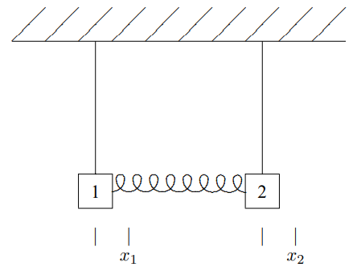
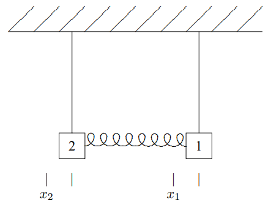
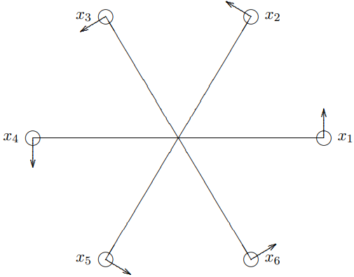

(ch-4)=

# 4. Symmetries

## 4.1: Symmetries

Let us return to the system of two identical pendulums coupled by a spring, discussed in chapter 3, in (3.78)-(3.93). This simple system has more to teach us. It is shown in Figure $4.1$. As in (3.78)-(3.93), both blocks have mass $m$, both pendulums have length $\ell$ and the spring constant is $\kappa$. Again we label the small displacements of the blocks to the right, $x_{1}$ and $x_{2}$.

We found the normal modes of this system in the last chapter. But in fact, we could have found them even more easily by making use of the symmetry of this system. If we reflect this system in a plane midway between the two blocks, we get back a completely equivalent system. We say that the system is “invariant” under reflections in the plane between the blocks. However, while the physics is unchanged by the reflection, our description of the system is affected. The coordinates get changed around. The reflected system is shown in Figure $4.2$. Comparing the two figures, we can describe the reflection in terms of its effect on the displacements, 
$$
x_{1} \rightarrow-x_{2}, \quad x_{2} \rightarrow-x_{1} .
$$

Figure $4.1$: A system of coupled pendulums. Displacements are measured to the right, as shown.

Figure $4.2$: The system of coupled pendulums after reflection in the plane through between the two.

In particular, if 
$$
X(t)=\left(\begin{array}{l}

x_{1}(t) \\

x_{2}(t)

\end{array}\right)
$$

is a solution to the equations of motion for the system, then the reflected vector, 
$$
\tilde{X}(t) \equiv\left(\begin{array}{l}

-x_{2}(t) \\

-x_{1}(t)

\end{array}\right) ,
$$

must also be a solution, because the reflected system is actually identical to the original. While this must be so from the physics, it is useful to understand how the math works. To see mathematically that (4.3) is a solution, define the symmetry matrix, $S$, 
$$
S \equiv\left(\begin{array}{cc}

0 & -1 \\

-1 & 0

\end{array}\right) ,
$$

so that $\tilde{X}(t)$ is related to $X(t)$ by matrix multiplication: 
$$
\tilde{X}(t)=\left(\begin{array}{cc}

0 & -1 \\

-1 & 0

\end{array}\right)\left(\begin{array}{l}

x_{1}(t) \\

x_{2}(t)

\end{array}\right)=S X(t) .
$$

The mathematical statement of the symmetry is the following condition on the $M$ and $K$ matrices:1 
$$
M S=S M,
$$

and 
$$
K S=S K .
$$

You can check explicitly that (4.6) and (4.7) are true. From these equations, it follows that if $X(t)$ is a solution to the equation of motion, 
$$
M \frac{d^{2}}{d t^{2}} X(t)=-K X(t) ,
$$

then $\tilde{X}(t)$ is also. To see this explicitly, multiply both sides of (4.8) by $S$ to get 
$$
S M \frac{d^{2}}{d t^{2}} X(t)=-S K X(t) .
$$

Then using (4.6) and (4.7) in (4.9), we get 
$$
M S \frac{d^{2}}{d t^{2}} X(t)=-K S X(t) .
$$

The matrix $S$ is a constant, independent of time, thus we can move it through the time derivatives in (4.10) to get 
$$
M \frac{d^{2}}{d t^{2}} S X(t)=-K S X(t) .
$$

But now using (4.5), this is the equation of motion for $\tilde{X}(t)$, 
$$
M \frac{d^{2}}{d t^{2}} \tilde{X}(t)=-K \tilde{X}(t) .
$$

Thus, as promised, (4.6) and (4.7) are the mathematical statements of the reflection symmetry because they imply, as we have now seen explicitly, that if $X(t)$ is a solution, $\tilde{X}(t)$ is also.

Note that from (4.6), you can show that 
$$
M^{-1} S=S M^{-1}
$$

by multiplying on both sides by $M^{-1}$. Then (4.13) can be combined with (4.7) to give 
$$
M^{-1} K S=S M^{-1} K .
$$

We will use this later.

Now suppose that the system is in a normal mode, for example 
$$
X(t)=A^{1} \cos \omega_{1} t .
$$

Then $\tilde{X}(t)$ is another solution. But it has the same time dependence, and thus the same angular frequency. It must, therefore, be proportional to the same normal mode vector because we already know from our previous analysis that the two angular frequencies of the normal modes of the system are different, $\omega_{1} \neq \omega_{2}$. Anything that oscillates with angular frequency, $\omega_{1}$, must be proportional to the normal mode, $A^{1}$: 
$$
\tilde{X}(t) \propto A^{1} \cos \omega_{1} t .
$$

Thus the symmetry implies 
$$
S A^{1} \propto A^{1} .
$$

That is, we expect from the symmetry that the normal modes are also eigenvectors of $S$. This must be true whenever the angular frequencies are distinct. In fact, we can see by checking the solutions that this is true. The proportionality constant is just −1, 
$$
S A^{1}=\left(\begin{array}{cc}

0 & -1 \\

-1 & 0

\end{array}\right) A^{1}=-A^{1} ,
$$

and similarly 
$$
S A^{2}=\left(\begin{array}{cc}

0 & -1 \\

-1 & 0

\end{array}\right) A^{2}=A^{2} .
$$

Furthermore, we can run the argument backwards. If $A$ is an eigenvector of the symmetry matrix $S$, and if all the eigenvalues of $S$ are different, then because of the symmetry, (4.13), $A$ is a normal mode. To see this, consider the vector $M^{-1}KA$ and act on it with the matrix $S$. Using (4.14), we see that if 
$$
S A=\beta A
$$

then 
$$
S M^{-1} K A=M^{-1} K S A=\beta M^{-1} K A .
$$

In words, (4.21) means that $M^{-1}KA$ is an eigenvector of $S$ with the same eigenvalue as $A$. But if the eigenvalues of $S$ are all different, then $M^{-1}KA$ must be proportional to $A$, which means that $A$ is a normal mode. Mathematically we could say it this way. If the eigenvectors of $S$ are $A^{n}$ with eigenvalues $\beta_{n}$, then 
$$
S A^{n}=\beta_{n} A^{n}, \text { and } \beta_{n} \neq \beta_{m} \text { for } n \neq m \Rightarrow A^{n} \text { are normal modes. }
$$

It turns out that for the symmetries we care about, the eigenvalues of $S$ are always all different.[^4-1-2]

**Thus even if we had not known the solution, we could have used (4.20) to determine the normal modes without bothering to solve the eigenvalue problem for the** $M^{-1}K$ **matrix!** Instead of solving the eigenvalue problem, 
$$
M^{-1} K A^{n}=\omega_{n}^{2} A^{n} ,
$$

we can instead solve the eigenvalue problem 
$$
S A^{n}=\beta_{n} A^{n} .
$$

It might seem that we have just traded one eigenvalue problem for another. But in fact, (4.24) is easier to solve, because **we can use the symmetry to determine the eigenvalues,** $\beta_{n}$**, without ever computing a determinant.** The reflection symmetry has the nice property that if you do it twice, you get back to where you started. This is reflected in the property of the matrix $S$, 
$$
S^{2}=I .
$$

In words, this means that applying the matrix $S$ twice gives you back exactly the vector that you started with. Multiplying both sides of the eigenvalue equation, (4.24), by $S$, we get 
$$
\begin{aligned}

A^{n}=& I A^{n}=S^{2} A^{n}=S \beta_{n} A^{n} \\

&=\beta_{n} S A^{n}=\beta_{n}^{2} A^{n} ,

\end{aligned}
$$

which implies 
$$
\beta_{n}^{2}=1 \quad \text { or } \quad \beta_{n}=\pm 1 .
$$

This saves some work. Once the eigenvalues of $S$ are known, it is easier to find the eigenvectors of $S$. But because of the symmetry, we know that the eigenvectors of $S$ will also be the normal modes, the eigenvectors of $M^{-1}K$. And once the normal modes are known, it is straightforward to find the angular frequency by acting on the normal mode eigenvectors with $M^{-1}K$.

What we have seen here, in a simple example, is how to use the symmetry of an oscillating system to determine the normal modes. In the remainder of this chapter we will generalize this technique to a much more interesting situation. The idea is always the same.

**We can find the normal modes by solving the eigenvalue problem for the symmetry matrix,** $S$**, instead of** $M^{-1}K$**. And we can use the symmetry to determine the eigenvalues.**

### Beats

4-1

The beginnings of wave phenomena can already be seen in this simple example. Suppose that we start the system oscillating by displacing block 1 an amount $d$ with block 2 held fixed in its equilibrium position, and then releasing both blocks from rest at time $t = 0$. The general solution has the form 
$$
X(t)=A^{1}\left(b_{1} \cos \omega_{1} t+c_{1} \sin \omega_{1} t\right)+A^{2}\left(b_{2} \cos \omega_{2} t+c_{2} \sin \omega_{2} t\right) .
$$

The positions of the blocks at $t = 0$ gives the matrix equation: 
$$
X(0)=\left(\begin{array}{l}

d \\

0

\end{array}\right)=A^{1} b_{1}+A^{2} b_{2} ,
$$

or 
$$
\begin{gathered}

d=b_{1}+b_{2} \\

0=-b_{1}+b_{2}

\end{gathered} \Rightarrow b_{1}=b_{2}=\frac{d}{2} .
$$

Because both blocks are released from rest, we know that $c1 = c2 = 0$. We can see this in the same way by looking at the initial velocities of the blocks: 
$$
\dot{X}(0)=\left(\begin{array}{l}

0 \\

0

\end{array}\right)=\omega_{1} A^{1} c_{1}+\omega_{2} A^{2} c_{2} ,
$$

or 
$$
\begin{gathered}

0=c_{1}+c_{2} \\

0=-c_{1}+c_{2}

\end{gathered} \Rightarrow c_{1}=c_{2}=0 .
$$

Thus 
$$
\begin{aligned}

&x_{1}(t)=\frac{d}{2}\left(\cos \omega_{1} t+\cos \omega_{2} t\right) \\

&x_{2}(t)=\frac{d}{2}\left(\cos \omega_{1} t-\cos \omega_{2} t\right) .

\end{aligned}
$$

The remarkable thing about this solution is the way in which the energy gets completely transferred from block 1 to block 2 and back again. To see this, we can rewrite (4.34) as (using (1.64) and another similar identity) 
$$
\begin{aligned}

&x_{1}(t)=d \cos \Omega t \cos \delta \omega t \\

&x_{2}(t)=d \sin \Omega t \sin \delta \omega t

\end{aligned}
$$

where 
$$
\Omega=\frac{\omega_{1}+\omega_{2}}{2}, \quad \delta \omega=\frac{\omega_{2}-\omega_{1}}{2} .
$$

Each of the blocks exhibits “beats.” They oscillate with the average angular frequency, $\Omega$, but the amplitude of the oscillation changes with angular frequency $\delta \omega$. After a time , the $\frac{\pi}{2 \delta \omega}$ energy has been almost entirely transferred from block 1 to block 2. This behavior is shown in program 4-1 on your program disk. Note how the beats are produced by the interplay between the two normal modes. When the two modes are in phase for one of the blocks so that the block is moving with maximum amplitude, the modes are $180^{\circ}$ out of phase for the other block, so the other block is almost still.

The complete transfer of energy back and forth from block 1 to block 2 is a feature both of our special initial condition, with block 2 at rest and in its equilibrium position, and of the special form of the normal modes that follows from the reflection symmetry. As we will see in more detail later, this is the same kind of energy transfer that takes place in wave phenomena.

### Less Trivial Example

4-2

Take a hacksaw blade, fix one end and attach a mass to the other. This makes a nice oscillator with essentially only one degree of freedom (because the hacksaw blade will only bend back and forth easily in one way). Now take six identical blades and fix one end of each at a single point so that the blades fan out at $60^{\circ}$ angles from the center with their orientation such that they can bend back and forth **in the plane formed by the blades.** If you put a mass at the end of each, in a hexagonal pattern, you will have six uncoupled oscillators. But if instead you put identical magnets at the ends, the oscillators will be coupled together in some complicated way. You can see what the oscillations of this system look like in program 4-2 on the program

Figure $4.3$: A system of six coupled hacksaw blade oscillators. The arrows indicate the directions in which the displacements are measured.

disk. If the displacements from the symmetrical equilibrium positions are small, the system is approximately linear. Despite the apparent complexity of this system, we can write down the normal modes and the corresponding angular frequencies with almost no work! The trick is to make clever use of the symmetry of this system.

This system looks exactly the same if we rotate it by $60^{\circ}$ about its center. We should, therefore, take pains to analyze it in a manifestly symmetrical way. Let us label the masses 1 through 6 starting any place and going around counterclockwise. Let $x_{j}$ be the counterclockwise displacement of the $j$th block from its equilibrium position. As usual, we will arrange these coordinates in a vector:3 $X=\left(\begin{array}{l}

x_{1} \\

x_{2} \\

x_{3} \\

x_{4} \\

x_{5} \\

x_{6}

\end{array}\right) .\]

The symmetry operation of rotation is implemented by the cyclic substitution 
$$
x_{1} \rightarrow x_{2} \rightarrow x_{3} \rightarrow x_{4} \rightarrow x_{5} \rightarrow x_{6} \rightarrow x_{1} .
$$

This can be represented in a matrix notation as 
$$
X \rightarrow S X ,
$$

where the symmetry matrix, \(S$, is 
$$
S=\left(\begin{array}{llllll}

0 & 1 & 0 & 0 & 0 & 0 \\

0 & 0 & 1 & 0 & 0 & 0 \\

0 & 0 & 0 & 1 & 0 & 0 \\

0 & 0 & 0 & 0 & 1 & 0 \\

0 & 0 & 0 & 0 & 0 & 1 \\

1 & 0 & 0 & 0 & 0 & 0

\end{array}\right) .
$$

Note that the 1s along the next-to-diagonal of the matrix, $S$, in (4.40) implement the substitutions 
$$
x_{1} \rightarrow x_{2} \rightarrow x_{3} \rightarrow x_{4} \rightarrow x_{5} \rightarrow x_{6} ,
$$

while the 1 in the lower left-hand corner closes the circle with the substitution 
$$
x_{6} \rightarrow x_{1} .
$$

The symmetry requires that the K matrix for this system has the following form: 
$$
K=\left(\begin{array}{cccccc}

E & -B & -C & -D & -C & -B \\

-B & E & -B & -C & -D & -C \\

-C & -B & E & -B & -C & -D \\

-D & -C & -B & E & -B & -C \\

-C & -D & -C & -B & E & -B \\

-B & -C & -D & -C & -B & E

\end{array}\right) .
$$

Notice that all the diagonal elements are the same $(E)$, as they must be because of the symmetry. The $j$th diagonal element of the $K$ matrix is minus the force per unit displacement on the $j$th mass due to its displacement. Because of the symmetry, each of the masses behaves in exactly the same way when it is displaced with all the other masses held fixed. Thus all the diagonal matrix elements of the $K$ matrix, $K_{jj}$, are equal. Likewise, the symmetry ensures that the effect of the displacement of each block, $j$, on its neighbor, $j \pm 1$ ($j+1 \rightarrow 1$ if $j = 6$, $j - 1 \rightarrow 6$ if $j = 1$ — see (4.42)), is exactly the same. Thus the matrix elements along the next-to-diagonal ($B$) are all the same, along with the $B$s in the corners. And so on! The $K$ matrix then satisfies (4.7), 
$$
S K=K S
$$

which, as we saw in (4.13)-(4.12), is the mathematical statement of the symmetry. Indeed, we can go backwards and work out the most general symmetric matrix consistent with (4.44) and check that it must have the form, (4.43). You will do this in problem (4.4).

Because of the symmetry, we know that if a vector $A$ is a normal mode, then the vector $SA$ is also a normal mode with the same frequency. This is physically obvious. If the system oscillates with all its parts in step in a certain way, it can also oscillate with the parts rotated by $60^{\circ}$, but otherwise moving in the same way, and the frequency will be the same. This suggests that we look for normal modes that behave simply under the symmetry transformation $S$. In particular, if we find the eigenvectors of $S$ and discover that the eigenvalues of $S$ are all different, then we know that all the eigenvectors are normal modes, from (4.22). In the previous example, we found modes that went into themselves multiplied by $\pm 1$ under the symmetry. In general, however, we should not expect the eigenvalues to be real because the modes can involve complex exponentials. In this case, we must look for modes that correspond to complex eigenvalues of $S$,4 
$$
S A=\beta A .
$$

As above in (4.25)-(4.27), we can find the possible eigenvalues by using the symmetry. Note that because six $60^{\circ}$ rotations get us back to the starting point, the matrix, $S$, satisfies 
$$
S^{6}=I .
$$

Because of (4.46), it follows that $\beta^{6} = 1$. Thus $\beta$ is a sixth root of one, 
$$
\beta=\beta_{k}=e^{2 i k \pi / 6} \text { for } k=0 \text { to } 5 \text { . }
$$

Then for each $k$, there is a normal mode 
$$
S A^{k}=\beta_{k} A^{k} .
$$

Explicitly, 
$$
S A^{k}=\left(\begin{array}{c}

A_{2}^{k} \\

A_{3}^{k} \\

A_{4}^{k} \\

A_{5}^{k} \\

A_{6}^{k} \\

A_{1}^{k}

\end{array}\right)=\beta_{k} \cdot\left(\begin{array}{c}

A_{1}^{k} \\

A_{2}^{k} \\

A_{3}^{k} \\

A_{4}^{k} \\

A_{5}^{k} \\

A_{6}^{k}

\end{array}\right) .
$$

If we take $A_{1}^{k}=1$ we can solve for all the other components, 
$$
A_{j}^{k}=\left(\beta_{k}\right)^{j-1} .
$$

Thus 
$$
\left(\begin{array}{c}

A_{1}^{k} \\

A_{2}^{k} \\

A_{3}^{k} \\

A_{4}^{k} \\

A_{5}^{k} \\

A_{6}^{k}

\end{array}\right)=\left(\begin{array}{c}

1 \\

e^{2 i k \pi / 6} \\

e^{4 i k \pi / 6} \\

e^{6 i k \pi / 6} \\

e^{8 i k \pi / 6} \\

e^{10 i k \pi / 6}

\end{array}\right) .
$$

Now to determine the angular frequencies corresponding to the normal modes, we have to evaluate 
$$
M^{-1} K A^{k}=\omega_{k}^{2} A^{k} .
$$

Since we already know the form of the normal modes, this is straightforward. For example, we can compare the first components of these two vectors: 
$$
\begin{gathered}

\omega_{k}^{2}=\left(E-B e^{2 i k \pi / 6}-C e^{4 i k \pi / 6}-D e^{6 i k \pi / 6}-C e^{8 i k \pi / 6}-B e^{10 i k \pi / 6}\right) / m \\

=\frac{E}{m}-2 \frac{B}{m} \cos \frac{k \pi}{3}-2 \frac{C}{m} \cos \frac{2 k \pi}{3}-(-1)^{k} \frac{D}{m} .

\end{gathered}
$$

Notice that $\omega_{1}^{2}=\omega_{5}^{2}$ and $\omega_{2}^{2}=\omega_{4}^{2}$. This had to be the case, because the corresponding normal modes are complex conjugate pairs, 
$$
A^{5}=A^{1^{*}}, \quad A^{4}=A^{2^{*}} .
$$

Any complex normal mode must be part of a pair with its complex conjugate normal mode at the same frequency, so that we can make real normal modes out of them. This must be the case because the normal modes describe a real physical system whose displacements are real. The real modes are linear combinations (see (1.19)) of the complex modes, 
$$
A^{k}+A^{k^{*}} \text { and }\left(A^{k}-A^{k^{*}}\right) / i \text { for } k=1 \text { or } 2 \text { . }
$$

These modes can be seen in program 4-2 on the program disk. See appendix A and your program instruction manual for details.

Notice that the real solutions, (4.55), are not eigenvectors of the symmetry matrix, $S$. This is possible because the angular frequencies are not all different. However, the eigenvalues of $S$ are all different, from (4.47). Thus even though we can construct normal modes that are not eigenvectors of $S$, it is still true that **all the eigenvectors of** $S$ **are normal modes.** This is what we use in (4.48)-(4.50) to determine the $A^{n}$.

We note that (4.55) is another example of a very important principle of (3.117) that we will use many times in what follows:

If $A$ and $A^{\prime}$ are normal modes of a system **with the same angular frequency,** $\omega$**,** then any linear combination, $b A+c A^{\prime}$, is (4.56) also a normal mode with the same angular frequency.

Normal modes with the same frequency can be linearly combined to give new normal modes (see problem 4.3). On the other hand, a linear combination of two normal modes with **different** frequencies gives nothing very simple.

The techniques used here could have been used for any number of masses in a similar symmetrical arrangement. With $N$ masses and symmetry under rotation of $2 \pi / N$ radians, the $N$th roots of 1 would replace the 6th roots of one in our example. Symmetry arguments can also be used to determine the normal modes in more interesting situations, for example when the masses are at the corners of a cube. But that case is more complicated than the one we have analyzed because the order of the symmetry transformations matters — the transformations do not commute with one another. You may want to look at it again after you have studied some group theory.

_____________________

1Two matrices, $A$ and $B$, that satisfy $AB = BA$ are said to “commute.”

[^4-1-2]: See the discussion on page 103.

3From here on, we will assume that the reader is sufficiently used to complex numbers that it is not necessary to distinguish between a real coordinate and a complex coordinate.

4Even this is not the most general possibility. In general, we might have to consider sets of modes that go into one another under matrix multiplication. That is not necessary here because the symmetry transformations all commute with one another.

## 4.2: Chapter Checklist

You should now be able to:

1. Apply symmetry arguments to find the normal modes of systems of coupled oscillators by finding the eigenvalues and eigenvectors of the symmetry matrix.

### Problems

**4.1.** Show explicitly that (4.7) is true for the $K$ matrix, (4.43), of system of Figure $4.3$ by finding $SK$ and $KS$.

**4.2.** Consider a system of six identical masses that are free to slide without friction on a circular ring of radius $R$ and each of which is connected to both its nearest neighbors by identical springs, shown below in equilibrium:

1. Analyze the possible motions of this system in the region in which it is linear (note that this is not quite just small oscillations). To do this, define appropriate displacement variables (so that you can use a symmetry argument), find the form of the $K$ matrix and then follow the analysis in (4.37)-(4.55). If you have done this properly, you should find that one of the modes has zero frequency. Explain the physical significance of this mode. **Hint:** Do not attempt to find the form of the $K$ matrix directly from the spring constants of the spring and the geometry. This is a mess. Instead, figure out what it has to look like on the basis of symmetry arguments. You may want to look at appendix c.

2. If at $t = 0$, the masses are evenly distributed around the circle, but every other mass is moving with (counterclockwise) velocity $v$ while the remaining masses are at rest, find and describe in words the subsequent motion of the system.

**4.3.**

1. Prove (4.56).

2. Prove that if $A$ and $A^{\prime}$ are normal modes corresponding to **different** angular frequencies, $\omega$ and $\omega^{\prime}$ respectively, where $\omega^{2}$ \neq \omega^{\prime 2}\), then $b A+c A^{\prime}$ is not a normal mode unless $b$ or $c$ is zero. **Hint:** You will need to use the fact that both $A$ and $A^{\prime}$ are nonzero vectors.

**4.4.** Show that (4.43) is the most general symmetric $6 \times 6$ matrix satisfying (4.44).
