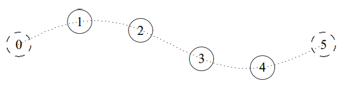
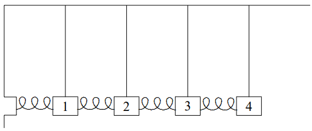
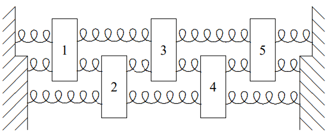
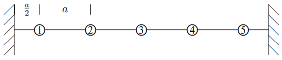
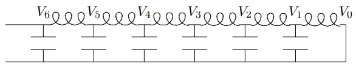

(ch-5)=

# 5. Waves

The climax of this book comes early. Here we identify the crucial features of a system that supports waves — space translation invariance and local interactions.

::::{admonition} Chapter Preview
:class: preview

We identify the space translation invariance of the class of infinite systems in which wave phenomena take place.

1. Symmetry arguments cannot be directly applied to finite systems that support waves, such as a series of coupled pendulums. However, we show that if the couplings are only between neighboring blocks, the concept of symmetry can still be used to understand the oscillations. In this case we say that the interactions are “local.” The idea is to take the physics apart into two different components: the physics of the interior; and the physics of the boundaries, which is incorporated in the form of boundary conditions. The interior can be regarded as part of an infinite system with space translation invariance, a symmetry under translations by some distance, a. In this case the normal modes are called standing waves.

2. We then introduce a notation designed to take maximum advantage of the space translation invariance of the infinite system. We introduce the angular wave number, $k$, which plays the role for the spatial dependence of the wave that the angular frequency, $\omega$, plays for its time dependence.

3. We describe the normal modes of transverse oscillation of a beaded string. The modes are “wavy.”

4. We study the normal modes of a finite beaded string with free ends as another example of boundary conditions.

5. We study a type of forced oscillation problem that is particularly important for translation invariant systems with local interactions. If the driving force acts only at the ends of the system, the solution can be found simply using boundary conditions.

6. We apply the idea of space translation invariance to a system of coupled $LC$ circuits.
::::

## 5.1: Space Translation Invariance

:::{figure} ../images/lt-33596-clipboard_ed95a15b360353842f10d265c99fcf22a.png
:label: fig-5-1
:enumerator: 5.1
:alt: A finite system of coupled pendulums.

A finite system of coupled pendulums.
:::
The typical system of coupled oscillators that supports waves is one like the system of $N$ identical coupled pendulums shown in [Figure 5.1](#fig-5-1). This system is a generalization of the system of two coupled pendulums that we studied in chapters 3 and 4. Suppose that each pendulum bob has mass $m$, each pendulum has length $\ell$, each spring has spring constant $\kappa$ and the equilibrium separation between bobs is $a$. Suppose further that there is no friction and that the pendulums are constrained to oscillate only in the direction in which the springs are stretched. We are interested in the free oscillation of this system, with no external force. Such an oscillation, when the motion is parallel to the direction in which the system is stretched in space is called a “longitudinal oscillation”. Call the longitudinal displacement of the $j$th bob from equilibrium $\psi_{j}$. We can organize the displacements into a vector, $\Psi$ (for reasons that will become clear below, it would be confusing to use $X$, so we choose a different letter, the Greek letter psi, which looks like $\psi$ in lower case and $\Psi$ when capitalized): 
$$
\Psi=\left(\begin{array}{c}
\psi_{1} \\
\psi_{2} \\
\psi_{3} \\
\vdots \\
\psi_{N}
\end{array}\right) . \tag{5.1} \label{eq-5-1}
$$

Then the equations of motion (for small longitudinal oscillations) are 
$$
\frac{d^{2} \Psi}{d t^{2}}=-M^{-1} K \Psi \tag{5.2} \label{eq-5-2}
$$

where $M$ is the diagonal matrix with $m$’s along the diagonal, 
$$
\left(\begin{array}{ccccc}
m & 0 & 0 & \cdots & 0 \\
0 & m & 0 & \cdots & 0 \\
0 & 0 & m & \cdots & 0 \\
\vdots & \vdots & \vdots & \ddots & \vdots \\
0 & 0 & 0 & \cdots & m
\end{array}\right) , \tag{5.3} \label{eq-5-3}
$$

and $K$ has diagonal elements $(m g / \ell+2 \kappa)$, next-to-diagonal elements $-\kappa$, and zeroes elsewhere, 
$$
\left(\begin{array}{ccccc}
m g / \ell+2 \kappa & -\kappa & 0 & \cdots & 0 \\
-\kappa & m g / \ell+2 \kappa & -\kappa & \cdots & 0 \\
0 & -\kappa & m g / \ell+2 \kappa & \cdots & 0 \\
\vdots & \vdots & \vdots & \ddots & \vdots \\
0 & 0 & 0 & \cdots & m g / \ell+2 \kappa
\end{array}\right) . \tag{5.4} \label{eq-5-4}
$$

The $- \kappa$ in the next-to-diagonal elements has exactly the same origin as the $- \kappa$ in the $2 \times 2 \text { } K$ matrix in [3.78](#eq-3-78). It describes the coupling of two neighboring blocks by the spring. The $(m g / \ell+2 \kappa)$ on the diagonal is analogous to the $(m g / \ell+ \kappa)$ on the diagonal of [3.78](#eq-3-78). The difference in the factor of 2 in the coefficient of $\kappa$ arises because there are two springs, one on each side, that contribute to the restoring force on each block in the system shown in [Figure 5.1](#fig-5-1), while there was only one in the system shown in [Figure 3.1](#fig-3-1). Thus $M^{- 1}K$ has the form 
$$
\left(\begin{array}{ccccc}
2 B & -C & 0 & \cdots & 0 \\
-C & 2 B & -C & \cdots & 0 \\
0 & -C & 2 B & \cdots & 0 \\
\vdots & \vdots & \vdots & \ddots & \vdots \\
0 & 0 & 0 & \cdots & 2 B
\end{array}\right) \tag{5.5} \label{eq-5-5}
$$

where 
$$
2 B=g / \ell+2 \kappa / m, \quad C=\kappa / m . \tag{5.6} \label{eq-5-6}
$$

It is interesting to compare the matrix, [5.5](#eq-5-5), with the matrix, [4.43](#eq-4-43), from the previous chapter. In both cases, the diagonal elements are all equal, because of the symmetry. The same goes for the next-to-diagonal elements. However, in [5.5](#eq-5-5), all the rest of the elements are zero because the interactions are only between nearest neighbor blocks. We call such interactions “local.” In [4.43](#eq-4-43), on the other hand, each of the masses interacts with all the others. We will use the local nature of the interactions below.

We could try to find normal modes of this system directly by finding the eigenvectors of $M^{- 1}K$, but there is a much easier and more generally useful technique. We can divide the physics of the system into two parts, the physics of the coupled pendulums, and the physics of the walls. To do this, **we first consider an infinite system with no walls at all.**

:::{figure} ../images/lt-33597-clipboard_e03f7cab952546d2c582d59b590b35665.png
:label: fig-5-2
:enumerator: 5.2
:alt: A piece of an infinite system of coupled pendulums.

A piece of an infinite system of coupled pendulums.
:::
Notice that in [Figure 5.2](#fig-5-2), we have not changed the interior of the system shown in [Figure 5.1](#fig-5-1) at all. We have just replaced the walls by a continuation of the interior.

Now we can find all the modes of the infinite system of [Figure 5.2](#fig-5-2) very easily, making use of a symmetry argument. **The infinite system of** [Figure 5.2](#fig-5-2) **looks the same if it is translated, moved to the left or the right by a multiple of the equilibrium separation,** $a$**. It has the property of “space translation invariance.”** Space translation invariance is the symmetry of the infinite system under translations by multiples of $a$. In this example, because of the discrete blocks and finite length of the springs, the space translation invariance is “discrete.” Only translation by integral multiples of $a$ give the same physics. Later, we will discuss continuous systems that have continuous space translation invariance. However, we will see that such systems can be analyzed using the same techniques that we introduce in this chapter.

We can use the symmetry of space translation invariance, just as we used the reflection and rotation symmetries discussed in the previous chapter, to find the normal modes of the infinite system. **The discrete space translation invariance of the infinite system (the symmetry under translations by multiples of** $a$**) allows us to find the normal modes of the infinite system in a simple way.**

Most of the modes that we find using the space translation invariance of the infinite system of [Figure 5.2](#fig-5-2) will have nothing to do with the finite system shown in [Figure 5.1](#fig-5-1). **But if we can find linear combinations of the normal modes of the infinite system of** [Figure 5.2](#fig-5-2) **in which the 0th and** $N$ **+ 1st blocks stay fixed, then they must be solutions to the equations of motion of the system shown in** [Figure 5.1](#fig-5-1)**. The reason is that the interactions between the blocks are “local” — they occur only between nearest neighbor blocks.** Thus block 1 knows what block 0 is doing, but not what block −1 is doing. If block 0 is stationary it might as well be a wall because the blocks on the other side do not affect block 1 (or any of the blocks 1 to $N$) in any way. The local nature of the interaction allows us to put in the physics of the walls as a boundary condition after solving the infinite problem. This same trick will also enable us to solve many other problems.

Let us see how it works for the system shown in [Figure 5.1](#fig-5-1). First, we use the symmetry under translations to find the normal modes of the infinite system of [Figure 5.2](#fig-5-2). As in the previous two chapters, we describe the solutions in terms of a vector, $A$. But now $A$ has an infinite number of components, $A_{j}$ where the integer $j$ runs from $- \infty$ to $+ \infty$. It is a little inconvenient to write this infinite vector down, but we can represent a piece of it: 
$$
A=\left(\begin{array}{c}
\vdots \\
A_{0} \\
A_{1} \\
A_{2} \\
A_{3} \\
\vdots \\
A_{N} \\
A_{N+1} \\
\vdots
\end{array}\right) . \tag{5.7} \label{eq-5-7}
$$

Likewise, the $M^{- 1}K$ matrix for the system is an infinite matrix, not easily written down, but any piece of it (along the diagonal) looks like the interior of [5.5](#eq-5-5): 
$$
\left(\begin{array}{cccccc}
\ddots & \vdots & \vdots & \vdots & \vdots & \ddots \\
\cdots & 2 B & -C & 0 & 0 & \cdots \\
\cdots & -C & 2 B & -C & 0 & \cdots \\
\cdots & 0 & -C & 2 B & -C & \cdots \\
\cdots & 0 & 0 & -C & 2 B & \cdots \\
\ddots & \vdots & \vdots & \vdots & \vdots & \ddots
\end{array}\right) . \tag{5.8} \label{eq-5-8}
$$

This system is “space translation invariant” because it looks the same if it is moved to the left a distance $a$. This moves block $j+1$ to where block $j$ used to be, thus if there is a mode with components $A_{j}$, there must be another mode with the same frequency, represented by a vector, $A^{\prime} = SA$, with components 
$$
A_{j}^{\prime}=A_{j+1} . \tag{5.9} \label{eq-5-9}
$$

The symmetry matrix, $S$, is an infinite matrix with 1s along the next-to-diagonal. These are analogous to the 1s along the next-to-diagonal in [4.40](#eq-4-40). Now, however, the transformation never closes on itself. There is no analog of the 1 in the lower left-hand corner of [4.40](#eq-4-40), because the infinite matrix has no corner. We want to find the eigenvalues and eigenvectors of the matrix $S$, satisfying 
$$
A^{\prime}=S A=\beta A \tag{5.10} \label{eq-5-10}
$$

or equivalently (from [5.9](#eq-5-9)), the modes in which $A_{j}$ and $A_{j}^{\prime}$ are proportional: 
$$
A_{j}^{\prime}=\beta A_{j}=A_{j+1} \tag{5.11} \label{eq-5-11}
$$

where $\beta$ is some nonzero constant.[^5-1-1]

Equation [5.11](#eq-5-11) can be solved as follows: Choose $A_{0} = 1$. Then $A_{1} = \beta$, $A_{2} = \beta^{2}$, etc., so that $A_{j} = (\beta)^{j}$ for all nonnegative $j$. We can also rewrite [5.11](#eq-5-11) as $A_{j-1}=\beta^{-1} A_{j}$, so that $A_{-1} = \beta^{-1}$, $A_{-2} = \beta^{-2}$, etc. Thus the solution is 
$$
A_{j}=(\beta)^{j} \tag{5.12} \label{eq-5-12}
$$

Now that we know the form of the normal modes, it is easy to get the corresponding frequencies by acting on [5.12](#eq-5-12) with the $M^{-1}K$ matrix, [5.8](#eq-5-8). This gives 
$$
\omega^{2} A_{j}^{\beta}=2 B A_{j}^{\beta}-C A_{j+1}^{\beta}-C A_{j-1}^{\beta} , \tag{5.13} \label{eq-5-13}
$$

or inserting [5.13](#eq-5-13), 
$$
\omega^{2} \beta^{j}=2 B \beta^{j}-C \beta^{j+1}-C \beta^{j-1}=\left(2 B-C \beta-C \beta^{-1}\right) \beta^{j} . \tag{5.14} \label{eq-5-14}
$$

This is true for all $j$, which shows that [5.13](#eq-5-13) is indeed an eigenvector (we already knew this from the symmetry argument, [4.22](#eq-4-22), but it is nice to check when possible), and the eigenvalue is 
$$
\omega^{2}=2 B-C \beta-C \beta^{-1} . \tag{5.15} \label{eq-5-15}
$$

Notice that for almost every value of $\omega^{2}$, there are two normal modes, because we can interchange $\beta$ and $\beta^{-1}$ without changing [5.16](#eq-5-16). The only exceptions are 
$$
\omega^{2}=2 B \mp 2 C , \tag{5.16} \label{eq-5-16}
$$

corresponding to $\beta=\pm 1$. The fact that there are at most two normal modes for each value of $\omega^{2}$ will have a dramatic consequence. It means that we only have to deal with two normal modes at a time to implement the physics of the boundary. This is a special feature of the one-dimensional system that is not shared by two- and three-dimensional systems. As we will see, it makes the one-dimensional system very easy to handle.

### Boundary Conditions

5-1

We have now solved the problem of the oscillation of the infinite system. Armed with this result, we can put back in the physics of the walls. Any $\beta$ (except $\beta=\pm 1$) gives a pair of normal modes for the infinite system of [Figure 5.2](#fig-5-2). But only special values of $\beta$ will work for the finite system shown in [Figure 5.1](#fig-5-1). To find the normal modes of the system shown in [Figure 5.1](#fig-5-1), we use (4.56), the fact that **any linear combination of the two normal modes with the same angular frequency,** $\omega$**, is also a normal mode.** If we can find a linear combination that vanishes for $j = 0$ and for $j = N + 1$, it will be a normal mode of the system shown in [Figure 5.1](#fig-5-1). It is the vanishing of the normal mode at $j = 0$ and $j = N + 1$ that are the “boundary conditions” for this particular finite system.

Let us begin by trying to satisfy the boundary condition at $j = 0$. For each possible value of $\omega^{2}$, we have to worry about only two normal modes, the two solutions of [5.16](#eq-5-16) for $\beta$. So long as $\beta \neq \pm 1$, we can find a combination that vanishes at $j = 0$; just subtract the two modes $A^{\beta}$ and $A^{\beta^{-1}}$ to get a vector 
$$
A=A^{\beta}-A^{\beta^{-1}} , \tag{5.17} \label{eq-5-17}
$$

or in components 
$$
A_{j} \propto A_{j}^{\beta}-A_{j}^{\beta^{-1}}=\beta^{j}-\beta^{-j} . \tag{5.18} \label{eq-5-18}
$$

The first thing to notice about [5.19](#eq-5-19) is that $A^{j}$ cannot vanish for any $j \neq 0$ unless $|\beta|=1$. Thus if we are to have any chance of satisfying the boundary condition at $j = N + 1$, we must assume that 
$$
\beta=e^{i \theta} . \tag{5.19} \label{eq-5-19}
$$

Then from [5.19](#eq-5-19), 
$$
A_{j} \propto \sin j \theta . \tag{5.20} \label{eq-5-20}
$$

Now we can satisfy the boundary condition at $j = N + 1$ by setting $A_{N + 1} = 0$. This implies $\sin [(N+1) \theta]=0$, or 
$$
\theta=n \pi /(N+1), \text { for integer } n . \tag{5.21} \label{eq-5-21}
$$

Thus the normal modes of the system shown in [Figure 5.1](#fig-5-1) are 
$$
A_{j}^{n}=\sin \left(\frac{j n \pi}{N+1}\right), \text { for } n=1,2, \cdots N . \tag{5.22} \label{eq-5-22}
$$

Other values of $n$ do not lead to new modes, they just repeat the $N$ modes already shown in [5.23](#eq-5-23). The corresponding frequencies are obtained by putting [5.20](#eq-5-20)-[5.21](#eq-5-21) into [5.16](#eq-5-16), to get 
$$
\omega^{2}=2 B-2 C \cos \theta=2 B-2 C \cos \left(\frac{n \pi}{N+1}\right) . \tag{5.23} \label{eq-5-23}
$$

From here on, the analysis of the motion of the system is the same as for any other system of coupled oscillators. As discussed in chapter 3, we can take a general motion apart and express it as a sum of the normal modes. This is illustrated for the system of coupled pendulums in program 5-1 on the program disk. The new thing about this system is the way in which we obtained the normal modes, and their peculiarly simple form, in terms of trigonometric functions. We will get more insight into the meaning of these modes in the next section. Meanwhile, note the way in which the simple modes can be combined into the very complicated motion of the full system.

___________________

[^5-1-1]: Zero does not work for $\beta$ because the eigenvalue equation has no solution.

## 5.2: k and Dispersion Relations

So far, the equilibrium separation between the blocks, $a$, has not appeared in the analysis. Everything we have said so far would be true even if the springs had random lengths, so long as all spring constants were the same. In such a case, the “space translation invariance” that we used to solve the problem would be a purely mathematical device, taking the original system into a different system with the same kind of small oscillations. Usually, however, in physical applications, the space translation invariance is real and all the inter-block distances are the same. Then it is very useful to **label the blocks by their equilibrium position.** Take $x = 0$ to be the position of the left wall (or the 0th block). Then the first block is at $x = a$, the second at $x = 2a$, etc., as shown in [Figure 5.3](#fig-5-3). We can describe the displacement of all the blocks by a function $\psi(x, t)$, where $\psi(ja, t)$ is the displacement of the $j$th block (the one with equilibrium position $ja$). Of course, this function is not very well defined because we only care about its values at a discrete set of points. Nevertheless, as we will see below when we discuss the beaded string, it will help us understand what is going on if we draw a smooth curve through these points.

:::{figure} ../images/lt-33666-clipboard_ec30442f686e394a6a29b8e6961d34aff.png
:label: fig-5-3
:enumerator: 5.3
:alt: The coupled pendulums with blocks labeled by their equilibrium positions.

The coupled pendulums with blocks labeled by their equilibrium positions.
:::
In the same way, we can describe a normal mode of the system shown in [Figure 5.1](#fig-5-1) (or the infinite system of [Figure 5.2](#fig-5-2)) as a function $A(x)$ where 
$$
A(j a)=A_{j} . \tag{5.24} \label{eq-5-24}
$$

In this language, space translation invariance, [5.11](#eq-5-11), becomes 
$$
A(x+a)=\beta A(x) . \tag{5.25} \label{eq-5-25}
$$

It is conventional to write the constant $\beta$ as an exponential 
$$
\beta=e^{i k a} . \tag{5.26} \label{eq-5-26}
$$

Any nonzero complex number can be written as a exponential in this way. In fact, we can change $k$ by a multiple of $2 \pi / a$ without changing $\beta$, thus we can choose the real part of $k$ to be between $- \pi / a$ and $\pi / a$ 
$$
-\frac{\pi}{a}<\operatorname{Re} k \leq \frac{\pi}{a} . \tag{5.27} \label{eq-5-27}
$$

If we put [5.13](#eq-5-13) and [5.27](#eq-5-27) into [5.25](#eq-5-25), we get 
$$
A^{\beta}(j a)=e^{i k j a} . \tag{5.28} \label{eq-5-28}
$$

This suggests that we take the function describing the normal mode corresponding to [5.27](#eq-5-27) to be 
$$
A(x)=e^{i k x} . \tag{5.29} \label{eq-5-29}
$$

The mode is determined by the number $k$ satisfying [5.28](#eq-5-28).

The parameter $k$ (when it is real) is called the angular wave number of the mode. It measures the waviness of the normal mode, in radians per unit distance. The “wavelength” of the mode is the smallest length, $\lambda$ (the Greek letter lambda), such that a change of $x$ by $\lambda$ leaves the mode unchanged, 
$$
A(x+\lambda)=A(x) . \tag{5.30} \label{eq-5-30}
$$

In other words, the wavelength is the length of a complete cycle of the wave, $2 \pi$ radians. Thus the wavelength, $\lambda$, and the angular wave number, $k$, are inversely related, with a factor of $2 \pi$, 
$$
\lambda=\frac{2 \pi}{k} \text { . } \tag{5.31} \label{eq-5-31}
$$

In this language, the normal modes of the system shown in [Figure 5.1](#fig-5-1) are described by the functions 
$$
A^{n}(x)=\sin k x , \tag{5.32} \label{eq-5-32}
$$

with 
$$
k=\frac{n \pi}{L} , \tag{5.33} \label{eq-5-33}
$$

where $L = (N +1)a$ is the total length of the system. **The important thing about [5.33](#eq-5-33) and [5.34](#eq-5-34) is that they do not depend on the details of the system. They do not even depend on** $N$**.** The normal modes always have the same shape, when the system has length $L$. Of course, as $N$ increases, the number of modes increases. For fixed L, this happens because $a = L/(N + 1)$ decreases as $N$ increases and thus the allowed range of $k$ (remember [5.28](#eq-5-28)) increases.

The forms [5.33](#eq-5-33) for the normal modes of the space translation invariant system are called “standing waves.” We will see in more detail below why the word “wave” is appropriate. The word “standing” refers to the fact that while the waves are changing with time, they do not appear to be moving in the $x$ direction, unlike the “traveling waves” that we will discuss in chapter 8 and beyond.

### Dispersion Relation

In terms of the angular wave number $k$, the frequency of the mode is (from [5.16](#eq-5-16) and [5.27](#eq-5-27)) 
$$
\omega^{2}=2 B-2 C \cos k a . \tag{5.34} \label{eq-5-34}
$$

**Such a relation between** $k$ (actually $k^{2}$ because $\cos k a$ is an even function of $k$) **and** $\omega^{2}$ **is called a “dispersion relation”** (we will learn later why the name is appropriate). The specific form [5.35](#eq-5-35) is a characteristic of the particular infinite system of [Figure 5.2](#fig-5-2). It depends on the masses and spring constants and pendulum lengths and separations.

**But it does not depend on the boundary conditions.** Indeed, we will see below that [5.35](#eq-5-35) will be useful for boundary conditions very different from those of the system shown in [Figure 5.1](#fig-5-1).

**The dispersion relation depends only on the physics of the infinite system.**

Indeed, it is only through the dispersion relation that the details of the physics of the infinite system enters the problem. The form of the modes, $e^{\pm i k x}$, is already determined by the general properties of linearity and space translation invariance.

**We will call [5.35](#eq-5-35) the dispersion relation for coupled pendulums.** We have given it a special name because we will return to it many times in what follows. The essential physics is that there are two sources of restoring force: gravity, that tends to keep all the masses in equilibrium; and the coupling springs, that tend to keep the separations between the masses fixed, but are unaffected if all the masses are displaced by the same distance. In [5.35](#eq-5-35), the constants always satisfy $B \geq C$, as you see from [5.6](#eq-5-6).

The limit $B = C$ is especially interesting. This happens when there is no gravity (or $\ell \rightarrow \infty$). The dispersion relation is then 
$$
\omega^{2}=2 B(1-\cos k a)=4 B \sin ^{2} \frac{k a}{2} . \tag{5.35} \label{eq-5-35}
$$

Note that the mode with $k = 0$ now has zero frequency, because all the masses can be displaced at once with no restoring force.[^5-2-2]

_______________________

[^5-2-2]: See appendix $C$.

## 5.3: Waves

### Beaded String

:::{figure} ../images/lt-33667-clipboard_eef96f3ab993cf685e15a3ae22b1d646d.png
:label: fig-5-4
:enumerator: 5.4
:alt: The beaded string in equilibrium.

The beaded string in equilibrium.
:::
Another instructive system is the beaded string, undergoing transverse oscillations. The oscillations are called “transverse” if the motion is perpendicular to the direction in which the system is stretched. Consider a massless string with tension $T$, to which identical beads of mass $m$ are attached at regular intervals, $a$. A portion of such a system in its equilibrium configuration is depicted in [Figure 5.4](#fig-5-4). The beads cannot oscillate longitudinally, because the string would break.[^5-3-3] However, for small transverse oscillations, the stretching of the string is negligible, and the tension and the horizontal component of the force from the string are approximately constant. The horizontal component of the force on each block from the string on its right is canceled by the horizontal component from the string on the left. The total horizontal force on each block is zero (this must be, because the blocks do not move horizontally). But the strings produces a transverse restoring force when neighboring beads do not have the same transverse displacement, as illustrated in [Figure 5.5](#fig-5-5). The force of the string on bead 1 is shown, along with the transverse component. The dotted lines complete similar triangles, so that $F / T=\left(\psi_{2}-\psi_{1}\right) / a$. You can see from [Figure 5.5](#fig-5-5) that the restoring force, $F$ in the figure, for small transverse oscillations is linear, and corresponds to a spring constant $T / a$.

:::{figure} ../images/lt-33668-clipboard_eb559867acba95a419497f14a80dd64ed.png
:label: fig-5-5
:enumerator: 5.5
:alt: Two neighboring beads on a beaded string.

Two neighboring beads on a beaded string.
:::
**Thus [5.37](#eq-5-37) is also the dispersion relation for the small transverse oscillations of the beaded string with** 
$$
B=\frac{T}{m a}, \tag{5.36} \label{eq-5-36}
$$

**where** $T$ **is the string tension,** $m$ **is the bead mass and** $a$ **is the separation between beads.** The dispersion relation for the beaded string can thus be written as 
$$
\omega^{2}=\frac{4 T}{m a} \sin ^{2} \frac{k a}{2} \tag{5.37} \label{eq-5-37}
$$

This dispersion relation, [5.39](#eq-5-39), has the interesting property that $\omega \rightarrow 0$ as $k \rightarrow 0$. This is discussed from the point of view of symmetry in appendix C, where we discuss the connection of this dispersion relation with what are called “Goldstone bosons.” Here we should discuss the special properties of the $k = 0$ mode with exactly zero angular frequency, $\omega = 0$. This is different from all other angular frequencies because we do not get a different time dependence by complex conjugating the irreducible complex exponential, $e^{-i \omega t}$. But we need two solutions in order to describe the possible initial conditions of the system, because we can specify both a displacement and a velocity for each bead. The resolution of this dilemma is similar to that discussed for critical damping in chapter 2 (see [2.12](#eq-2-12)). If we approach $\omega = 0$ from nonzero $\omega$, we can form two independent solutions as follows:4 
$$
\lim _{\omega \rightarrow 0} \frac{e^{-i \omega t}+e^{i \omega t}}{2}=1, \quad \lim _{\omega \rightarrow 0} \frac{e^{-i \omega t}-e^{i \omega t}}{-2 i \omega}=t \tag{5.38} \label{eq-5-38}
$$

The first, for $k = 0$, describes a situation in which all the beads are sitting at some fixed position. The second describes a situation in which all of the beads are moving together at constant velocity in the transverse direction.

Precisely analogous things can be said about the $x$ dependence of the $k = 0$ mode. Again, approaching $k = 0$ from nonzero $k$, we can form two modes, 
$$
\lim _{k \rightarrow 0} \frac{e^{i k x}+e^{-i k x}}{2}=1, \quad \lim _{k \rightarrow 0} \frac{e^{i k x}-e^{-i k x}}{2 i k}=x \tag{5.39} \label{eq-5-39}
$$

The second mode here describes a situation in which each subsequent bead is more displaced. The transverse force on each bead from the string on the left is canceled by the force from the string on the right.

### Fixed Ends

5-2

:::{figure} ../images/lt-33670-clipboard_eed2de40da54ca802361fe04ba290db55.png
:label: fig-5-6
:enumerator: 5.6
:alt: A beaded string with fixed ends.

A beaded string with fixed ends.
:::
Now suppose that we look at a **finite** beaded string with its ends fixed at $x = 0$ and $x = L = (N + 1)a$, as shown in [Figure 5.6](#fig-5-6). The analysis of the normal modes of this system is exactly the same as for the coupled pendulum problem at the beginning of the chapter. Once again, we imagine that the finite system is part of an infinite system with space translation invariance and look for linear combinations of modes such that the beads at $x = 0$ and $x = L$ are fixed. Again this leads to [5.33](#eq-5-33). The only differences are:

1. the frequencies of the modes are different because the dispersion relation is now given by [5.39](#eq-5-39);

2. [5.33](#eq-5-33) describes the transverse displacements of the beads.

This is a very nice example of the standing wave normal modes, [5.33](#eq-5-33), because you can see the shapes more easily than for longitudinal oscillations. For four beads ($N = 4$), the four independent normal modes are illustrated in $Figures \text { } 5.7 \text {-} 5.10$, where we have made the coupling strings invisible for clarity. The fixed imaginary beads that play the role of the walls are shown (dashed) at $x = 0$ and $x = L$. Superimposed on the positions of the beads is the continuous function, $\sin k x$, for each $k$ value, represented by a dotted line. Note that this function does **not** describe the positions of the coupling strings, which are stretched straight between neighboring beads.

:::{figure} ../images/lt-33671-clipboard_e840a41e1331d6bfe2e4e3065a32a9fdd.png
:label: fig-5-7
:enumerator: 5.7
:alt: n = 1.

$n = 1$.
:::
****

:::{figure} ../images/book-fig-5-8.png
:label: fig-5-8
:enumerator: 5.8
:alt: n = 2.

$n = 2$.
:::

:::{figure} ../images/lt-33673-clipboard_eeda10063182715e49699e2aa5f2d5d09.png
:label: fig-5-9
:enumerator: 5.9
:alt: n = 3.

$n = 3$.
:::
:::{figure} ../images/lt-33674-clipboard_e54f1c4f151c089430faf83bf88eeeafd.png
:label: fig-5-10
:enumerator: 5.10
:alt: n = 4.

$n = 4$.
:::
It is pictures like $Figures \text { } 5.7 \text {-} 5.10$ that justify the word “wave” for these standing wave solutions. They are, frankly, wavy, exhibiting the sinusoidal space dependence that is the *sine qua non* of wave phenomena.

The transverse oscillation of a beaded string with both ends fixed is illustrated in program 5-2, where a general oscillation is shown along with the normal modes out of which it is built. Note the different frequencies of the different normal modes, with the frequency increasing as the modes get more wavy. We will often use the beaded string as an illustrative example because the modes are so easy to visualize.

_________________________

[^5-3-3]: More precisely, the string has a very large and nonlinear force constant for longitudinal stretching. The longitudinal oscillations have a much higher frequency and are much more strongly damped than the transverse oscillations, so we can ignore them in the frequency range of the transverse modes. See the discussion of the “light” massive spring in chapter 7.

4You can evaluate the limits easily, using the Taylor series for $e^{x}=1+x+\cdots$.

## 5.4: Free Ends

Let us work out an example of forced oscillation with a different kind of boundary condition. Consider the transverse oscillations of a beaded string. For definiteness, we will take four beads so that this is a system of four coupled oscillators. However, instead of coupling the strings at the ends to fixed walls, we will attach them to massless rings that are free to slide in the transverse direction on frictionless rods. The string then is said to have its ends free (at least for transverse motion). Then the system looks like the diagram in [Figure 5.11](#fig-5-11), where the oscillators move up and down in the plane of the paper: Let us find its normal modes.

:::{figure} ../images/lt-33675-clipboard_e16bfa332936b57b1d5b136391fa07b23.png
:label: fig-5-11
:enumerator: 5.11
:alt: A beaded string with free ends.

A beaded string with free ends.
:::

### Normal Modes for Free Ends

5-3

As before, we imagine that this is part of an infinite system of beads with space translation invariance. This is shown in [Figure 5.12](#fig-5-12). Here, the massless rings sliding on frictionless rods have been replaced by the imaginary (dashed) beads, 0 and 5. The dispersion relation is just the same as for any other infinite beaded string, [5.39](#eq-5-39). The question is, then, what kind of boundary condition on the infinite system corresponds to the physical boundary condition, that the end beads are free on one side? The answer is that we must have the first imaginary bead on either side move up and down with the last real bead, so that the coupling string from bead 0 is horizontal and exerts no transverse restoring force on bead 1 and the coupling string from bead 5 is horizontal and exerts no transverse restoring force on bead 4: 
$$
A_{0}=A_{1} , \tag{5.40} \label{eq-5-40}
$$

$$
A_{4}=A_{5} ; \tag{5.41} \label{eq-5-41}
$$

:::{figure} ../images/lt-33677-clipboard_e9b3e26c9073c386079f0008d163959b9.png
:label: fig-5-12
:enumerator: 5.12
:alt: Satisfying the boundary conditions in the finite system.

Satisfying the boundary conditions in the finite system.
:::
We will work in the notation in which the beads are labeled by their equilibrium positions. The normal modes of the infinite system are then $e^{\pm i k x}$. **But we haven’t yet had to decide where we will put the origin.** How do we form a linear combination of the complex exponential modes, $e^{\pm i k x}$, and choose $k$ to be consistent with this boundary condition? Let us begin with [5.42](#eq-5-42). We can write the linear combination, whatever it is, in the form 
$$
\cos (k x-\theta) . \tag{5.42} \label{eq-5-42}
$$

Any real linear combination of $e^{\pm i k x}$ can be written in this way up to an overall multiplicative constant (see [1.96](#eq-1-96)). Now if 
$$
\cos \left(k x_{0}-\theta\right)=\cos \left(k x_{1}-\theta\right) , \tag{5.43} \label{eq-5-43}
$$

where $x_{j}$ is the position of the $j$th block, then either

1. $\cos (k x-\theta)$ has a maximum or minimum at $\frac{x_{0}+x_{1}}{2}$, or

2. $k x_{1}-k x_{0}$ is a multiple of $2 \pi$.

Let us consider case 1. We will see that case 2 does not give any additional modes. We will $\frac{x_{0}+x_{1}}{2}$ choose our coordinates so that the point , midway between $x_{0}$ and $x_{1}$, is $x = 0$. We don’t care about the overall normalization, so if the function has a minimum there, we will multiply it by −1, to make it a maximum. Thus in case 1, the function $\cos (k x-\theta)$ has a maximum at $x = 0$, which implies that we can take $\theta = 0$. Thus the function is simply $\cos kx$. The system with this labeling is shown in [Figure 5.13](#fig-5-13). The displacement of the $j$th bead is then 
$$
A_{j}=\cos [k a(j-1 / 2)] . \tag{5.44} \label{eq-5-44}
$$

:::{figure} ../images/lt-33678-clipboard_e3732c2425a226e09145aca31b93f5e35.png
:label: fig-5-13
:enumerator: 5.13
:alt: The same system of oscillators labeled more cleverly.

The same system of oscillators labeled more cleverly.
:::
It should now be clear how to impose the boundary condition, [5.43](#eq-5-43), on the other end. We want to have a maximum or minimum midway between bead 4 and bead 5, at $x = 4a$. We get a maximum or minimum every time the argument of the cosine is an integral multiple of $\pi$. The argument of the cosine at $x = 4a$ is $4ka$, where $k$ is the angular wave number. Thus the boundary condition will be satisfied if the mode has $4ka = n \pi$ for integer $n$. Then 
$$
\cos [k a(4-1 / 2)]=\cos [k a(5-1 / 2)] \Rightarrow k a=\frac{n \pi}{4} . \tag{5.45} \label{eq-5-45}
$$

Thus the modes are 
$$
A_{j}=\cos [k a(j-1 / 2)] \text { with } k=\frac{n \pi}{4 a} \text { for } n=0 \text { to } 3 . \tag{5.46} \label{eq-5-46}
$$

For $n > 3$, the modes just repeat, because $k \geq \pi / a$.

In [5.48](#eq-5-48), $n = 0$ is the trivial mode in which all the beads move up and down together. This is possible because there is no restoring force at all when all the beads move together. As discussed above (see [5.40](#eq-5-40)) the beads can all move with a constant velocity because $\omega = 0$ for this mode. Note that case 2, above, gives the same mode, and nothing else, because if $k x_{1}-k x_{0}=2 n \pi$, then [5.44](#eq-5-44) has the same value for all $x_{j}$. The remaining modes are shown in $Figures \text { } 5.14 \text{-} 5.16$. This system is illustrated in program 5-3 on the program disk.

:::{figure} ../images/lt-33679-clipboard_e809451da9b927de31dcfc6fa4e6e022e.png
:label: fig-5-14
:enumerator: 5.14
:alt: n = 1, A_{j}=\cos [(j-1 / 2) \pi / 4].

$n = 1$, $A_{j}=\cos [(j-1 / 2) \pi / 4]$.
:::
:::{figure} ../images/lt-33680-clipboard_e44462c816973c3334f3bba038b60a8ae.png
:label: fig-5-15
:enumerator: 5.15
:alt: n = 2, A_{j}=\cos [(j-1 / 2) 2 \pi / 4].

$n = 2$, $A_{j}=\cos [(j-1 / 2) 2 \pi / 4]$.
:::
## 5.5: Forced Oscillations and Boundary Conditions

Forced oscillations can be analyzed using the methods of chapter 3. This always works, even for a force that acts on each of the parts of the system independently. Very often, however, for a space translation invariant system, we are interested in a different sort of forced oscillation problem, one in which the external force acts only at one end (or both ends). In this case, we can solve the problem in a much simpler way using boundary conditions. An example of this sort is shown in [Figure 5.17](#fig-5-17).

:::{figure} ../images/lt-33681-clipboard_e1717d6e66e023e5c05547051fd705365.png
:label: fig-5-16
:enumerator: 5.16
:alt: n = 3, A_{j}=\cos [(j-1 / 2) 3 \pi / 4] ..

$n = 3$, $A_{j}=\cos [(j-1 / 2) 3 \pi / 4] .$.
:::
:::{figure} ../images/lt-33682-clipboard_ebbae9130e27cb7a2a0f4372672fba0a1.png
:label: fig-5-17
:enumerator: 5.17
:alt: A forced oscillation problem in a space translation invariant system.

A forced oscillation problem in a space translation invariant system.
:::
This is the system of [5.1](#eq-5-1), except that one wall has been removed and the end of the spring is constrained by some external agency to move back and forth with a displacement 
$$
z \cos \omega_{d} t . \tag{5.47} \label{eq-5-47}
$$

As usual, in a forced oscillation problem, we first consider the driving term, in this case the fixed displacement of the $N + 1$st block, [5.49](#eq-5-49), to be the real part of a complex exponential driving term, 
$$
z e^{-i \omega_{d} t} . \tag{5.48} \label{eq-5-48}
$$

Then we look for a steady state solution in which the entire system is oscillating with the driving frequency $\omega_{d}$, with the irreducible time dependence, $e^{-i \omega_{d} t}$.

**If there is damping from a frictional force, no matter how small, this will be the steady state solution that survives after all the free oscillations have decayed away. We can find such solutions by the same sort of trick that we used to find the modes of free oscillation of the system. We look for modes of the infinite system and put them together to satisfy boundary conditions.**

This situation is different from the free oscillation problem. In a typical free oscillation problem, the boundary conditions fix $k$. Then we determine $\omega$ from the dispersion relation. In this case, the boundary conditions determine $\omega_{d}$ instead. Now we must use the dispersion relation, [5.35](#eq-5-35), to find the wave number $k$.

Solving [5.35](#eq-5-35) gives 
$$
k=\frac{1}{a} \cos ^{-1} \frac{2 B-\omega_{d}^{2}}{2 C} . \tag{5.49} \label{eq-5-49}
$$

We must combine the modes of the infinite system, $e^{\pm i k x}$, to satisfy the boundary conditions at $x = 0$ and $x = (N + 1)a = L$. As for the system [5.1](#eq-5-1), the condition that the system be stationary at $x = 0$ leads to a mode of the form 
$$
\psi(x, t)=y \sin k x e^{-i \omega_{d} t} \tag{5.50} \label{eq-5-50}
$$

for some amplitude $y$. **But now the condition at** $x = L = (N + 1)a$ **determines not the wave number (that is already fixed by the dispersion relation), but the amplitude** $y$**.** 
$$
\psi(L, t)=y \sin k L e^{-i \omega_{d} t}=z e^{-i \omega_{d} t} . \tag{5.51} \label{eq-5-51}
$$

Thus 
$$
y=\frac{z}{\sin k L} . \tag{5.52} \label{eq-5-52}
$$

Notice that if $\omega_{d}$ is a normal mode frequency of the system [5.1](#eq-5-1) with no damping, then [5.54](#eq-5-54) doesn’t make sense because $\sin kL$ vanishes. That is as it should be. It corresponds to the infinite amplitude produced by a driving force on resonance with a normal frequency of a frictionless system. In the presence of damping, however, as we will discuss in chapter 8, the wave number $k$ is complex because the dispersion relation is complex. We will see later that if $k$ is complex, $\sin kL$ cannot vanish. Even if the damping is very small, of course, we do not get a real infinity in the amplitude as we go to the resonance. Eventually, nonlinear effects take over. Whether it is nonlinearity or the damping that is more important near any given resonance depends on the details of the physical system.[^5-5-5]

### Forced Oscillations with a Free End

:::{figure} ../images/lt-33684-clipboard_e71397a00d5650e7973ee21400b0512f3.png
:label: fig-5-18
:enumerator: 5.18
:alt: Forced oscillation of a mass on a spring.

Forced oscillation of a mass on a spring.
:::
As another example, we will now discuss again the forced longitudinal oscillations of the simple system of a mass on a spring, shown in [Figure 5.18](#fig-5-18). The physics here is the same as that of the system in [Figure 2.9](#fig-2-9), except that to begin with, we will ignore damping. The block has mass $m$. The spring has spring constant $K$ and equilibrium length $a$. To be specific, imagine that this block sits on a nearly frictionless table, and that you are holding onto the other end of the spring, moving it back and forth along the table, parallel to the direction of the spring, with displacement 
$$
d_{0} \cos \omega_{d} t . \tag{5.53} \label{eq-5-53}
$$

The question is, how does the block move? We already know how to solve this problem from chapter 2. Now we will do it in a different way, using space translation invariance, local interactions and boundary conditions. It may seem surprising that we can treat this problem using the techniques we have developed to deal with space translation invariant systems, because there is only one block. Nevertheless, that is what we are going to do. Certainly nothing prevents us from extending this system to an infinite system by repeating the block-spring combination. The infinite system then has the dispersion relation of the beaded string (or of the coupled pendulum for $\ell \rightarrow \infty$): 
$$
\omega_{d}^{2}=\frac{4 K}{m} \sin ^{2} \frac{k a}{2} . \tag{5.54} \label{eq-5-54}
$$

The relevant part of the infinite system is shown in [Figure 5.19](#fig-5-19). The point is that we can impose boundary conditions on the infinite system, [Figure 5.19](#fig-5-19), that make it equivalent to [Figure 5.18](#fig-5-18).

:::{figure} ../images/lt-33685-clipboard_ef76472d67982e5d25d9b71042225f588.png
:label: fig-5-19
:enumerator: 5.19
:alt: Part of the infinite system.

Part of the infinite system.
:::
We begin by imagining that the displacement is complex, $d_{0} e^{-i \omega_{d} t}$, so that at the end, we will take the real part to recover the real result of [5.55](#eq-5-55). Thus, we take 
$$
\psi_{2}(t)=d_{0} e^{-i \omega_{d} t} . \tag{5.55} \label{eq-5-55}
$$

Then to ensure that there is no force on block 1 from the imaginary spring on the left, we must take 
$$
\psi_{0}(t)=\psi_{1}(t) . \tag{5.56} \label{eq-5-56}
$$

To satisfy [5.58](#eq-5-58), we can argue as in [Figure 5.13](#fig-5-13) that 
$$
\psi(x, t)=z(t) \cos k x \tag{5.57} \label{eq-5-57}
$$

:::{figure} ../images/lt-33686-clipboard_eff7f38fda6bb624f275f3b523d7f73c2.png
:label: fig-5-20
:enumerator: 5.20
:alt: A better definition of the zero of x.

A better definition of the zero of $x$.
:::
where $x$ is defined as shown in [Figure 5.20](#fig-5-20).

Now since the equilibrium position of block 2 is $3 a / 2$, we substitute 
$$
\psi_{2}(t)=z(t) \cos \frac{3 k a}{2} \tag{5.58} \label{eq-5-58}
$$

into [5.57](#eq-5-57), to obtain 
$$
z(t)=\frac{d_{0}}{\cos \frac{3 k a}{2}} e^{-i \omega_{d} t} . \tag{5.59} \label{eq-5-59}
$$

Then the final result is 
$$
\psi_{1}(t)=\frac{\cos \frac{k a}{2}}{\cos \frac{3 k a}{2}} d_{0} e^{-i \omega_{d} t} \tag{5.60} \label{eq-5-60}
$$

or in real form 
$$
\psi_{1}(l)=\frac{\cos \frac{k a}{2}}{\cos \frac{3 k a}{2}} d_{0} \cos \omega_{d} l . \tag{5.61} \label{eq-5-61}
$$

We can now use the dispersion relation. First use trigonometry, 
$$
\cos 3 y=\cos ^{3} y-3 \cos y \sin ^{2} y=\cos y\left(1-4 \sin ^{2} y\right) \tag{5.62} \label{eq-5-62}
$$

to write 
$$
\psi_{1}(t)=\frac{1}{1-4 \sin ^{2} \frac{k a}{2}} d_{0} \cos \omega_{d} t \tag{5.63} \label{eq-5-63}
$$

or substituting [5.56](#eq-5-56), 
$$
\psi_{1}(t)=\frac{\omega_{0}^{2}}{\omega_{0}^{2}-\omega_{d}^{2}} d_{0} \cos \omega_{d} t , \tag{5.64} \label{eq-5-64}
$$

where $\omega_{0}$ is the free oscillation frequency of the system, 
$$
\omega_{0}^{2}=\frac{K}{m} . \tag{5.65} \label{eq-5-65}
$$

This is exactly the same resonance formula that we got in chapter 2.

### Generalization

The real advantage of the procedure we used to solve this problem is that it is easy to generalize it. For example, suppose we look at the system shown in [Figure 5.21](#fig-5-21).

:::{figure} ../images/lt-33687-clipboard_e316648bd60c44eeba8a05c3d79999b61.png
:label: fig-5-21
:enumerator: 5.21
:alt: A system with two blocks.

A system with two blocks.
:::
Here we can go to the same infinite system and argue that the solution is proportional to $\cos kx$ where $x$ is defined as shown in [Figure 5.22](#fig-5-22). Then the same argument leads to the result for the displacements of blocks 1 and 2: 
$$
\psi_{1}(t)=\frac{\cos \frac{k a}{2}}{\cos \frac{5 k a}{2}} d_{0} \cos \omega_{d} t, \quad \psi_{2}(t)=\frac{\cos \frac{3 k a}{2}}{\cos \frac{5 k a}{2}} d_{0} \cos \omega_{d} t . \tag{5.66} \label{eq-5-66}
$$

You should be able to generalize this to arbitrary numbers of blocks.

:::{figure} ../images/lt-33688-clipboard_efec303795c691f77dfe019fdab1f5ac3.png
:label: fig-5-22
:enumerator: 5.22
:alt: The infinite system.

The infinite system.
:::
_____________________

[^5-5-5]: Note also that, when $\sin kL$ is complex, the parts of the system do not all oscillate in phase, even though all oscillate at the same frequency.

## 5.6: Coupled LC Circuits

We saw in chapter 1 the analogy between the $LC$ circuit in [Figure 1.10](#fig-1-10) and a corresponding system of a mass and springs in [Figure 1.11](#fig-1-11). In this section, we discuss what happens when we put $LC$ circuits together into a space translation invariant system.

For example, consider an infinite space translation invariant circuit, a piece of which is shown in [Figure 5.23](#fig-5-23). One might guess, on the basis of the discussion in chapter 1, that the circuit in [Figure 5.23](#fig-5-23) is analogous to the combination of springs and masses shown in

:::{figure} ../images/lt-33689-clipboard_eb8b66dbf5e19014aaf968e4ca73bfe2b.png
:label: fig-5-23
:enumerator: 5.23
:alt: An infinite system of coupled LC circuits.

An infinite system of coupled $LC$ circuits.
:::
[Figure 5.24](#fig-5-24), with the correspondence between the two systems being: 
$$
\begin{aligned}
m & \leftrightarrow \quad L \\
K & \leftrightarrow 1 / C \\
x_{j} & \leftrightarrow \quad Q_{j}
 \tag{5.67} \label{eq-5-67}
\end{aligned}
$$

where $x_{j}$ is the displacement of the $j$th block to the right and $Q_{j}$ is the charge that has been “displaced” through the $j$th inductor from the equilibrium situation with the capacitors uncharged. In fact, this is right, and we could use [5.69](#eq-5-69) to write down the dispersion relation for the [Figure 5.23](#fig-5-23). However, with our powerful tools of linearity and space translation invariance, we can solve the problem from scratch without too much effort. The strategy will be to write down what we know the solution has to look like, from space translation invariance, and then work backwards to find the dispersion relation.

:::{figure} ../images/lt-33690-clipboard_e4e343c6c9829c7620ba1d57e3952fb24.png
:label: fig-5-24
:enumerator: 5.24
:alt: A mechanical system analogous to [Figure 5.23](#fig-5-23).

A mechanical system analogous to [Figure 5.23](#fig-5-23).
:::
The starting point should be familiar by now. **Because the system is linear and space translation invariant, the modes of the infinite system are proportional to** $e^{\pm i k x}$**. Therefore all physical quantities in a mode, voltages, charges, currents, whatever, must also be proportional to** $e^{\pm i k x}$**.** In this case the variable, $x$, is really just a label. The electrical properties of the circuit do not depend very much on the disposition of the elements in space.6 The dispersion relation will depend only on $ka$, where $a$ is the separation between the identical parts of the system (see [5.35](#eq-5-35)). However, it is easier to think about the system if it is physically laid out into a space translation invariant configuration, as shown in [Figure 5.23](#fig-5-23).

:::{figure} ../images/lt-33691-clipboard_e6d64a776b109e4eec5bbda0ab43265b6.png
:label: fig-5-25
:enumerator: 5.25
:alt: A labeling for the infinite system of coupled LC circuits.

A labeling for the infinite system of coupled $LC$ circuits.
:::
In particular, let us label the inductors and capacitors as shown in [Figure 5.25](#fig-5-25). Then the charge displaced through the $j$th inductor in the mode with angular wave number, $k$, is 
$$
Q_{j}(t)=q e^{i j k a} e^{-i \omega t} \tag{5.68} \label{eq-5-68}
$$

for some constant charge, $q$. Note that we could just as well take the time dependence to be $\cos \omega t$, $\sin \omega t$, or $e^{i \omega t}$. It does not matter for the argument below. What matters is that when we differentiate $Q_{j}(t)$ twice with respect to time, we get $-\omega^{2} Q_{j}(t)$. The current through the $j$th inductor is 
$$
I_{j}=\frac{d}{d t} Q_{j}(t)=-i \omega q e^{i j k a} e^{-i \omega t} . \tag{5.69} \label{eq-5-69}
$$

The charge on the $j$th capacitor, which we will call $q_{j}$, is also proportional to $e^{i j k a} e^{-i \omega t}$, but in fact, we can also compute it directly. The charge, $q_{j}$, is just 
$$
q_{j}=Q_{j}-Q_{j+1} \tag{5.70} \label{eq-5-70}
$$

because the charge displaced through the $j$th inductor must either flow onto the $j$th capacitor or be displaced through the $j + 1$st inductor, so that $Q_{j}=q_{j}+Q_{j+1}$. Now we can compute the voltage, $V_{j}$, of each capacitor, 
$$
V_{j}=\frac{1}{C}\left(Q_{j}-Q_{j+1}\right)=\frac{q}{C}\left(1-e^{i k a}\right) e^{i j k a} e^{-i \omega t} , \tag{5.71} \label{eq-5-71}
$$

and then compute the voltage drop across the inductors, 
$$
L \frac{d I_{j}}{d t}=V_{j-1}-V_{j} , \tag{5.72} \label{eq-5-72}
$$

inserting [5.71](#eq-5-71) and [5.73](#eq-5-73) into [5.74](#eq-5-74), and dividing both sides by the common factor $-q L e^{i j k a} e^{-i \omega t}$, we get the dispersion relation, 
$$
\omega^{2}=-\frac{1}{L C}\left(1-e^{i k a}\right)\left(e^{-i k a}-1\right)=\frac{4}{L C} \sin ^{2} \frac{k a}{2} . \tag{5.73} \label{eq-5-73}
$$

This corresponds to [5.37](#eq-5-37) with $B = 1 / LC$. This is just what we expect from [5.69](#eq-5-69). We will call [5.75](#eq-5-75) **the dispersion relation for coupled** $LC$ **circuits.**

### Example of Coupled $LC$ Circuits

:::{figure} ../images/lt-33692-clipboard_e85133c5eb34744b4dabb1d2707d4bb2a.png
:label: fig-5-26
:enumerator: 5.26
:alt: A circuit with three inductors.

A circuit with three inductors.
:::
Let us use the results of this section to study a finite example, with boundary conditions. Consider the circuit shown in [Figure 5.26](#fig-5-26). This circuit in [Figure 5.26](#fig-5-26) is analogous to the combination of springs and masses shown in [Figure 5.27](#fig-5-27).

:::{figure} ../images/lt-33693-clipboard_efaa62d991c6a7c000b7dd640bc519c53.png
:label: fig-5-27
:enumerator: 5.27
:alt: A mechanical system analogous to [Figure 5.26](#fig-5-26).

A mechanical system analogous to [Figure 5.26](#fig-5-26).
:::
We already know that this is true for the middle. It remains only to understand the boundary conditions at the ends. If we label the inductors as shown in [Figure 5.28](#fig-5-28), then we can imagine that this system is part of the infinite system shown in [Figure 5.23](#fig-5-23), with the charges constrained to satisfy 
$$
Q_{0}=Q_{4}=0 . \tag{5.74} \label{eq-5-74}
$$

This must be right. No charge can be displaced through inductors 0 and 4, because in [Figure 5.26](#fig-5-26), they do not exist. This is just what we expect from the analogy to the system in [5.27](#eq-5-27), where the displacement of the 0 and 4 blocks must vanish, because they are taking the place of the fixed walls.

Now we can immediately write down the solution for the normal modes, in analogy with [5.21](#eq-5-21) and [5.22](#eq-5-22), 
$$
Q_{j} \propto \sin \frac{j n}{4} \tag{5.75} \label{eq-5-75}
$$

:::{figure} ../images/lt-33694-clipboard_e847f73fdbfa8ead5ffe0f9fd785ade93.png
:label: fig-5-28
:enumerator: 5.28
:alt: A labeling of the inductors in [Figure 5.26](#fig-5-26).

A labeling of the inductors in [Figure 5.26](#fig-5-26).
:::
for $n$ = 1 to 3.

### Forced Oscillation Problem for Coupled $LC$ Circuits

:::{figure} ../images/lt-33695-clipboard_ee07f709ec5292c129c3501be825891c6.png
:label: fig-5-29
:enumerator: 5.29
:alt: A forced oscillation with three inductors.

A forced oscillation with three inductors.
:::
One more somewhat more practical example may be instructive. Consider the circuit shown in [Figure 5.29](#fig-5-29). The  in [Figure 5.29](#fig-5-29) stands for a source of harmonically varying voltage. We will assume that the voltage at this point in the circuit is fixed by the source, , to be 
$$
V \cos \omega t . \tag{5.76} \label{eq-5-76}
$$

We would like to find the voltages at the other nodes of the system, as shown in [Figure 5.30](#fig-5-30), with 
$$
V_{3}-V \cos \omega t . \tag{5.77} \label{eq-5-77}
$$

We could solve this problem using the displaced charges, however, it is a little easier to use the fact that **all** the physical quantities in the infinite system in [Figure 5.23](#fig-5-23) are proportional to $e^{i k x}$ in a mode with angular wave number $k$. Because this is a forced oscillation problem (and because, as usual, we are ignoring possible free oscillations of the system and looking for the steady state solution), $k$ is determined from $\omega$, by the dispersion relation for the infinite system of coupled $LC$ circuits, [5.75](#eq-5-75).

The other thing we need is that 
$$
V_{0}=0 , \tag{5.78} \label{eq-5-78}
$$

:::{figure} ../images/lt-33697-clipboard_e037ed30072030bba6450f537d480ab6c.png
:label: fig-5-30
:enumerator: 5.30
:alt: The voltages in the system of [Figure 5.29](#fig-5-29).

The voltages in the system of [Figure 5.29](#fig-5-29).
:::
because the circuit is shorted out at the end. Thus we must combine the two modes of the infinite system, $e^{\pm i k x}$, into $\sin kx$, and the solution has the form 
$$
V_{j} \propto \sin j k a . \tag{5.79} \label{eq-5-79}
$$

We can satisfy the boundary condition at the other end by taking 
$$
V_{j}=\frac{V}{\sin 3 k a} \sin j k a \cos \omega t . \tag{5.80} \label{eq-5-80}
$$

This is the solution.

_____________________

6This is not exactly true, however. Relativity imposes constraints. See chapter 11.

::::{admonition} Chapter Checklist
:class: checklist

You should now be able to:

1. Recognize a finite system as part of a space translation invariant infinite system;

2. Find the normal modes of the finite system as linear combinations of normal modes of the space translation invariant infinite system, consistent with the physics of the boundaries, by imposing boundary conditions;

3. Describe the normal modes of a space translation invariant system in terms of an angular wave number, $k$;

4. Find the dispersion relation that relates the angular frequency, $\omega$, to the angular wave number, $k$;

5. Solve forced oscillation problems using boundary conditions;

6. Analyze space translation invariant systems of coupled $LC$ circuits.
::::

## Problems

::::{exercise}
:label: prb-5-1
:enumerator: 5.1

Consider the small longitudinal oscillations of the system shown below:

In the picture above, each bob has mass $m$, each pendulum has length $\ell$, each spring has spring constant $\kappa$, and the equilibrium separation between bobs is $a$.

1. Find the $M^{-1}K$ matrix for this system in the basis in which the displacements of the blocks from equilibrium are all measured to the right and arranged into vector in the obvious way, 
$$
X(t)=\left(\begin{array}{l}
    x_{1}(t) \\
    x_{2}(t) \\
    x_{3}(t) \\
    x_{4}(t)
    \end{array}\right) .
$$

2. Classify as TRUE or FALSE each of the following questions about the normal modes of this system. If possible, explain your answers qualitatively, that is, in words, rather than by plugging into a formula, and discuss the generality of your results.

   1. In the normal mode with the lowest frequency, all the blocks move in the same direction when they are moving at all.

   2. In the normal mode with the second lowest frequency, the 1st and 2nd blocks have the same displacement.

   3. In the normal mode with the highest frequency, neighboring blocks move in opposite directions when they are moving at all.

3. Find the angular frequencies of each of the normal modes. **Hint:** You may want to use the dispersion relation for coupled pendulums, 
$$
\omega^{2}=2 B-2 C \cos k a
$$

where 
$$
B=\frac{g}{2 \ell}+\frac{\kappa}{m}, \quad C=\frac{\kappa}{m} .
$$

::::

::::{exercise}
:label: prb-5-2
:enumerator: 5.2

In the system shown above, all the blocks have mass m and they are constrained to move only horizontally. The long springs with six loops have spring constant $K$. The shorter springs, with three loops, have spring constant $2K$. The shortest springs, with two loops, have spring constant $3K$. As you will see in chapter 7, this is what we expect if the springs are all made out of the same material (see [Figure 7.1](#fig-7-1)). Find the normal modes of the system and the corresponding frequencies. Make sure that you justify any assumptions you make about the normal modes. **Hint:** Try to find an infinite system with space translation invariance that contains this in such a way that you can put in the physics of the walls as a boundary condition. **Another Hint:** This works simply only if the three loop springs have exactly twice the spring constant of the long springs. Your answer should explain why.

::::

::::{exercise}
:label: prb-5-3
:enumerator: 5.3

In the beaded string shown below, the interval between neighboring beads is $a$, and the distance from the end beads to the walls is $a / 2$. All the beads have mass $m$ and are constrained to move only vertically, in the plane of the paper.

Show that the physics of the left-hand wall can be incorporated by going to an infinite system and requiring the boundary condition $A_{0} = -A_{1}$.

1. **Easy.** Find the analogous boundary condition for the right-hand wall.

2. Find the normal modes and the corresponding frequencies.

::::

::::{exercise}
:label: prb-5-4
:enumerator: 5.4

Consider the following circuit:

All the capacitors have the same capacitance, $C \approx 0.00667 \mu F$, and all the inductors have the same inductance, $L \approx 150 \mu H$ and no resistance. The center wire is grounded. This circuit is an electrical analog of the space translation invariant systems of coupled mechanical oscillators that we have discussed in this chapter.

When you apply a harmonically oscillating signal from a signal generator through a coaxial cable to $V_{6}$, different oscillating voltages will be induced along the line. That is if 
$$
V_{6}(t)=V \cos \omega t ,
$$

then $V_{j}(t)$ has the form 
$$
V_{j}(t)=A_{j} \cos \omega t+B_{j} \sin \omega t .
$$

Find $A_{j}$ and $B_{j}$.

::::
