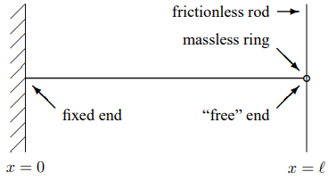
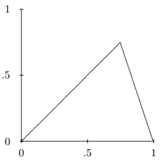
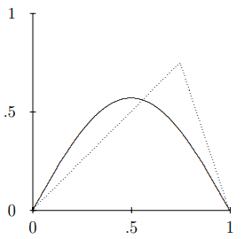
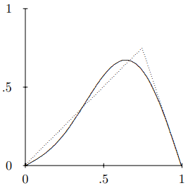
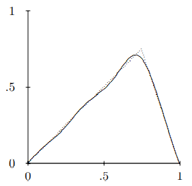
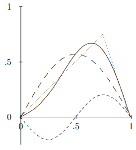
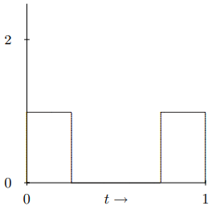
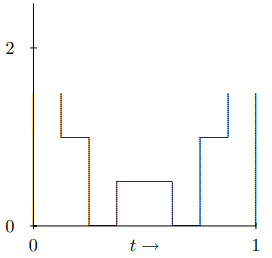
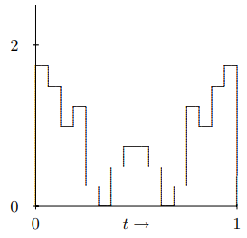

(ch-6)=

# 6. Continuum Limit and Fourier Series

## 6.1: The Continuum Limit

Consider a discrete space translation invariant system in which the separation between neighboring masses is $a$. **If** $a$ **is very small, the discrete system looks continuous.** To understand this statement, consider the action of the $M^{- 1}K$ matrix, (5.8), in the notation of the last chapter in which the degrees of freedom are labeled by their equilibrium positions. The matrix $M^{- 1}K$ acts on a vector to produce another vector. We have replaced our vectors by functions of $x$, so $M^{- 1}K$ is something that acts on a function $A(x)$ to give another function. Let’s call it $M^{- 1}K A(x)$. It is easiest to see what is happening for the beaded string, for which $B = C = T / ma$. Then

$$
M^{-1} K A(x)=\left(\frac{T}{m a}\right)(2 A(x)-A(x+a)-A(x-a)). \tag{6.1} \label{eq-6-1}
$$

So far, Equation [6.1](#eq-6-1) is correct for any $a$, large or small.

Whenever you say that a dimensional quantity, like the length $a$, is large or small, you must specify a quantity for comparison. You must say large or small compared to what?[^6-1-1] In this case, the other dimensional quantity in the problem with the dimensions of length is the wavelength of the mode that we are interested in. Now here is where small $a$ enters. If we are interested only in modes with a wavelength $\lambda=2 \pi / k$ that is very large compared to $a$, then $ka$ is a very small dimensionless number and $A(x + a)$ is very close to $A(x)$. We can expand it in a Taylor series that is rapidly convergent. Expanding Equation [6.1](#eq-6-1) in a Taylor series gives

$$
M^{-1} K A(x)=-\frac{T a}{m} \frac{\partial^{2} A(x)}{\partial x^{2}}+\cdots \tag{6.2} \label{eq-6-2}
$$

where the $\cdots$ represent higher derivative terms that are smaller by powers of the small number $ka$ than the first term in Equation [6.2](#eq-6-2). In the limit in which we take a to be really tiny (always compared to the wavelengths we want to study) we can replace $m / a$ by the linear mass density $\rho_{L}$, or mass per unit length of the now almost continuous string and ignore the higher order terms. In this limit, we can replace the $M^{- 1}K$ matrix by the combination of derivatives that appear in the first surviving term of the Taylor series (Equation [6.2](#eq-6-2)),

$$
M^{-1} K \rightarrow-\frac{T}{\rho_{L}} \frac{\partial^{2}}{\partial x^{2}} . \tag{6.3} \label{eq-6-3}
$$

**Then the equation of motion for** $\psi(x,t)$ **becomes the wave equation:**

$$
\frac{\partial^{2}}{\partial t^{2}} \psi(x, t)=\frac{T}{\rho_{L}} \frac{\partial^{2}}{\partial x^{2}} \psi(x, t) . \tag{6.4} \label{eq-6-4}
$$

The dispersion relation is 
$$
\omega^{2}=\frac{T}{\rho_{L}} k^{2} . \tag{6.5} \label{eq-6-5}
$$

This can be seen directly by plugging the normal mode $e^{i k x}$ into Equation [6.4](#eq-6-4), or by taking the limit of (5.37)-(5.38) as $a \rightarrow 0$. **Equation (6.5) is the dispersion relation for the ideal continuous string.** The quantity, $\sqrt{T / \rho_{L}}$, has the dimensions of velocity. It is called the “[**phase velocity**](https://phys.libretexts.org/Bookshelves/Electricity_and_Magnetism/Electromagnetics_II_(Ellingson)/06%3A_Waveguides/6.01%3A_Phase_and_Group_Velocity)”, $v_{\varphi}$. As we will discuss in much more detail in chapter 8 and following, this is the speed with which traveling waves move on the string.

We will call the approximation of replacing a discrete system with a continuous system that looks approximately the same for $k_{\rightarrow} \gg 1 / a$ the **continuum approximation**. Really, all of the mechanical systems that we will consider are discrete, at least on the atomic level. However, if we are concerned only about waves with macroscopic wavelengths, the continuum approximation is a very good one.

### Philosophy and Speculation

Our treatment of the wave equation in Equation [6.4](#eq-6-4) is a little unusual. In many treatments of wave phenomena, the wave equation is given a place of honor. In fact, the wave equation is only a restatement of the dispersion relation, Equation [6.5](#eq-6-5), which is usually just an approximation to what is really going on. Almost all of the systems that we usually treat with the wave equation are actually discrete at very small distances. We cannot really get all the way to the continuum limit that gives Equation [6.5](#eq-6-5). Light waves, which we will study in the chapters to come, for all we know, may be an exception to this rule, and be completely continuous. However, we don’t really have the right to assume even that. It could be that at very short distances, far below anything we can look at today, the nature of light and even of space and time changes in some way so that space and time themselves have some tiny characteristic length scale $a$. **The analysis above shows that this doesn’t matter!** As long as we can only look at space and time at distances much larger than $a$, they look continuous to us. Then because we are scientists, concerned about how the world looks in our experiments, and not how it behaves in some ideal regime far beyond what we can probe experimentally, we might as well treat them as continuous.

_______________________

[^6-1-1]: A dimensionless quantity does not require this step. A dimensionless number is large if it is much greater than one and small if it is much smaller than one.

## 6.2: Fourier Series

### String with Fixed Ends

If we stretch our continuous string between fixed walls so that $\psi(0)=\psi(\ell)=0$, the modes are given by (5.33) and (5.34), just as for the discrete system. The only difference is that now n runs from 1 to $\infty$, or at least to such large $n$ that the wavelength $2 \pi / k=2 \ell / n$ is so small that the continuum approximation breaks down. This follows from (5.28), which because $k$ is real here becomes 
$$
-\frac{\pi}{a}<k \leq \frac{\pi}{a} .
$$

As $a \rightarrow 0$ the allowed range of $k$ increases to infinity.

These standing wave modes are animated in program 6-1 on the program disk, assuming the dispersion relation, (6.5). We can now discuss the physical basis of the Fourier series. In (3.77) in chapter 3, we showed that the normal modes for a discrete system are linearly independent and complete. That means that any displacement of the discrete system can be written as a unique linear combination of the normal modes. Physically, this must be so to allow us to solve the initial value problem. Our picture of the continuous string is a limit of the beaded string in which the number of beads, $N$, goes to infinity and the beads get infinitely close together. For each $N$, the most general displacement of the system can be expanded as a linear combination of the $N$ normal modes. If the limit $N \rightarrow \infty$ is reasonably well behaved, we might expect that the most general displacement of the limiting continuous string could be expanded in terms of the infinite number of normal modes of the continuous system. This expansion is a Fourier series. The displacement of the continuous system is described by a function of the position X along the string. If the function is not too discontinuous, the expansion in normal modes works fine.

Consider the continuous string, stretched between fixed walls at $x = 0$ and $x = \ell$. The transverse displacement of this system at any time is described by a continuous function of $x$, $\psi(x)$ with 
$$
\psi(0)=\psi(\ell)=0 .
$$

Thus we expect from the argument above that we can express any function that is not too discontinuous and satisfies (6.7) as a sum of the normal modes given by (5.33) and (5.34), 
$$
\psi(x)=\sum_{n=1}^{m} c_{n} \sin \frac{n \pi x}{\ell} .
$$

The constants, $c_{n}$, are called the “Fourier coefficients.” They can be found using the following identity: 
$$
\int_{0}^{\ell} d x \sin \frac{n \pi x}{\ell} \sin \frac{n^{\prime} \pi x}{\ell}=\left\{\begin{array}{c}

\ell / 2 \text { if } n=n^{\prime} \\

0 \text { if } n \neq n^{\prime}

\end{array}\right.
$$

This is just the method of normal coordinates adapted to the continuous situation.

### Free Ends

Equation (6.8) is called the Fourier series for a function satisfying (6.7). Other boundary conditions yield different series. For example, consider a string with the $x = 0$ end fixed at

Figure $6.1$S: A continuous string with one end free to oscillate in the transverse direction.

$z = 0$. Suppose that the other end, at $x = \ell$ is attached to a massless ring that is free to slide along a frictionless rod in the $z$ direction, as shown in Figure $6.1$. We say that this system has one “free end” because the end at $x = \ell$ is free to slide in the transverse direction, even though it is fixed in the $x$ direction.

Because the rod is frictionless, the force on the ring due to the rod must have no component in the $z$ direction. But because the ring is massless, the total force on the ring must vanish. Therefore, the force on the ring due to the string must have no component in the $z$ direction. That implies that the string is horizontal at $x = \ell$. But the shape of the string at any given time is given by the graph of the transverse displacement, $\psi(x,t)$ versus $x^{2}$. Thus the slope of $\psi(x,t)$ at $x = \ell$ must vanish. Therefore, the appropriate boundary conditions for the displacement is 
$$
\psi(0, t)=0,\left.\quad \frac{\partial}{\partial x} \psi(x, t)\right|_{x=\bar{\ell}}=0 .
$$

This implies that the normal modes also satisfy similar boundary conditions: 
$$
A_{n}(0)=0, \quad A_{n}^{\prime}(\ell)=0 .
$$

The first condition implies that the solution must have the form 
$$
A_{n}(x) \propto \sin k_{n} x
$$

for some $k_{n}$. The second condition determines the possible values of $k_{n}$. It implies that $\sin k_{n}x$ must have a maximum or minimum at $x = \ell$ which, in turn, implies that 
$$
k_{n} \ell=\frac{\pi}{2}+n \pi
$$

where $n$ is a nonnegative integer (nonnegative because we can choose all the $k_{n} > 0$ in (6.13) — negative values just change the sign of $A_{n}(x)$ and do not lead to new solutions). The solutions have the form 
$$
\sin \left(\frac{(2 n+1) \pi x}{2 \ell}\right) \quad \text { for } n=0 \text { to } \infty .
$$

These normal modes are animated in program 6-2. With these normal modes, we can describe an arbitrary function, $\psi(x)$, satisfying the boundary conditions for this system, (6.11). 
$$
\psi(0)=0, \quad \psi^{\prime}(\ell)=0 .
$$

Thus for such a function, we can write 
$$
\psi(x)=\sum_{n=1}^{\infty} c_{n} \sin \left(\frac{(2 n+1) \pi x}{2 \ell}\right)
$$

where 
$$
c_{n}=\frac{2}{\ell} \int_{0}^{\ell} d x \sin \left(\frac{(2 n+1) \pi x}{2 \ell}\right) \psi(x) .
$$

#### Examples of Fourier Series

Let us find the Fourier coefficients for the following function, defined in the interval [0,1]:

$$
\psi(x)=\left\{\begin{array}{cc}

x & \text { for } x \leq w, \\

\frac{w(1-x)}{1-w} & \text { for } x>w .

\end{array}\right.
$$

For definiteness, we will take $w = 0.75$, so the function $\psi(x)$ has the form shown in Figure $6.2$.

We compute the Fourier coefficients using (6.10). Because $\ell = 1$, this has the following form (see problem (6.2)):

$$
\begin{align*}

c_{n} &=\int_{0}^{1} d x \sin n \pi x \psi(x) \\

&=\int_{0}^{w} d x x \sin n \pi x+\frac{w}{1-w} \int_{w}^{1} d x(1-x) \sin n \pi x \\

&=\frac{\sin n \pi w}{(1-w) n^{2} \pi^{2}} .

\end{align*}
$$

Figure $6.2$: The function $\psi(x)$ for $w = 0.75$.

Figure $6.3$: The first term in the Fourier series for $\psi(x)$. The dotted line is $\psi(x)$.

We can reconstruct the function, $\psi(x)$, as a sum over the normal modes of the string. Let us look at the first few terms in the series to get a feeling for how this works. The first term in the sum, for $w = 0.75$, is shown in Figure $6.3$. This is a lousy approximation, necessarily, because the function is not symmetrical about $x = 1 / 2$, while the first term in the sum is symmetrical. The first two terms are shown in Figure $6.4$. This looks much better.

Figure $6.4$: The sum of the first two terms in the Fourier series for $\psi(x)$. The dotted line is $\psi(x)$.

The first six terms are shown in Figure $6.5$. This is now a pretty good approximation except where the function has a kink.

Figure $6.5$: The sum of the first six terms in the Fourier series for $\psi(x)$. The dotted line is $\psi(x)$.

What is going on here is that if we include terms in the Fourier series only up to $n = N$, the truncated Fourier series 
$$
\psi(x)=\sum_{n=1}^{N} c_{n} \sin n \pi x
$$

does not include any modes with very small wavelengths. The smallest wavelength that appears (for the highest angular wave number) is $2 / N$ (no dimensions here because we took $a = 1$). Thus while the Fourier series can describe any features of the shape of the function that are larger than $2 / N$, there is no way that it can pick up features that are much smaller. In this example, because the function has an infinitely sharp kink, the Fourier series never gets very good near $x = w$. However, eventually the discrepancy is squeezed into such a small region around the kink that the result will look OK to the naked eye.

Figure $6.6$: The first two terms in the Fourier series for $\psi(x)$ and their sum.

You can see how this works in more detail by studying Figure $6.6$. The curve of long dashes is the first term in the Fourier series. Evidently, it is less than the function, $\psi(x)$ (the dotted triangle), for large $x$ and greater than $\psi(x)$ for small $x$. The sign and magnitude of the second term in the Fourier series, the curve of short dashes in Figure $6.6$, is chosen to make up for this discrepancy, so that the sum (the solid curve) is much closer to the actual function. The same process is repeated over and over again as you go to higher order in the truncated Fourier series.

You can play with the truncated Fourier series for the function $\psi(x)$ in program 6-3. This program allows you to vary the parameter $w$, and also the number of terms in the Fourier series. You should look at what happens near $w = 1$. You might think that this would cause problems for the Fourier series because the ($1 − w$) in the denominator of (6.20) goes to zero. However, the limit is actually well behaved because $sin n \pi \omega$ also goes to zero as $w \rightarrow 0$. Nevertheless, the Fourier series has to work hard for $w = 1$ to reproduce a function that does not go to zero for $x = 1$ as a sum of sine functions, each of which do vanish at $x = 1$. This difficulty is reflected in the wiggles near $x = 1$ for any reasonable number of terms in the Fourier series.

### Plucking a String

Let us now use this mathematics to solve a physics problem. We will solve the initial value problem for the string with fixed end for a particular initial shape. The initial value problem here is almost exactly like that discussed in chapter 3, (3.98)-(3.100), for a system with a finite number of degrees of freedom. The only difference is that now, because the number of degrees of freedom is infinite, the sum over modes runs to infinity. You shouldn’t worry about the fact that the number of modes is infinite. What that “infinity” really means is “larger than any number we are going to care about.” In practice, as we saw in the examples above, the higher modes eventually don’t make much difference. They are associated with smaller and smaller features of the shape. When we say that the system is continuous and that it has an infinite number of degrees of freedom, we are actually assuming that the smallest features that we care about in the waves are still much larger than the distance between pieces of the system, so that we can truncate our Fourier series far below the limit and still have a good approximate description of the motion.

Suppose we pluck the string. Specifically, suppose that the string has linear mass density $\rho_{L}$, tension $T$, and fixed ends at $x = 0$ and $\ell$. Suppose further that at time $t = 0$ the string is at rest, but pulled out of its equilibrium position into the shape, $\psi(x)$, given by (6.19). If the string is then released at $t = 0$, we can find the subsequent motion by summing over all the normal modes with fixed coefficients multiplied by $\cos \omega_{n} t$ and/or $\sin \omega_{n} t$, where $\omega_{n}$ is the frequency of the mode $\sin \frac{n \pi x}{\ell}$ with $k=\frac{n \pi}{\ell}$ (the frequency is given by (6.5)) 
$$
\omega_{n}=\sqrt{\frac{T}{\rho_{L}}} k_{n}=\sqrt{\frac{T}{\rho_{L}}} \frac{n \pi}{\ell} .
$$

In this case, only the $\cos \omega_{n} t$ terms appear, because the velocity is zero at $t = 0$. Thus we can write 
$$
\psi(x, t)=\sum_{n=1}^{\infty} c_{n} \sin \frac{n \pi x}{\ell} \cos \omega_{n} t .
$$

This satisfies the boundary conditions at $t = 0$, by virtue of the Fourier series, (6.8). The disadvantage of (6.23) is that we are left with an infinite sum. For the simple dispersion relation, (6.5), there are other ways to solve this problem that we will discuss later when we learn about traveling waves. However, the advantage of the solution (6.23) is that it does not depend on the dispersion relation.

We can solve the problem approximately using (6.23) by adding up only the first few terms of the series. The computer can do this quickly. In program 6-4, the first twenty terms of the series are shown for $w = 1 / 2$ (and the dispersion relation still given by (6.5)). The result is amazingly simple. Check it out! Program 6-5 is the same idea, but allows you to vary $w$ and the number of terms in the Fourier series. Try out $w = 0.75$ and compare with $Figures \text { } 6.3 \text {-} 6.5$.

_____________________

2This is why transverse oscillations are easier to visualize than longitudinal oscillations — compare with (7.5).

## 6.3: Chapter Checklist

::::{admonition} Learning Objectives
:class: objectives

You should now be able to:

1. Take the limit of a space translation invariant discrete system as the distance between the parts goes to zero, interpret the physics of the resulting continuous system, and find its dispersion relation;

2. Use the Fourier series to set up and solve the initial value problem for a massive string with various boundary conditions.
::::

### Problems

**6.1.** Consider the continuous string of (6.7)-(6.10) as the continuum limit of a beaded string with $W$ beads as $W \rightarrow \infty$. Write the analog of (6.8) and (6.10) for finite $W$. Show that the limit as $W \rightarrow \infty$ yields (6.10). **Hint:** This is an exercise in the definition of an integral as the limit of a sum. But to do the first part, you will either need to use normal coordinates, X or prove the identity

$$
\begin{aligned}

\sum_{k=1}^{W} \sin \frac{n k \pi}{W+1} \sin \frac{n^{\prime} k \pi}{W+1} = \begin{cases}b & \text { if } n=n^{\prime} \neq 0 \\ 0 & \text { if } n \neq n^{\prime} \text { and } n, n^{\prime}>0\end{cases}

\end{aligned}
$$

for a constant $b$ and find $b$.

**6.2.** Do the integrals in (6.20). **Hint:** Use integration by parts and watch for miraculous cancellations.

**6.3.** Find the normal modes of the string with two free ends, shown in Figure $6.7$.

**6.4.** **Fun with Fourier Series and Fractals**

In this problem you will explore the Fourier series for an interesting set of functions. Consider a function of the following form, defined on the interval [0,1]: 
$$
f(t)=\sum_{j=0}^{\infty} h^{j} g\left(\operatorname{frac}\left(2^{j} t\right)\right) .
$$

Figure $6.7$: A continuous string with both ends free to oscillate in the transverse direction.

where 
$$
g(t)=\left\{\begin{array}{c}

1 \text { for } 0 \leq t \leq w \\

0 \text { for } w<t<1-w \\

1 \text { for } 1-w \leq t \leq 1

\end{array}\right.
$$

and $\operatorname{frac}(x)$ denotes the fractional part, i.e. $\operatorname{frac}(4.39)=0.39$. $f(t)$ thus depends on the two parameters $h$ and $w$, where $0 < h < 1$ and $0 < w < 1 / 2$. For example, for $h = 1 / 2$ and $w = 1 / 4$, the $h^{0}$ term is shown in Figure $6.8.

Figure \( 6.8$: The $h^{0}$ term in $f(t)$ for $h = 1 / 2$ and $w = 1 / 4$.

If we add in the $h^{1}$ term we get the picture in Figure $6.9$.

Figure $6.9$: The first two terms in $f(t)$ for $h = 1 / 2$ and $w = 1 / 4$.

Adding the $h^{2}$ term gives the picture in Figure $6.10$, and so on.

The final result is a very bumpy function, called a “fractal.” You cannot compute this function exactly, but you can include enough terms to get to any desired accuracy. Because

Figure $6.10$: The first three terms in $(f(t)$ for $h = 1 / 2$ and $w = 1 / 4$.

the function is symmetric about $t = 1 / 2$, it is really only necessary to plot it from $0$ to $1 / 2$. Also because of the symmetry, it can be expressed in terms of a Fourier series of cosines, 
$$
f(t)=\sum_{k=0}^{\infty} b_{k} \cos 2 \pi k t .
$$

Show that the Fourier coefficients are given by 
$$
b_{k}=\frac{2}{\pi k} \sum_{j=0}^{\xi(k)}(2 h)^{j} \sin \left(2 \pi k w / 2^{j}\right)
$$

for $k \neq 0$, and 
$$
b_{0}=\frac{2 w}{1-h}
$$

where the function, $\xi(k)$ is the number of times 2 appears as a factor of $k$. Thus $\xi(0)=\xi(1)=\xi(3)=0, \xi(2)=1, \xi(4)=2,$ etc.

Write a program to display and print the fractal for some set of parameters, $h$ and $w$. Also, display the truncated Fourier series, 
$$
f_{m}(t)=\sum_{k=0}^{m-1} b_{k} \cos 2 \pi k t
$$

with m terms, for $m = 5$, $10$, and $20$ (or more if you have a fast computer).
