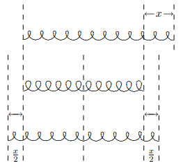
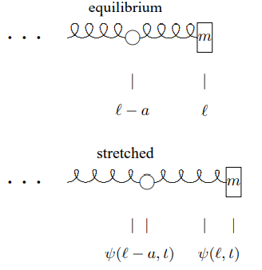
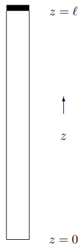
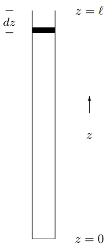
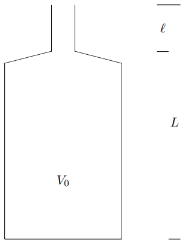
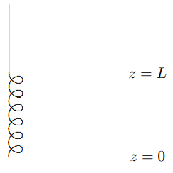
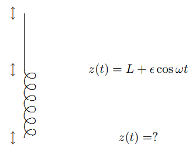
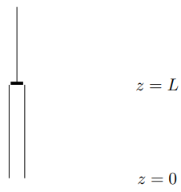

(ch-7)=

# 7. Longitudinal Oscillations and Sound

## 7.1: Longitudinal Modes in a Massive Spring

So far, in our extensive discussions of waves in systems of springs and blocks, we have assumed that the only degrees of freedom are those associated with the motion of the blocks. This is a reasonable assumption at low frequencies, when the blocks are very heavy compared to the springs, because the blocks move so slowly that the springs have time to readjust and are always nearly uniform.[^7-1-1] In this case, the dispersion relation for the longitudinal oscillations of the blocks is just the dispersion relation for coupled pendulums, (5.35), in the limit in which we ignore gravity, and keep only the coupling between the masses produced by the spring constant, $K$. In other words, we take the limit of (5.35) as $g / \ell \rightarrow 0$. The result can be written as 
$$
\omega^{2}=\frac{4 K_{a}}{m} \sin ^{2} \frac{k a}{2}
$$

where $K_{a}$ is the spring constant of the springs, $m$ the mass of the blocks, and $a$ the equilibrium separation. We have put a subscript $a$ on $K_{a}$ because we will want to vary the spring constant as we vary the separation between the blocks in the discussion below.

Now what happens when the blocks are absent, but the spring is massive? We can find this out by considering the limit of (7.1) as $a \rightarrow 0$. In this limit, the massive blocks and the massless spring melt into one another, so that the result looks like a uniform, massive spring. In order to take the limit, however, we must understand what variables describe the massive spring, and have a finite limit as $a \rightarrow 0$. One such variable is the linear mass density, 
$$
\rho_{L}=\lim _{a \rightarrow 0} \frac{m}{a} .
$$

We must take the masses of the blocks to zero as $a \rightarrow 0$ in order to keep $\rho_{L}$ finite.

To understand what happens to $K_{a}$ as $a \rightarrow 0$, consider what happens when you cut a spring in half. When a spring is stretched, each half contributes half the displacement. But the tension is uniform throughout the stretched spring. Thus the spring constant of half a spring is twice as great as that of the full spring, because half the displacement gives the same force. This relation is illustrated in Figure $7.1$. The spring in the center is unstretched. The spring on top is stretched by $x$ to the right. The bottom shows the **same** stretched spring, still stretched by $x$, but now symmetrically. Comparing top and bottom, you can see that the return force from stretching the spring by $x$ is the same as from stretching half the spring by $x / 2$.

The diagram in Figure $7.1$ is an example of the following result. In general, the spring constant, $K_{a}$, depends not just on what the spring is made of, it depends on how long the spring is. But the quantity $K_{a}a$, where $a$ is the length of the spring, is actually independent of $a$, for a spring made of uniform material. Thus we should take the limit $a \rightarrow 0$ holding $K_{a}a$ fixed.

This implies that the dispersion relation for the massive spring is 
$$
\omega^{2}=\frac{K_{a} a}{\rho_{L}} k^{2}
$$

where we have used the Taylor series expansion of $\sin x$, (1.58), and kept only the first term.

Figure $7.1$: Half a spring has twice the spring constant.

According to the discussion above, we can rewrite this as 
$$
\omega^{2}=\frac{K \ell}{\rho_{L}} k^{2}
$$

where $\ell$ is the length of the spring and $K$ is the spring constant of the spring as a whole.

Note that in longitudinal oscillations in a continuous material in the $x$ direction, the equilibrium position, $x$, doesn’t actually describe the $x$ position of the material. Because the displacement is longitudinal, the actual $x$ position of the point on the spring with equilibrium position $x$ is 
$$
x+\psi(x, t),
$$

where $\psi$ is the displacement. You will need this to do problem (7.1).

### Fixed Ends

Suppose that we have a massive spring with length $\ell$ and its ends fixed at $x = 0$ and $x = \ell$. Then the displacement, $\psi(x,t)$ must vanish at the ends, 
$$
\psi(0, t)=0, \quad \psi(\ell, t)=0 .
$$

The modes of the system are the same as for any other space translation invariant system. The linear combinations of the complex exponential modes of the infinite system that satisfy (7.6) are 
$$
A_{n}(x)=\sin \frac{n \pi x}{\ell} ,
$$

with angular wave number 
$$
k_{n}=\frac{n \pi}{\ell}
$$

and frequency (from the dispersion relation, (7.4)) 
$$
\omega_{n}=\sqrt{\frac{K \ell}{\rho_{L}}} k_{n}=\sqrt{\frac{K \ell}{\rho_{L}}} \frac{n \pi}{\ell} .
$$

However, because the oscillations are longitudinal, the modes **look** very different from the transverse modes of the string that we studied in the previous chapter. The position of the point on the string whose equilibrium position is x, in the nth normal mode, has the general form (from (7.5)) 
$$
x+\epsilon \sin \frac{n \pi x}{\ell} \cos \left(\omega_{n} t+\phi\right)
$$

where $\epsilon$ and $\phi$ are the amplitude and phase of the oscillation.

The lowest 9 modes in (7.10) are animated in program 7-1. Compare these with the modes animated in program 6-1. The mathematics is the same, but the physics is very different because of (7.5). Stare at these two animations until you can visualize the relation between the two. Then you will have understood (7.5).

### Free Ends

Now let us look at the situation in which the end of the spring at $x = 0$ is fixed, but the end at $x = \ell$ is free. The boundary conditions in this case are analogous to the normal modes of the string with one fixed end. The displacement at $x = 0$ must vanish because the end is fixed. Also, the derivative of the displacement at $x = \ell$ must vanish. You can see this by looking at the continuous spring as the limit of discrete masses coupled by springs. As we saw in (5.43), the last real mass must have the same displacement as the first “imaginary” mass, 
$$
\psi(\ell, t)=\psi(\ell+a, t) .
$$

Therefore, for the finite system with a free end at $\ell$, we have the relation 
$$
\frac{\psi(\ell, t)-\psi(\ell+a, t)}{a}=0 \text { for all } a .
$$

In the limit that the distance between masses goes to zero, this becomes the condition that the derivative of the displacement, $\psi$, with respect to $x$ vanishes at $x = \ell$, 
$$
\left.\frac{\partial}{\partial x} \psi(x, t)\right|_{x=\ell}=0 .
$$

Thus the boundary conditions on the displacement are the same as in (6.11) for the transverse oscillation of a continuous string with $x = 0$ fixed and $x = \ell$ free, 
$$
\psi(0, t)=0,\left.\quad \frac{\partial}{\partial x} \psi(x, t)\right|_{x=\ell}=0 .
$$

This, in turn, implies that the normal modes are the same as for the transversely oscillating string, (6.15), 
$$
A_{n}(x)=\sin \left(\frac{(2 n+1) \pi x}{2 \ell}\right) \quad \text { for } n=0 \text { to } \infty .
$$

However, again because of (7.5), these modes look very different from those of the string. The first nine are animated in program 7-2 (compare with program 6-2).

___________________

[^7-1-1]: We will say this much more formally below.

## 7.2: A Mass on a Light Spring

Let us return to the system that we studied at the very beginning of the book, the harmonic oscillator constructed by putting a mass at the end of a light spring. We are now in a position to understand precisely what “light” means for this system, because we can now allow the spring to have a nonzero linear mass density, $\rho_{L}$, and find the normal modes of this system. We will then be able to see what happens as $\rho_{L} \rightarrow 0$.

To be specific, consider a spring with equilibrium length $\ell$ and spring constant $K$, fixed at $x = 0$ and constrained to oscillate only in the $x$ direction (that is longitudinally). Now attach a mass, $m$, to the free end (with equilibrium position $x = \ell$). The spring, for $0 < x < \ell$, can be regarded as part of a space translation invariant system. To find the normal modes for this system, we look for linear combination of the modes of the infinite spring (for a given $\omega$) that reproduces the physics at $x = 0$ and $x = \ell$. The fixed end at $x = 0$ is easy. This fixes the form of the modes to be proportional to 
$$
\sin k_{n} x
$$

with frequency 
$$
\omega_{n}=\sqrt{\frac{K \ell}{\rho_{L}}} k_{n} .
$$

As always, $k_{n}$ and $\omega_{n}$ are related by the dispersion relation, (7.4). Now to determine the possible values of $k_{n}$, we require that $F = ma$ be satisfied for the mass. Suppose, for example, that the amplitude of the oscillation is $A$ (a length). Then the displacement of the point on the spring with equilibrium position $x$ is 
$$
\psi(x, t)=A \sin k_{n} x \cos \omega_{n} t,
$$

and the displacement of the mass is determined by the displacement of the end of the spring, 
$$
x(t) \equiv \psi(\ell, t)=A \sin k_{n} \ell \cos \omega_{n} t .
$$

The acceleration is 
$$
a(t)=\frac{\partial^{2}}{\partial t^{2}} \psi(\ell, t)=-\omega_{n}^{2} A \sin k_{n} \ell \cos \omega_{n} t
$$

Figure $7.2$: The stretching of the last spring is $\psi(\ell, t)-\psi(\ell-a, t)$

To find the force on the mass, consider the massive spring as the continuum limit as $a \rightarrow 0$ of masses connected by massless springs of equilibrium length $a$, as at the beginning of the chapter. Then the force on the mass at the end is determined by the stretching of the last spring in the series. This, in turn, is the difference between the displacement of the system at $x = \ell$ and $x = \ell - a$, as illustrated in Figure $7.2$. Thus the force is 
$$
F=-K_{\dot{a}}[\psi(\ell, t)-\psi(\ell-a, t)] .
$$

In order to take the limit, $a \rightarrow 0$, rewrite this as 
$$
F=-K_{a} a \frac{\psi(\ell, t)-\psi(\ell-a, t)}{a} .
$$

Now in the continuum limit, $K_{a}a$ is $K \ell$, and the last factor goes to a derivative, $\left.\frac{\partial}{\partial x} \psi(x, t)\right|_{x=\ell}$. The final result for the force is therefore2 
$$
F=-\left.K \ell \frac{\partial}{\partial x} \psi(x, t)\right|_{x=\ell}=-K \ell k_{n} A \cos k_{n} \ell \cos \omega_{n} t .
$$

Note that the units work. $K \ell$ is a force. $\frac{\partial}{\partial x} \psi$ is dimensionless.

Putting (7.20) and (7.23) into $F = ma$ and canceling a factor of $-A \cos \omega_{n} t$ on both sides gives, 
$$
K \ell k_{n} \cos k_{n} \ell=m \omega_{n}^{2} \sin k_{n} \ell .
$$

Using the dispersion relation to eliminate $\omega_{n}^{2}$, we obtain 
$$
k_{n} \ell \tan k_{n} \ell=\frac{\rho_{L} \ell}{m} .
$$

We have multiplied both sides of (7.25) by $\ell$ in order to deal with the dimensionless variables $k_{n}\ell$ (which is $2 \pi$ times the number of wavelengths that fit onto the spring) and the dimensionless number 
$$
\epsilon \equiv \frac{\rho_{L} \ell}{m}
$$

(which is the ratio of the mass of the spring, $\rho_{L}\ell$, to the mass, $m$). The spring is light if $\epsilon$ is much smaller than one.

The important point is that (7.25) has only one solution for $k_{n}\ell$ that goes to zero as $\epsilon \rightarrow 0$. Because $\tan k \ell \approx k \ell$ for small $k \ell$, it is 
$$
k_{0} \ell \approx \sqrt{\epsilon} \text { . }
$$

For all the other solutions, the smallness of the left-hand side of (7.25) must come because $\tan k_{n} \ell$ is very small, 
$$
k_{n} \ell \approx n \pi \quad \text { for } n=1 \text { to } \infty .
$$

But (7.28) implies 
$$
x(t) \equiv \psi(\ell, t)=A \sin k_{n} \ell \cos \omega_{n} t \approx 0 \quad \text { for } n=1 \text { to } \infty .
$$

In other words, in all the solutions except $k_{0}$, the mass is hardly moving at all, and the spring is doing almost all the oscillating, looking very much like a system with two fixed ends. Furthermore, the frequencies of all the modes except the $k_{0}$ mode are large, 
$$
\omega_{n} \approx n \pi \sqrt{\frac{K}{\rho_{L} \ell}} \quad \text { for } n=1 \text { to } \infty ,
$$

while the frequency of the $k_{0}$ mode is 
$$
\omega_{0} \approx \sqrt{\frac{K}{m}} .
$$

For small $\epsilon$ (large mass), the $k_{0}$ mode is associated primarily with the oscillation of the mass, and has about the frequency we found for the case of the massless spring. The other modes are in an entirely different range of frequencies. They are associated with the oscillations of the spring. This is an important example of the way in which a single system can behave in very different ways in different regimes of frequency.

____________________

2Note that we can use this to give an alternate derivation of the boundary condition for a free end, (7.14).

## 7.3: The Speed of Sound

The physics of sound waves is obviously a three-dimensional problem. However, we can learn a lot about sound by considering motion of air in only one-dimension. Consider, for example, standing waves in the air in a long narrow tube like an organ pipe, shown in cartoon form in Figure $7.3$. Here, we will ignore the motion of the air perpendicular to the length of the pipe, and consider only the one-dimensional motion along the pipe. As we will see later, when we can deal with three-dimensional problems, this is a sensible thing to do for low frequencies, at which the transverse modes of oscillation cannot be excited. If we consider only one-dimensional motion, we can draw an analogy between the oscillations of the air in the pipe and the longitudinal waves in a massive spring.

:::{figure} ../images/lt-33567-clipboard_eeb4afbe6b3aa72bbb45fcbbd1ffe8ccb.png
:label: fig-7-3
:enumerator: 7.3
:alt: An organ pipe.

An organ pipe.
:::

It is clear what the analog of $\rho_{L}$ is. The linear mass density of the air in the tube is 
$$
\rho_{L}=\rho A
$$

where $A$ is the cross-sectional area of the tube. The question then is what is $K \ell$ for a tube of air?

Consider putting a piston at the top of the tube, as shown in Figure $7.4$. With the piston at the top of the tube, there is no force on the piston, because the pressure of the air in the tube is the same as the pressure of the air in the room outside. However, if the piston is moved in a distance $dz$, as shown Figure $7.5$, the volume of the air in the tube is decreased by 
$$
-d V=A d z .
$$

Figure $7.4$: The organ pipe with a piston at the top. The air in the tube acts like a spring.

Figure $7.5$: Pushing in the piston changes the volume of the air in the tube.

If the piston were moved in slowly enough for the temperature of the gas to stay constant, then the pressure would simply be inversely proportional to the volume. However, in a sound wave, the motion of the air is so rapid that almost no heat has a chance to flow in or out of the system. Such a change in the volume is called “adiabatic.” When the volume is decreased adiabatically, the temperature goes up (because the force on the piston is doing work) and the pressure increases faster than $1 / V$, like 
$$
p \propto V^{-\gamma}
$$

where $\gamma$ is a positive constant that depends on the thermodynamic properties of the gas. More precisely, $\gamma$ is the ratio of the specific heat at constant pressure to the specific heat at constant volume:3 
$$
C_{P} / C_{V}
$$

In air, at standard temperature and pressure 
$$
\gamma_{\text {air }} \approx 1.40
$$

Now we can write from (7.34), 
$$
\frac{d p}{p}=-\gamma \frac{d V}{V}
$$

or 
$$
d p=-\gamma p \frac{d V}{V} \approx \frac{\gamma A p_{0}}{V} d z=\frac{\gamma p_{0}}{\ell} d z
$$

where $p_{0}$ is the equilibrium (room) pressure. Then the force on the piston is 
$$
d F=A d p=\frac{\gamma A^{2} p_{0}}{V} d z=\frac{\gamma A p_{0}}{\ell} d z
$$

so that 
$$
K=\frac{d F}{d z}=\frac{\gamma A p_{0}}{\ell}
$$

and $K \ell$ is 
$$
K \ell=\gamma A p_{0} .
$$

Thus we expect the dispersion relation to be 
$$
\omega^{2}=v_{\text {sound }}^{2} k^{2}=\frac{K \ell}{\rho_{L}} k^{2}=\frac{\gamma p_{0}}{\rho} k^{2}
$$

where we have defined the “speed of sound”, $v_{\text {sound }}$, as 
$$
v_{\text {sound }}^{2}=\frac{\gamma p_{0}}{\rho}
$$

For air at standard temperature and pressure, 
$$
v_{\text {sound }} \approx 332 \frac{\mathrm{m}}{\mathrm{s}} .
$$

As we will see in the next chapter, this is actually the speed at which sound waves travel. For now, it is just a parameter in our calculation of the normal modes.

In the pipe shown in (7.3), the displacement of the air, which we will call $\psi(z,t)$, must vanish at $z = 0$, because the bottom of the tube is closed and there is nowhere for the gas to go.

The $z$ derivative of $\psi$ must vanish at $z = \ell$, because the excess pressure is proportional to $-\frac{\partial}{\partial z} \psi$. The pressure is proportional to the force in our analogy with longitudinal waves in ∂z the massive spring. Using (7.41) and (7.23), we expect the longitudinal force to be 
$$
\pm \gamma A p_{0} \frac{\partial}{\partial z} \psi
$$

or the excess pressure to be 
$$
p-p_{0}=-\gamma p_{0} \frac{\partial}{\partial z} \psi .
$$

We want the negative sign because for $\frac{\partial}{\partial z} \psi>0$, the air is spreading out and has lower pressure.

Thus for a standing wave in the pipe, (7.3), we expect the boundary conditions 
$$
\psi(0, t)=0,\left.\quad \frac{\partial}{\partial z} \psi(z, t)\right|_{z=\ell}=0 ,
$$

for which the solution is 
$$
\psi(z, t)=\sin k z \cos \omega t
$$

$$
k=\frac{(n+1 / 2) \pi}{\ell}, \quad \omega=v k ,
$$

where $v=v_{\text {sound }}$, for nonnegative integer $n$. In particular, the lowest frequency mode of the tube corresponds to $n = 0$, 
$$
\omega=\frac{v \pi}{2 \ell}, \quad \nu=\frac{\omega}{2 \pi}=\frac{v}{4 \ell} .
$$

### Helmholtz Approximation

Let’s consider a slightly different problem. What is the lowest frequency mode of a one-liter soda bottle, shown in Figure $7.6$? A typical set of parameters is given below: 
$$
\begin{aligned}

&A \approx 2.85 \mathrm{~cm}^{2}: \text { area of neck }\\

&\begin{aligned}

&\ell \approx 5.7 \mathrm{~cm} \quad: \text { length of neck } \\

&L \approx 25 \mathrm{~cm} \quad: \text { length of bottle }

\end{aligned}\\

&V_{0} \approx 1000 \mathrm{~cm}: \text { volume of body }

\end{aligned}
$$

Figure $7.6$: A one liter soda bottle.

Putting the length, $L$, of the bottle into (7.50) gives $\nu \approx 332 \text { hertz }$. In American standard pitch (see $Table \text { } 7.1$), this is an $E$ above middle $C$.

This is obviously wrong. If you have ever blown into your soda bottle, you know that the frequency of the lowest mode is much lower than that. The problem, of course, is that the soda bottle is not shaped anything like the tube. To determine the modes is a complicated three-dimensional problem. It turns out, however, that we can find the lowest mode to a decent approximation rather easily.

The idea is that in the lowest mode, the air in the neck of the bottle is moving rapidly, but in the body of the bottle, the air quickly spreads out so that it is not moving much at all. The idea of the Helmholtz approximation to try is to treat the air in the neck as a single chunk with mass 
$$
\rho A \ell ,
$$

and to treat the body as a spring, that contributes restoring force but no inertia (because the air is not moving much). Then all we must do is to compute the $K$ of the “spring.” That is easy, using (7.38). In this case, 
$$
d V=A d z ,
$$

so 
$$
d p=-\gamma p \frac{A d z}{V} \approx-\gamma p_{0} \frac{A d z}{V_{0}}
$$

$Table \text { } 7.1$: American standard pitch (A440) — frequencies are in Hertz.

| Note | $\nu$ | Note | $\nu$ | Note | $\nu$ |
| --- | --- | --- | --- | --- | --- |
| $A$ | 880 | $A$ | 440 | $A$ | 220 |
| $G\#$ | 831 | $G\#$ | 415 | $G\#$ | 208 |
| $G$ | 784 | $G$ | 392 | $G$ | 196 |
| $F\#$ | 740 | $F\#$ | 370 | $F\#$ | 185 |
| $F$ | 698 | $F$ | 349 | $F$ | 175 |
| $E$ | 659 | $E$ | 330 | $E$ | 165 |
| $E b$ | 622 | $E b$ | 311 | $E b$ | 156 |
| $D$ | 587 | $D$ | 294 | $D$ | 147 |
| $C\#$ | 554 | $C\#$ | 277 | $C\#$ | 139 |
| $C$ | 523 | $C$ | 262 | $C$ | 131 |
| $B$ | 494 | $B$ | 247 | $B$ | 123 |
| $B b$ | 466 | $B b$ | 233 | $B b$ | 117 |

and 
$$
F \approx-\gamma p_{0} \frac{A^{2} d z}{V_{0}}
$$

or 
$$
" K "=\gamma p_{0} \frac{A^{2}}{V_{0}} .
$$

Then using $\omega^{2}=K / m$, we expect 
$$
\omega=\sqrt{\frac{\gamma A^{2} p_{0} / V_{0}}{\rho A \ell}}=v \sqrt{\frac{A}{\ell V_{0}}} .
$$

For the soda bottle, (7.6), this gives 
$$
\nu \approx 118 \text { hertz }
$$

or roughly a $B b$ below low $C$. This is just about right (see problem 7.5).

### Corrections to Helmholtz

There are many possible corrections to (7.57) that might be considered. One is to include the so-called “end effect.” The point is that the velocity of the air in the lowest mode does not drop to zero immediately when you go past the ends of the neck. Thus the actual mass is somewhat larger than $\rho A \ell$. The lore is that you can do better by replacing 
$$
\ell \rightarrow \ell+0.6 r
$$

where $r$ is the radius of the neck.

Here we will discuss another correction that can be dealt with systematically using the methods of space translation invariance and local interactions. If the bottle has a long neck, it is probably not a good idea to treat the air in the neck as a solid mass. Furthermore, there is a simple alternative. A better analogy for the neck is a massive spring with $K \ell=\gamma A p_{0}$. Because the neck is a space translation invariant, essentially one-dimensional system, we expect a displacement of the form 
$$
y \cos \frac{\omega z}{v}
$$

in the neck, where $z = 0$ is the open end and $y$ is the displacement of the air at $z = 0$. Thus, where the neck attaches to the body, the displacement is 
$$
y \cos \frac{\omega \ell}{v} .
$$

The force at this point from the compression of the air in the neck is (from (7.45)) 
$$
F_{\text {neck }}=-\gamma A p_{0} \frac{\partial \psi}{\partial z}=\frac{\gamma A p_{0} \omega}{v} y \sin \frac{\omega \ell}{v} .
$$

This must be the negative of the force from the air in the body, from (7.39), 
$$
-F_{\text {body }}=\frac{\gamma A^{2} p_{0}}{V_{0}} y \cos \omega \ell / v ,
$$

or 
$$
\frac{\omega V_{0}}{A v} \tan \frac{\omega \ell}{v}=1 .
$$

You will explore the consequences of this in problem 7.5.

This analysis does not distinguish between the area of the top and bottom of the neck. Perhaps the area at the bottom is more appropriate. What matters is the area at the bottom that determines the force per unit area where the wave in the neck matches onto the body.

___________________

3See, for example, Halliday and Resnick.

## 7.4: Chapter Checklist

::::{admonition} Learning Objectives
:class: objectives

You should now be able to:

1. Find the motion of a point on a continuous spring oscillating longitudinally in one of its normal modes for various boundary conditions;

2. Solve for the normal modes of a system of a mass attached to a massive spring;

3. Be able to derive the dispersion relation for sound waves and find the normal modes for oscillations of air in a tube;

4. Be able to use the Helmholtz approximation to estimate the frequency of the lowest mode of bottle.
::::

### Problems

**7.1.** Derive (7.45) directly by considering the volume of the chunk of air in the tube between $z$ and $z + dz$, and using (7.38).

**7.2.** Use an analogy with (7.16)-(7.31) to find (approximately!) the normal modes and corresponding frequencies of the system shown in Figure $6.1$, but with a massive ring of mass m sliding on the frictionless rod.

Figure $7.7$: A hanging spring.

**7.3.**A massive continuous spring with mass $m$, length $L$ and spring constant $K$ hanging vertically. The system is shown **at rest in its equilibrium configuration** in Figure $7.7$. The spring constant is large, satisfying $K L \gg m g$, so gravity plays no important role here except to keep the spring vertical. Now suppose that the supporting hanger is driven up and down so that the top of the spring moves vertically with displacement $\epsilon \cos \omega t$, as shown in Figure $7.8$. Find the $z$ position of the bottom of the spring as a function of time. Ignore damping.

Figure $7.8$: Problem 7.3.

**7.4.** A system analogous to that in problem 7.3 is a tube of air with a piston at the top and the bottom open, as shown in Figure $7.9$: If the cross sectional area of the tube is $A$, what is the analog in this system of the spring constant, $K$, in problem 7.3? Make sure that your answer has units of force per unit distance.

Figure $7.9$: Problem 7.4.

**7.5.** **PERSONAL EXPERIMENT —**Show that when $\omega \ell / v$ is small, (7.64) reduces to the Helmholtz approximation, (7.57), while for $V_{0} \approx 0$, when the bottle is all neck, it reduces to the result for the modes of a uniform tube with one open and one closed end, (7.50).

**Do the experiment!** Find a selection of at least four bottles, at least one of which has a very long neck. Measure the frequency of the lowest mode of each, and describe how you did it. For each bottle, tabulate the following (in cgs units):

1. A description (ie. soda bottle, 1000 ml)

2. $A_{t}$ (the area of the top of the neck)

3. $A_{b}$ (the area of the bottom of the neck)

4. $r$ (the radius of the neck)

5. $\ell$ (the length of the neck)

6. $V_{\text {body}}$ (the volume of the body)

7. $\nu$ (the frequency of the lowest mode)

8. $\omega$ (the angular frequency of the lowest mode)

9. $\omega^{2} V_{0} \ell / a v^{2}$ (=1 in the Helmholtz approximation)

10. $\left(\omega V_{0} / A v\right) \tan (\omega \ell / v)$ (=1 in the approximation (7.64))

See whether you can see the end effect, (7.59), or distinguish the area of the top of the neck from the bottom — that is, see which works better in (7.57). Comment, as quantitatively as you can, on the errors in your experiment, and on the relative merits of the approximate expressions that you have tested.
