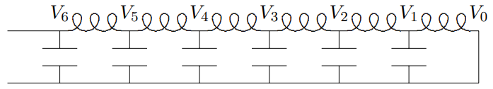

(ch-8)=

# 8. Traveling Waves

In this chapter, we show how the same physics that leads to standing wave oscillations also gives rise to waves that move in space as well as time. We then go on to introduce the important physical example of light waves.

::::{admonition} Chapter Preview
:class: preview

In an infinite translation invariant system, traveling waves arise naturally from the complex exponential behavior of the solutions in space and time.

1. We begin by showing the connection between standing waves and traveling waves in infinite systems. A traveling wave in a linear system is a pair of standing waves put together with a special phase relation. We show how traveling waves can be produced in finite systems by appropriate forced oscillations.

2. We then go on to discuss the force and power required to produce a traveling wave on a string, and introduce the useful idea of “impedance.”

3. We introduce and discuss the most important classical example of wave phenomena, electromagnetic waves and light.

4. We reexamine the translation invariant systems of coupled $LC$ circuits discussed in chapter 5 and show how they are related to electromagnetic waves.

5. We discuss the effects of damping in translation invariant systems, giving a simple physical interpretation of the effect of traveling waves.

6. We discuss traveling waves in systems with damping and in systems with high and/or low frequency cut-offs.
::::

## 8.1: Standing and Traveling Waves

### What is It That is Moving?

8-1

We have seen that an infinite system with translation invariance has complex solutions of the form 
$$
e^{\pm i k x} e^{\pm i \omega t} , \tag{8.1} \label{eq-8-1}
$$

where $k$ and $\omega$ are related by the dispersion relation characteristic of the system. So far, we have considered standing wave solutions in which the space and time dependent factors are separately real, i.e. 
$$
\sin k x \cdot \cos \omega t \propto\left(e^{i k x}-e^{-i k x}\right) \cdot\left(e^{i \omega t}+e^{-i \omega t}\right) . \tag{8.2} \label{eq-8-2}
$$

But we can put the same solutions together in a different way, 
$$
\psi(x, t)=\cos (k x-\omega t) \propto\left(e^{i k x} e^{-i \omega t}+e^{-i k x} e^{i \omega t}\right) . \tag{8.3} \label{eq-8-3}
$$

This is called a **“traveling wave.”** The underlying system that supports the wave is not actually traveling. Instead, what is moving is the wave itself. If we follow the point $x$ for which $\psi(x,t)$ has some constant value, the point moves in the positive $x$ direction at a constant velocity, called the **“phase velocity,”**
$$
v_{\phi}=\omega(k) / k . \tag{8.4} \label{eq-8-4}
$$

In [8.3](#eq-8-3), for example, $\psi(x,t)$ is equal to one for $x = t = 0$, because the argument of the cosine is zero (it is also equal to one for $x=2 n \pi / k$ for any integer $n$, but we will focus on just the single point, $x = 0$). As $t$ increases, this point moves in the positive $x$ direction because the argument of the cosine, $k x-\omega t$, vanishes for $x=\omega t / k=v_{\phi} t$. This is illustrated in program 8-1.

We will continue to define all the real modes to be real parts of complex modes proportional to $e^{-i \omega t}$. Thus [8.3](#eq-8-3) is 
$$
\cos (k x-\omega t)=\operatorname{Re}\left[e^{i k x} e^{-i \omega t}\right] . \tag{8.5} \label{eq-8-5}
$$

In this notation a wave traveling to the left is 
$$
\cos (k x+\omega t)=\operatorname{Re}\left[e^{-i k x} e^{-i \omega t}\right] , \tag{8.6} \label{eq-8-6}
$$

while a standing wave is 
$$
\begin{gathered}
\cos k x \cos \omega t=\frac{1}{2} \operatorname{Re}\left[e^{i k x} e^{-i \omega t}+e^{-i k x} e^{-i \omega t}\right] \\
=\frac{1}{2}[\cos (k x-\omega t)+\cos (k x+\omega t)] .
 \tag{8.7} \label{eq-8-7}
\end{gathered}
$$

A standing wave is a combination of traveling waves going in opposite directions! Likewise, a traveling wave is a combination of standing waves. For example, 
$$
\cos (k x-\omega t)=\cos k x \cos \omega t+\sin k x \sin \omega t . \tag{8.8} \label{eq-8-8}
$$

These relations are important because they show that **the relation between** $k$ **and** $\omega$**, the dispersion relation, is just the same for traveling waves as for standing waves!** A wave is a wave, whether traveling or standing. Indeed, we can go back and forth using [8.7](#eq-8-7) and [8.8](#eq-8-8). **The dispersion relation that relates** $k$ **and** $\omega$ **is a property of the system in which the waves exist, not of the particular wave.**

The other side of this coin is that traveling waves exist for systems with any dispersion relation. Knowing the phase velocity, [8.4](#eq-8-4), for all $k$ is equivalent to knowing the dispersion relation, because you must know $\omega(k)$. In particular, it is only for simple, continuous systems like the stretched string (see [6.5](#eq-6-5)) that $\omega(k)$ is proportional to $k$ and the phase velocity is a constant, independent of $k$.

### Boundary Conditions

8-2

Traveling waves can be produced in finite systems by forced oscillation with an appropriate phase for the oscillations at the two ends. A simple example involves a stretched string with tension $T$ and linear mass density $\rho$. Given boundary conditions on the system so that 
$$
\psi(0, t)=A \cos \omega t, \quad \psi(L, t)=A \sin \omega t , \tag{8.9} \label{eq-8-9}
$$

where $L$ is the length of the string, the angular frequency $\omega$ is chosen so that 
$$
k=\frac{5 \pi}{2 L}=\omega \sqrt{\frac{\rho}{T}}=\frac{\omega}{v_{\phi}} . \tag{8.10} \label{eq-8-10}
$$

As usual in a forced oscillation problem, we are interested in the steady state solution in which the system moves with the angular frequency, $\omega$, of the forcing terms. We can solve this problem easily by breaking it up into two problems.

First consider the boundary condition: 
$$
\psi_{1}(0, t)=0, \quad \psi_{1}(L, t)=A \sin \omega t . \tag{8.11} \label{eq-8-11}
$$

This is easily solved by the methods of chapter 5. From the condition at $x = 0$, we know that the solution for $\psi_{1}(x, t)$ is proportional to $\sin k x$. Then the boundary condition at $x = L$ gives the standing wave solution: 
$$
\psi_{1}(x, t)=A \sin k x \sin \omega t . \tag{8.12} \label{eq-8-12}
$$

Next consider the boundary condition 
$$
\psi_{2}(0, t)=A \cos \omega t, \quad \psi_{2}(L, t)=0 . \tag{8.13} \label{eq-8-13}
$$

Analogous arguments (starting at $x = L$) show that the solution is the standing wave 
$$
\psi_{2}(x, t)=A \cos k x \cos \omega t . \tag{8.14} \label{eq-8-14}
$$

Now we can obtain the solution for the boundary condition [8.9](#eq-8-9) simply by adding these: 
$$
\begin{gathered}
\psi(x, t)=\psi_{1}(x, t)+\psi_{2}(x, t) \\
=A \cos k x \cos \omega t+A \sin k x \sin \omega t=A \cos (k x-\omega t) ,
 \tag{8.15} \label{eq-8-15}
\end{gathered}
$$

which is a wave traveling from $x = 0$ to $x = L$. The crucial point is that the two standing waves out of which the traveling wave is built are $90^{\circ}$ out of phase with one another both in time and in space. They get large at different points in space and also at different times and the interplay between the two produces the traveling wave. This is illustrated in $Figures \text { } 8.1 \text {-} 8.4$ for $\omega t = 0$, $\pi / 4$, $\pi / 2$ and $3 \pi / 4$. In each of these figures, the top curve is the traveling wave. The middle curve is [8.14](#eq-8-14). The lower curve is [8.12](#eq-8-12).

:::{figure} ../images/lt-33466-clipboard_e1b19c836d0ec75d776b41bfe4548027f.png
:label: fig-8-1
:enumerator: 8.1
:alt: t = 0.

$t = 0$.
:::
:::{figure} ../images/lt-33469-clipboard_e0e1398bfc77497470523c1541561744f.png
:label: fig-8-2
:enumerator: 8.2
:alt: t = \pi / 4.

$t = \pi / 4$.
:::
:::{figure} ../images/lt-33468-clipboard_e8ce6b07512b24f0b222f59767a459a18.png
:label: fig-8-3
:enumerator: 8.3
:alt: t = \pi / 2.

$t = \pi / 2$.
:::
:::{figure} ../images/lt-33467-clipboard_e6f6bd116a1fb098ddc0e33b1e05d450d.png
:label: fig-8-4
:enumerator: 8.4
:alt: t = 3 \pi / 4.

$t = 3 \pi / 4$.
:::
This system is animated in program 8-2. This animation is important. It is worth staring at it for a while to get a better feeling for how [8.15](#eq-8-15) works than you can from the still pictures in $Figures \text { } 8.1 \text{-} 8.4$. If you concentrate on a particular point on the string, you will see that the traveling wave gets large either when one of the standing waves is a maximum with the other near zero, or (depending on where you are looking) when both standing waves are positive.

## 8.2: Force, Power and Impedance

Whatever is enforcing the boundary conditions in the example of [8.9](#eq-8-9) must exert a force on the string. Of course, a horizontal force is required to keep the string stretched, but for small oscillations, this force is nearly constant and approximately equal to the string tension, $T$. Furthermore, there is no motion in the $x$ direction so no work is done by this component of the force. The vertical component of the force is the negative of the force which the tension on the string produces. At $x = 0$, this is 
$$
F_{0}=-\left.T \frac{\partial}{\partial x} \psi(x, t)\right|_{x=0} . \tag{8.16} \label{eq-8-16}
$$

This is illustrated in $Figure \text { } 8.5$.

:::{figure} ../images/lt-33470-clipboard_e25422a4140e8a9a2dac3baee33af6fb7.png
:label: fig-8-5
:enumerator: 8.5
:alt: The force due to a string pulling in the + x direction.

The force due to a string pulling in the $+ x$ direction.
:::
At $x = L$, because the string is coming in from the $- x$ direction, it is 
$$
F_{L}=\left.T \frac{\partial}{\partial x} \psi(x, t)\right|_{x=L} , \tag{8.17} \label{eq-8-17}
$$

as illustrated in [Figure 8.6](#fig-8-6).

:::{figure} ../images/lt-33471-clipboard_ecd88ceb5df69c8bb926eaccd10ba4935.png
:label: fig-8-6
:enumerator: 8.6
:alt: The force due to a string pulling in the - x direction.

The force due to a string pulling in the $- x$ direction.
:::
In the forced oscillation, the end of the string is moving only in the transverse direction. Thus the power supplied by the external force at $x = 0$, which is $\vec{F} \cdot \vec{v}$ is 
$$
P(t)=-\left.T \frac{\partial}{\partial x} \psi(x, t)\right|_{x=0} \frac{\partial}{\partial t} \psi(0, t) \tag{8.18} \label{eq-8-18}
$$

where as in [2.26](#eq-2-26), $\psi(x,t)$ is the **real** displacement from equilibrium for the piece of string at horizontal position $x$. We must take the real part first because the power is a **nonlinear** function of the displacement.

For a standing wave on the string (or any system with no frictional forces), the force and the velocity are $90^{\circ}$ out of phase. For example, if the displacement is proportional to $\sin \omega t$, then the transverse force at each end is also proportional to $\sin \omega t$. The velocity, however, is proportional to $\cos \omega t$. Thus the power expended by the external force is 
$$
\propto \sin \omega t \cos \omega t=\frac{1}{2} \sin 2 \omega t . \tag{8.19} \label{eq-8-19}
$$

This averages to zero over a half-cycle. On the average, no power is required to keep the standing wave going (in the absence of damping).

In a traveling wave, on the other hand, the force and the velocity are proportional. From [8.15](#eq-8-15), you can see that 
$$
\propto \sin \omega t \cos \omega t=\frac{1}{2} \sin 2 \omega t \tag{8.20} \label{eq-8-20}
$$

Thus 
$$
F_{0}=Z \frac{\partial}{\partial t} \psi(0, t), \quad F_{L}=-Z \frac{\partial}{\partial t} \psi(L, t) , \tag{8.21} \label{eq-8-21}
$$

where the constant $Z$, 
$$
Z=\frac{T k}{\omega}=\sqrt{\rho T} , \tag{8.22} \label{eq-8-22}
$$

is called the **“impedance”** of the string system. It measures the power required to produce the traveling wave. The power required at $x = 0$ is 
$$
P_{0}=Z\left(\frac{\partial}{\partial t} \psi(0, t)\right)^{2}=Z A^{2} \omega^{2} \sin ^{2} \omega t . \tag{8.23} \label{eq-8-23}
$$

The average power expended is thus 
$$
\left\langle P_{0}\right\rangle=Z A^{2} \omega^{2} / 2 . \tag{8.24} \label{eq-8-24}
$$

The power expended at $x = 0$ to produce the traveling wave is given up by the string at $x = L$, because the power required at $L$ is 
$$
P_{L}=-Z\left(\frac{\partial}{\partial t} \psi(L, t)\right)^{2}=-Z A^{2} \omega^{2} \cos ^{2} \omega t . \tag{8.25} \label{eq-8-25}
$$

If the boundary conditions were such that the traveling waves were going in the opposite direction, the force in the above derivations would have the opposite sign from [8.20](#eq-8-20). Thus the positive power is always required to produce the wave and the negative power is required to absorb it. It may seem odd that the power fed into the wave in [8.23](#eq-8-23) and the power given up by the wave in [8.25](#eq-8-25) are not exactly equal and opposite. The sum vanishes on the average, but oscillates with time. The reason is that the length of the system is not an integral number of wavelengths. This allows the energy stored on the system, the sum of kinetic and potential, to oscillate as a function of time.

Note that the force required to absorb a traveling wave, in [8.21](#eq-8-21), is negative and proportional to the velocity. This is a typical frictional force. Thus a traveling wave can be absorbed completely by a frictional force (or a resistance) with exactly the right ratio of force to velocity. If the impedance of the **“dashpot”** (as such a resistance is called) is not exactly the same as that of the string, there will be some reflection. We will come back to this in the next chapter.

### Complex Impedance

For the stretched string, a system for which the dispersion relation is equivalent to the wave equation, [6.4](#eq-6-4), the force on the system and the displacement velocity, $\frac{\partial}{\partial t} \psi$, are proportional for any traveling wave.[^8-2-1] In general, this is not true. For example, consider the beaded string of [Figure 5.4](#fig-5-4) stretched from $x = 0$ to some large $x$. Suppose further that there is a traveling wave in the system of the form, 
$$
\psi(x, t)=A \cos (k x-\omega t) , \tag{8.26} \label{eq-8-26}
$$

illustrated in [Figure 8.7](#fig-8-7).[^8-2-2] The dotted line is the equilibrium position of the string.

:::{figure} ../images/lt-33472-clipboard_e8781d388ac09dbc7da9b295f44992a5c.png
:label: fig-8-7
:enumerator: 8.7
:alt: A snapshot of a traveling wave in a beaded string.

A snapshot of a traveling wave in a beaded string.
:::
So long as $k$ and $\omega$ are related by the dispersion relation, [5.39](#eq-5-39), then [8.26](#eq-8-26) is a solution to the equation of motion. The external transverse force at $x = 0$ required to produce the traveling wave is related to the difference between the displacement of the first block and the displacement of the end at $x = 0$ (see [figure 5.5](#fig-5-5)). It is 
$$
F_{0}=\frac{T A}{a}(\cos (\omega t-k a)-\cos \omega t) . \tag{8.27} \label{eq-8-27}
$$

This is approximately proportional to the velocity **only** if $ka$ is very small, so that the right-hand side of [8.27](#eq-8-27) can be expanded in a Taylor series. Thus in this case, and in general for a discrete system, we cannot define the impedance simply as in [8.21](#eq-8-21).

However, suppose that instead of the real traveling waves, [8.26](#eq-8-26), we consider a complex harmonic traveling wave with **irreducible** time and space dependence of the form 
$$
\psi(x, t)=A e^{-i(\omega t-k x)} . \tag{8.28} \label{eq-8-28}
$$

Then because of the irreducible dependence on $t$ and $x$ (that comes from translation invariance), we know immediately that both the force and the $t$ derivative of $\psi$ are proportional to $\psi$. For an irreducible solution, everything is proportional to $e^{-i(\omega t-k x)}$. Thus they are also proportional to each other, and we can define the impedance, 
$$
F=-Z(k) \frac{\partial}{\partial t} \psi(x, t)=i \omega A Z(k) e^{-i(\omega t-k x)} . \tag{8.29} \label{eq-8-29}
$$

For example, for the beaded string, if we replace the real solution, [8.26](#eq-8-26), with the irreducible complex solution, [8.28](#eq-8-28), the force becomes 
$$
F_{0}=\frac{T A}{a}\left(e^{-i(\omega t-k a)}-e^{-i \omega t}\right)=\frac{T A}{a}\left(e^{i k a}-1\right) e^{-i \omega t} . \tag{8.30} \label{eq-8-30}
$$

Thus from [8.29](#eq-8-29), the impedance, $Z(k)$, is 
$$
Z(k)=\frac{T}{\omega a} \frac{e^{i k a}-1}{i}=\frac{2 T}{a} e^{i k a / 2} \frac{\sin \frac{k a}{2}}{\omega} . \tag{8.31} \label{eq-8-31}
$$

Using the dispersion relation, [5.39](#eq-5-39), we can write this as 
$$
Z(k)=e^{i k a / 2} \sqrt{\frac{m T}{a}} . \tag{8.32} \label{eq-8-32}
$$

The impedance, $Z(k)$, defined by [8.29](#eq-8-29) is, in general, complex, and $k$ dependent. Nevertheless, we can find the average power required to produce the wave. Because the power is a nonlinear function of the displacement, we must first take the real parts of the complex velocity and complex force before computing the power, as in [2.26](#eq-2-26). For arbitrary complex $A=|A| e^{i \phi}$, 
$$
\begin{gathered}
v=\omega|A| \sin (\omega t-k x-\phi) , \\
F=(\operatorname{Im} Z(k)) \omega|A| \cos (\omega t-k x-\phi)+(\operatorname{Re} Z(k)) \omega|A| \sin (\omega t-k x-\phi),
 \tag{8.33} \label{eq-8-33}
\end{gathered}
$$

where we have put the phase of $A$ into the $\cos$ and $\sin$ functions (see [1.96](#eq-1-96)-[1.98](#eq-1-98)) to make it clear that only the absolute value of $A$ matters for the average power. Then, as in [2.26](#eq-2-26), only the $\sin^{2}$ term contributes to the time-averaged power, which is 
$$
\frac{1}{2}(\operatorname{Re} Z) \omega^{2}|A|^{2} . \tag{8.34} \label{eq-8-34}
$$

______________________

[^8-2-1]: We will see this in detail in chapter 10.

[^8-2-2]: For an animation of a traveling wave in a similar system, see program 8-6. The system shown in this program has the beads on springs, as well as on a string. However, the form of the traveling wave is the same. Only the dispersion relation is different.

## 8.3: Light

Light waves, like the sound waves that we discussed in the previous chapter, are inherently three-dimensional things. However, as with sound, we can say a lot about light that is more or less independent of the three-dimensional details.

### Plane Waves

There is a simple way of concentrating on only one dimension. That is to look for solutions in which the other two dimensions do not enter at all. Consider Maxwell’s equations in free space, in terms of the vector fields, $\vec{E}$ and $\vec{B}$ describing the electric and magnetic fields. 
$$
\begin{aligned}
&\frac{\partial E_{y}}{\partial x}-\frac{\partial E_{x}}{\partial y}=-\frac{\partial B_{z}}{\partial t} \\
&\frac{\partial E_{z}}{\partial y}-\frac{\partial E_{y}}{\partial z}=-\frac{\partial B_{x}}{\partial t} \\
&\frac{\partial E_{x}}{\partial z}-\frac{\partial E_{z}}{\partial x}=-\frac{\partial B_{y}}{\partial t}
 \tag{8.35} \label{eq-8-35}
\end{aligned}
$$

$$
\begin{aligned}
&\frac{\partial B_{y}}{\partial x}-\frac{\partial B_{x}}{\partial y}=\mu_{0} \epsilon_{0} \frac{\partial E_{z}}{\partial t} \\
&\frac{\partial B_{z}}{\partial y}-\frac{\partial B_{y}}{\partial z}=\mu_{0} \epsilon_{0} \frac{\partial E_{x}}{\partial t} \\
&\frac{\partial B_{x}}{\partial z}-\frac{\partial B_{z}}{\partial x}=\mu_{0} \epsilon_{0} \frac{\partial E_{y}}{\partial t}
 \tag{8.36} \label{eq-8-36}
\end{aligned}
$$

$$
\begin{aligned}
&\frac{\partial E_{x}}{\partial x}+\frac{\partial E_{y}}{\partial y}+\frac{\partial E_{z}}{\partial z}=0 \\
&\frac{\partial B_{x}}{\partial x}+\frac{\partial B_{y}}{\partial y}+\frac{\partial B_{z}}{\partial z}=0
 \tag{8.37} \label{eq-8-37}
\end{aligned}
$$

where $\epsilon_{0}$ and $\mu_{0}$ are two constants called the permittivity and permeability of empty space.[^8-3-3] Let us look for solutions to these partial differential equations that involve only functions of $z$ and $t$. In this case, things simplify to: 
$$
0=-\frac{\partial B_{z}}{\partial t}, \quad-\frac{\partial E_{y}}{\partial z}=-\frac{\partial B_{x}}{\partial t}, \quad \frac{\partial E_{x}}{\partial z}=-\frac{\partial B_{y}}{\partial t} , \tag{8.38} \label{eq-8-38}
$$

$$
0=\mu_{0} \epsilon_{0} \frac{\partial E_{z}}{\partial t}, \quad-\frac{\partial B_{y}}{\partial z}=\mu_{0} \epsilon_{0} \frac{\partial E_{x}}{\partial t}, \quad \frac{\partial B_{x}}{\partial z}=\mu_{0} \epsilon_{0} \frac{\partial E_{y}}{\partial t} , \tag{8.39} \label{eq-8-39}
$$

$$
\frac{\partial E_{z}}{\partial z}=0, \quad \frac{\partial B_{z}}{\partial z}=0 . \tag{8.40} \label{eq-8-40}
$$

These equations imply that $E_{z}$ and $B_{z}$ are independent of $z$ and $t$. Since we have already assumed that they depend only on $z$ and $t$, this means that they are constants. We will ignore them because we are interested in the solutions with nontrivial $z$ and $t$ dependence. That leaves the $x$ and $y$ components, satisfying [8.38](#eq-8-38) and [8.39](#eq-8-39).

Then, because [8.38](#eq-8-38) and [8.39](#eq-8-39) are invariant under translations in $z$ and $t$, we expect complex exponential solutions, in which all components are proportional to 
$$
e^{i(\pm k z-\omega t)}, \tag{8.41} \label{eq-8-41}
$$

$$
E_{x}(z, t)=\varepsilon_{x}^{\pm} e^{i(\pm k z-\omega t)}, \quad E_{y}(z, t)=\varepsilon_{y}^{\pm} e^{i(\pm k z-\omega t)} , \tag{8.42} \label{eq-8-42}
$$

$$
B_{x}(z, t)=\beta_{x}^{\pm} e^{i(\pm k z-\omega t)}, \quad B_{y}(z, t)=\beta_{y}^{\pm} e^{i(\pm k z-\omega t)} , \tag{8.43} \label{eq-8-43}
$$

Direct substitution of [8.42](#eq-8-42) and [8.43](#eq-8-43) into [8.38](#eq-8-38) and [8.39](#eq-8-39) gives 
$$
\mp k \varepsilon_{y}^{\pm}=\omega \beta_{x}^{\pm}, \quad \pm k \varepsilon_{x}^{\pm}=\omega \beta_{y}^{\pm}, \tag{8.44} \label{eq-8-44}
$$

$$
\mp k \beta_{y}^{\pm}=-\mu_{0} \epsilon_{0} \omega \varepsilon_{x}^{\pm}, \quad \pm k \beta_{x}^{\pm}=-\mu_{0} \epsilon_{0} \omega \varepsilon_{y}^{\pm} . \tag{8.45} \label{eq-8-45}
$$

As usual, we have written the wave with the irreducible time dependence, $e^{-i \omega t}$. To get the real electric and magnetic fields, we take the real part of [8.42](#eq-8-42) and [8.43](#eq-8-43). This works because Maxwell’s equations are linear in the electric and magnetic fields. The amplitudes, $\varepsilon_{x}^{\pm}$, etc, can be complex.

From [8.44](#eq-8-44) and [8.45](#eq-8-45), you see that $\varepsilon_{y}^{\pm}$ is related to $\beta_{x}^{\pm}$ and $\varepsilon_{x}^{\pm}$ is related to $\beta_{y}^{\pm}$. For each relation, there are two homogeneous simultaneous linear equations in the two unknowns. They are consistent only if the ratio of the coefficients is the same, which implies a relation between $k$ and $\omega$, 
$$
k^{2}=\mu_{0} \epsilon_{0} \omega^{2} . \tag{8.46} \label{eq-8-46}
$$

This is a dispersion relation, 
$$
\omega^{2}=c^{2} k^{2}=\frac{1}{\mu_{0} \epsilon_{0}} k^{2} . \tag{8.47} \label{eq-8-47}
$$

The phase velocity, $c$, is the speed of light in vacuum (we will have more to say about this in chapters 10 and 11!).

Once [8.47](#eq-8-47) is satisfied, we can solve for the $\beta^{\pm}$ in terms of the $\varepsilon^{\pm}$: 
$$
\beta_{y}^{\pm}=\pm \frac{1}{c} \varepsilon_{x}^{\pm}, \quad \beta_{x}^{\pm}=\mp \frac{1}{c} \varepsilon_{y}^{\pm} . \tag{8.48} \label{eq-8-48}
$$

These solutions to Maxwell’s equations in free space are electromagnetic waves, or light waves. These simple solutions, depending only on $z$ and $t$ are an example of plane wave solutions. The name is appropriate because the electric and magnetic fields in the wave have the same value everywhere on each plane of constant $z$, for any fixed time, $t$. These planes propagate in the $\pm z$ direction at the phase velocity, $c$.

In general, electromagnetic waves can propagate in any direction in three-dimensional space. However, the electric and magnetic fields that make up the wave are always perpendicular to the direction in which the wave is traveling and perpendicular to each other.

The treatment of plane wave electromagnetic waves traveling in the $z$ direction is analogous to our treatment of sound in chapter 7. There, also, the wave depended only on $z$. However, the electromagnetic waves are a little more complicated because the wave phenomenon depends on**both** the electric and magnetic fields. The reason that we have postponed until now the discussion of electromagnetic waves, even though they are one of the most important examples of wave phenomena, is that the relations, [8.48](#eq-8-48), between the electric and magnetic fields depend on the direction in which the wave is traveling (the $\pm$ sign!). It is much easier to write down the solutions for the traveling waves than for the standing waves. Even for the simple traveling plane waves we have described that depend only on $z$ and $t$, this relation between $\vec{E}$ and $\vec{B}$ and the direction of the wave depends on the three-dimensional properties of Maxwell’s equations. We will discuss these issues in much more detail in chapters 11 and 12.

### Interferometers

One of the wonderful features of light waves is that it is relatively easy to split them up and reassemble them. This feature is used in many optical devices, one of the simplest of

:::{figure} ../images/lt-33473-clipboard_ef694abf6d6f0dc834306c2e7478458ad.png
:label: fig-8-8
:enumerator: 8.8
:alt: A schematic diagram of a Michelson interferometer.

A schematic diagram of a Michelson interferometer.
:::
which is an **“interferometer,”** one version of which (the Michelson interferometer) is shown in schematic form in [Figure 8.8](#fig-8-8). A source produces a plane wave (as we will discuss in chapter 13, it cannot be quite a plane wave, but never mind that for now). The partially silvered mirror serves as a “beam splitter” by allowing some of the light to pass through, while reflecting the rest. Then the mirrors at the top and the right reflect the beams back. Then the partially silvered mirror serves as a “beam reassembler,” combining the beams from the top and the right into a single beam that travels on to the detector screen where the beam intensity (proportional to the square of the electric field) is measured. The important thing is that the light wave reaching the detector screen is the sum of two components that are coherent and yet have traveled different paths. What “coherent” means in this context is not only that the frequency is the same, but that the phase of the waves is correlated. In this case, that happens simply because the two components reaching the screen arise from the same incoming plane wave.

Now the intensity of the light reaching the screen depends on the relative length of the two paths. Different path lengths will produce different phases. If the two components are in phase, the amplitudes will add and the screen will be bright. This is called “constructive interference”. If the two components are $180^{\circ}$ out of phase, the amplitudes will subtract and the screen will be dark. There will be what is called “destructive interference.”

This sounds rather trivial, and indeed it is (at least for classical electromagnetic waves), but it is also extremely useful, because it provides a very sensitive measure of **changes** of the length of the paths. In particular, if one of the mirrors is moved a distance $d$ (it might be part of an experimental setup designed to detect small motions, for example), the relative phase of the two components reaching the screen changes by $2kd$ where $k$ is the angular wave number of the plane wave, because the path length of the reflected wave has changed by $2d$. Thus each time $d$ changes by a quarter of the wavelength of the light, the screen goes from bright to dark, or vice versa.

This is a very useful way of measuring small distance changes. In practice, the incoming beam is not exactly a plane wave (that, as we will see in detail later, would require an infinite experiment!), so the intensity of the light is not uniform over the screen. Instead there are light areas and dark areas known as “fringes.” As the mirror is moved, the fringes move, and one can count the fringes that go past a given spot to keep track of the number of changes from bright to dark.

### Quantum Interference

There is another way of thinking about the interferometer that makes it seem much less trivial. As we will discuss several times in this book, and you will learn more about when you study quantum mechanics, light is not only a wave. It is **also** made up of individual particles of light called photons. You don’t notice this unless you turn the intensity of the light wave way down. But in fact, you can turn the intensity down so much that you can detect individual photons hitting the screen. Now it is not so clear what is happening. An individual photon cannot split into two parts at the beam splitter and beam reassembler. As we will see later, the energy of the photon is determined by the frequency of the light. It cannot be divided. You might think, therefore, that the individual photon would have to go one way or the other. But then how can one get an interference between the two paths? There is no answer to this question that makes “sense” in the classical physics of particles. Nevertheless, when the experiment is done, the number of photons reaching the screen depends on the difference in lengths between the two paths in just the way you expect from the wave description! The probability that a photon will hit a given spot on the screen is proportional to the intensity of the corresponding classical wave. If the path lengths produce destructive interference, no photons get through. Not only that, but similar experiments can be done with other particles, such as neutrons! Maybe interference is not so trivial after all.

___________________________

[^8-3-3]: See, for example, Purcell, chapter 9.

## 8.4: Transmission Lines

We have seen that a translation invariant system of inductors and capacitors can carry waves. Let us ask what happens when we take the continuum limit of such a system. This will give an interesting insight into electromagnetic waves. The dispersion relation for the system of [Figure 5.23](#fig-5-23) is given by [5.75](#eq-5-75), 
$$
\omega^{2}=\frac{4}{L_{a} C_{a}} \sin ^{2} \frac{k a}{2} . \tag{8.49} \label{eq-8-49}
$$

where $L_{a}$ and $C_{a}$ are the inductance and capacitance of the inductors and capacitors for the system with separation $a$ between neighboring parts. To take the continuum limit, we must replace the inductance and capacitance, $L_{a}$ and $C_{a}$, by quantities that we expect to have finite limits as $a \rightarrow 0$. We expect from the analogy, [5.69](#eq-5-69), between $LC$ circuits and systems of springs and masses, and the discussion at the beginning of chapter 7 about the continuum limit of the system of masses and springs that the relevant quantities will be: 
$$
\begin{aligned}
&\rho_{L} \rightarrow \frac{L_{a}}{a} \quad \text { inductance per unit length } \\
&K_{a} a \rightarrow \frac{a}{C_{a}} \quad \text { capacitance per unit length }
 \tag{8.50} \label{eq-8-50}
\end{aligned}
$$

These two quantities can be computed directly from the inductance and capacitance of a finite length, $\ell$, of the system that contains many individual units. The inductances are connected in series so the individual inductances add to give the total inductance. Thus if the length $\ell$ is $na$ so that the finite system contains $n$ inductors, the total inductance is $L = n L_{a}$. Then 
$$
\frac{L}{\ell}=\frac{L_{a}}{a} \tag{8.51} \label{eq-8-51}
$$

The capacitances work the same way because they are connected in parallel, and parallel capacitances add. Thus 
$$
\frac{C}{\ell}=\frac{C_{a}}{a} . \tag{8.52} \label{eq-8-52}
$$

Therefore, in taking the limit as $a \rightarrow 0$ of [8.49](#eq-8-49), we can write 
$$
L_{a}=a \frac{L}{\ell}, \quad C_{a}=a \frac{C}{\ell} . \tag{8.53} \label{eq-8-53}
$$

This gives the following dispersion relation: 
$$
\omega^{2}=\frac{\ell^{2}}{L C} \frac{4 \sin ^{2} \frac{k a}{2}}{a^{2}} \rightarrow \frac{\ell^{2}}{L C} k^{2} . \tag{8.54} \label{eq-8-54}
$$

A continuous system like this with fixed inductance and capacitance per unit length is called a transmission line. We will call [8.54](#eq-8-54) the dispersion relation for a resistanceless transmission line. A transmission line can be used to send electrical waves, just as a continuous string transmits mechanical waves. In the continuous system, the displacement variable, the displaced charge, becomes a function of position along the transmission line. If the transmission line is stretched in the $z$ direction, we can describe the charges on the transmission line by a function $Q(z,t)$ that is the charge that has been displaced through the point $z$ on the transmission line at time $t$. The time derivative of $Q(z,t)$ is the current at the point $z$ and time $t$: 
$$
I(z, t)=\frac{\partial Q(z, t)}{\partial t} . \tag{8.55} \label{eq-8-55}
$$

### Parallel Plate Transmission Line

It is worth working out a particular example of a transmission line. The example we will use is of two long parallel conducting strips. Imagine an infinite system in which the strips are stretched parallel to one another in planes of constant $y$, going to infinity in the $z$ direction. Suppose that the strips are sufficiently thin that we can neglect their thickness. Suppose further that the width of the strips, $w$, is much larger than the separation, $s$. A cross section of this transmission line in the $x - y$ plane is shown in [Figure 8.9](#fig-8-9). In the figure, the $z$ direction is out of the plane of the paper, toward you. We will keep track of the motion of the charges in the upper conductor and assume that the lower conductor is grounded (with voltage fixed at $V = 0$).

:::{figure} ../images/lt-33474-clipboard_e8ba8be71698e72c503a840beef64282c.png
:label: fig-8-9
:enumerator: 8.9
:alt: Cross section of a transmission line in the x - y plane.

Cross section of a transmission line in the $x - y$ plane.
:::
We will find the dispersion relation of the transmission line by computing the capacitance and inductance of a part of the line of length $\ell$. It will be useful to do this using energy considerations. Suppose that there is a charge, $Q$, uniformly spread over the upper plate of the capacitor, and a current, $I$, flowing evenly out of the $x - y$ plane in the $z$ direction along the upper conductor (and back into the plane along the lower conductor). The energy stored in the length, $\ell$, of the transmission line is then 
$$
\frac{1}{2 C} Q^{2}+\frac{1}{2} L I^{2} , \tag{8.56} \label{eq-8-56}
$$

where $C$ and $L$ are the capacitance and inductance.[^8-4-4]

The energy is actually stored in the electric and magnetic fields produced by the charge and current. In this configuration, the electric and magnetic fields are almost entirely between the two plates of the piece of the transmission line. If $Q$ and $I$ are positive, the electric and magnetic fields are as shown in [Figure 8.10](#fig-8-10) and [Figure 8.11](#fig-8-11). In [Figure 8.10](#fig-8-10), the dotted line is a cross section of a box-shaped region that can be used to compute the electric field, using Gauss’s law. In [Figure 8.11](#fig-8-11), the dotted path can be used to compute the magnetic field, using Ampere’s law. The electric and magnetic fields are approximately constant between the strips, but quickly fall off to near zero outside.

:::{figure} ../images/lt-33476-clipboard_e37348b6a9fd1d8d781a697a9766d23ca.png
:label: fig-8-10
:enumerator: 8.10
:alt: The electric field due to the charge on the transmission line.

The electric field due to the charge on the transmission line.
:::
:::{figure} ../images/lt-33477-clipboard_e997f038e0249f2b40ee7431acde4eb03.png
:label: fig-8-11
:enumerator: 8.11
:alt: The magnetic field due to the current on the transmission line.

The magnetic field due to the current on the transmission line.
:::
The charge density on the upper plate is approximately uniform and given by the total charge divided by the area, $w \ell$, 
$$
\sigma \approx \frac{Q}{w \ell} . \tag{8.57} \label{eq-8-57}
$$

Then we can apply Gauss’s law to a small box-shaped region, a cross section of which is shown in [Figure 8.10](#fig-8-10) and conclude that the electric field inside is given by 
$$
E_{y} \approx-\frac{Q}{\epsilon_{0} w \ell} \tag{8.58} \label{eq-8-58}
$$

The density of energy stored in the electric field between the plates is therefore 
$$
u_{E}=\frac{\epsilon_{0}}{2} E^{2} \approx \frac{Q^{2}}{2 \epsilon_{0} w^{2} \ell^{2}} . \tag{8.59} \label{eq-8-59}
$$

The total energy stored in the electric field is then obtained by multiplying $u_{E}$ by the volume between the plates, yielding 
$$
\frac{1}{2} \frac{s}{\epsilon_{0} w \ell} Q^{2} \tag{8.60} \label{eq-8-60}
$$

thus (comparing with [8.56](#eq-8-56)) 
$$
C=\frac{\epsilon_{0} w \ell}{s} . \tag{8.61} \label{eq-8-61}
$$

We can calculate the inductance in a similar way. Ampere’s law, applied to a path enclosing the upper conductor (as shown in [figure 8.11](#fig-8-11)) gives 
$$
B_{x} \approx \frac{\mu_{0} I}{w} . \tag{8.62} \label{eq-8-62}
$$

The density of energy stored in the magnetic field between the plates is therefore 
$$
u_{B}=\frac{1}{2 \mu_{0}} B^{2} \approx \frac{\mu_{0} I^{2}}{2 w^{2}} . \tag{8.63} \label{eq-8-63}
$$

The total energy stored in the magnetic field is then obtained by multiplying $u_{B}$ by the volume between the plates, yielding 
$$
\frac{1}{2} \frac{\mu_{0} s \ell}{w} I^{2} \tag{8.64} \label{eq-8-64}
$$

thus (comparing with [8.56](#eq-8-56)) 
$$
L=\frac{\mu_{0} s \ell}{w} . \tag{8.65} \label{eq-8-65}
$$

We can now put [8.61](#eq-8-61) and [8.65](#eq-8-65) into [8.54](#eq-8-54) to get the dispersion relation for this transmission line: 
$$
\omega^{2}=\frac{1}{\mu_{0} \epsilon_{0}} k^{2}=c^{2} k^{2} , \tag{8.66} \label{eq-8-66}
$$

where $c$ is the speed of light!

### Waves in the Transmission Line

The dispersion relation, [8.66](#eq-8-66), looks suspiciously like the dispersion relation for electromagnetic waves. In fact, the electric and magnetic fields **between** the strips of the transmission line have exactly the form of an electromagnetic wave. To see this explicitly, let us look at a traveling wave on the transmission line, and consider the charge, $Q(z,t)$, displaced through $z$, with the irreducible complex exponential $z$ and $t$ dependence, 
$$
Q(z, t)=q e^{i(k z-\omega t)} . \tag{8.67} \label{eq-8-67}
$$

This wave is traveling in the positive $z$ direction, out toward you in the diagram of [Figure 8.9](#fig-8-9).

At any fixed time, $t$ and position, $z$, the electric and magnetic fields inside the transmission line look as shown in [Figure 8.10](#fig-8-10) and [Figure 8.11](#fig-8-11) (or both may point in the opposite direction). We can find the magnetic field just as we did above, because the current at any point along the line is given by [8.55](#eq-8-55), so 
$$
B_{x}(z, t) \approx \frac{\mu_{0} I(z, t)}{w}=\frac{\mu_{0}}{w} \frac{\partial}{\partial t} Q(z, t)=-i \frac{\mu_{0} \omega q}{w} e^{i(k z-\omega t)} . \tag{8.68} \label{eq-8-68}
$$

To find the electric field as a function of $z$ and $t$, we need the density of charge along the line. Once we have that, we can find the electric field using Gauss’s law, as above. A nonzero charge density results if the amount of charge displaced **changes** as a function of $z$. It is easiest to find the charge density by returning to the discrete system discussed in chapter 5, and to [5.72](#eq-5-72). In the language in which we label the parts of the system by their positions, the charge, $q_{j}$, in the discrete system becomes $q(z,t)$ where $z = j a$. As $a \rightarrow 0$, this corresponds to a linear charge density along the transmission line of 
$$
\rho(z, t)=\frac{q(z, t)}{a} . \tag{8.69} \label{eq-8-69}
$$

In this language, [5.72](#eq-5-72) becomes 
$$
q(z, t)=Q(z, t)-Q(z+a, t) , \tag{8.70} \label{eq-8-70}
$$

where $Q(z,t)$ is the charge displaced through the inductor at a position $z$ at time $t$. Combining [8.69](#eq-8-69) and [8.70](#eq-8-70) gives 
$$
\rho(z, l)=\frac{Q(z, t)-Q(z+a, t)}{a} . \tag{8.71} \label{eq-8-71}
$$

Taking the limit as $a \rightarrow 0$ gives 
$$
\rho(z, t)=-\frac{\partial}{\partial z} Q(z, t)=-i k q e^{i(k z-\omega t)} . \tag{8.72} \label{eq-8-72}
$$

This linear charge density is spread out over the width of the upper strip in the transmission line, giving a surface charge density of 
$$
\sigma(z, t)=\frac{\rho(z, t)}{w}=-i \frac{k q}{w} e^{i(k z-\omega t)} . \tag{8.73} \label{eq-8-73}
$$

Now the electric field from Gauss’s law is 
$$
E_{y}=-\frac{\sigma(z, t)}{\epsilon_{0}}=i \frac{k q}{\epsilon_{0} w} e^{i(k z-\omega t)} . \tag{8.74} \label{eq-8-74}
$$

Comparing [8.68](#eq-8-68) with [8.74](#eq-8-74), you can see that [8.45](#eq-8-45) is satisfied, so that this pair of electric and magnetic fields forms a part of a traveling electromagnetic plane wave.

What is happening here is that the role of the charges and currents in the strips of the transmission line is to **confine** the electromagnetic waves. Without the conductors it would be impossible to produce a **piece** of a plane wave, as we will see in much more detail in chapter 13.

Meanwhile, note that the mode with $\omega = 0$ and $k = 0$ must be treated with care, as with the $\omega = k = 0$ mode of the beaded string discussed in chapter 5. The mode in which the displaced charge is proportional to $z$ (see [5.41](#eq-5-41)) describes a situation in which the entire infinite transmission line is charged. This is not very interesting in the finite case. However, the mode that is independent of $z$, but increasing with time, proportional to $t$ is important. This describes the situation in which a constant current is flowing through the conductors. Inside the transmission line, in this case, is a constant magnetic field.

____________________

[^8-4-4]: See Halliday and Resnick, part 2.

## 8.5: Damping

It is instructive, at this point, to consider waves in systems with frictional forces. We have postponed this until now because it will be easier to understand what is happening in systems with damping now that we have discussed traveling waves.

The key observation is that in a translation invariant system, even in the presence of damping, the normal modes of the infinite system are exactly the same as they were without damping, because they are still determined by translation invariance. The normal modes are still of the form, $e^{\pm i k x}$, characterized by the angular wave number $k$. Only the dispersion relation is different. To see how this goes in detail, let us recapitulate the arguments of chapter 5.

The dispersion relation for a system without damping is determined by the solution to the eigenvalue equation 
$$
\left[-\omega^{2}+M^{-1} K\right] A^{k}=0 \tag{8.75} \label{eq-8-75}
$$

where $A^{k}$ is the normal mode with wave number $k$, 
$$
A_{j}^{k} \propto e^{i j k a} , \tag{8.76} \label{eq-8-76}
$$

with time dependence $e^{-i \omega t}$.[^8-5-5] We already know that $A^{k}$ is a normal mode, because of translation invariance. This implies that it is an eigenvector of $M^{- 1} K$. The eigenvalue is some function of $k$. We will call it $\omega_{0}^{2}(k)$, so that 
$$
M^{-1} K A^{k}=\omega_{0}^{2}(k) A^{k} \tag{8.77} \label{eq-8-77}
$$

This function $\omega_{0}^{2}(k)$ **determines** the dispersion relation for the system without damping, because the eigenvalue equation, [8.75](#eq-8-75) now implies 
$$
\omega^{2}=\omega_{0}^{2}(k) . \tag{8.78} \label{eq-8-78}
$$

We can now modify the discussion above to include damping in the infinite translation invariant system. In the presence of damping, the equation of motion looks like 
$$
M \frac{d^{2}}{d t^{2}} \psi(t)=-M \Gamma \frac{d}{d t} \psi(t)-K \psi(t) , \tag{8.79} \label{eq-8-79}
$$

where $M \Gamma$ is the matrix that describes the velocity dependent damping. Then for a normal mode, 
$$
\psi(t)=A^{k} e^{-i \omega t} , \tag{8.80} \label{eq-8-80}
$$

the eigenvalue equation now looks like 
$$
\left[-\omega^{2}-i \Gamma \omega+M^{-1} K\right] A^{k}=0 . \tag{8.81} \label{eq-8-81}
$$

Now, just as in [8.77](#eq-8-77) above, because of translation invariance, we know that $A^{k}$ is an eigenvector of both $M^{- 1}K$ and $\Gamma$, 
$$
M^{-1} K A^{k}=\omega_{0}^{2}(k) A^{k}, \quad \Gamma A^{k}=\gamma(k) A^{k} . \tag{8.82} \label{eq-8-82}
$$

Then, as above, the eigenvalue equation becomes the dispersion relation 
$$
\omega^{2}=\omega_{0}^{2}(k)-i \gamma(k) \omega . \tag{8.83} \label{eq-8-83}
$$

For all $k$, $\gamma (k) \geq 0$, because as we will see in [8.84](#eq-8-84) below, the force is a frictional force. If $\gamma(k)$ were negative for any $k$, then the “frictional” force would be feeding energy into the system instead of damping it. Note also that if $\Gamma = \gamma I$, then $\gamma(k) = \gamma$, independent of $k$. However, in general, the damping will depend on $k$. Modes with different $k$ may get damped differently.

In [8.83](#eq-8-83), we see the new feature of translation invariant systems with damping. **The only difference is that the dispersion relation becomes complex.**Both $\omega_{0}^{2}(k)$ and $\gamma(k)$ are real for real $k$. Because of the explicit $i$ in [8.83](#eq-8-83), either $\omega$ or $k$ (or both) must be complex to satisfy the equation of motion.

### Free Oscillations

For free oscillations, the angular wave numbers, $k$, of the allowed modes are determined by the boundary conditions. Typically, the allowed $k$ values are real and $\omega_{0}^{2}(k)$ is positive (corresponding to a stable equilibrium in the absence of damping). Then the modes of free oscillation are analogous to the free oscillations of a damped oscillator discussed in chapter 2. In fact, if we substitute $\alpha \rightarrow-i \omega$ and $\Gamma \rightarrow \gamma(k)$ in [2.5](#eq-2-5), we get precisely [8.83](#eq-8-83). Thus we can take over the solution from [2.6](#eq-2-6), 
$$
-i \omega=-\frac{\gamma(k)}{2} \pm \sqrt{\frac{\gamma(k)^{2}}{4}-\omega_{0}^{2}(k)} . \tag{8.84} \label{eq-8-84}
$$

This describes a solution that dies out exponentially in time. Whether it oscillates or dies out smoothly depends on the ratio of $\gamma(k)$ to $\omega_{0}(k)$, as discussed in chapter 2.

### Forced Oscillation

8-3 – 8-5

Now consider a forced oscillation, in which we drive one end of a translation invariant system with angular frequency $\omega$. After the free oscillations have died away, we are left with oscillation at the single, real angular frequency $\omega$. As always, in forced oscillation problems, we think of the real displacement of the end of the system as the real part of a complex displacement, proportional to $e^{-i \omega t}$. Then the dispersion relation, [8.83](#eq-8-83), applies. Now the dispersion relation determines $k$, and $k$ must be complex.

You may have noticed that none of the dispersion relations that we have studied so far depend on the **sign** of $k$. This is not an accident. The reason is that all the systems that we have studied have the property of reflection symmetry. We could change $x \rightarrow-x$ without affecting the physics. In fact, a translation invariant system that did not have this symmetry would be a little peculiar. As long as the system is invariant under reflections, $x \rightarrow-x$, the dispersion relation cannot depend on the sign of $k$. The reason is that when $x \rightarrow-x$, the mode $e^{i k x}$ goes to $e^{-i k x}$. If $x \rightarrow-x$ is a symmetry, these two modes with angular wave numbers $k$ and $- k$ must be physically equivalent, and therefore must have the same frequency. Thus the two solutions for fixed $\omega$ must have the form: 
$$
k=\pm\left(k_{r}+i k_{i}\right) \tag{8.85} \label{eq-8-85}
$$

Because of the $\pm$ sign, we can choose $k_{r} > 0$ in [8.85](#eq-8-85).

In systems with frictional forces, we always find 
$$
k_{i} \geq 0 \text { for } k_{r}>0 . \tag{8.86} \label{eq-8-86}
$$

The reason for this is easy to see if you consider the traveling waves, which have the form 
$$
e^{-i \omega t} e^{\pm i\left(k_{r}+i k_{i}\right) x} \tag{8.87} \label{eq-8-87}
$$

or 
$$
e^{i\left(\pm k_{r} x-\omega t\right)} e^{\mp k_{i} x} . \tag{8.88} \label{eq-8-88}
$$

From [8.88](#eq-8-88), it should be obvious what is going on. When the $\pm$ is $+$, the wave is going in the $+ x$ direction, so the sign of the real exponential is such that the amplitude of the wave decreases as $x$ increases. The wave peters out as it travels! This is what must happen with a frictional force. The other sign would require a source of energy in the medium, so that the wave amplitude would grow exponentially as the wave travels. A part of an infinite damped traveling wave is animated in program 8-3.

The form, [8.88](#eq-8-88) has some interesting consequences for forced oscillation problems in the presence of damping. In damped, **discrete** systems, even in a normal mode, the parts of the system do not all oscillate in phase. In damped, **continuous** systems, the distinction between traveling and standing waves gets blurred.

Consider a forced oscillation problem for the transverse oscillation of a string with one end fixed at $x = 0$ and the other end driven at $x = L$ at frequency $\omega$. It will not matter until the end of our analysis whether the string is continuous, or has beads with separation a such that $n a = L$ for integer $n$. The boundary conditions are 
$$
\psi(L, t)=A \cos \omega t, \quad \psi(0, t)=0 . \tag{8.89} \label{eq-8-89}
$$

As usual, we regard $\psi(x, t)$ as the real part of a complex displacement, $\tilde{\psi}(x, t)$, satisfying 
$$
\tilde{\psi}(L, t)=A e^{-i \omega t}, \quad \tilde{\psi}(0, t)=0 . \tag{8.90} \label{eq-8-90}
$$

If $k$, for the given angular frequency $\omega$, is given by [8.85](#eq-8-85), then the relevant modes of the infinite system are those in [8.87](#eq-8-87), and we must find a linear combination of these two that satisfies [8.89](#eq-8-89). The answer is 
$$
\tilde{\psi}(x, t)=A\left[\left(\frac{e^{i\left(k_{r}+i k_{i}\right) x}-e^{-i\left(k_{r}+i k_{i}\right) x}}{e^{i\left(k_{r}+i k_{i}\right) L}-e^{-i\left(k_{r}+i k_{i}\right) L}}\right) e^{-i \omega t}\right] . \tag{8.91} \label{eq-8-91}
$$

The factor in parentheses is constructed to vanish at $x = 0$ and to equal 1 at $x = L$.

For a continuous string, the solution, [8.91](#eq-8-91), is animated in program 8-4. The interesting thing to notice about this is that near the $x = L$ end, the solution looks like a traveling wave. The reason is that here, the real exponential factors in [8.91](#eq-8-91) enhance the left-moving wave and suppress the right-moving wave, so that the solution is very nearly a traveling wave moving to the left. On the other hand, near $x = 0$, the real exponential factors are comparable, and the solution is very nearly a standing wave. We will discuss the more complicated behavior in the middle in the next chapter.

The same solution works for a beaded string (although the dispersion relation will be different). An example is shown in the animation in program 8-5. Here you can see very clearly that the parts of the system are not all in phase.

______________________

[^8-5-5]: In the presence of damping, the sign of i matters. The relations below would look different if we had used eiωt, and we could not use cos ωt or sin ωt.

## 8.6: High and Low Frequency Cut-Offs

### More on Coupled Pendulums

8-6

In the previous section, we saw how the angular wave number, $k$, can become complex in a system with friction. There is another important way in which $k$ can become complex. Consider the dispersion relation for the system of coupled pendulums, [5.35](#eq-5-35), which we can rewrite as follows: 
$$
\omega^{2}=\omega_{\ell}^{2}+\omega_{c}^{2} \sin ^{2} \frac{k a}{2} . \tag{8.92} \label{eq-8-92}
$$

Here $a$ is the interblock distance, $\omega_{\ell}$ is the frequency of a single uncoupled pendulum, and $\omega_{c}^{2}$ is a frequency associated with the coupling between neighboring blocks. 
$$
\omega_{c}^{2}=\frac{4 K}{m} \tag{8.93} \label{eq-8-93}
$$

where $m$ is the mass of a block and $K$ is the spring constant of the coupling springs.

Traveling waves in a system with a dispersion relation like [8.92](#eq-8-92) are animated in program 8-6. To make the physics easier to see, this system is a beaded string with transverse oscillations. However, to produce the $\omega_{\ell}^{2}$ term in [8.92](#eq-8-92), we have also attached each bead by a spring to an equilibrium position along the dotted line. In this case, the coupling between beads comes from the string, so the analog of [8.93](#eq-8-93) is 
$$
\omega_{c}^{2}=\frac{4 T}{m a} . \tag{8.94} \label{eq-8-94}
$$

The parameters in the system are chosen so that in terms of a reference frequency, $\omega_{0}$, 
$$
\omega_{\ell}^{2}=25 \omega_{0}^{2}, \quad \omega_{c}^{2}=24 \omega_{0}^{2} \tag{8.95} \label{eq-8-95}
$$

The properties of waves in this system differ dramatically as a function of $\omega$. One way to see this is to go backwards and note that for real $k$, because $\sin ^{2} \frac{k a}{2}$ must be between 0 and 1, $\omega$ is constrained, 
$$
\omega_{\ell} \leq \omega \leq \sqrt{\omega_{\ell}^{2}+\omega_{c}^{2}} \equiv \omega_{h} \tag{8.96} \label{eq-8-96}
$$

For $k$ in this “allowed” region, 
$$
\sin ^{2} \frac{k a}{2}=\frac{\omega^{2}-\omega_{\ell}^{2}}{\omega_{c}^{2}} \tag{8.97} \label{eq-8-97}
$$

is between 0 and 1, as is 
$$
\cos ^{2} \frac{k a}{2}=\frac{\omega_{h}^{2}-\omega^{2}}{\omega_{c}^{2}} . \tag{8.98} \label{eq-8-98}
$$

The two frequencies, $\omega_{\ell}$ and $\omega_{h}$, are called low and high frequency cut-offs. The system of coupled pendulums supports traveling waves only for a frequency $\omega$ between the high and low frequency cut-offs. It is only in this region that the dispersion relation can be satisfied for real $\omega$ and $k$. For $\omega<\omega_{\ell}$ or $\omega > \omega_{h}$, the system oscillates, but there is nothing quite like a traveling wave. You can see this in program 8-6 by changing the frequency up and down with the arrow keys.

For any $\omega$, we can always solve the dispersion relation. However, in some regions of frequency, the result will be complex, as in [8.85](#eq-8-85). We expect $k_{i} = 0$ in the allowed region [8.96](#eq-8-96). The solution of [8.92](#eq-8-92) for $k_{r}$ and $k_{i}$ as functions of $\omega$ is shown in the graphs in [Figure 8.12](#fig-8-12). Here, $k_{r}$ and $k_{i}$ are plotted against $\omega$ for the dispersion relation, [8.92](#eq-8-92), with $\omega_{\ell}=5 \omega_{0}$ and $\omega_{h}=7 \omega_{0} . k_{i}$. $k_{i}$ is the dotted line. Note the very rapid dependence of ki near the high and low frequency cut-offs.

:::{figure} ../images/lt-33480-clipboard_eac03cc36e29bce24a9ab39ca6827b56b.png
:label: fig-8-12
:enumerator: 8.12
:alt: k_{r}a and k_{i}a versus \omega.

$k_{r}a$ and $k_{i}a$ versus $\omega$.
:::
As $\omega$ decreases, in the allowed region, [8.96](#eq-8-96), $\sin \frac{k a}{2}$ decreases. At the low frequency cut-off, $\omega=\omega_{\ell}$, $\sin \frac{k a}{2}$ and therefore $k$ goes to zero. This means that as the frequency decreases, the wavelength of the traveling waves gets longer and longer, until at the cut-off frequency, it becomes infinite. At the low frequency cut-off, every pendulum in the infinite chain is oscillating in phase. The springs that couple them are then irrelevant because they always maintain their equilibrium lengths. This is possible precisely because $\omega_{\ell}$ is the oscillation frequency of the uncoupled pendulum, so that no coupling is required for an individual pendulum to swing at frequency $\omega_{\ell}$.

If $\omega$ is below the low frequency cut-off, $\omega_{\ell}$, $\sin \frac{k a}{2}$ must become negative to satisfy the dispersion relation, [8.92](#eq-8-92). Therefore $\sin \frac{k a}{2}$ must be a pure imaginary number 
$$
k-\pm i k_{i} . \tag{8.99} \label{eq-8-99}
$$

The general solution for the wave is then 
$$
\psi(x, t)=A e^{-k_{i} x} e^{-i \omega t}+B e^{k_{i} x} e^{-i \omega t} \tag{8.100} \label{eq-8-100}
$$

In a finite system of coupled pendulums, both terms may be present. In a semi-infinite system that is driven at $x = 0$ and extends to $x \rightarrow \infty$, the constant $B$ must vanish to avoid exponential growth of the wave at infinity. Thus the wave falls off exponentially at large $x$. Furthermore, the solution is a product of a real function of $x$ and a complex exponential function of $t$. This is a standing wave. There is no traveling wave. You can see this in program 8-6 at low frequencies.

The physics of this oscillation below the low frequency cut-off is particularly clear in the extreme limit, $\omega \rightarrow 0$. At zero frequency, there is no motion. The analog of a forced oscillation problem is just to displace one pendulum from equilibrium and look to see what happens to the rest. Clearly, what happens is that the displacement of the first pendulum causes a force on the next one because of the coupling spring that pulls it away from equilibrium, but not as far as the first. Its displacement is smaller than that of the first by some factor $\epsilon=e^{-k_{i} a}$. Then the second pendulum pulls the third, but again the displacement is smaller by the same factor. And so on! In an infinite system, this gives rise to the exponentially falling displacement in [8.100](#eq-8-100) for $B = 0$. As the frequency is increased, the effect of inertia (more precisely, the $ma$ term in $F = ma$) increases the displacement of the second (and each subsequent) block, until above the low frequency cut-off, the effect of inertia is large enough to compete on an equal footing with the effect of the restoring force, and a real traveling wave can be produced.

The low frequency cut-off is not peculiar to the discrete system. It occurs any time there is a restoring force for $k = 0$ in the infinite system. Later, in chapter 11, we will see that a similar phenomenon can occur in two- and three-dimensional systems even when there is no restoring force at $k = 0$.

The high frequency cut-off, on the other hand, depends on the finite separation between blocks. As $\omega$ increases, in the allowed region, [8.96](#eq-8-96), $\sin \frac{k a}{2}$ increases, $k$ increases, and therefore $\cos \frac{k a}{2}$ decreases. At the high frequency cut-off, $\omega=\omega_{h}$, $\sin \frac{k a}{2}=1$ and $\cos \frac{k a}{2}= 0$. But 
$$
\sin \frac{k a}{2}=1 \Rightarrow k=\frac{\pi}{a} \tag{8.101} \label{eq-8-101}
$$

which, in turn means 
$$
e^{i k a}=e^{-i k a}=-1 . \tag{8.102} \label{eq-8-102}
$$

Thus the displacement of the blocks simply alternates, because 
$$
\psi_{j}=\psi(j a, t) \propto e^{i j \pi}=(-1)^{j} . \tag{8.103} \label{eq-8-103}
$$

This is as wavy as the discrete system can get. In a discrete system with interblock separation, a, the maximum possible real part of $k$ is $\frac{\pi}{a}$ (because $k$ can be redefined by a multiple of $\frac{2 \pi}{a}$ without changing the displacements of any of the blocks – see [5.28](#eq-5-28)). This bound is the origin of the high frequency cut-off.

You can see this in program 8-6. The frequency starts out at $6 \omega_{0}$. At this point, $k_{r}a$ is quite small (and $k_{i} = 0$) and the wave looks smooth. As the frequency is increased toward $\omega_{h}$, the wave gets more and more jagged looking, until at $\omega = \omega_{h}$, neighboring beads are moving in opposite directions.

For $\omega > \omega_{h}$, $\sin \frac{k a}{2}$ is greater than 1, and $\cos \frac{k a}{2}$ is negative. This implies that $k$ has the form 
$$
k=\frac{\pi}{a} \pm i k_{i} . \tag{8.104} \label{eq-8-104}
$$

Then the general solution for the displacement is 
$$
\psi(x, t)=A e^{-k_{i} x} e^{i \pi x / a} e^{-i \omega t}+B e^{k_{i} x} e^{i \pi x / a} e^{-i \omega t} . \tag{8.105} \label{eq-8-105}
$$

As in [8.100](#eq-8-100), there is an exponentially falling term and an exponentially growing one. Here however, there is also a phase factor, $e^{i \pi x / a}$, that looks as if it might lead to a traveling wave. But in fact, this is not really a phase. It simply produces the alternation of the displacement from one block to the next. We see this if we look only at the displacements of the blocks (as in [8.103](#eq-8-103), 
$$
\psi_{j}=\psi(j a, t)=A(-1)^{j} e^{-k_{i} x} e^{-i \omega t}+B(-1)^{j} e^{k_{i} x} e^{-i \omega t} . \tag{8.106} \label{eq-8-106}
$$

As for [8.100](#eq-8-100), in a semi-infinite system that extends to $x \rightarrow \infty$, we must have $B = 0$, and there is no travelling wave.

One of the striking things about program 8-6 is the very rapid switch from a traveling wave solution in the allowed region to a standing wave solution with a rapid exponential decay of the amplitude in the high and low frequency regions. You see this also in [Figure 8.12](#fig-8-12) in the rapid change of $k_{i}$ near the cut-offs. The reason for this is that $k$ has a square-root dependence on the frequency near the cut-offs.

In the infinite system, the solution outside the allowed region is a pure standing wave. In the absence of damping, the work done by the force that produces the wave averages to zero over time. In a finite system, however, it is possible to transfer energy from one end of a system to the other, even if you are below the low frequency cut-off or above the high-frequency cutoff. The reason is that in a finite system, both the $A$ and $B$ terms in [8.100](#eq-8-100) (or [8.106](#eq-8-106)) can be nonzero. If $A$ and $B$ are both real (or relatively real — that is if they have the same phase), then there is no energy transfer. The solution is the product of a real function of $x$ (or $j$) and an oscillating exponential function of $t$. Thus it looks like a standing wave. However if $A$ and $B$ have different phases, then the oscillation looks something like a traveling wave and energy can be transferred. This process becomes exponentially less efficient as the length of the system increases. We will discuss this in more detail in chapter 11.

::::{admonition} Chapter Checklist
:class: checklist

You should now be able to:

1. Construct traveling wave modes of an infinite system with translation invariance;

2. Decompose a traveling wave into a pair of standing waves, and a standing wave into a pair of traveling waves “moving” in opposite directions;

3. Solve forced oscillation problems with traveling wave solutions and compute the forces acting on the system.

4. Compute the power and average power required to produce a wave, and define and calculate the impedance;

5. Analyze translation invariant systems with damping;

6. Understand the physical origins of high and low frequency cut-offs and be able to analyze the behavior of systems driven above and below the cut-off frequencies.
::::

## Problems

::::{exercise}
:label: prb-8-1
:enumerator: 8.1

An infinite string with tension $T$ and linear mass density $\rho$ is stretched along the $x$ axis. A force is applied in the $y$ direction at $x = 0$ so as to cause the string at $x = 0$ to oscillate in the $y$ direction with displacement

$$
A(t)=D \cos \omega t .
$$

This produces two traveling waves moving away from $x = 0$ in the $\pm x$ directions.

1. Find the force applied at $x = 0$.

2. Find the average power supplied by the force.

::::

::::{exercise}
:label: prb-8-2
:enumerator: 8.2

For air at standard temperature and pressure, the pressure is $1.01 \times 10^{6} \mathrm{dyne} / \mathrm{cm}^{2}$; the density is $1.29 \times 10^{3} \mathrm{gr} / \mathrm{cm}^{3}$. Use these to find the displacement amplitude for sound waves with a frequency of $440 \mathrm {cycles} / \mathrm{sec}$ (Hertz) carrying a power per unit area of $10^{-3} \mathrm {watts} / \mathrm{cm}^{2}$.

::::

::::{exercise}
:label: prb-8-3
:enumerator: 8.3

Consider the following circuit:

All the capacitors have the same capacitance, $C \approx 0.00667 \mu F,$, and all the inductors have the same inductance, $L \approx 150 \mu H$ and the same resistance, $R \approx 15 \Omega$ (this is the same problem as [5.4](#eq-5-4), but with nonzero resistance). The wire at the bottom is grounded so that $V_{0} = 0$. This circuit is an electrical analog of the translation invariant systems of coupled mechanical oscillators that we have discussed in this chapter.

1. Show that the dispersion relation for this system is 
$$
\omega^{2}+i \omega \frac{R}{L}=\frac{2}{L C}(1-\cos k a) .
$$

    When you apply a harmonically oscillating signal from a signal generator through a coaxial cable to $V_{6}$, different oscillating voltages will be induced along the line. That is, if 
$$
V_{6}(t)=V \cos \omega t ,
$$

    then $V_{j}(t)$ has the form 
$$
V_{j}(t)=A_{j} \cos \omega t+B_{j} \sin \omega t .
$$

2. Find $A_{1}$ and $B_{1}$ and $\left|A_{1}+i B_{1}\right|$ and graph each of them versus $\omega$ from $\omega = 0$ to $2 / \sqrt{L C}$. Never mind simplifying complicated expressions, so long as you can graph them. How many of the resonances can you identify in each of the graphs? **Hint:** Use the trigonometric identity of [problem 1.2e](#prb-1-2), 
$$
\sin 6 x=\sin x\left(32 \cos ^{5} x-32 \cos ^{3} x+6 \cos x\right)
$$

    to express $A_{1} + iB_{1}$ in terms of $\cos k a$. Note that this identity is true even if $x$ is a complex number. Then use the dispersion relation to express $\cos k a$ in terms of $\omega$. Find $A_{1}$ and $B_{1}$ by taking the real and imaginary parts of $A_{1} + iB_{1}$. Finally, program a computer to construct the graphs.[^8-7-6]

3. Find the positions of the resonances directly using the arguments of chapter 5, and show that they are where you expect them.

___________________

[^8-7-6]: This hint dates from the days before Mathematica was generally available. You may choose to do the problem differently, and that is OK as long as you explain clearly what you are doing and understand it!

::::
