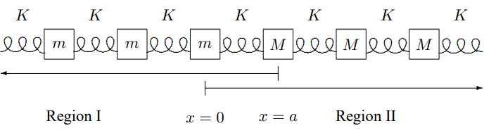
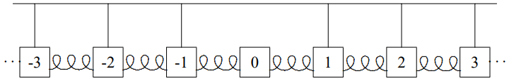
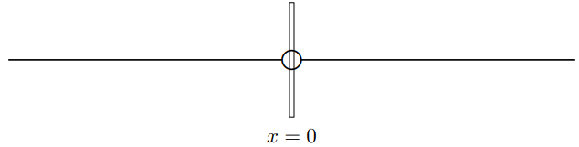
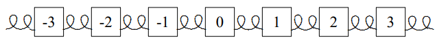
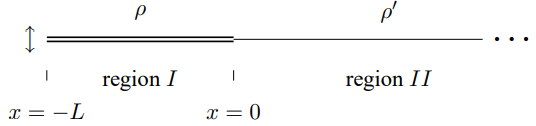

(ch-9)=

# 9. The Boundary at Infinity

## 9.1: Reflection and Transmission

### Forced Oscillation

Consider the forced oscillation problem in a semiinfinite stretched string that runs from $x = 0$ to $x = \infty$. Suppose that 
$$
\psi(0, t)=A \cos \omega t \tag{9.1} \label{eq-9-1}
$$

Then what is $\psi(x,t)$? This is not a well-posed problem, because we only have a boundary condition on one side. Furthermore, $\psi(\infty, t)$ does not have a definite value. We can only talk about the value of a function at infinity if the function goes to a constant value. Here, we expect $\psi(x,t)$ to continue to oscillate as $x \rightarrow \infty$, so we cannot specify it. Instead, we can specify either the incoming (traveling toward the boundary at $x = 0$ in the $- x$ direction) or the outgoing (traveling away from $x = 0$ in the $+ x$ direction) traveling waves in the system. This is called a “boundary condition at $\infty$.”

For example, we could take our boundary condition at infinity to be that no incoming traveling waves appear on the string. Physically, this corresponds to the situtation in which the motion of the string at $x = 0$ is producing the waves. In general, we can write a solution with angular frequency $\omega$ as a sum of four real traveling waves 
$$
\begin{aligned}
&\psi(x, t)=a \cos (k x-\omega t)+b \sin (k x-\omega t) \\
&+c \cos (k x+\omega t)+d \sin (k x+\omega t) .
 \tag{9.2} \label{eq-9-2}
\end{aligned}
$$

Then [9.1](#eq-9-1) implies 
$$
a+c=A, \quad b-d=0 , \tag{9.3} \label{eq-9-3}
$$

and the boundary condition at $\infty$ implies 
$$
c=d=0 . \tag{9.4} \label{eq-9-4}
$$

Thus 
$$
\psi(x, t)=A \cos (k x-\omega t) . \tag{9.5} \label{eq-9-5}
$$

### Infinite Systems

Now consider two semi-infinite strings with the same tension but different densities that are tied together at $x = 0$, as shown in [Figure 9.1](#fig-9-1). Suppose that in the $x \leq 0$ region (Region $I$), there is an incoming traveling wave with amplitude $A$ and angular frequency $\omega$, and in the $x \geq 0$ region (Region $II$), there is no incoming traveling wave. This describes a physical situation in which the incoming wave in $I$ is scattered by the boundary so that the other waves are a transmitted wave in $II$ and a reflected wave in $I$, both outgoing.

:::{figure} ../images/lt-33447-clipboard_e5327302946858a0a47218e9e23815e0a.png
:label: fig-9-1
:enumerator: 9.1
:alt: Two semi-infinite strings tied together at x = 0.

Two semi-infinite strings tied together at $x = 0$.
:::
The key to this problem is to think of it as a forced oscillation problem. The incoming traveling wave in region $I$ is what is “causing” all the oscillations. We have put the word in quotes, because the harmonic form, $e^{-i \omega t}$, for the oscillation implies that it has been going on forever, so that a philosopher might question this use of cause and effect. Nevertheless, it will help us to think of it this way. If the reflected and transmitted waves are produced by the incoming wave, their amplitudes will also be proportional to $e^{-i \omega t}$. As in a conventional forced oscillation problem, we could add on any free oscillations of the system. However, if there is any friction at all, these will die away with time, and we will be left only with the oscillation produced by the incoming traveling wave, proportional to $e^{-i \omega t}$. The important thing is that the frequency is the same in both regions, because as in a forced oscillation problem, the frequency is imposed on the system by an external agency, in this case, whatever produced the incoming traveling wave.

In our complex exponential notation in which everything has the irreducible time dependence, $e^{-i \omega t}$. Right moving waves are $\propto e^{i k x} e^{-i \omega t}$ and left moving waves are $\propto e^{-i k x} e^{-i \omega t}$. In this case, the boundary conditions at $\pm \infty$ require that 
$$
\psi(x, t)=e^{i k x} A e^{-i \omega t}+R A e^{-i k x} e^{-i \omega t} \tag{9.6} \label{eq-9-6}
$$

for $x \leq 0$ in Region $I$, and 
$$
\psi(x, t)=\tau A e^{i k^{\prime} x} e^{-i \omega t} \tag{9.7} \label{eq-9-7}
$$

for $x \geq 0$ in Region $II$. The $k$ and $k^{\prime}$ are 
$$
k=\omega \sqrt{\rho_{I} / T}, \quad k^{\prime}=\omega \sqrt{\rho_{I I} / T} , \tag{9.8} \label{eq-9-8}
$$

and $R$ and $\tau$ are (in general) complex numbers that determine the reflected and transmitted waves. They are sometimes called the “reflection coefficient” and “transmission coefficient,” or the “amplitudes” for transmission and reflection. Notice that we have defined the reflection and transmission coefficients by taking out a factor of the amplitude, $A$, of the incoming wave. The amplitude, $A$, then drops out of all the boundary conditions, and the dimensionless coefficients $R$ and $\tau$ are independent of $A$. This must be so because of the linearity of the system. We know that once we have found the solution, $\psi(x, t)$, for an incoming amplitude, $A$, we can find the solution for an incoming amplitude, $B$, by multiplying our solution by $B / A$. We will keep the parameter, $A$, in our expressions for $\psi(x, t)$, mostly in order to keep the units right. $A$ has units of length in this example, but in general, the amplitude of the incoming wave will have units of generalized displacement (as in [1.107](#eq-1-107) and [1.108](#eq-1-108)).

To determine $R$ and $\tau$, we need a boundary condition at $x = 0$ where [9.6](#eq-9-6) and [9.7](#eq-9-7) meet. Clearly $\psi(x, t)$ must be continuous at $x = 0$, thus 
$$
1+R=\tau . \tag{9.9} \label{eq-9-9}
$$

We have canceled the common factor of $A e^{-i \omega t}$ from both sides. The $x$ derivative must also be continuous (for a massless knot) because the vertical forces on the knot must balance, thus 
$$
i k(1-R)=i k^{\prime} \tau . \tag{9.10} \label{eq-9-10}
$$

Solving for $R$ and $\tau$ gives 
$$
\tau=\frac{2}{1+k^{\prime} / k}, \quad R=\frac{1-k^{\prime} / k}{1+k^{\prime} / k} . \tag{9.11} \label{eq-9-11}
$$

### Impedance Matching

Note that we could replace the string in Region $II$ by a dashpot with the same impedance, $Z_{II}$. This must be true because of the local nature of the interactions. The only thing that the string for $x < 0$ knows about the string for $x > 0$ is that it exerts a force at $x = 0$ equal to 
$$
-Z_{I I} \frac{\partial}{\partial t} \psi(0, t) . \tag{9.12} \label{eq-9-12}
$$

Thus we also learned what happens when an incoming wave encounters a dashpot with the wrong impedance. The amplitude of the reflected wave is given by $R$ in [9.11](#eq-9-11).

The reflected wave in [9.11](#eq-9-11) vanishes if $k = k^{\prime}$. If $k = k^{\prime}$, then $\rho_{I} = \rho_{II}$ (from [9.8](#eq-9-8)), and the impedance in region $I$ is the same as the impedance in region $II$. This is a simple example of the important principle of “impedance matching.” There is no reflection if the impedance of the system in region $II$ is the same as the impedance of the system in region $I$. The argument is the same as for the dashpot in the previous paragraph. What matters in the computation of the reflection coefficient are the forces that act on the string at $x = 0$. Those forces are determined by the impedances in the two regions. Nothing else matters. Consider, for example, the system shown in [Figure 9.2](#fig-9-2) of two semi-infinite strings connected at $x = 0$ to a massless ring which is free to slide in the vertical direction on a frictionless rod. The rod can exert a horizontal force on the ring, so the tensions in the two strings need not be the same. In such a system, we can change both the density and the tension in the string from region $I$ to region $II$. There will be no reflection so long as the product of the linear mass density and the tension (and thus the impedance, from [8.22](#eq-8-22)) is the same in both regions, 
$$
Z_{I}=\sqrt{\rho_{I} T_{I}}=\sqrt{\rho_{I I} T_{I I}}=Z_{I I} . \tag{9.13} \label{eq-9-13}
$$

:::{figure} ../images/lt-33448-clipboard_ea125a11f3125568aac3e060f5d438b69.png
:label: fig-9-2
:enumerator: 9.2
:alt: A system in which impedances can be matched.

A system in which impedances can be matched.
:::
It is instructive to solve the scattering problem completely for the more general case shown in [Figure 9.2](#fig-9-2). This will give us a feeling for the meaning of impedance. The form of the solution, [9.6](#eq-9-6) and [9.7](#eq-9-7) is unchanged, but now the angular wave numbers satisfy 
$$
k=\omega \sqrt{\rho_{I} / T_{I}}, \quad k^{\prime}=\omega \sqrt{\rho_{I I} / T_{I I}} . \tag{9.14} \label{eq-9-14}
$$

The boundary condition at $x = 0$ arising from the continuity of the string, [9.9](#eq-9-9), remains unchanged. However, [9.10](#eq-9-10) arose from the fact that the forces on the massless knot must sum to zero so the acceleration is not infinite. In this case, from [8.21](#eq-8-21), the contribution of each component of the wave to the total force is proportional to plus or minus the impedance in the relevant region depending on whether it is moving in the $+ x$ or the $- x$ direction. Thus the boundary condition is 
$$
Z_{I}(1-R)=Z_{I I} \tau . \tag{9.15} \label{eq-9-15}
$$

Then the reflection and transmission coefficients are 
$$
\tau=\frac{2 Z_{I}}{Z_{I}+Z_{I I}}, \quad R=\frac{Z_{I}-Z_{I I}}{Z_{I}+Z_{I I}} . \tag{9.16} \label{eq-9-16}
$$

We have already discussed the case where the impedances match and the reflection coefficient vanishes. It is also interesting to look at the limits in which $R=\pm 1$. First consider the limit in which the impedance in region $II$ goes to infinity, 
$$
\lim _{Z_{I I} \rightarrow \infty} R=-1 . \tag{9.17} \label{eq-9-17}
$$

This is situation in which it takes an infinite force to produce a wave in region $II$. Thus the string in region $II$ does not move at all, and in particular, the point $x = 0$ might as well be a fixed end. The solution, [9.17](#eq-9-17) ensures that the string does not move at $x = 0$, and therefore that the solution in region $I$ is $\psi(x, t) \propto \sin k x$. This solution is an infinite standing wave with a fixed end boundary condition.

In the opposite limit, in which the impedance in region $II$ is zero, we get 
$$
\lim _{Z_{I I} \rightarrow 0} R=1 . \tag{9.18} \label{eq-9-18}
$$

This time, it takes no force at all to produce a wave in region $II$. Thus the end of region $I$ at $x = 0$ feels no transverse force. It acts like a free end. The solution, [9.18](#eq-9-18) ensures that $\psi(x, t) \propto \cos k x$ in region $I$, so the slope of the string vanishes at $x = 0$. This solution is an infinite standing wave with a free end boundary condition.

### Looking at Reflected Waves

9-1

In this section, we discuss what the displacement in Region I looks like. We will find a useful diagnostic for the presence of reflection. We will also conclude that standing waves are very special.

Look at a wave of the form 
$$
A \cos (k x-\omega t)+R A \cos (k x+\omega t) . \tag{9.19} \label{eq-9-19}
$$

This describes an incoming traveling wave with some reflected wave of amplitude $R$ (we could put in an arbitrary phase for the reflected wave but it would complicate the algebra without changing the physics).

For $R=\pm 1$, this is a standing wave. For $R = 0$, it is a traveling wave. To see how the system interpolates between these two extremes, consider the motion of the crest of the wave, a maximum of [9.19](#eq-9-19).

To find the maximum, we differentiate with respect to $x$ and set the result to zero. Eliminating the irrelevant factor of $A$, we get 
$$
\sin (k x-\omega t)+R \sin (k x+\omega t)=0 , \tag{9.20} \label{eq-9-20}
$$

or 
$$
(1+R) \sin k x \cos \omega t=(1-R) \cos k x \sin \omega t , \tag{9.21} \label{eq-9-21}
$$

or 
$$
\tan k x=\frac{1-R}{1+R} \tan \omega t . \tag{9.22} \label{eq-9-22}
$$

[9.22](#eq-9-22) describes (implicitly — we could solve for $x$ as a function of $t$ if we felt like it) the motion of the maximum as a function of time. We can differentiate it to get the velocity: 
$$
k\left(1+\tan ^{2} k x\right) \frac{\partial x}{\partial t}=\frac{1-R}{1+R} \frac{\omega}{\cos ^{2} \omega t} . \tag{9.23} \label{eq-9-23}
$$

We have left $\left(1+\tan ^{2} k x\right)$ in [9.23](#eq-9-23) so that we can eliminate it by using [9.22](#eq-9-22). Thus 
$$
\begin{aligned}
& \frac{\partial x}{\partial t}=\frac{1-R}{1+R} \frac{\omega}{k} \frac{1}{\left(1+\tan ^{2} k x\right) \cos ^{2} \omega t} \\
=& \frac{1-R}{1+R} \frac{\omega}{k} \frac{1}{\left(1+\left(\frac{1-R}{1+R}\right)^{2} \tan ^{2} \omega t\right) \cos ^{2} \omega t} \\
=& v \frac{(1+R)(1-R)}{(1+R)^{2} \cos ^{2} \omega t+(1-R)^{2} \sin ^{2} \omega t}
 \tag{9.24} \label{eq-9-24}
\end{aligned}
$$

where $v=\omega / k$ is the phase velocity. When $\sin \omega t$ vanishes, the speed of the maximum is smaller than the phase velocity by a factor of 
$$
\frac{1-R}{1+R} , \tag{9.25} \label{eq-9-25}
$$

while when $\cos \omega t$ vanishes, the speed is larger than the $v$ by the inverse factor, 
$$
\frac{1+R}{1-R} . \tag{9.26} \label{eq-9-26}
$$

The wave thus appears to move in fits and starts. You can easily see this effect if you stare at a system with a lot of reflection. The effect is illustrated in program 9-1.

We can draw a more general moral from this discussion. The general case of wave motion is much more like a traveling wave than like a standing wave. Generically, except for $R=\pm 1$, the wave crests move with time. As we approach $R=\pm 1$, one of the two velocities in [9.25](#eq-9-25) and [9.26](#eq-9-26) goes to zero and the other goes to infinity. What happens when you are close to $R=\pm 1$ is then that the wave stays nearly still most of the time, and then moves very quickly to the next nearly stationary position. A standing wave is thus a degenerate special case of a traveling wave in which this motion is unobservable because, in a sense, it is infinitely fast.

### Power and Reflection

It is instructive to consider the power required to produce a traveling wave that is partially reflected. That is, we consider the power required by a transverse force acting at $x = 0$ to produce a wave in the region $x > 0$ that is a linear combination of an outgoing wave moving in the $+ x$ direction and an incoming wave moving in the $- x$ direction, such as might be produced by a reflection at some large value of $x$. Let us imagine the most general one-dimensional case, in a medium with impedance Z: 
$$
\begin{gathered}
\psi(x, t)=\operatorname{Re}\left(A_{+} e^{i(k x-\omega t)}+A_{-} e^{i(-k x-\omega t)}\right) \\
=R_{+} \cos \left(k x-\omega t+\phi_{+}\right)+R_{-} \cos \left(-k x-\omega t+\phi_{-}\right)
 \tag{9.27} \label{eq-9-27}
\end{gathered}
$$

where $R_{\pm}$ and $\phi_{\pm}$ are the absolute value and phase of the amplitude $A_{\pm}$. The velocity is 
$$
\frac{\partial}{\partial t} \psi(x, t)=\omega R_{+} \sin \left(k x-\omega t+\phi_{+}\right)+\omega R_{-} \sin \left(-k x-\omega t+\phi_{-}\right) . \tag{9.28} \label{eq-9-28}
$$

Now because [9.27](#eq-9-27) involves waves traveling both in the $+ x$ and in the $- x$ direction, we cannot find the force required to produce the wave at the point $x$ by simply multiplying [9.28](#eq-9-28) by the impedance, $Z$. However, we can use linearity. We can write $\psi(x, t)=\psi_{+}(x, t)+\psi_{-}(x, t)$, where $\psi_{\pm}(x, t)$ is the wave moving in the $\pm x$ direction. Then from [8.21](#eq-8-21), the force required to produce $\psi_{+}$ is 
$$
F_{+}(t)=Z \frac{\partial}{\partial t} \psi_{+}(0, t) \tag{9.29} \label{eq-9-29}
$$

while the force required to produce $\psi_{-}$ is 
$$
F_{-}(t)=-Z \frac{\partial}{\partial t} \psi_{-}(0, t) . \tag{9.30} \label{eq-9-30}
$$

Then the total force required to produce $\psi$ is 
$$
\begin{gathered}
F(t)=F_{+}(t)+F_{-}(t) \\
=Z \omega R_{+} \sin \left(-\omega t+\phi_{+}\right)-Z \omega R_{-} \sin \left(-\omega t+\phi_{-}\right) .
 \tag{9.31} \label{eq-9-31}
\end{gathered}
$$

Thus the power required is 
$$
\begin{gathered}
P(t)=\left.F(t) \frac{\partial}{\partial t} \psi(x, t)\right|_{x=0} \\
=Z \omega^{2} R_{+}^{2} \sin ^{2}\left(-\omega t+\phi_{+}\right)-Z \omega^{2} R_{-}^{2} \sin ^{2}\left(-\omega t+\phi_{-}\right) .
 \tag{9.32} \label{eq-9-32}
\end{gathered}
$$

The average power is then given by 
$$
P_{\text {average }}=\frac{1}{2} Z \omega^{2}\left(R_{+}^{2}-R_{-}^{2}\right)=\frac{1}{2} Z \omega^{2}\left(\left|A_{+}\right|^{2}-\left|A_{-}\right|^{2}\right) . \tag{9.33} \label{eq-9-33}
$$

The result, [9.32](#eq-9-32), has an obvious and important physical interpretation. Positive power is required to produce the outgoing traveling wave, while the incoming wave gives energy back to the system, and thus requires negative power. **The power required to produce a general traveling wave is thus proportional to the difference of the squares of the absolute values of the amplitudes of the outgoing and incoming waves.**

Note also that we can apply this discussion to the example of reflection at a boundary, discussed above. We can check that energy is conserved in this scattering. The average power required to produce the wave in region $I$ is, from [9.33](#eq-9-33) 
$$
Z_{I} \omega^{2}-Z_{I} \omega^{2} R^{2} . \tag{9.34} \label{eq-9-34}
$$

The average power required to produce the wave in region $II$ is, 
$$
Z_{I I} \omega^{2} \tau^{2} . \tag{9.35} \label{eq-9-35}
$$

Using [9.16](#eq-9-16), you can check that these are equal.

### Mass on a String

9-2

:::{figure} ../images/lt-33452-clipboard_eb1abd3e65236a9df70b1aef1b93fc81e.png
:label: fig-9-3
:enumerator: 9.3
:alt: A mass on a string.

A mass on a string.
:::
Consider the transmission and reflection of waves from a mass, $m$, at $x = 0$ on a string with linear mass density $\rho$ and tension $T$, stretched from $x=-\infty$ to $x=\infty$, shown in [Figure 9.3](#fig-9-3). Before we calculate the coefficients for reflection and transmission, let us guess the result in two extreme limits.

$m$ **small –** Here we expect that the reflection to be small and the transmission close to one, because in the limit 
$$
m \rightarrow 0 \Rightarrow \tau \rightarrow 1 \text { and } R \rightarrow 0 . \tag{9.36} \label{eq-9-36}
$$

$m$ **large –** Here we expect the transmission to be small and the reflection close to $- 1$, because in the limit 
$$
m \rightarrow \infty \rightarrow \tau \rightarrow 0 \text { and } R \rightarrow-1 . \tag{9.37} \label{eq-9-37}
$$

“Large or small compared to what?” you ask! That we can answer by dimensional analysis. The relevant dimensional parameters are $m$, $\omega$, $k$, $\rho$ and $T$. However, one of these is not independent, because of the dispersion relation, [6.5](#eq-6-5). If we use [6.5](#eq-6-5) to eliminate $T$, then $\omega$ cannot be relevant to the question, because it is the only thing left that involves the unit of time. The only dimensionless quantity we can build is 
$$
\epsilon=\frac{m k}{\rho}=\frac{m \omega^{2}}{k T} . \tag{9.38} \label{eq-9-38}
$$

Now that we have guessed, we can do the calculation. It follows from translation invariance and the boundary condition at $x = \infty$ that 
$$
\psi(x, t)=A e^{i k x} e^{-i \omega t}+R A e^{-i k x} e^{-i \omega t} \text { for } x \leq 0 \tag{9.39} \label{eq-9-39}
$$

$$
\psi(x, t)=\tau A e^{i k x} e^{-i \omega t} \text { for } x \geq 0 \tag{9.40} \label{eq-9-40}
$$

where, as usual, $R$ and $\tau$ are “amplitudes” for the reflected and transmitted waves. The boundary conditions are

**continuity –** The fact that the string doesn’t break implies that it is continuous, so that $\psi(0, t)$ can be computed with either [9.39](#eq-9-39) or [9.40](#eq-9-40). This implies 
$$
1+R=\tau . \tag{9.41} \label{eq-9-41}
$$

$F = ma$ **–** The horizontal component of the tension in the string must be equal on the two sides. Both are about equal to $T$, for small displacements. However, if there is a kink in the string, the vertical components do not match, as shown in [Figure 9.4](#fig-9-4) (see also [8.16](#eq-8-16)-[8.17](#eq-8-17)). The force on the mass is then the tension times the slope for $x \geq 0$ minus the tension times the slope for $x \leq 0$, thus $F = ma$ becomes 
$$
\begin{gathered}
T\left(\left.\frac{\partial}{\partial x} \psi(x, t)\right|_{x=0^{+}}-\left.\frac{\partial}{\partial x} \psi(x, t)\right|_{x=0^{-}}\right) \\
=m \frac{\partial^{2}}{\partial t^{2}} \psi(0, t)
 \tag{9.42} \label{eq-9-42}
\end{gathered}
$$

or 
$$
i k T(R-1+\tau)=-m \omega^{2} \tau . \tag{9.43} \label{eq-9-43}
$$

Thus 
$$
1+R=\tau, \quad 1-R=(1-i \epsilon) \tau , \tag{9.44} \label{eq-9-44}
$$

so that 
$$
\tau=\frac{2}{2-i \epsilon}, \quad R=\frac{i \epsilon}{2-i \epsilon} . \tag{9.45} \label{eq-9-45}
$$

Clearly, this is in accord with our guess.

:::{figure} ../images/lt-33453-clipboard_ecbec8bf6b1488af436cd4873ecc6f859.png
:label: fig-9-4
:enumerator: 9.4
:alt: The force on the mass.

The force on the mass.
:::
Note that these amplitudes, unlike those in [9.11](#eq-9-11), are complex numbers. The transmitted and reflected waves do not have the same phase as the incoming wave at the boundary. The phase difference between the transmitted (or reflected) wave is called a “phase shift.” One interesting feature of the solution, [9.45](#eq-9-45), that we did not guess is that for large $\epsilon$, the small transmitted wave is $90^{\circ}$ out of phase with the incoming wave.

This scattering is animated in program 9-2. The solution is also decomposed into incoming, transmitted and reflected waves. Stare at the mass and see if you can understand how the kink in the string is related to its acceleration. You can also make the mass larger and smaller to approach the limits [9.36](#eq-9-36) and [9.37](#eq-9-37).

## 9.2: Index of Refraction

Matter is composed of electric charges. This is something of a miracle. We cannot understand it without quantum mechanics. In a purely classical world, there would be no stable atoms or molecules. Because of quantum mechanics, the world does not collapse and we can build stable chunks of matter composed of equal numbers of positive and negative charges. In a chunk of matter in equilibrium, the charge and current are very close to zero when averaged over any large smooth region. However, in the presence of external electric and magnetic fields, such as those produced by an electromagnetic wave, the charges out of which the matter is built can move. This gives rise to what are called “bound” charges and currents, distinguishable from the “free” charges that are not part of the matter itself. These bound charges and currents affect the relation between electric and magnetic fields. In a homogeneous and isotropic material, which is a fancy way of describing a material that does not have any preferred axis, the effects of the matter (averaged over large regions) can be incorporated by replacing the constants $\epsilon_{0}$ and $\mu_{0}$ by the permittivity and permeability, $\epsilon$ and $\mu$. Then Maxwell’s equations for electromagnetic waves, [8.35](#eq-8-35)-[8.37](#eq-8-37), are modified to1 
$$
\begin{gathered}
\frac{\partial E_{y}}{\partial x}-\frac{\partial E_{x}}{\partial y}=-\frac{\partial B_{z}}{\partial t}, \quad \frac{\partial E_{z}}{\partial y}-\frac{\partial E_{y}}{\partial z}=-\frac{\partial B_{x}}{\partial t}, \\
\frac{\partial E_{x}}{\partial z}-\frac{\partial E_{z}}{\partial x}=-\frac{\partial B_{y}}{\partial t} ,
 \tag{9.46} \label{eq-9-46}
\end{gathered}
$$

$$
\begin{gathered}
\frac{\partial B_{y}}{\partial x}-\frac{\partial B_{x}}{\partial y}=\mu \epsilon \frac{\partial E_{z}}{\partial t}, \quad \frac{\partial B_{z}}{\partial y}-\frac{\partial B_{y}}{\partial z}=\mu \epsilon \frac{\partial E_{x}}{\partial t}, \\
\frac{\partial B_{x}}{\partial z}-\frac{\partial B_{z}}{\partial x}=\mu \epsilon \frac{\partial E_{y}}{\partial t} ,
 \tag{9.47} \label{eq-9-47}
\end{gathered}
$$

$$
\frac{\partial E_{x}}{\partial x}+\frac{\partial E_{y}}{\partial y}+\frac{\partial E_{z}}{\partial z}=0, \quad \frac{\partial B_{x}}{\partial x}+\frac{\partial B_{y}}{\partial y}+\frac{\partial B_{z}}{\partial z}=0 . \tag{9.48} \label{eq-9-48}
$$

Now [8.41](#eq-8-41)-[8.47](#eq-8-47) are satisfied with the appropriate substitutions, 
$$
\epsilon_{0} \rightarrow \epsilon, \quad \mu_{0} \rightarrow \mu . \tag{9.49} \label{eq-9-49}
$$

In particular, the dispersion relation, [8.47](#eq-8-47), becomes 
$$
\omega^{2}=\frac{1}{\mu \epsilon} k^{2},=\frac{\mu_{0} \epsilon_{0}}{\mu \epsilon} c^{2} k^{2} . \tag{9.50} \label{eq-9-50}
$$

so electromagnetic waves propagate with velocity 
$$
v=\frac{\omega}{k}=c \sqrt{\frac{\mu_{0} \epsilon_{0}}{\mu \epsilon}} , \tag{9.51} \label{eq-9-51}
$$

and [8.48](#eq-8-48) becomes 
$$
\beta_{y}^{\pm}=\pm \sqrt{\mu \epsilon} \varepsilon_{x}^{\pm}, \quad \beta_{x}^{\pm}=\mp \sqrt{\mu \epsilon} \varepsilon_{y}^{\pm} . \tag{9.52} \label{eq-9-52}
$$

The factor 
$$
n=\sqrt{\frac{\mu \epsilon}{\mu_{0} \epsilon_{0}}} \tag{9.53} \label{eq-9-53}
$$

is called the index of refraction of the material. $1 / n$ is the ratio of the speed of light in the material to the speed of light in vacuum. In terms of $n$, we can write [9.52](#eq-9-52) as 
$$
\beta_{y}^{\pm}=\pm \frac{n}{c} \varepsilon_{x}^{\pm}, \quad \beta_{x}^{\pm}=\mp \frac{n}{c} \varepsilon_{y}^{\pm} . \tag{9.54} \label{eq-9-54}
$$

Note also that we can rewrite [9.50](#eq-9-50) in the following useful form: 
$$
k=n \frac{\omega}{c} . \tag{9.55} \label{eq-9-55}
$$

For fixed frequency, the wave number is proportional to the index of refraction. For most transparent materials, $\mu$ is very close to 1, and can be ignored. But $\epsilon$ can be very different from 1, and is often quite important. For example, the index of refraction of ordinary glass is about 1.5 (it varies slightly with frequency, but we will discuss the interesting and familiar consequences of this later, when we treat waves in three dimensions).

### Reflection from a Dielectric Boundary

Let us now consider a plane wave in the $+ z$ direction in a universe that is filled with a dielectric material with index of refraction $n=\sqrt{\epsilon / \epsilon_{0}}$, for $z < 0$ and filled with another dielectric material with index of refraction $n^{\prime}=\sqrt{\epsilon^{\prime} / \epsilon_{0}}$, for $z > 0$. The boundary between the two dielectrics, the plane $z = 0$, is analogous to the boundary between two regions of the rope in [Figure 9.1](#fig-9-1). We would, therefore, expect some reflection from this surface.

Because the electric field in a plane electromagnetic wave is perpendicular to its direction of motion, we know that in this case that it is in the $x$-$y$ plane. It doesn’t matter in what direction the electric field of our incoming plane wave is pointing in the $x$-$y$ plane. That is clear by symmetry. The system looks the same if we rotate it around the $z$ axis, thus we can always rotate until our $\vec{e}_{+}$ vector is pointing in some convenient direction, say the $x$ direction. It is then pretty obvious that the reflected and transmitted waves will also have their electric fields in the $\pm x$ direction. Actually, we can turn this into a symmetry argument too. If we reflect the system in the $x$-$z$ plane, both the incoming wave and the dielectric are unchanged, but any $y$ component of the transmitted or reflected waves would change sign. Thus these components must vanish, by symmetry. Magnetic fields work the other way, because of the cross product of vectors in their definition. Thus we can write 
$$
\begin{aligned}
E_{x}(z, t)=A e^{i(k z-\omega t)}+R A e^{i(-k z-\omega t)} & \text { for } z<0, \\
B_{y}(z, t)=\frac{n}{c} A e^{i(k z-\omega t)}-\frac{n}{c} R A e^{i(-k z-\omega t)}
 \tag{9.56} \label{eq-9-56}
\end{aligned}
$$

and 
$$
\begin{aligned}
E_{x}(z, t)=\tau A e^{i(k z-\omega t)} & \\
B_{y}(z, t) &=\frac{n^{\prime}}{c} \tau A e^{i(k z-\omega t)}
 \tag{9.57} \label{eq-9-57}
\end{aligned} \quad \text { for } z>0,
$$

where we have continued our convention of calling the amplitude of the incoming wave $A$. Here, $A$ has units of electric field. In [9.56](#eq-9-56) and [9.57](#eq-9-57), we have used [9.54](#eq-9-54) to get the $B$ field from the $E$ field.

To compute $R$ and $\tau$, we need the boundary conditions at $z = 0$. For this we go back to Maxwell. The only way to get a discontinuity in the electric field is to have a sheet of charge. In a dielectric, charge builds up on the boundary only if there is a polarization perpendicular to the boundary. In this case, the electric fields, and therefore the polarizations, are parallel to the boundary, and thus the $E$ field is continuous at $z = 0$. The only way to get a discontinuity of the magnetic field, $B$, is to have a sheet of current. If $\mu$ were not equal to 1 in one of the materials, then we would have a nonzero magnetization, and we would have to worry about current sheets at the boundary. However, because these are only dielectrics, and $\mu = 1$ in both, there is no magnetization and the $B$ field is continuous at $z = 0$ as well. Thus we can immediately read off the boundary conditions: 
$$
1+R=\tau, \quad n(1-R)=n^{\prime} \tau . \tag{9.58} \label{eq-9-58}
$$

Because of [9.55](#eq-9-55), the boundary condition [9.58](#eq-9-58) is equivalent to 
$$
1+R=\tau, \quad k(1-R)=k^{\prime} \tau , \tag{9.59} \label{eq-9-59}
$$

which looks exactly like [9.9](#eq-9-9) and [9.10](#eq-9-10). We can simply take over the results of [9.11](#eq-9-11), 
$$
\tau=\frac{2}{1+k^{\prime} / k}, \quad R=\frac{1-k^{\prime} / k}{1+k^{\prime} / k} \tag{9.60} \label{eq-9-60}
$$

_____________________

1See Purcell, chapter 10.

## 9.3: Transfer Matrices

### Masses on a String

Next consider the reflection and transmission from two masses on a string, as in [Figure 9.5](#fig-9-5). Now translation invariance and the boundary condition at $x = \infty$ imply that 
$$
\psi(x, t)=A e^{i k x} e^{-i \omega t}+R A e^{-i k x} e^{-i \omega t} \text { for } x \leq 0 , \tag{9.61} \label{eq-9-61}
$$

:::{figure} ../images/lt-33455-clipboard_ede1f215c2b6e609305fb1bd31b69a2e2.png
:label: fig-9-5
:enumerator: 9.5
:alt: Two masses on a string.

Two masses on a string.
:::
$$
\psi(x, t)=T_{I} A e^{i k x} e^{-i \omega t}+R_{I} A e^{-i k x} e^{-i \omega t} \text { for } 0 \leq x \leq L , \tag{9.62} \label{eq-9-62}
$$

$$
\psi(x, t)=\tau A e^{i k x} e^{-i \omega t} \text { for } x \geq L . \tag{9.63} \label{eq-9-63}
$$

:::{figure} ../images/lt-33454-clipboard_e6c5d87aa9ce964181b3b28f5ec3d4a20.png
:label: fig-9-6
:enumerator: 9.6
:alt: The general scattering problem from a mass on a string.

The general scattering problem from a mass on a string.
:::
We could solve this problem in the same way, simply imposing boundary conditions twice, at $x = 0$ and at $x = L$, but there is a systematic way of doing this that is very useful. Consider first the general scattering problem from a single mass at $x = \ell$, with both incoming and outgoing waves on both sides, as shown in [Figure 9.6](#fig-9-6). This is the most general possible thing that can happen in scattering from a single mass, and we will be able to use the result to do much more complicated problems without any additional work. The general solution has the form 
$$
\psi(x, t)=T_{I} A e^{i k x} e^{-i \omega t}+R_{I} A e^{-i k x} e^{-i \omega t} \text { for } x \leq \ell , \tag{9.64} \label{eq-9-64}
$$

$$
\psi(x, t)=T_{I I} A e^{i k x} e^{-i \omega t}+R_{I I} A e^{-i k x} e^{-i \omega t} \text { for } x \geq \ell . \tag{9.65} \label{eq-9-65}
$$

The boundary conditions are continuity — 
$$
T_{I} e^{i k \ell}+R_{I} e^{-i k \ell}=T_{I I} e^{i k \ell}+R_{I I} e^{-i k \ell} \tag{9.66} \label{eq-9-66}
$$

and $F = ma$ — 
$$
\begin{gathered}
T\left(\left.\frac{\partial}{\partial x} \psi(x, t)\right|_{x=\ell^{+}}-\left.\frac{\partial}{\partial x} \psi(x, t)\right|_{x=\ell^{-}}\right) \\
=m \frac{\partial^{2}}{\partial t^{2}} \psi(\ell, t)
 \tag{9.67} \label{eq-9-67}
\end{gathered}
$$

or 
$$
\begin{aligned}
&i k T\left(\left(T_{I I}-T_{I}\right) e^{i k \ell}+\left(R_{I}-R_{I I}\right) e^{-i k \ell}\right) \\
&=-m \omega^{2}\left(T_{I I} e^{i k \ell}+R_{I I} e^{-i k \ell}\right) .
 \tag{9.68} \label{eq-9-68}
\end{aligned}
$$

Solving for $T_{I}$ and $R_{I}$ gives 
$$
\begin{aligned}
&T_{I}=\frac{1}{2}\left[(2-i \epsilon) T_{I I}-i \epsilon R_{I I} e^{-2 i k \ell}\right] , \\
&R_{I}=\frac{1}{2}\left[(2+i \epsilon) R_{I I}+i \epsilon T_{I I} e^{2 i k \ell}\right] .
 \tag{9.69} \label{eq-9-69}
\end{aligned}
$$

The important point is that because of linearity, the result [9.69](#eq-9-69) can be written in matrix form: 
$$
\left(\begin{array}{l}
T_{I} \\
R_{I}
\end{array}\right)=d(\ell)\left(\begin{array}{l}
T_{I I} \\
R_{I I}
\end{array} \tag{9.70} \label{eq-9-70}\right)
$$

where the matrix $d(\ell)$ 
$$
d(\ell)=\frac{1}{2}\left(\begin{array}{cc}
(2-i \epsilon) & -i \epsilon e^{-2 i k \ell} \\
i \epsilon e^{2 i k \ell} & (2+i \epsilon)
\end{array} \tag{9.71} \label{eq-9-71}\right) .
$$

The matrix, $d(\ell)$, is a “transfer matrix.” It allows us to get from the amplitudes in one region to those in the next by just doing a matrix multiplication. We can use this to solve the two mass problem without any further calculation except a matrix multiplication. Comparing the general result, [9.70](#eq-9-70), with the two mass problem, [Figure 9.5](#fig-9-5), we see immediately that 
$$
\left(\begin{array}{l}
1 \\
R
\end{array}\right)=d(0)\left(\begin{array}{l}
T_{I} \\
R_{I}
\end{array} \tag{9.72} \label{eq-9-72}\right) ,
$$

and 
$$
\left(\begin{array}{c}
T_{I} \\
R_{I}
\end{array}\right)=d(L)\left(\begin{array}{l}
\tau \\
0
\end{array} \tag{9.73} \label{eq-9-73}\right) .
$$

Thus 
$$
\left(\begin{array}{l}
1 \\
R
\end{array}\right)=d(0) d(L)\left(\begin{array}{l}
\tau \\
0
\end{array} \tag{9.74} \label{eq-9-74}\right) .
$$

Doing the matrix multiplication, 
$$
\begin{gathered}
d(0) d(L)=\frac{1}{4} \\
\left(\begin{array}{cc}
(2-i \epsilon)^{2}+\epsilon^{2} e^{2 i k L} & -i \epsilon\left((2-i \epsilon) e^{-2 i k L}+(2+i \epsilon)\right) \\
i \epsilon\left((2-i \epsilon)+(2+i \epsilon) e^{2 i k L}\right) & (2+i \epsilon)^{2}+\epsilon^{2} e^{-2 i k L}
\end{array}\right) .
 \tag{9.75} \label{eq-9-75}
\end{gathered}
$$

So 
$$
\begin{gathered}
\tau=\frac{4}{(2-i \epsilon)^{2}+\epsilon^{2} e^{2 i k L}} , \\
R=i \epsilon\left((2-i \epsilon)+(2+i \epsilon) e^{2 i k L}\right) \frac{\tau}{4} .
 \tag{9.76} \label{eq-9-76}
\end{gathered}
$$

Note that the reflection and transmission shows interesting resonance structure. For example, the reflection vanishes for 
$$
e^{2 i k L}=-\frac{2-i \epsilon}{2+i \epsilon} . \tag{9.77} \label{eq-9-77}
$$

In [Figure 9.7](#fig-9-7), $|\tau|$ and $|R|$ are plotted versus $\epsilon$ for $k L=0.5$.

:::{figure} ../images/lt-33456-clipboard_eb9643aa72cfa02949364edc4eb572738.png
:label: fig-9-7
:enumerator: 9.7
:alt: |\tau| and |R| plotted versus \epsilon for two masses on a string.

$|\tau|$ and $|R|$ plotted versus $\epsilon$ for two masses on a string.
:::
### $k$ Changes Region

:::{figure} ../images/lt-33457-clipboard_ef3d91ec0dd6d7b87b0a68289b9a1a204.png
:label: fig-9-8
:enumerator: 9.8
:alt: The general scattering problem for a change of k.

The general scattering problem for a change of $k$.
:::
Let us return to the simple example at the beginning of the chapter of a boundary between two regions of string with different values of $k$. This is a very important example because its general features are characteristic of many important physical systems. For example, when a light-wave encounters a transparent medium, the $k$ value changes. That situation is somewhat more complicated because of the three-dimensional nature of light waves and because of polarization. However the analogy between [9.59](#eq-9-59) and [9.9](#eq-9-9) and [9.10](#eq-9-10) means that we can take over the discussion of of the string directly to electromagnetic waves reflecting from a dielectric boundary perpendicular to the direction of the wave. In this section, we apply the general method of transfer matrices discussed in the previous section to this important example. Thus we consider the situation shown in [Figure 9.8](#fig-9-8). where the waves have the form 
$$
\psi(x, t)=A e^{-i \omega t}\left(T_{I} e^{i k_{1} x}+R_{I} e^{-i k_{1} x}\right) \text { in } I , \tag{9.78} \label{eq-9-78}
$$

$$
\psi(x, t)=A e^{-i \omega t}\left(T_{I I} e^{i k_{2} x}+R_{I I} e^{-i k_{2} x}\right) \text { in } I I . \tag{9.79} \label{eq-9-79}
$$

Then as in [9.9](#eq-9-9) and [9.10](#eq-9-10), the boundary conditions are that $\psi$ is continuous at $x = \ell$, which implies 
$$
T_{I} e^{i k_{1} \ell}+R_{I} e^{-i k_{1} \ell}=T_{I I} e^{i k_{2} \ell}+R_{I I} e^{-i k_{2} \ell} , \tag{9.80} \label{eq-9-80}
$$

and that the slope, $\partial \psi / \partial x$ is continuous at $x = \ell$, which implies 
$$
i k_{1}\left(T_{I} e^{i k_{1} \ell}-R_{I} e^{-i k_{1} \ell}\right)=i k_{2}\left(T_{I I} e^{i k_{2} \ell}-R_{I I} e^{-i k_{2} \ell}\right) . \tag{9.81} \label{eq-9-81}
$$

Solving the simultaneous linear equations, [9.80](#eq-9-80) and [9.81](#eq-9-81), for $T_{I}$ and $R_{I}$ and expressing the result in matrix form, we find 
$$
\left(\begin{array}{c}
T_{I} \\
R_{I}
\end{array}\right)=d\left(k_{1}, k_{2}, \ell\right)\left(\begin{array}{c}
T_{I I} \\
R_{I I}
\end{array} \tag{9.82} \label{eq-9-82}\right) ,
$$

where 
$$
d\left(k_{1}, k_{2}, \ell\right)=\frac{1}{2}\left(\begin{array}{cc}
\left(1+\frac{k_{2}}{k_{1}}\right) e^{i k_{2} \ell-i k_{1} \ell} & \left(1-\frac{k_{2}}{k_{1}}\right) e^{-i k_{2} \ell-i k_{1} \ell} \\
\left(1-\frac{k_{2}}{k_{1}}\right) e^{i k_{2} \ell+i k_{1} \ell} & \left(1+\frac{k_{2}}{k_{1}}\right) e^{-i k_{2} \ell+i k_{1} \ell}
\end{array} \tag{9.83} \label{eq-9-83}\right) .
$$

[9.82](#eq-9-82) is a very general result because $k_{1}$, $k_{2}$ and $\ell$ can be anything. Note that the relation is symmetrical: 
$$
\left(\begin{array}{c}
\bar{T}_{I I} \\
R_{I I}
\end{array}\right)=d\left(k_{2}, k_{1}, \ell\right)\left(\begin{array}{c}
T_{I} \\
R_{I}
\end{array} \tag{9.84} \label{eq-9-84}\right) .
$$

In matrix language, that implies that 
$$
d\left(k_{2}, k_{1}, \ell\right) d\left(k_{1}, k_{2}, \ell\right)=I . \tag{9.85} \label{eq-9-85}
$$

It is also useful to use the properties of matrix multiplication to rewrite [9.83](#eq-9-83) in the following form: 
$$
d\left(k_{1}, k_{2}, \ell\right)=b\left(k_{1}, \ell\right)^{-1} \tau\left(k_{1}, k_{2}\right) b\left(k_{2}, \ell\right) , \tag{9.86} \label{eq-9-86}
$$

where 
$$
b(k, \ell)=\left(\begin{array}{cc}
e^{i k \ell} & 0 \\
0 & e^{-i k \ell}
\end{array} \tag{9.87} \label{eq-9-87}\right) ,
$$

and 
$$
\tau\left(k_{1}, k_{2}\right)=d\left(k_{1}, k_{2}, 0\right)=\frac{1}{2}\left(\begin{array}{ll}
\left(1+\frac{k_{2}}{k_{1}}\right) & \left(1-\frac{k_{2}}{k_{1}}\right) \\
\left(1-\frac{k_{2}}{k_{1}}\right) & \left(1+\frac{k_{2}}{k_{1}}\right)
\end{array} \tag{9.88} \label{eq-9-88}\right) .
$$

You will see the utility of this in the computer problem, (9.6).

### Reflection from a Thin Film

(fig-9-9)=

*Reflection from a thin film.*

Consider the situation shown in [Figure 9.9](#fig-9-9). where the wave numbers are $k_{1}$ for $x \leq 0$, $k_{2}$ for $0 \leq x \leq L$ and $k_{3}$ for $x \geq L$. As usual, translation invariance plus the boundary condition at infinity (that the incoming wave in $I$ has amplitude, $A$, and that there is only an outgoing wave in $III$) implies 
$$
\begin{gathered}
\psi(x, t)=A e^{-i \omega t}\left(e^{i k_{1} x}+R e^{-i k_{1} x}\right) \quad \text { for } x \leq 0 \\
\psi(x, t)=A e^{-i \omega t}\left(T_{I I} e^{i k_{2} x}+R_{I I} e^{-i k_{2} x}\right) \text { for } 0 \leq x \leq L, \\
\psi(x, t)=\tau A e^{-i \omega t} e^{i k_{3} x} \text { for } L \leq x .
 \tag{9.89} \label{eq-9-89}
\end{gathered}
$$

Then we know from the results of the previous section that 
$$
\left(\begin{array}{l}
1 \\
R
\end{array}\right)=d\left(k_{1}, k_{2}, 0\right)\left(\begin{array}{l}
T_{I I} \\
R_{I I}
\end{array} \tag{9.90} \label{eq-9-90}\right)
$$

and 
$$
\left(\begin{array}{c}
T_{I I} \\
R_{I I}
\end{array}\right)=d\left(k_{2}, k_{3}, L\right)\left(\begin{array}{l}
\tau \\
0
\end{array} \tag{9.91} \label{eq-9-91}\right)
$$

and therefore 
$$
\begin{gathered}
\left(\begin{array}{c}
1 \\
R
\end{array}\right)=d\left(k_{1}, k_{2}, 0\right) d\left(k_{2}, k_{3}, L\right)\left(\begin{array}{c}
\tau \\
0
\end{array}\right) . \\
d\left(k_{1}, k_{2}, 0\right) d\left(k_{2}, k_{3}, L\right) \\
=b\left(k_{1}, 0\right)^{-1} \tau\left(k_{1}, k_{2}\right) b\left(k_{2}, 0\right) b\left(k_{2}, L\right)^{-1} \tau\left(k_{2}, k_{3}\right) b\left(k_{3}, L\right)
 \tag{9.92} \label{eq-9-92}
\end{gathered}
$$

Often we are interested in the situation $k_{3} = k_{1}$, that describes a film (in one-dimension, a film is just a region in $x$) in an otherwise homogeneous medium. This is then a one-dimensional analog of the reflection of light from a soap bubble. Then the transfer matrix looks like 
$$
\begin{gathered}
\frac{1}{4}\left(\begin{array}{ll}
\left(1+\frac{k_{2}}{k_{1}}\right) & \left(1-\frac{k_{2}}{k_{1}}\right) \\
\left(1-\frac{k_{2}}{k_{1}}\right) & \left(1+\frac{k_{2}}{k_{1}}\right)
\end{array}\right)\left(\begin{array}{cc}
e^{-i k_{2} L} & 0 \\
0 & e^{i k_{2} L}
\end{array}\right) \\
\left(\begin{array}{ll}
\left(1+\frac{k_{1}}{k_{2}}\right) & \left(1-\frac{k_{1}}{k_{2}}\right) \\
\left(1-\frac{k_{1}}{k_{2}}\right) & \left(1+\frac{k_{1}}{k_{2}}\right)
\end{array}\right)\left(\begin{array}{cc}
e^{i k_{1} L} & 0 \\
0 & e^{-i k_{1} L}
\end{array}\right)
 \tag{9.93} \label{eq-9-93}
\end{gathered}
$$

Thus 
$$
1=\left(\cos k_{2} L-i \frac{k_{1}^{2}+k_{2}^{2}}{2 k_{1} k_{2}} \sin k_{2} L\right) e^{i k_{1} L} \tau \tag{9.94} \label{eq-9-94}
$$

and 
$$
R=-\left(i \frac{k_{1}^{2}-k_{2}^{2}}{2 k_{1} k_{2}} \sin k_{2} L\right) e^{i k_{1} L} \tau \tag{9.95} \label{eq-9-95}
$$

or 
$$
\tau=\left(\cos k_{2} L-i \frac{k_{1}^{2}+k_{2}^{2}}{2 k_{1} k_{2}} \sin k_{2} L\right)^{-1} e^{-i k_{1} L} \tag{9.96} \label{eq-9-96}
$$

and 
$$
R=-\left(i \frac{k_{1}^{2}-k_{2}^{2}}{2 k_{1} k_{2}} \sin k_{2} L\right)\left(\cos k_{2} L-i \frac{k_{1}^{2}+k_{2}^{2}}{2 k_{1} k_{2}} \sin k_{2} L\right)^{-1} . \tag{9.97} \label{eq-9-97}
$$

Here we see the phenomenon of **resonant transmission**. The wave does not get reflected at all if the thickness of the film is an integral or half-integral number of wavelengths. Note, also, that when $k_{2} \rightarrow k_{1}$, $\tau \rightarrow 1$ and $R \rightarrow 0$ as they should, because in this limit there is no boundary.

The reflection in [9.98](#eq-9-98) varies rapidly with $k_{2}$, as shown [Figure 9.10](#fig-9-10), where we plot the intensity of the reflected wave versus $k_{2}$ for fixed ratio $k_{1} / k_{2} = 3$. It is this rapid variation of the intensity of reflected light as a function of wavelength that is responsible for the familiar color patterns on thin films like soap bubbles and oil slicks.

(fig-9-10)=

*Graph of $|R|^{2}$ versus $k_{2}$ for $k_{1} / k_{2} = 3$.*

### Nonreflective Coating

We will not work out the general case of $k_{1} \neq k_{3}$, simply because the algebra is a mess. However, one important special case is worth noting. Suppose that you have a boundary between media in which the wave number of your traveling wave are $k_{1}$ and $k_{3}$. Normally, you find reflection at the boundary. The question is, can you add an intermediate film layer with wave number $k_{2}$, that eliminates all reflection? The answer is yes. First you must adjust the wave number in the film to be the geometric mean of $k_{1}$ and $k_{3}$, so that 
$$
\frac{k_{2}}{k_{1}}=\frac{k_{3}}{k_{2}} . \tag{9.98} \label{eq-9-98}
$$

Then the transfer matrix becomes 
$$
\begin{aligned}
&\frac{1}{4}\left(\begin{array}{ll}
\left(1+\frac{k_{2}}{k_{1}}\right) & \left(1-\frac{k_{2}}{k_{1}}\right) \\
\left(1-\frac{k_{2}}{k_{1}}\right) & \left(1+\frac{k_{2}}{k_{1}}\right)
\end{array}\right)\left(\begin{array}{cc}
e^{-i k_{2} L} & 0 \\
0 & e^{i k_{2} L}
\end{array}\right) \\
&\left(\begin{array}{cc}
\left(1+\frac{k_{2}}{k_{1}}\right) & \left(1-\frac{k_{2}}{k_{1}}\right) \\
\left(1-\frac{k_{2}}{k_{1}}\right) & \left(1+\frac{k_{2}}{k_{1}}\right)
\end{array}\right)\left(\begin{array}{cc}
e^{i k_{3} L} & 0 \\
0 & e^{-i k_{3} L}
\end{array}\right) .
 \tag{9.99} \label{eq-9-99}
\end{aligned}
$$

It is easy to check that the reflection vanishes when there are a half-odd-integral number of wavelengths in the intermediate region, 
$$
k_{2} L=(2 n+1) \frac{\pi}{2} . \tag{9.100} \label{eq-9-100}
$$

In qualitative terms, the reflection vanishes because of a destructive interference between the reflected waves from the two boundaries. This has practical applications to nonreflective coatings for optical components.

## 9.4: Chapter Checklist

You should now be able to:

1. Analyze scattering problems by imposing boundary conditions and computing reflection and transmission coefficients;

2. Identify a wave with some reflection, and differentiate it from a pure traveling or standing wave;

3. Check energy conservation in scattering problems;

4. Analyze electromagnetic plane waves in a dielectric, and the reflection from a dielectric boundary;

5. *Use transfer matrices to simplify the analysis of scattering from more than one boundary.

### Problems

::::{exercise}
:label: prb-9-1
:enumerator: 9.1

Shown above is the boundary between two semi-infinite systems. To the left, there are identical blocks of mass $m$. To the right, there are identical blocks of mass $M$. They are connected as shown by identical massless springs with spring constant $K$, such that the equilibrium separation between neighboring blocks is $a$. Consider the reflection of a traveling longitudinal wave from the boundary between these two regions. That is, assume that in region I there is an incident wave of amplitude $A$ traveling to the right and a reflected wave traveling to the left. In a complex notation, the displacement of the mass with equilibrium position $x$ is 
$$
\psi(x, l)=A e^{-i(\omega t-k x)}+R A e^{-i(\omega t+k x)}
$$

for $x \leq a$. What is the relation between $\omega$ and $k$?

In region II, there is only a transmitted wave: 
$$
\psi(x, l)=A e^{-i(\omega t-k x)}+R A e^{-i(\omega t+k x)}
$$

for $x \geq 0$. What is the relation between $\omega$ and $k^{\prime}$? Find the appropriate boundary conditions that allow you to relate $\psi(x,t)$ in the two regions and solve for $R$ (do not bother to simplify the complex number). Check your result by taking the limit of $a$, $m$ and $M$ going to zero with $m / a$ and $M / a$ fixed and comparing with an appropriate continuous system.

::::

::::{exercise}
:label: prb-9-2
:enumerator: 9.2

An infinite line of coupled pendulums supports traveling waves, but it has no standing wave normal modes in which the displacement of the pendulums goes to zero at infinity. Consider, however, the system shown below:

Here block 0 is free to slide longitudinally with no gravitational restoring force, only the coupling due to the springs. If the blocks have mass $M$, the springs’ spring constant $K$, the separation between neighboring blocks is $a$, and the pendulums have length $\ell$, find the frequency of the standing wave normal mode of the system in which the displacements are $A e^{-\kappa x}$ for $x \geq 0$ and $A e^{\kappa x}$ for $x \leq 0$. **Hint:** Consider the subsystem, $-a \leq x \leq a$, as part of an infinite system with appropriate boundary conditions. Then you can get the answer directly from the dispersion relation.

::::

::::{exercise}
:label: prb-9-3
:enumerator: 9.3

****

Consider a string with linear mass density $\rho$, split into two pieces. The two halves are attached to a massless ring which slides vertically without friction on a rod at $x = 0$. One of the two halves is stretched in the negative $x$ direction with tension $T$. The other is stretched in the positive $x$ direction with tension $T^{\prime}$. Note that the vertical rod is necessary to balance the horizontal forces on the massless ring from the two strings with different tensions.

Suppose that a traveling wave comes in from the negative $x$ direction. Then the displacement of the strings in the two regions is 
$$
\begin{gathered}
\psi(x, t)=A e^{i k x} e^{-i \omega t}+R A e^{-i k^{\prime} x} e^{-i \omega^{\prime} t} \text { for } x \leq 0 \\
\psi(x, t)=\tau A e^{i k^{\prime \prime} x} e^{-i \omega^{\prime \prime} t} \text { for } x \geq 0 .
\end{gathered}
$$

1. Find k, k0 , ω0 , k00 and ω00 in terms of ω, T, T0 and ρ. Hint – this is easy!

2. Write down the two boundary conditions at x = 0 and find R and τ .

::::

::::{exercise}
:label: prb-9-4
:enumerator: 9.4

Consider traveling waves in an infinite system, part of which is shown below, for longitudinal (horizontal) motion of the blocks.

All the blocks have mass $m$, except for block 0 **which is massless**. The springs are massless and have spring constant $K$. The separation between neighboring blocks is $a$. To the left of block 0, which we will take to be at $x = 0$, there is an incoming and a reflected wave, so that the longitudinal displacement of the blocks for $x \leq 0$ has the form 
$$
A e^{i k x-i \omega t}+R A e^{-i k x-i \omega t} .
$$

To the right of the massless block, there is a transmitted wave, so that the longitudinal displacement of the blocks for $x \geq 0$ has the form 
$$
T A e^{i k x-i \omega t} .
$$

$\omega$ and $k$ are related by the dispersion relation 
$$
\omega^{2}=\frac{4 K}{m} \sin ^{2} \frac{k a}{2} .
$$

1. Explain the physics of the boundary conditions at $x = 0$.

2. Find $R$ and $T$.

::::

::::{exercise}
:label: prb-9-5
:enumerator: 9.5

Consider a semi-infinite system of two kinds of massive string with different densities, shown below:

The density of the string in region $I$ is $\rho$ and in region $II$ is $\rho^{\prime}$. The tension in both strings is $T$. Suppose that the end at $x = −L$ is oscillated in the transverse direction with displacement $\chi \sin \omega t$. This produces an outgoing wave (moving to the right) in region $II$ with no incoming wave. Suppose that $\omega=\frac{\pi}{2 L} \sqrt{\frac{T}{\rho}}$. Find the displacement at the point $x = 0$ as a function of time.

::::

::::{exercise}
:label: prb-9-6
:enumerator: 9.6

If you are doing a reflection and transmission problem involving several different regions, and thus requiring several boundary conditions, the transfer matrix is very helpful. You saw this in the analysis of scattering from a thin film.

Your computer assignment is to extend this analysis to incorporate $2 \pi$ such boundary conditions where n is some large integer. In particular, consider a continuous string with wave number $k_{2}$ for $L \leq x \leq 2 L, 3 L \leq x \leq 4 L$, $\cdots$, and $(2 n-1) L \leq x \leq 2 n L$, and $k_{1}$ elsewhere.

:::{figure} ../images/lt-33463-clipboard_e07167b3ca2ebe7cd7bbe0be8c372b6d0.png
:label: fig-9-11
:enumerator: 9.11
:alt: n = 3.

$n = 3$.
:::
Take $k_{1} = k$ and $k_{2} = 2k$. Compute the amplitude for transmission of an incoming wave in this system as a function of $L$ by doing the appropriate multiplication of $2n$ matrices. To do this, you must program your computer to multiply complex matrices. Organize your program in an iterative way, so that you can change n easily. This will allow you to start out with small $n$ and go to larger $n$ only when you are sure that the program is working.

If possible, you should present the results in the form of a graph of the absolute value of the transmission coefficient versus $kL$, for $0 \leq L \leq \pi / 2 k$. As you go to higher $n$, something interesting happens. The transmission coefficient drops nearly to zero in a region of $L$ values. Even if you cannot produce a graph, you should be able to find the range of $L$ for which the transmission goes to zero as $n$ gets large.

**Hint:** For $n = 3$, the result should look like the graph in [Figure 9.11](#fig-9-11).

::::
