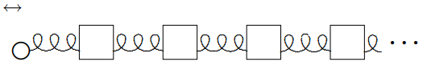

(ch-10)=

# 10. Signals and Fourier Analysis

## 10.1: Signals in Forced Oscillation

### Pulse on a String

10-1

We begin with the following illustrative problem: the transverse oscillations of a semiinfinite string stretched from $x = 0$ to $\infty$, driven at $x = 0$ with some arbitrary transverse signal $f(t)$, and with a boundary condition at infinity that there are no incoming traveling waves. This simple system is shown in [Figure 10.1](#fig-10-1).

:::{figure} ../images/lt-33392-clipboard_e864fdb0e647b7f2c200fac6d46410ada.png
:label: fig-10-1
:enumerator: 10.1
:alt: A semiinfinite string.

A semiinfinite string.
:::
There is a slick way to get the answer to this problem that works **only** for a system with the simple dispersion relation, 
$$
\omega^{2}=v^{2} k^{2} . \tag{10.1} \label{eq-10-1}
$$

The trick is to note that the dispersion relation, [10.1](#eq-10-1), implies that the system satisfies the wave equation, [6.4](#eq-6-4), or 
$$
\frac{\partial^{2}}{\partial t^{2}} \psi(x, t)=v^{2} \frac{\partial^{2}}{\partial x^{2}} \psi(x, t) . \tag{10.2} \label{eq-10-2}
$$

It is a mathematical fact (we will discuss the physics of it below) that the general solution to the one-dimensional wave equation, [10.2](#eq-10-2), is a sum of right-moving and left-moving waves with arbitrary shapes, 
$$
\psi(x, t)=g(x-v t)+h(x+v t) , \tag{10.3} \label{eq-10-3}
$$

where $g$ and $h$ are arbitrary functions. You can check, using the chain rule, that [10.3](#eq-10-3) satisfies [10.2](#eq-10-2), 
$$
\begin{gathered}
\frac{\partial^{2}}{\partial t^{2}}(g(x-v t)+h(x+v t))=v^{2} \frac{\partial^{2}}{\partial x^{2}}(g(x-v t)+h(x+v t)) \\
=v^{2}\left(g^{\prime \prime}(x-v t)+h^{\prime \prime}(x+v t)\right) .
 \tag{10.4} \label{eq-10-4}
\end{gathered}
$$

Given this mathematical fact, we can find the functions $g$ and $h$ that solve our particular problem by imposing boundary conditions. The boundary condition at infinity implies 
$$
h = 0 \tag{10.5} \label{eq-10-5}
$$

because the $h$ function describes a wave moving in the $-x$ direction. The boundary condition at $x = 0$ implies 
$$
g(-v t)=f(t) , \tag{10.6} \label{eq-10-6}
$$

which gives 
$$
\psi(x, t)=f(t-x / v) \tag{10.7} \label{eq-10-7}
$$

This describes the signal, $f(t)$, propagating down the string at the phase velocity $v$ with no change in shape.

For the simple function 
$$
f(t)=\left\{\begin{array}{cc}
1-|t| & \text { for }|t| \leq 1 \\
0 & \text { for }|t|>1
\end{array} \tag{10.8} \label{eq-10-8}\right.
$$

the shape of the string at a sequence of times is shown in [Figure 10.2](#fig-10-2) and animated in program 10-1.

:::{figure} ../images/lt-33393-clipboard_e96bc032d3ede4cce114976216ccfea18.png
:label: fig-10-2
:enumerator: 10.2
:alt: A triangular pulse propagating on a stretched string.

A triangular pulse propagating on a stretched string.
:::
### Fourier integrals

Let us think about this problem in a more physical way. In the process, we will understand the physics of the general solution, [10.3](#eq-10-3). This may seem like a strange thing to say in a section entitled, “Fourier integrals.” Nevertheless, we will see that the mathematics of Fourier integrals has a direct and simple physical interpretation.

The idea is to use linearity in a clever way to solve this problem. We can take $f(t)$ apart into its component angular frequencies. We already know how to solve the forced oscillation problem for each angular frequency. We can then take the individual solutions and add them back up again to reconstruct the solution to the full problem. The advantage of this procedure is that it works for any dispersion relation, not just for [10.1](#eq-10-1).

Because there may be a continuous distribution of frequencies in an arbitrary signal, we cannot just write $f(t)$ as a sum over components, we need a Fourier integral, 
$$
f(t)=\int_{-\infty}^{\infty} d \omega C(\omega) e^{-i \omega t} . \tag{10.9} \label{eq-10-9}
$$

The physics of [10.9](#eq-10-9) is just linearity and time translation invariance. We know that we can choose the normal modes of the free system to have irreducible exponential time dependence, because of time translation invariance. Since the normal modes describe all the possible motions of the system, we know that by taking a suitable linear combination of normal modes, we can find a solution in which the motion of the end of the system is described by the function, $f(t)$. The only subtlety in [10.9](#eq-10-9) is that we have assumed that the values of $\omega$ that appear in the integral are all real. This is appropriate because a nonzero imaginary part for $\omega$ in $e^{-i \omega t}$ describes a function that goes exponentially to infinity as $t \rightarrow \pm \infty$. Physically, we are never interested in such things. In fact, we are really interested in functions that go to zero as $t \rightarrow \pm \infty$. These are well-described by the integral over real $\omega$, [10.9](#eq-10-9).

Note that if $f(t)$ is real in [10.9](#eq-10-9), then 
$$
\begin{gathered}
f(t)=\int_{-\infty}^{\infty} d \omega C(\omega) e^{-i \omega t} \\
=f(t)^{*}=\int_{-\infty}^{\infty} d \omega C(\omega)^{*} e^{i \omega t}=\int_{-\infty}^{\infty} d \omega C(-\omega)^{*} e^{-i \omega t}
 \tag{10.10} \label{eq-10-10}
\end{gathered}
$$

thus 
$$
C(-\omega)^{*}=C(\omega) . \tag{10.11} \label{eq-10-11}
$$

It is actually easier to work with the complex Fourier integral, [10.9](#eq-10-9), with the irreducible complex exponential time dependence, than with real expansions in terms of $\cos \omega t$ and $\sin \omega t$. But you may also see the real forms in other books. You can always translate from [10.9](#eq-10-9) by using the Euler identity 
$$
e^{i \theta}=\cos \theta+i \sin \theta . \tag{10.12} \label{eq-10-12}
$$

For each value of $\omega$, we can write down the solution to the forced oscillation problem, incorporating the boundary condition at $\infty$. Each frequency component of the force produces a wave traveling in the $+x$ direction. 
$$
e^{-i \omega t} \rightarrow e^{-i \omega t+i k x} , \tag{10.13} \label{eq-10-13}
$$

then we can use linearity to construct the solution by adding up the individual traveling waves from [10.13](#eq-10-13) with the coefficients $C(\omega)$ from [10.9](#eq-10-9). Thus 
$$
\psi(x, t)=\int_{-\infty}^{\infty} d \omega C(\omega) e^{-i \omega t+i k x} . \tag{10.14} \label{eq-10-14}
$$

where $\omega$ and $k$ are related by the dispersion relation.

Equation [10.14](#eq-10-14) is true quite generally for any one-dimensional system, **for any dispersion relation,** but the result is particularly simple for a nondispersive system such as the continuous string with a dispersion relation of the form [10.1](#eq-10-1). We can use [10.1](#eq-10-1) in [10.14](#eq-10-14) by replacing 
$$
k \rightarrow \omega / v . \tag{10.15} \label{eq-10-15}
$$

Note that while $k^{2}$ is determined by the dispersion relation, the sign of $k$, for a given $\omega$, is determined by the boundary condition at infinity. $k$ and $\omega$ must have the same sign, as in [10.15](#eq-10-15), to describe a wave traveling in the $+x$ direction. Putting [10.15](#eq-10-15) into [10.14](#eq-10-14) gives 
$$
\psi(x, t)=\int_{-\infty}^{\infty} d \omega C(\omega) e^{-i \omega t+i \omega x / v}=\int_{-\infty}^{\infty} d \omega C(\omega) e^{-i \omega(t-x / v)} . \tag{10.16} \label{eq-10-16}
$$

Comparing this with [10.9](#eq-10-9) gives [10.7](#eq-10-7).

Let us try to understand what is happening in words. The Fourier integral, [10.9](#eq-10-9), expresses the signal as a linear combination of harmonic traveling waves. The relation, [10.15](#eq-10-15), which follows from the dispersion relation, [10.1](#eq-10-1), and the boundary condition at $\infty$, implies that each of the infinite harmonic traveling waves moves at the same phase velocity. Therefore, the waves stay in exactly the same relationship to one another as they move, and the signal is never distorted. It just moves with the waves.

The nonharmonic signal is called a “wave packet.” As we have seen, it can be taken apart into harmonic waves, by means of the Fourier integral, [10.9](#eq-10-9).

## 10.2: Dispersive Media and Group Velocity

For any other dispersion relation, the signal changes shape as it propagates, because the various harmonic components travel at different velocities. Eventually, the various pieces of the signal get out of phase and the signal is dispersed. That is why such a medium is called “dispersive.” This is the origin of the name “dispersion relation.”

### Group Velocity

10-2

If you are clever, you can send signals in a dispersive medium. The trick is to send the signal not directly as the function, $f(t)$, but as a modulation of a harmonic signal, of the form 
$$
f(t)=f_{s}(t) \cos \omega_{0} t , \tag{10.17} \label{eq-10-17}
$$

where $f_{s}(t)$ is the signal. Very often, you want to do this anyway, because the important frequencies in your signal may not match the frequencies of the waves with which you want to send the signal. An example is AM radio transmission, in which the signal is derived from sound with a typical frequency of a few hundred cycles per second (Hz), but it is carried as a modulation of the amplitude of an electromagnetic radio wave, with a frequency of a few million cycles per second.[^10-2-1]

You can get a sense of what is going to happen in this case by considering the sum of two traveling waves with different frequencies and wave numbers, 
$$
\cos \left(k_{+} x-\omega_{+} t\right)+\cos \left(k_{-} x-\omega_{-} t\right) \tag{10.18} \label{eq-10-18}
$$

where 
$$
k_{\pm}=k_{0} \pm k_{s}, \quad \omega_{\pm}=\omega_{0} \pm \omega_{s} , \tag{10.19} \label{eq-10-19}
$$

for 
$$
k_{s} \ll k_{0}, \quad \omega_{s} \ll \omega_{0} . \tag{10.20} \label{eq-10-20}
$$

The sum can be written as a product of cosines, as 
$$
2 \cos \left(k_{s} x-\omega_{s} t\right) \cdot \cos \left(k_{0} x-\omega_{0} t\right) . \tag{10.21} \label{eq-10-21}
$$

Because of [10.20](#eq-10-20), the first factor varies slowly in $x$ and $t$ compared to the second. The result can be thought of as a harmonic wave with frequency $\omega_{0}$ with a slowly varying amplitude proportional to the first factor. The space dependence of [10.21](#eq-10-21) is shown in [Figure 10.3](#fig-10-3).

:::{figure} ../images/lt-33395-clipboard_e6828adbbe7ec8c1a968daa1d82d4fb8e.png
:label: fig-10-3
:enumerator: 10.3
:alt: The function [10.21](#eq-10-21) for t = 0 and k0/ks = 10.

The function [10.21](#eq-10-21) for t = 0 and k0/ks = 10.
:::
You should think of the first factor in [10.21](#eq-10-21) as the signal. The second factor is called the “carrier wave.” Then [10.21](#eq-10-21) describes a signal that moves with velocity
$$
v_{s}=\frac{\omega_{s}}{k_{s}}=\frac{\omega_{+}-\omega_{-}}{k_{+}-k_{-}} , \tag{10.22} \label{eq-10-22}
$$

while the smaller waves associated with the second factor move with velocity 
$$
v_{0}=\frac{\omega_{0}}{k_{0}} . \tag{10.23} \label{eq-10-23}
$$

These two velocities will not be the same, in general. If [10.20](#eq-10-20) is satisfied, then (as we will show in more detail below) $v_{0}$ will be roughly the phase velocity. In the limit, as $k_{+}-k_{-}=2 k_{s}$ becomes very small, [10.22](#eq-10-22) becomes a derivative 
$$
v_{s}=\left.\frac{\omega_{+}-\omega_{-}}{k_{+}-k_{-}} \rightarrow \frac{\partial \omega}{\partial k}\right|_{k=k_{0}} . \tag{10.24} \label{eq-10-24}
$$

This is called the “group velocity.” It measures the speed at which the signal can actually be sent.

The time dependence of [10.21](#eq-10-21) is animated in program 10-2. Note the way that the carrier waves move through the signal. In this animation, the group velocity is smaller than the phase velocity, so the carrier waves appear at the back of each pulse of the signal and move through to the front.

Let us see how this works in general for interesting signals, $f(t)$. Suppose that for some range of frequencies near some frequency $\omega_{0}$, the dispersion relation is slowly varying. Then we can take it to be approximately linear by expanding $\omega (k)$ in a Taylor series about $k_{0}$ and keeping only the first two terms. That is 
$$
\omega=\omega(k)=\omega_{0}+\left.\left(k-k_{0}\right) \frac{\partial \omega}{\partial k}\right|_{k=k_{0}}+\cdots, \tag{10.25} \label{eq-10-25}
$$

$$
\omega_{0} \equiv \omega\left(k_{0}\right), \tag{10.26} \label{eq-10-26}
$$

and the higher order terms are negligible for a range of frequencies 
$$
\omega_{0}-\Delta \omega<\omega<\omega_{0}+\Delta \omega . \tag{10.27} \label{eq-10-27}
$$

where $\Delta \omega$ is a constant that depends on $\omega_{0}$ and the details on the higher order terms. Then you can send a signal of the form 
$$
f(t) \cdot e^{-i \omega_{0} t} \tag{10.28} \label{eq-10-28}
$$

(a complex form of [10.17](#eq-10-17), above) where $f(t)$ satisfies [10.9](#eq-10-9) with 
$$
C(\omega) \approx 0 \text { for }\left|\omega-\omega_{0}\right|>\Delta \omega . \tag{10.29} \label{eq-10-29}
$$

This describes a signal that has a carrier wave with frequency $\omega_{0}$, modulated by the interesting part of the signal, $f(t)$, that acts like a time-varying amplitude for the carrier wave, $e^{-i \omega_{0} t}$. The strategy of sending a signal as a varying amplitude on a carrier wave is called amplitude modulation.

Usually, the higher order terms in [10.25](#eq-10-25) are negligible only if $\Delta \omega \ll \omega_{0}$. If we neglect them, we can write [10.25](#eq-10-25) as 
$$
\omega=v k+a, \quad k=\omega / v+b, \tag{10.30} \label{eq-10-30}
$$

where $a$ and $b$ are constants we can determine from [10.25](#eq-10-25), 
$$
a=\omega_{0}-v k_{0}, \quad b=k_{0}-\omega_{0} / v \tag{10.31} \label{eq-10-31}
$$

and $v$ is the group velocity 
$$
v=\left.\frac{\partial \omega}{\partial k}\right|_{k=k_{0}} . \tag{10.32} \label{eq-10-32}
$$

For the signal [10.28](#eq-10-28) 
$$
\psi(0, t)=\int_{-\infty}^{\infty} d \omega C(\omega) e^{-i\left(\omega+\omega_{0}\right) t}=\int_{-\infty}^{\infty} d \omega C\left(\omega-\omega_{0}\right) e^{-i \omega t} . \tag{10.33} \label{eq-10-33}
$$

Thus [10.14](#eq-10-14) becomes 
$$
\psi(x, t)=\int_{-\infty}^{\infty} d \omega C\left(\omega-\omega_{0}\right) e^{-i \omega t} e^{i k x} , \tag{10.34} \label{eq-10-34}
$$

but then [10.29](#eq-10-29) gives 
$$
\begin{aligned}
\psi(x, t) &=\int_{-\infty}^{\infty} d \omega C\left(\omega-\omega_{0}\right) e^{-i \omega t+i(\omega / v+b) x} \\
=& \int_{-\infty}^{\infty} d \omega C\left(\omega-\omega_{0}\right) e^{-i \omega(t-x / v)+i b x} \\
=& \int_{=\infty}^{\infty} d \omega C(\omega) e^{-i\left(\omega+\omega_{0}\right)(t-x / v)+i b x} \\
&=f(t-x / v) e^{-i \omega_{0}(t-x / v)+i b x} .
 \tag{10.35} \label{eq-10-35}
\end{aligned}
$$

The modulation $f(t)$ travels without change of shape at the group velocity $v$ given by [10.32](#eq-10-32), as long as we can ignore the higher order term in the dispersion relation. The phase velocity 
$$
v_{\phi}=\frac{\omega}{k}, \tag{10.36} \label{eq-10-36}
$$

has nothing to do with the transmission of information, but notice that because of the extra $e^{i b x}$ in [10.35](#eq-10-35), the carrier wave travels at the phase velocity.

You can see the difference between phase velocity and group velocity in your pool or bathtub by making a wave packet consisting of several shorter waves.

_________________

[^10-2-1]: See [10.71](#eq-10-71), below.

## 10.3: Bandwidth, Fidelity, and Uncertainty

The relation [10.9](#eq-10-9) can be inverted to give $C(\omega)$ in terms of $f(t)$ as follows 
$$
C(\omega)=\frac{1}{2 \pi} \int_{-\infty}^{\infty} d t f(t) e^{i \omega t} . \tag{10.37} \label{eq-10-37}
$$

This is the “inverse Fourier transform.” It is very important because it allows us to go back and forth between the signal and the distribution of frequencies that it contains. We will get this result in two ways: first, with a fancy argument that we will use again and explain in more detail in chapter 13; next, by going back to the Fourier series, discussed in chapter 6 for waves on a finite string, and taking the limit as the length of the string goes to infinity.

The fancy argument goes like this. It is very reasonable that the integral in [10.37](#eq-10-37) is proportional to $C(\omega)$ because if we insert [10.9](#eq-10-9) and rearrange the order of integration, we get 
$$
\frac{1}{2 \pi} \int_{-\infty}^{\infty} d \omega^{\prime} C\left(\omega^{\prime}\right) \int_{-\infty}^{\infty} d t e^{i\left(\omega-\omega^{\prime}\right) t} . \tag{10.38} \label{eq-10-38}
$$

The $t$ integral averages to zero unless $\omega = \omega^{\prime}$. Thus the $\omega^{\prime}$ integral is simply proportional to $C(\omega)$ times a constant factor. The factor of $1 / 2 \pi$ can be obtained by doing some integrals explicitly. For example, if 
$$
f(t)=e^{-\Gamma|t|} , \tag{10.39} \label{eq-10-39}
$$

for $\Gamma>0$ then, as we will show explicitly in [10.49](#eq-10-49)-[10.56](#eq-10-56), [10.37](#eq-10-37) yields 
$$
2 \pi C(\omega)=2 \Gamma /\left(\Gamma^{2}+\omega^{2}\right) , \tag{10.40} \label{eq-10-40}
$$

which can, in turn, be put back in [10.9](#eq-10-9) to give [10.39](#eq-10-39). For $t = 0$, the integral can be done by the trigonometric substitution $\omega \rightarrow \Gamma \tan \theta$: 
$$
\begin{aligned}
&1=f(0)=e^{-\Gamma \cdot 0}=\int_{-\infty}^{\infty} d \omega C(\omega) e^{-i \omega \cdot 0} \\
&=\frac{1}{\pi} \int_{-\infty}^{\infty} d \omega \frac{\Gamma}{\Gamma^{2}+\omega^{2}} \rightarrow \frac{1}{\pi} \int_{-\pi / 2}^{\pi / 2} d \theta=1 .
 \tag{10.41} \label{eq-10-41}
\end{aligned}
$$

To get the inverse Fourier transform, [10.37](#eq-10-37), as the limit of a Fourier series, it is convenient to use a slightly different boundary condition from those we discussed in chapter 6, fixed ends and free ends. Instead, let us consider a string stretched from $x=-\pi \ell$ to $x=\pi \ell$, in which we assume that the displacement of the string from equilibrium at $x=\pi \ell$ is the same as the displacement at $x=-\pi \ell$,2 
$$
\psi(-\pi \ell, t)=\psi(\pi \ell, t) . \tag{10.42} \label{eq-10-42}
$$

The requirement, [10.42](#eq-10-42), is called “periodic boundary conditions,” because it implies that the function $\psi$ that describes the displacement of the string is periodic in $x$ with period $2 \pi \ell$. The normal modes of the infinite system that satisfy [10.42](#eq-10-42) are 
$$
e^{i n x / \ell} , \tag{10.43} \label{eq-10-43}
$$

for integer $n$, because changing $x$ by $2 \pi \ell$ in [10.43](#eq-10-43) just changes the phase of the exponential by $2 \pi$. Thus if $\psi(x)$ is an arbitrary function satisfying $\psi(-\pi \ell)=\psi(\pi \ell)$, we should be able to expand it in the normal modes of [10.43](#eq-10-43), 
$$
\psi(x)=\sum_{n=-\infty}^{\infty} c_{n} e^{-i n x / \ell} . \tag{10.44} \label{eq-10-44}
$$

Likewise, for a function $f(t)$, satisfying $f(-\pi T)=f(\pi T)$ for some large time $T$, we expect to be able to expand it as follows 
$$
f(t)=\sum_{n=-\infty}^{\infty} c_{n} e^{-i n t / T} , \tag{10.45} \label{eq-10-45}
$$

where we have changed the sign in the exponential to agree with [10.9](#eq-10-9). We will show that as $T \rightarrow \infty$, this becomes equivalent to [10.9](#eq-10-9).

Equation [10.44](#eq-10-44) is the analog of [6.8](#eq-6-8) for the boundary condition, [10.42](#eq-10-42). The sum runs from $-\infty$ to $\infty$ rather than 0 to $\infty$ because the modes in [10.43](#eq-10-43) are different for $n$ and $-n$. For this Fourier series, the inverse is 
$$
c_{m}=\frac{1}{2 \pi T} \int_{-\pi T}^{\pi T} d t e^{i m t / T} f(t) \tag{10.46} \label{eq-10-46}
$$

where we have used the identity 
$$
\frac{1}{2 \pi T} \int_{-\pi T}^{\pi T} d t e^{i m t / T} e^{-i n t / T}=\left\{\begin{array}{l}
1 \text { for } m=n , \\
0 \text { for } m \neq n .
\end{array} \tag{10.47} \label{eq-10-47}\right.
$$

Now suppose that $f(t)$ goes to 0 for large $|t|$ (note that this is consistent with the periodic boundary condition [10.42](#eq-10-42)) fast enough so that the integral in [10.46](#eq-10-46) is well defined as $T \rightarrow \infty$ for all $m$. Then because of the factor of $1/T$ in [10.47](#eq-10-47), the $c_{n}$ all go to zero like $1/T$. Thus we should multiply $c_{n}$ by $T$ to get something finite in the limit. Comparing [10.45](#eq-10-45) with [10.9](#eq-10-9), we see that we should take $\omega$ to be $n/T$.

Thus the relation, [10.45](#eq-10-45), is an analog of the Fourier integral, [10.9](#eq-10-9) where the correspondence is 
$$
\begin{aligned}
T & \rightarrow \infty \\
\frac{n}{T} & \rightarrow \omega \\
c_{n} T & \rightarrow C(\omega) .
 \tag{10.48} \label{eq-10-48}
\end{aligned}
$$

In the limit, $T \rightarrow \infty$, the sum becomes an integral over $\omega$.

Multiplying both sides of [10.46](#eq-10-46) by $T$, and making the substitution of [10.48](#eq-10-48) gives [10.37](#eq-10-37).

### Solvable Example

For practice in dealing with integration of complex functions, we will do the integration that leads to [10.40](#eq-10-40) in gory detail, with all the steps. 
$$
C(\omega)=\frac{1}{2 \pi} \int_{-\infty}^{\infty} d t e^{-\Gamma|t|} e^{i \omega t} . \tag{10.49} \label{eq-10-49}
$$

First we get rid of the absolute value — 
$$
=\frac{1}{2 \pi} \int_{0}^{\infty} d t e^{-\Gamma t} e^{i \omega t}+\frac{1}{2 \pi} \int_{-\infty}^{0} d t e^{\Gamma t} e^{i \omega t} \tag{10.50} \label{eq-10-50}
$$

and write the second integral as an integral from 0 to $\infty$ — 
$$
=\frac{1}{2 \pi} \int_{0}^{\infty} d t e^{-\Gamma t} e^{i \omega t}+\frac{1}{2 \pi} \int_{0}^{\infty} d t e^{-\Gamma t} e^{-i \omega t} \tag{10.51} \label{eq-10-51}
$$

$$
=\frac{1}{2 \pi} \int_{0}^{\infty} d t e^{-\Gamma t} e^{i \omega t}+\text { complex conjugate, } \tag{10.52} \label{eq-10-52}
$$

but we know how to differentiate even complex exponentials (see the discussion of [3.108](#eq-3-108)), so we can write 
$$
\frac{\partial}{\partial t}\left(e^{-\Gamma t} e^{i \omega t}\right)=(-\Gamma+i \omega) e^{-\Gamma t} e^{i \omega t} . \tag{10.53} \label{eq-10-53}
$$

Thus 
$$
\int_{0}^{\infty} d t e^{-\Gamma t} e^{i \omega t}=\frac{1}{-\Gamma+i \omega} \int_{0}^{\infty} d t \frac{\partial}{\partial t}\left(e^{-\Gamma t} e^{i \omega t}\right) \tag{10.54} \label{eq-10-54}
$$

or, using the fundamental theorem of integral calculus, 
$$
=\left.\frac{1}{-\Gamma+i \omega}\left(c^{-\Gamma t} c^{i \omega t}\right)\right|_{t=0} ^{\infty}=\frac{1}{\Gamma-i \omega} . \tag{10.55} \label{eq-10-55}
$$

This function of $\omega$ is called a “pole.” While the function is perfectly well behaved for real $\omega$, it blows up for $\omega=-i \Gamma$, which is called the position of the pole in the complex plane. Now we just have to add the complex conjugate to get 
$$
\begin{gathered}
C(\omega)=\frac{1}{2 \pi}\left(\frac{1}{\Gamma-i \omega}+\frac{1}{\Gamma+i \omega}\right) \\
=\frac{1}{2 \pi}\left(\frac{\Gamma+i \omega}{\Gamma^{2}+\omega^{2}}+\frac{\Gamma-i \omega}{\Gamma^{2}+\omega^{2}}\right)=\frac{1}{2 \pi} \frac{2 \Gamma}{\Gamma^{2}+\omega^{2}}
 \tag{10.56} \label{eq-10-56}
\end{gathered}
$$

which is [10.40](#eq-10-40). We already checked, in [10.41](#eq-10-41), that the factor of $1 / 2 \pi$ makes sense.

The pair [10.39](#eq-10-39)-[10.40](#eq-10-40) illustrates a very general fact about signals and their associated frequency spectra. In [Figure 10.4](#fig-10-4) we plot $f(t)$ for $\Gamma=0.5$ and $\Gamma=2$ and in [Figure 10.5](#fig-10-5), we plot $C(\omega)$ for the same values of $\Gamma$. Notice that as $\Gamma$ increases, the signal becomes more sharply peaked near $t = 0$ but the frequency spectrum spreads out. And conversely if ¡ is small so that $C(\omega)$ is sharply peaked near $\omega = 0$, then $f(t)$ is spread out in time. This complementary behavior is general. To resolve short times, you need a broad spectrum of frequencies.

:::{figure} ../images/lt-33396-clipboard_ec92f55715cef3f7a47400819b829905e.png
:label: fig-10-4
:enumerator: 10.4
:alt: f(t)=e^{-|\Gamma t|} for \Gamma=0.5 and \Gamma=2.

$f(t)=e^{-|\Gamma t|}$ for $\Gamma=0.5$ and $\Gamma=2$.
:::
:::{figure} ../images/lt-33397-clipboard_e361f4a04ce6400cbe38c0c03e1743b97.png
:label: fig-10-5
:enumerator: 10.5
:alt: C(\omega) for the same values of \Gamma.

$C(\omega)$ for the same values of $\Gamma$.
:::
### Broad Generalities

We can state this fact very generally using a precise mathematical definition of the spread of the signal in time and the spread of the spectrum in frequency.

We will define the intensity of the signal to be proportional to $|f(t)|^{2}$. Then, we can define the average value of any function $g(t)$ weighted with the signal’s intensity as follows 
$$
\langle g(t)\rangle=\frac{\int_{-\infty}^{\infty} d t g(t)|f(t)|^{2}}{\int_{-\infty}^{\infty} d t|f(t)|^{2}} . \tag{10.57} \label{eq-10-57}
$$

This weights $g(t)$ most when the signal is most intense.

For example, $\langle t\rangle$ is the average time, that is the time value around which the signal is most intense. Then 
$$
\left\langle[t-\langle t\rangle]^{2}\right\rangle \equiv \Delta t^{2} \tag{10.58} \label{eq-10-58}
$$

measures the mean-square deviation from the average time, so it is a measure of the spread of the signal.

We can define the average value of a function of $\omega$ in an analogous way by integrating over the intensity of the frequency spectrum. But here is the trick. Because of [10.9](#eq-10-9) and [10.37](#eq-10-37), we can go back and forth between $f(t)$ and $C(\omega)$ at will. They carry the same information. We ought to be able to calculate averages of functions of $\omega$ by using an integral over $t$. And sure enough, we can. Consider the integral 
$$
\int_{-\infty}^{\infty} d \omega \omega C(\omega) e^{-i \omega t}=i \frac{\partial}{\partial t} \int_{-\infty}^{\infty} d \omega C(\omega) e^{-i \omega t}=i \frac{\partial}{\partial t} f(t) . \tag{10.59} \label{eq-10-59}
$$

This shows that multiplying $C(\omega)$ by $\omega$ is equivalent to differentiating the corresponding $f(t)$ and multiplying by $i$.

Thus we can calculate $\langle\omega\rangle$ as 
$$
\langle\omega\rangle=\frac{\int_{-\infty}^{\infty} d t f(t)^{*} i \frac{\partial}{\partial t} f(t)}{\int_{-\infty}^{\infty} d t|f(t)|^{2}} , \tag{10.60} \label{eq-10-60}
$$

and 
$$
\Delta \omega^{2} \equiv\left\langle[\omega-\langle\omega\rangle]^{2}\right\rangle=\frac{\int_{-\infty}^{\infty} d t\left|\left(i \frac{\partial}{\partial t}-\langle\omega\rangle\right) f(t)\right|^{2}}{\int_{-\infty}^{\infty} d t|f(t)|^{2}} . \tag{10.61} \label{eq-10-61}
$$

$\Delta \omega$ is a measure of the spread of the frequency spectrum, or the “bandwidth.”

Now we can state and prove the following result: 
$$
\Delta t \cdot \Delta \omega \geq \frac{1}{2} . \tag{10.62} \label{eq-10-62}
$$

One important consequence of this theorem is that for a given bandwidth, $\Delta \omega$, the spread in time of the signal cannot be arbitrarily small, but is bounded by 
$$
\Delta t \geq \frac{1}{2 \Delta \omega} . \tag{10.63} \label{eq-10-63}
$$

The smaller the minimum possible value of $\Delta t$ you can send, the higher the “fidelity” you can achieve. Smaller $\Delta t$ means that you can send signals with sharper details. But [10.63](#eq-10-63) means that the smaller the bandwidth, the larger the minimum $\Delta t$, and the lower the fidelity.

To prove [10.62](#eq-10-62) consider the function3 
$$
\left([t-\langle t\rangle]-i \kappa\left[i \frac{\partial}{\partial t}-\langle\omega\rangle\right]\right) f(t)=r(t), \tag{10.64} \label{eq-10-64}
$$

which depends on the entirely free parameter $\kappa$. Now look at the ratio 
$$
\frac{\int_{-\infty}^{\infty} d t|r(t)|^{2}}{\int_{-\infty}^{\infty} d t|f(t)|^{2}} . \tag{10.65} \label{eq-10-65}
$$

This ratio is obviously positive, because the integrands of both the numerator and the denominator are positive. What we will do is choose $\kappa$ cleverly, so that the fact that the ratio is positive tells us something interesting.

First, we will simplify [10.65](#eq-10-65). In the terms in [10.65](#eq-10-65) that involve derivatives of $f(t)^{*}$, we can integrate by parts (and throw away the boundary terms because we assume $f(t)$ goes to zero at infinity) so that the derivatives act on $f(t)$. Then [10.65](#eq-10-65) becomes 
$$
\Delta t^{2}+\kappa^{2} \Delta \omega^{2}+\kappa \frac{\int_{-\infty}^{\infty} d t f(t)^{*}\left(t \frac{\partial}{\partial t}-\frac{\partial}{\partial t} t\right) f(t)}{\int_{-\infty}^{\infty} d t|f(t)|^{2}} . \tag{10.66} \label{eq-10-66}
$$

All other terms cancel. But 
$$
\frac{\partial}{\partial t}[t f(t)]=f(t)+t \frac{\partial}{\partial t} f(t) . \tag{10.67} \label{eq-10-67}
$$

Thus the last term in [10.66](#eq-10-66) is just $\kappa$, and [10.65](#eq-10-65) becomes 
$$
\Delta t^{2}+\kappa^{2} \Delta \omega^{2}-\kappa . \tag{10.68} \label{eq-10-68}
$$

[10.68](#eq-10-68) is clearly greater than or equal to zero for any value of $\kappa$, because it is a ratio of positive integrals. To get the most information from the fact that it is positive, we should choose $\kappa$ so that [10.65](#eq-10-65) (=[10.68](#eq-10-68)) is as small as possible. In other words, we should find the value of $\kappa$ that minimizes [10.68](#eq-10-68). If we differentiate [10.68](#eq-10-68) and set the result to zero, we find 
$$
\kappa_{\min }=\frac{1}{2 \Delta \omega^{2}} . \tag{10.69} \label{eq-10-69}
$$

We can now plug this back into [10.68](#eq-10-68) to find the minimum, which is still greater than or equal to zero. It is 
$$
\Delta t^{2}-\frac{1}{4 \Delta \omega^{2}} \geq 0 \tag{10.70} \label{eq-10-70}
$$

which immediately yields [10.62](#eq-10-62).

Equation [10.62](#eq-10-62) appears in many places in physics. A simple example is bandwidth in AM radio transmissions. A typical commercial AM station broadcasts in a band of frequency about 5000 cycles/s (5 kc) on either side of the carrier wave frequency. Thus 
$$
\Delta \omega=2 \pi \Delta \nu \approx 3 \times 10^{4} \mathrm{~s}^{-1} , \tag{10.71} \label{eq-10-71}
$$

and they cannot send signals that separate times less than a few $\times 10^{-5}$ seconds apart. This is good enough for talk and acceptable for some music.

A famous example of [10.62](#eq-10-62) comes from quantum mechanics. There is a completely analogous relation between the spatial spread of a wave packet, $\Delta x$, and the spread of $k$ values required to produce it, $\Delta k$: 
$$
\Delta x \cdot \Delta k \geq \frac{1}{2} \tag{10.72} \label{eq-10-72}
$$

In quantum mechanics, the momentum of a particle is related to the $k$ value of the wave that describes it by 
$$
p=\hbar k , \tag{10.73} \label{eq-10-73}
$$

where $\hbar$ is Planck’s constant $h$ divided by $2 \pi$. Thus [10.72](#eq-10-72) implies 
$$
\Delta x \cdot \Delta p \geq \frac{\hbar}{2} . \tag{10.74} \label{eq-10-74}
$$

This is the mathematical statement of the fact that the position and momentum of a particle cannot be specified simultaneously. This is Heisenberg’s uncertainty relation.

___________________

2A example of a physical system with this kind of boundary condition would be a string stretched around a frictionless cylinder with radius $\ell$ and (therefore) circumference $2 \pi \ell$. Then [10.42](#eq-10-42) would be true because $x=-\pi \ell$ describes the same point on the string as $x=\pi \ell$.

3This is a trick borrowed from a similar analysis that leads to the Heisenberg uncertainty principle in quantum mechanics. Don’t worry if it is not obvious to you where it comes from. The important thing is the result.

## 10.4: Scattering of Wave Packets

In a real scattering experiment, we are interested not in an incoming harmonic wave that has always existed and will always exist. Instead we are interested in an incoming **wave packet** that is limited in time. In this section, we discuss two examples of scattering of wave packets.

### Scattering from a Boundary

10-3

We begin with the easier of the two examples. Consider the scattering of a wave packet from the boundary between two semi-infinite dispersionless strings both with tension $T$ and different densities, $\rho_{I}$ and $\rho_{II}$, as shown in [Figure 9.1](#fig-9-1). The dispersion relations are: 
$$
\omega^{2}=\left\{\begin{array}{l}
v_{I}^{2} k^{2}=\frac{T}{\rho_{I}} k^{2}=\quad \text { in region } I \\
v_{I I}^{2} k^{2}=\frac{T}{\rho_{I I}} k^{2} \quad \text { in region } I I
\end{array} \tag{10.75} \label{eq-10-75}\right.
$$

where $v_{I}$ and $v_{II}$ are the phase velocities in the two regions.

Specifically, we assume that the boundary condition at $-\infty$ is that there is an incoming wave, 
$$
f(x-v t) \tag{10.76} \label{eq-10-76}
$$

in region $I$, but no incoming wave in region $II$, and we wish to find the outgoing waves, the reflected wave in region $I$ and the transmitted wave in region $II$.

We can solve this problem without decomposing the wave packet into its harmonic components with a trick that is analogous to that used at the beginning of this chapter to solve the forced oscillation problem, [Figure 10.1](#fig-10-1). The most general solution to the boundary conditions at $\pm \infty$ is 
$$
\psi(x, t)= \begin{cases}f\left(t-x / v_{I}\right)+g\left(t+x / v_{I}\right) & \text { in region } I \\ h\left(t-x / v_{I I}\right) & \text { in region } I I\end{cases} \tag{10.77} \label{eq-10-77}
$$

where $g$ and $h$ are arbitrary functions. To actually determine the reflected and transmitted waves, we must impose the boundary conditions at $x = 0$, that the displacement is continuous (because the string doesn’t break) and its x derivative is continuous (because the knot joining the two strings is massless): 
$$
f(t)+g(t)=h(t) , \tag{10.78} \label{eq-10-78}
$$

and 
$$
\left.\frac{\partial}{\partial x}\left[f\left(t-x / v_{I}\right)+g\left(t+x / v_{I}\right)\right]\right|_{x=0}=\left.\frac{\partial}{\partial x} h\left(t-x / v_{I I}\right)\right|_{x=0} . \tag{10.79} \label{eq-10-79}
$$

Using the chain rule in [10.79](#eq-10-79), we can relate the partial derivatives with respect to $x$ to deriviatives of the functions, 
$$
\left.\frac{1}{v_{I}}\left[-f^{\prime}\left(t-x / v_{I}\right)+g^{\prime}\left(t+x / v_{I}\right)\right]\right|_{x=0}=-\left.\frac{1}{v_{I I}} h^{\prime}\left(t-x / v_{I I}\right)\right|_{x=0} , \tag{10.80} \label{eq-10-80}
$$

or 
$$
-f^{\prime}(t)+g^{\prime}(t)=-\frac{v_{I}}{v_{I I}} h^{\prime}(t) . \tag{10.81} \label{eq-10-81}
$$

Differentiating [10.78](#eq-10-78), we get 
$$
f^{\prime}(t)+g^{\prime}(t)=h^{\prime}(t) , \tag{10.82} \label{eq-10-82}
$$

Now for every value of $t$, [10.81](#eq-10-81) and [10.82](#eq-10-82) form a pair of simultaneous linear equations that can be solved for $g^{\prime}(t)$ and $h^{\prime}(t)$ in terms of $f^{\prime}(t)$: 
$$
g^{\prime}(t)=\frac{1-v_{I} / v_{I I}}{1+v_{I} / v_{I I}} f^{\prime}(t), \quad h^{\prime}(t)=\frac{2}{1+v_{I} / v_{I I}} f^{\prime}(t) . \tag{10.83} \label{eq-10-83}
$$

Undoing the derivatives, we can write 
$$
g(\iota)=\frac{1-v_{I} / v_{I I}}{1+v_{I} / v_{I I}} \int(\iota)+k_{1}, \quad h(\iota)=\frac{2}{1+v_{I} / v_{I I}} \int(\iota)+k_{2} . \tag{10.84} \label{eq-10-84}
$$

where $k_{1}$ and $k_{2}$ are constants, independent of $t$. In fact, though, we must have $k_{1} = k_{2}$ to satisfy [10.78](#eq-10-78), and adding the same constant in both regions is irrelevant, because it just corresponds to our freedom to move the whole string up or down in the transverse direction. Thus we conclude that 
$$
g(t)=\frac{1-v_{I} / v_{I I}}{1+v_{I} / v_{I I}} f(t), \quad h(t)=\frac{2}{1+v_{I} / v_{I I}} f(t) , \tag{10.85} \label{eq-10-85}
$$

and the solution, [10.77](#eq-10-77), becomes 
$$
\psi(x, t)= \begin{cases}f\left(t-x / v_{I}\right)+\frac{1-v_{I} / v_{I I}}{1+v_{I} / v_{I I}} f\left(t+x / v_{I}\right) & \text { in region } I, \\ \frac{2}{1+v_{I} / v_{I I}} f\left(t-x / v_{I I}\right) & \text { in region } I I .\end{cases} \tag{10.86} \label{eq-10-86}
$$

The same result emerges if we take the incoming wave packet apart into its harmonic components. For each harmonic component, the reflection and transmission components are the same (from [9.16](#eq-9-16)):

When we now put the harmonic components back together to get the scatter and transmitted wave packets, the coefficients, $\rho$ and $\tau$ appear just as overall constants in front of the original pulse, as in [10.86](#eq-10-86).

This scattering process is animated in program 10-3. Here you can input different values of $v_{I I} / v_{I}$ to see how the reflection and transmission is affected. Notice that $v_{I I} / v_{I}$ very small corresponds to a large impedance ratio, $Z_{I I} / Z_{I}$, which means that the string in region $II$ does not move very much. Then we get a reflected pulse that is just the incoming pulse flipped over below the string. In the extreme limit, $v_{I I} / v_{I} \rightarrow \infty$, the boundary at $x = 0$ acts like a fixed end. $v_{I I} / v_{I}$ very large corresponds to a small impedance ratio, $Z_{I I} / Z_{I}$, in which case the string in region $I$ hardly notices the string in region $II$. In the limit $v_{I I} / v_{I} \rightarrow 0$, the boundary at $x = 0$ acts like a free end.

### Mass on a String

10-4

A more interesting example of the scattering of wave packets that can be worked out using the mathematics we have already done is the scattering of an incoming wave packet with the shape of [10.39](#eq-10-39) encountering a mass on a string. Here the dispersion relation is trivial, so the wave packet propagates without change of shape until it “hits” the mass. But then interesting things happen. This time, when we decompose the wave packet into its harmonic components, the reflection and transmission coefficients depend on $\omega$. When we add them

:::{figure} ../images/lt-33400-clipboard_ee34aa76e9c98d4d387470ce97a4d1b18.png
:label: fig-10-6
:enumerator: 10.6
:alt: A mass on a string.

A mass on a string.
:::
back up again to get the reflected and transmitted wave packets, we will find that the shape has changed. We will work this out in detail. The familiar setup is shown in [Figure 10.6](#fig-10-6).

For an incoming harmonic wave of amplitude $A$, the displacement looks like 
$$
\psi(x, t)=A e^{i k x} \cdot e^{-i \omega t}+R A e^{-i k x} \cdot e^{-i \omega t} \text { for } x \leq 0 \tag{10.87} \label{eq-10-87}
$$

$$
\psi(x, t)=\tau A e^{i k x} \cdot e^{-i \omega t} \text { for } x \geq 0 \tag{10.88} \label{eq-10-88}
$$

The solution for $R$ and $\tau$ was worked out in the last chapter in [9.39](#eq-9-39)-[9.45](#eq-9-45). However, the parameter $\epsilon$ of [9.38](#eq-9-38) depends on $\omega$. In order to disentangle the frequency dependence of the scattered wave packets, we write $R$ and $\tau$ as 
$$
\tau=\frac{2 \Omega}{2 \Omega-i \omega}, \quad R=\frac{i \omega}{2 \Omega-i \omega} , \tag{10.89} \label{eq-10-89}
$$

where 
$$
\Omega \equiv \frac{T}{m v}=\frac{\sqrt{\rho T}}{m} , \tag{10.90} \label{eq-10-90}
$$

is independent of $\omega$ — it depends just on the fixed parameters of the string and the mass. Note that in the notation of [9.38](#eq-9-38), 
$$
\Omega=\frac{\omega}{\epsilon} . \tag{10.91} \label{eq-10-91}
$$

Suppose that we have not a harmonic incoming wave, but an incoming pulse: 
$$
\psi_{\mathrm{in}}(x-v t)=A e^{-\Gamma|t-x / v|} . \tag{10.92} \label{eq-10-92}
$$

Now the situation is more interesting. We expect a solution of the form 
$$
\psi(x, t)=\psi_{\mathrm{in}}(x-v t)+\psi_{R}(x+v t) \text { for } x \leq 0 \tag{10.93} \label{eq-10-93}
$$

$$
\psi(x, t)=\psi_{\tau}(x-v t) \text { for } x \geq 0 \tag{10.94} \label{eq-10-94}
$$

where $\psi_{\tau}(x+v t)$ is the transmitted wave, traveling in the $+x$ direction, and $\psi_{R}(x+v t)$ is the reflected wave, traveling in the $-x$ direction. To get the reflected and transmitted waves, we will use superposition and take $\psi_{in}$ apart into harmonic components. We can then use to determine the scattering of each of the components, and then can put the pieces back together to get the solution. Thus we start by Fourier transforming $\psi_{in}$: 
$$
\psi_{\text {in }}(x, t)=\int d \omega e^{-i \omega(t-x / v)} C_{\text {in }}(\omega) . \tag{10.95} \label{eq-10-95}
$$

We know from our discussion of signals that 
$$
\begin{gathered}
C_{\text {in }}(\omega)=\frac{1}{2 \pi} \int d t e^{i \omega t} \psi_{\text {in }}(0, t) \\
=\frac{1}{2 \pi} \int_{0}^{\infty} d t A e^{i \omega t} e^{-\Gamma t}+\text { h.c. }=\frac{1}{2 \pi}\left(\frac{1}{\Gamma-i \omega}+\frac{1}{\Gamma+i \omega}\right) .
 \tag{10.96} \label{eq-10-96}
\end{gathered}
$$

Now to get the reflected and transmitted pulses, we multiply the components of $\psi_{in}$ by the reflection and transmission amplitudes $R$ and $\tau$ for unit $\psi_{in}$ 
$$
C_{\tau}(\omega)=A \frac{1}{2 \pi}\left(\frac{1}{\Gamma-i \omega}+\frac{1}{\Gamma+i \omega}\right) \frac{2 \Omega}{2 \Omega-i \omega} \tag{10.97} \label{eq-10-97}
$$

$$
C_{R}(\omega)=A \frac{1}{2 \pi}\left(\frac{1}{\Gamma-i \omega}+\frac{1}{\Gamma+i \omega}\right) \frac{i \omega}{2 \Omega-i \omega} \tag{10.98} \label{eq-10-98}
$$

Now we have to reverse the process and find the Fourier transforms of these to get the reflected and transmitted pulses. This is straightforward, because we can rewrite [10.98](#eq-10-98) and [10.99](#eq-10-99) in terms of single poles in $\omega$: 
$$
\begin{aligned}
C_{\tau}(\omega) &=A \frac{1}{2 \pi} \frac{2 \Omega}{2 \Omega-\Gamma} \cdot\left(\frac{1}{\Gamma-i \omega}-\frac{1}{2 \Omega-i \omega}\right) \\
+& \frac{1}{2 \pi} \frac{2 \Omega}{2 \Omega+\Gamma} \cdot\left(\frac{1}{\Gamma+i \omega}+\frac{1}{2 \Omega-i \omega}\right)
 \tag{10.99} \label{eq-10-99}
\end{aligned}
$$

$$
\begin{aligned}
&C_{R}(\omega)=A \frac{1}{2 \pi} \frac{1}{2 \Omega-\Gamma} \cdot\left(\frac{\Gamma}{\Gamma-i \omega}-\frac{2 \Omega}{2 \Omega-i \omega}\right) \\
&+\frac{1}{2 \pi} \frac{1}{2 \Omega+\Gamma} \cdot\left(-\frac{\Gamma}{\Gamma+i \omega}+\frac{2 \Omega}{2 \Omega-i \omega}\right) .
 \tag{10.100} \label{eq-10-100}
\end{aligned}
$$

Now we can work backwards in [10.100](#eq-10-100) and [10.101](#eq-10-101) to get the Fourier transforms. We know from [10.55](#eq-10-55) that each term is the Fourier transform of an exponential. It is straight-forward, but tedious, to put them back together. The result is reproduced below (note that we have combined the two terms in each expression proportional to $1 /(2 \Omega-i \omega)$). 
$$
\begin{gathered}
\psi_{\tau}(x, t)=\frac{2 \Omega}{2 \Omega-\Gamma} \theta(t-x / v) A e^{-\Gamma(t-x / v)} \\
-\frac{4 \Omega \Gamma}{4 \Omega^{2}-\Gamma^{2}} \theta(l-x / v) A e^{-2 \Omega(t-x / v)}+\frac{2 \Omega}{2 \Omega+\Gamma} \theta(-l+x / v) A e^{\Gamma(t-x / v)}
 \tag{10.101} \label{eq-10-101}
\end{gathered}
$$

and 
$$
\begin{gathered}
\psi_{r}(x, t)=\frac{2 \Gamma}{2 \Omega-\Gamma} \theta(t+x / v) A e^{-\Gamma(t+x / v)} \\
-\frac{4 \Omega \Gamma}{4 \Omega^{2}-\Gamma^{2}} \theta(t+x / v) A e^{-2 \Omega(t+x / v)}-\frac{2 \Gamma}{2 \Omega+\Gamma} \theta(-t-x / v) A e^{\Gamma(t+x / v)}
 \tag{10.102} \label{eq-10-102}
\end{gathered}
$$

where 
$$
\theta(t)=\left\{\begin{array}{l}
1 \text { for } t \geq 0 , \\
0 \text { for } t<0 .
\end{array} \tag{10.103} \label{eq-10-103}\right.
$$

These formulas are not very transparent or informative, but we can put them into a computer and look at the result. We will plot the result in the limit $2 \Omega \rightarrow \Gamma$. The results, [10.102](#eq-10-102) and [10.103](#eq-10-103) look singular in this limit, but actually, the limit exists and is perfectly smooth.[^10-4-4] In $Figures \text { } 10.7 \text {-} 10.12$, we show $\psi(x, t)$ for $\Gamma=v=1$ in arbitrary units, for$t$ values from $-2$

:::{figure} ../images/lt-33401-clipboard_e1b3129408beb8f76186e848eff8e15a6.png
:label: fig-10-7
:enumerator: 10.7
:alt: A wave packet on a stretched string, at t = -2.

A wave packet on a stretched string, at $t = -2$.
:::
:::{figure} ../images/lt-33402-clipboard_e475fad039cdfa60226eb7a9072bf010f.png
:label: fig-10-8
:enumerator: 10.8
:alt: t = -1.

$t = -1$.
:::
:::{figure} ../images/lt-33403-clipboard_e81752a51f7dbb5a25aea86a7b2ada462.png
:label: fig-10-9
:enumerator: 10.9
:alt: t = 0.

$t = 0$.
:::
:::{figure} ../images/lt-33404-clipboard_eca2edb32376802569b2e80452e287aff.png
:label: fig-10-10
:enumerator: 10.10
:alt: t = 1.

$t = 1$.
:::
:::{figure} ../images/lt-33405-clipboard_eaf2211c4c9e2db4ac317fe0f6597d243.png
:label: fig-10-11
:enumerator: 10.11
:alt: t = 2.

$t = 2$.
:::
:::{figure} ../images/lt-33406-clipboard_ef7a7c48d274e76f800c2775ae361a12d.png
:label: fig-10-12
:enumerator: 10.12
:alt: t = 3.

$t = 3$.
:::
to 3. At $t = -2$, you see the pulse approaching the mass for negative $t$. At $t = -1$, you can begin to see the effect of the mass on the string. By $t = 0$, the string to the left of $x = 0$ is moving rapidly downwards. At $t = 1$, downward motion of the string for $x < 0$ has continued, and has begun to form the reflected pulse. For $t = 2$, you can see the transmitted and reflected waves beginning to separate. For $t = 3$, you can see the reflected and transmitted pulses have separated almost completely and the mass has returned nearly to its equilibrium position. For large positive $t$, the pulse is split into a reflected and transmitted wave.

The really interesting stuff is going on between $t = 0$ and $t = 1$, so we will look at this on a finer time scale in $Figures \text { } 10.13 \text {-} 10.16$. To really appreciate this, you should see it in motion. It is animated in program 10-4.

:::{figure} ../images/lt-33407-clipboard_e0975920a4a94f2f4dad8bff19f8c3407.png
:label: fig-10-13
:enumerator: 10.13
:alt: This is t = .2.

This is $t = .2$.
:::
:::{figure} ../images/lt-33408-clipboard_e18868fe560b9f712be4340a078d9fe3f.png
:label: fig-10-14
:enumerator: 10.14
:alt: This is t = .4.

This is $t = .4$.
:::
:::{figure} ../images/lt-33409-clipboard_e11653bd24a859dcd61f1bbf9de3a6384.png
:label: fig-10-15
:enumerator: 10.15
:alt: This is t = .6.

This is $t = .6$.
:::
:::{figure} ../images/lt-33410-clipboard_e0a4c3385e271f71ee23a164fd3e77a46.png
:label: fig-10-16
:enumerator: 10.16
:alt: This is t = .8.

This is $t = .8$.
:::
__________________

[^10-4-4]: The apparent singularity is similar to one that occurs in the approach to critical damping, discussed in [2.12](#eq-2-12).

## 10.5: Is $c$ the Speed of Light?

We have seen that an electromagnetic wave in the $z$ direction satisfying Maxwell’s equations in free space has the dispersion relation [8.47](#eq-8-47), so that light, at least in vacuum, travels at the speed of light. But is the theory right? How do we test the dispersion relation? In fact, the most sensitive tests of Maxwell’s equations do not involve traveling waves. They come from observations of magnetic fields that extend over astrophysical distances (like the galaxy!). However, there is an interesting, if not very sensitive, way of looking for corrections to [8.47](#eq-8-47) that involves the speed of light directly. Before discussing this, let us digress briefly to talk in more detail about photons, the particles of light that we described briefly in chapter 8.

Light is a wave phenomenon, as we have seen. Indeed, the wave properties of light are obvious in our everyday experience. It is less obvious from our everyday experience, but equally true, that light also consists of photons. This becomes obvious when you work with light at very low intensities and/or very high energies. That both of these statements can be true simultaneously is one of the (many) miracles of quantum mechanics.

Quantum mechanics tells us that all particles have wave properties. A particle with momentum $p$ and energy $E$ has an associated angular frequency and angular wave number related by 
$$
E=\hbar \omega, \quad p=\hbar k , \tag{10.104} \label{eq-10-104}
$$

where $\hbar$ is Planck’s constant divided by $2 \pi$. This combination appears so ubiquitously in quantum mechanics that it has its own symbol, and we physicists almost always use $\hbar$ rather than $h$. The reason is just that $h$ is related to the frequency $ν$ rather than the angular frequency, $\omega$, and we have seen that $\omega$ is the more convenient measure for most purposes. In addition, the energy and momentum of the particle are related as follows: 
$$
E^{2}=p^{2} c^{2}+m^{2} c^{4}, \quad v=c \frac{p c}{E} \tag{10.105} \label{eq-10-105}
$$

where $m$ is the rest mass and $v$ is the classical velocity.

If we put [10.105](#eq-10-105) into [10.106](#eq-10-106), we get a dispersion relation for the quantum mechanical wave associated with the particle 
$$
\omega^{2}=c^{2} k^{2}+\omega_{0}^{2}, \quad \omega_{0}=\frac{m c^{2}}{\hbar} . \tag{10.106} \label{eq-10-106}
$$

The classical velocity is the **group velocity** of the quantum mechanical wave! 
$$
v=\frac{\partial \omega}{\partial k}=c^{2} \frac{k}{\omega}=c \frac{p c}{E} \tag{10.107} \label{eq-10-107}
$$

In fact, particles, in a quantum mechanical picture, correspond to wave packets that move with the group velocity.

The quantum mechanical dispersion relation, [10.107](#eq-10-107), agrees with [8.47](#eq-8-47) only if $m = 0$. Thus we can restate the question of whether [8.47](#eq-8-47) is correct by asking “Is the photon mass really zero?”

It would seem that we ought to be able to test this idea by looking at two photons with different frequencies emitted at the same time from a far away object and checking whether they arrive at the same time. There is an obvious flaw in this scheme. If the object is so far away that we cannot get there, how do we know that the two photons were emitted at the same time? In fact, astrophysics has provided us with a way around this difficulty. We can look at pulsars. Pulsars are (presumably) rotating neutron star remnants of supernova explosions that emit light toward the earth at regular intervals. For example, pulsar 1937+21 is so regular that the departure time of photons can be determined to within a few microseconds ($\mu \mathrm{s}$).[^10-5-5] It is also about 16,000 light years away, so the photons with the higher frequency (the faster ones) have plenty of time to get ahead. When this experiment is done, one finds a nonzero $\omega_{0}$, of about $1.7 \times 10^{4} \mathrm{~s}^{-1}$, corresponding to a mass of about $1.26 \times 10^{-49} \mathrm{~g}$. That seems like a rather small mass, but in fact, it is ridiculously large for a photon. From studies of the galactic magnetic field, we suspect that it is less than $4 \times 10^{-65} \mathrm{~g}$![^10-5-6] Thus something else is going on.

The problem with this measurement as a test of the dispersion relation is that there are electrons lying around out there — free electrons in interstellar space ($10^{-1}$ to $10^{-2} \mathrm{~cm}^{-3}$). These electrons in space will wiggle in the $E$ field — this will produce a current density that will affect Maxwell’s equations, and that, in turn, will affect the dispersion relation. Let us analyze the effect of this dilute plasma assuming that the electron density is constant. Then (at least for the long wavelength radio waves of interest in these experiments) we can still use translation invariance to understand what is happening. Consider a plane wave in the $z$ direction and suppose that the electric field of the plane wave is in the $x$ direction. Then it is still true that at a given $\omega$ 
$$
E_{x}(\vec{r}, t)=E_{0} e^{i(k z-\omega t)}, \quad B_{y}(\vec{r}, t)=B_{0} e^{i(k z-\omega t)} , \tag{10.108} \label{eq-10-108}
$$

for some $k$. To find $k$, we must look at the effect of the electric fields on the electrons, and then go back to Maxwell’s equations. The fields are very small, and for small fields the induced electron velocities, $v$ are small. Thus we can neglect $B$. Then the force on an electron at the point$(\vec{r}, t)$ is 
$$
F_{x}(\vec{r}, t)=e E_{x}(\vec{r}, t)=e E_{0} e^{i(k z-\omega t)}=m a_{x}(\vec{r}, t) \tag{10.109} \label{eq-10-109}
$$

The displacement of the electron has the same form: 
$$
d_{x}(\vec{r}, t)=d_{0} e^{i(k z-\omega t)} \tag{10.110} \label{eq-10-110}
$$

which implies 
$$
a_{x}(\vec{r}, t)=-\omega^{2} d_{0} e^{i(k z-\omega t)} \tag{10.111} \label{eq-10-111}
$$

comparing [10.110](#eq-10-110) and [10.112](#eq-10-112) gives 
$$
d_{0}=-\frac{e E_{0}}{m \omega^{2}} . \tag{10.112} \label{eq-10-112}
$$

Thus the electrons are displaced $180^{\circ}$ out of phase with the electric field and in the same direction. Then the electron velocity is 
$$
v_{x}=\frac{i e E_{0}}{m \omega} e^{i(k z-\omega t)} . \tag{10.113} \label{eq-10-113}
$$

The movement of the electrons gives rise to a current density:7 
$$
\mathcal{J}_{x}=\frac{i e^{2} N E_{0}}{m \omega} e^{i(k z-\omega t)} \tag{10.114} \label{eq-10-114}
$$

where $N$ is the electron number density.

Putting this into the relevant Maxwell’s equations, we find 
$$
k E_{0}=\omega B_{0}, \quad-k B_{0}=-\omega \mu_{0} \epsilon_{0} E_{0}+\mu_{0} \frac{e^{2} N E_{0}}{m \omega} , \tag{10.115} \label{eq-10-115}
$$

or using $c=1 / \sqrt{\mu_{0} \epsilon_{0}}$, [8.47](#eq-8-47), 
$$
B_{0}=\frac{k}{\omega} E_{0}, \quad-\frac{k^{2}}{\omega}=-\frac{\omega}{c^{2}}+\frac{e^{2} N}{c^{2} m \epsilon_{0} \omega} , \tag{10.116} \label{eq-10-116}
$$

or solving for $\omega^{2}$ 
$$
\omega^{2}=c^{2} k^{2}+\omega_{0}^{2}, \quad \text { with } \quad \omega_{0}^{2}=\frac{e^{2} N}{\epsilon_{0} m} . \tag{10.117} \label{eq-10-117}
$$

The constant $\omega_{0}$ in (10.118) is called the **“plasma frequency.”** The amazing thing is that it looks just like a photon mass. For $N \approx 10^{-2} \mathrm{~cm}^{-3}$, this is consistent with the observation from the pulsar.

_____________________

[^10-5-5]: See G. Barbiellini and G. Cocconi, Nature 329 (1987) 21.

[^10-5-6]: Chibisov, Soviet Physics - Uspekhi, 19 (1986) 624.

7Notice that the result is inversely proportional to the electron mass. This why we are concentrating on electrons rather than protons. The protons don’t move as fast!

## 10.6: Chapter Checklist

You should now be able to:

1. Solve a forced oscillation problem for a stretched string with arbitrary time dependent displacement at the end;

2. Decompose an arbitrary signal into harmonic components using the Fourier transformation;

3. Compute the group velocity of a dispersive system;

4. Understand the relations between a function and its Fourier transform that lead to the relation between bandwidth and fidelity;

5. Be able to describe the scattering of a wave packet;

6. Understand the effect of free charges on the dispersion relation of electromagnetic waves.

### Problems

::::{exercise}
:label: prb-10-1
:enumerator: 10.1

Is it possible for a medium that supports electromagnetic waves to have the dispersion relation $\omega^{2}=c^{2} k^{2}-\omega_{0}^{2}$ for real $\omega_{0}$?

Why or why not?

::::

::::{exercise}
:label: prb-10-2
:enumerator: 10.2

A beaded string has neighboring beads separated by $a$. If the maximum possible group velocity for waves on the string is $v$, find $T / m$.

::::

::::{exercise}
:label: prb-10-3
:enumerator: 10.3

In the next chapter, we will derive the dispersion relation for waves in water (or at least an idealized picture of water). If the water is deep, the dispersion relation is

$$
\omega^{2}=g k+\frac{T k^{3}}{\rho}
$$

where $g$ is the acceleration of gravity, 980 in cgs units, $T$ is the surface tension, 72, and $\rho$ is density, 1.0. Find the group velocity and phase velocity as a function of wavelength. When are they equal?

::::

::::{exercise}
:label: prb-10-4
:enumerator: 10.4

Consider the longitudinal oscillations of the system of blocks and **massless** springs shown below:

Each block has mass $m$. Each spring has spring constant $K$. The equilibrium separation between the blocks is $a$. The ring on the left is moved back and forth with displacement $B \cos \omega t$. This produces a traveling wave in the system moving to the right for $\omega<2 \sqrt{K / m}$. There is no traveling wave moving to the left.

The dispersion relation for the system is 
$$
\omega^{2}=\frac{4 K}{m} \sin ^{2} \frac{k a}{2} .
$$

1. Suppose that $\omega=\sqrt{K / m}$. Find the phase velocity of traveling waves at this frequency.

2. For $\omega=\sqrt{K / m}$, find the displacement of the first block at time $t=\pi / 2 \omega$. Express the answer as $B$ times a pure number.

3. Find the group velocity in the limit $\omega \rightarrow 2 \sqrt{K / m}$.

4. Find the time average of the power supplied by the force on the ring in the limit $\omega \rightarrow 2 \sqrt{K / m}$.

5. Explain the relation between the answers to parts c. and d. You may be able to do this part even if you have gotten confused in the algebra. Think about the physics and try to understand what must be going on.

::::
