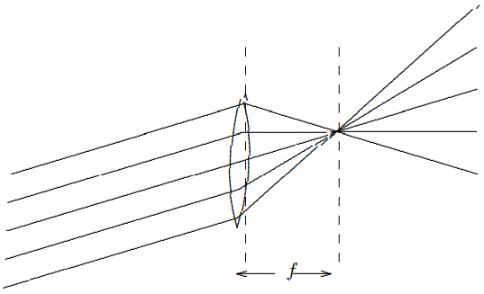
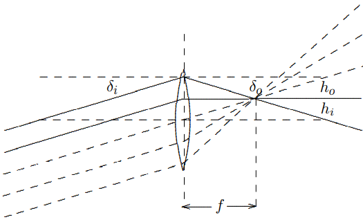
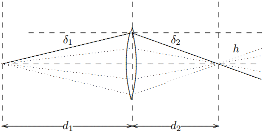
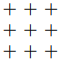
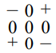
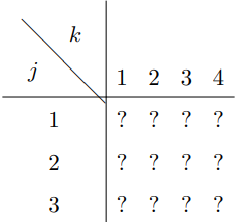
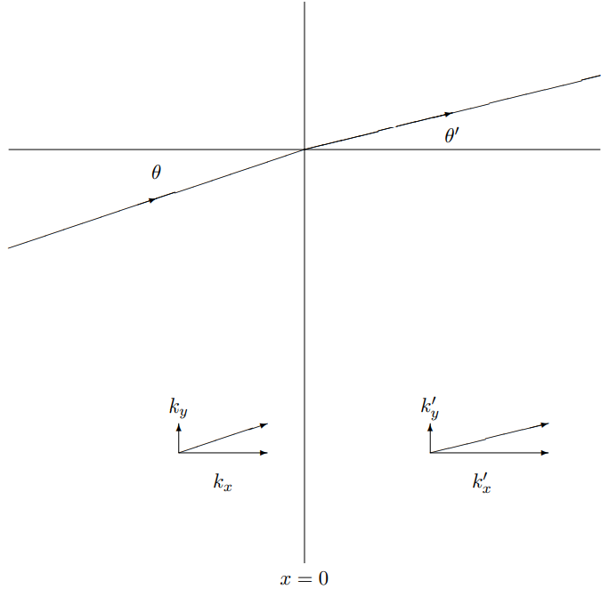
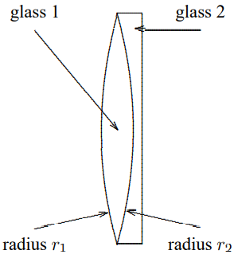
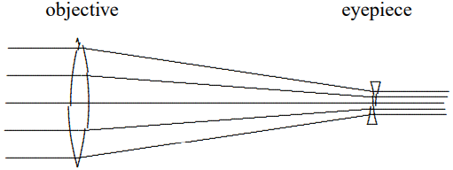

(ch-11)=

# 11. Two and Three Dimensions

## 11.1: The k Vector

Consider the two-dimensional beaded mesh, a two-dimensional analog of the beaded string, shown in [Figure 11.1](#fig-11-1). All the beads have mass $m$. The tension of the horizontal (vertical) strings is $T_{H}$ $(T_{V})$ and the interbead distance is $a_{H}$ $(a_{V})$. There is no damping. We can label the beads by a pair of integers ($j$, $k$) indicating their horizontal and vertical positions as shown. Alternatively, we can label the beads by their positions in the $x$, $y$ plane according to 
$$
(x, y)=\left(j a_{H}, k a_{V}\right) . \tag{11.1} \label{eq-11-1}
$$

Thus, we can describe their small transverse (out of the plane of the paper, in the $z$ direction) oscillations either by a matrix $\psi_{j k}(t)$ or by a function 
$$
\psi(x, y, t) ; \quad 0 \leq x \leq 5 a_{H}, 0 \leq y \leq 4 a_{V} . \tag{11.2} \label{eq-11-2}
$$

We will use [11.2](#eq-11-2) because we can then extend the discussion to continuous systems more easily. We are interested only in the transverse oscillations of this system, in which the blocks move up and down out of the plane of the paper, because these oscillations do not stretch the strings very much (only to second order in the small displacements). The other oscillations of such a system have much higher frequencies and are strongly damped, so they are not very interesting.

:::{figure} ../images/lt-33062-clipboard_e22843ed4f8139cd8cc4d964fcbab5153.png
:label: fig-11-1
:enumerator: 11.1
:alt: A two-dimensional beaded mesh.

A two-dimensional beaded mesh.
:::
As in the one-dimensional case, the first step is to remove the walls and consider the infinite system obtained by extending the interior in all directions. The oscillations of the resulting system can be described by a function $\psi(x, y, t)$, where $x$ and $y$ are not constrained.

This infinite system looks the same if it is translated by $a_{V}$ vertically, or by $a_{H}$ horizontally. We can write down solutions for the infinite system by using our discussion of the one-dimensional case twice. Because the system has translation invariance in the $x$ direction, we expect that we can find eigenstates of the $M^{−1}K$ matrix proportional to 
$$
e^{i k_{x} x} \tag{11.3} \label{eq-11-3}
$$

for any constant $k_{x}$. Because the system has translation invariance in the $y$ direction, we expect that we can find eigenstates of the $M^{−1}K$ matrix proportional to 
$$
e^{i k_{y} y} \tag{11.4} \label{eq-11-4}
$$

for any constant $k_{y}$. Putting [11.3](#eq-11-3) and [11.4](#eq-11-4) together, we expect that we can find eigenstates of the $M^{−1}K$ matrix that have the form 
$$
\psi(x, y)=A e^{i k_{x} x} e^{i k_{y} y}=A e^{i \vec{k} \cdot \vec{r}} \tag{11.5} \label{eq-11-5}
$$

where $\vec{k} \cdot \vec{r}$ is the two-dimensional dot product 
$$
\vec{k} \cdot \vec{r}=k_{x} x+k_{y} y . \tag{11.6} \label{eq-11-6}
$$

In other words, the wave number has become a vector.

As with the one-dimensional system, we can use [11.5](#eq-11-5) to determine the dispersion relation of the infinite system. Putting in the $t$ dependence, we have a displacement of the form 
$$
\psi(x, y, t)=A e^{i \vec{k} \cdot \vec{r}} e^{-i \omega t} . \tag{11.7} \label{eq-11-7}
$$

The analysis is precisely analogous to that for the one-dimensional beaded string, with the result that $\omega^{2}$ is simply a sum of vertical and horizontal contributions, each of which look like the dispersion relation for the one-dimensional case: 
$$
\omega^{2}=\frac{4 T_{H}}{m a_{H}} \sin ^{2} \frac{k_{x} a_{H}}{2}+\frac{4 T_{V}}{m a_{V}} \sin ^{2} \frac{k_{y} a_{V}}{2} . \tag{11.8} \label{eq-11-8}
$$

Equations [11.7](#eq-11-7) and [11.8](#eq-11-8) are the complete solution to the equations of motion for the infinite beaded mesh.

### Difference between One and Two Dimensions

11-1

So far, our analysis has been essentially the same in two dimensions as it was in one. The next step, though, is very different. In the one-dimensional case, where the normal modes are $e^{\pm i k x}$, there are only two modes with any given value of $\omega^{2}$. Thus, no matter what the boundary conditions are, we only have to worry about superposing two modes at a time. But in the two-dimensional case, there are a continuously infinite number of solutions to [11.8](#eq-11-8) for any $\omega$, because you can lower $k_{x}$ and compensate by raising $k_{y}$. Thus a normal mode of the finite two-dimensional system with no damping (which is just some solution in which all the beads oscillate in phase with the same $\omega$) may be a linear combination of an infinite number of the nice simple space translation invariant modes of the infinite system.

Sure enough, in general, the two-dimensional case is infinitely harder. If [Figure 11.1](#fig-11-1) were a system with a more complicated shape, we would not be able to find an analytic solution. But for the special case of a rectangular frame, aligned with the beads, the boundary conditions are not so bad, because both the modes, [11.5](#eq-11-5) and the boundary conditions can be simply expressed in terms of products of one-dimensional normal modes.

The boundary conditions for the system in [Figure 11.1](#fig-11-1) are; 
$$
\psi(0, y, t)=\psi\left(L_{H}, y, t\right)=\psi(x, 0, t)=\psi\left(x, L_{V}, t\right)=0 , \tag{11.9} \label{eq-11-9}
$$

where 
$$
L_{H}=5 a_{H}, \quad L_{V}=4 a_{V} . \tag{11.10} \label{eq-11-10}
$$

In the corresponding infinite system, a piece of which is shown in [Figure 11.2](#fig-11-2), [11.9](#eq-11-9) implies that the beads along the dotted rectangle are all at rest. Comparing [Figure 11.1](#fig-11-1) and [Figure 11.2](#fig-11-2), you can see that this boundary condition captures the physics of the walls in [Figure 11.1](#fig-11-1).

Now to find the normal modes of the finite system in [Figure 11.1](#fig-11-1), we must find linear combinations of modes of the infinite system that satisfy the boundary conditions, [11.9](#eq-11-9). We can satisfy [11.9](#eq-11-9) by forming linear combinations of just four modes of the infinite system:1 
$$
A e^{\pm i k_{x} x} e^{\pm i k_{y} y} \tag{11.11} \label{eq-11-11}
$$

where 
$$
k_{x}=n \pi / L_{H}, \quad k_{y}=n^{\prime} \pi / L_{V} . \tag{11.12} \label{eq-11-12}
$$

Then we can take the solutions to be a product of sines, 
$$
\begin{gathered}
\psi(x, y)=A \sin \left(n \pi x / L_{H}\right) \sin \left(n^{\prime} \pi y / L_{V}\right) \\
\text { for } n=1 \text { to } 4 \text { and } n^{\prime}=1 \text { to } 3 .
 \tag{11.13} \label{eq-11-13}
\end{gathered}
$$

:::{figure} ../images/lt-33063-clipboard_e83ed891665b6553ad1b1c48372e2ef86.png
:label: fig-11-2
:enumerator: 11.2
:alt: A piece of an infinite two-dimensional beaded mesh.

A piece of an infinite two-dimensional beaded mesh.
:::
The frequency of each mode is given by the dispersion relation [11.8](#eq-11-8): 
$$
\omega^{2}=\frac{4 T_{H}}{m a_{H}} \sin ^{2} \frac{n \pi a_{H}}{2 L_{H}}+\frac{4 T_{V}}{m a_{V}} \sin ^{2} \frac{n^{\prime} \pi a_{V}}{2 L_{V}} . \tag{11.14} \label{eq-11-14}
$$

These modes are animated in program 11-1.

The solution of this problem is an example of a technique called “separation of variables.” In the right variables, in this case, $x$ and $y$, the problem falls apart into one-dimensional problems. This trick works equally well in the continuous case, so long as the boundary surface is rectangular. If we take the limit in which $a_{V}$ and $a_{H}$ are very small compared to the wavelengths of interest, we can express [11.8](#eq-11-8) in terms of quantities that make sense in the continuum limit, just as in the analysis of the continuous one-dimensional string as the limit of the beaded string, in chapter 6. Assume, for simplicity, that 
$$
a_{V}=a_{H}=a \text { and } T_{V}=T_{H}=T \tag{11.15} \label{eq-11-15}
$$

(so that the $x$ and $y$ directions have the same properties). The quantities that characterize the surface in this case are the surface mass density, 
$$
\rho_{s}=\frac{m}{a^{2}} , \tag{11.16} \label{eq-11-16}
$$

and the surface tension, 
$$
T_{s}=\frac{T}{a} . \tag{11.17} \label{eq-11-17}
$$

The surface tension is the pull per unit transverse distance exerted by the membrane. When these quantities remain finite as the separation, $a$, goes to zero, [11.8](#eq-11-8) becomes 
$$
\omega^{2}=\frac{T_{s}}{\rho_{s}}\left(k_{x}^{2}+k_{y}^{2}\right)=\frac{T_{s}}{\rho_{s}}|\vec{k}|^{2} . \tag{11.18} \label{eq-11-18}
$$

An argument that is precisely analogous to that for the one-dimensional case shows that in this limit, $\psi(x, y, t)$ satisfies the two-dimensional wave equation, 
$$
\frac{\partial^{2}}{\partial t^{2}} \psi(x, y, t)=v^{2}\left(\frac{\partial^{2}}{\partial x^{2}}+\frac{\partial^{2}}{\partial y^{2}}\right) \psi(x, y, t)=v^{2} \vec{\nabla}^{2} \psi(x, y, t) . \tag{11.19} \label{eq-11-19}
$$

Note that in this limit, the special properties of the $x$ and $y$ axes that were manifest in the finite system have completely disappeared from the equation of motion. The wave numbers $k_{x}$ and $k_{y}$ form a two-dimensional vector $\vec{k}$. The infinite number of solutions to the dispersion relation [11.18](#eq-11-18) are just those obtained by rotating $\vec{k}$ in all possible ways without changing its length. This makes it possible to solve for the normal modes in circular regions, for example. But we will not discuss these more complicated boundary conditions now. It is clear, however, that [11.13](#eq-11-13) is the solution for the rectangular region in the continuous case, and that the corresponding frequency is 
$$
\omega^{2}=\frac{T_{s}}{\rho_{s}}\left[\left(\frac{n \pi}{L_{H}}\right)^{2}+\left(\frac{n^{\prime} \pi}{L_{V}}\right)^{2}\right] . \tag{11.20} \label{eq-11-20}
$$

Now because the system is continuous, the integers $n$ and $n^{\prime}$ run from zero to infinity (though $n=n^{\prime}$ is not interesting), or until the continuum approximation breaks down.

### Three Dimensions

The beaded mesh cannot be extended to three dimensions because there is no transverse direction. But a system of masses connected by elastic rods can be three-dimensional, and indeed, this sort of system is a good model of an elastic solid. This system is rather complicated because each mass can move in all three directions. A two-dimensional version of this is illustrated in [Figure 11.3](#fig-11-3). This system is the same as [Figure 11.1](#fig-11-1) except that the strings have been replaced by light, elastic rods, so that system is in equilibrium even without the frame. Now we are interested in the oscillations of this system **in the plane of the paper.** Compared to [Figure 11.1](#fig-11-1), this system has twice as many degrees of freedom, because each block can move in both the $x$ and $y$ direction, while in [Figure 11.1](#fig-11-1), the blocks moved only

:::{figure} ../images/lt-33065-clipboard_ea7446d0106806389f70eed624d34522a.png
:label: fig-11-3
:enumerator: 11.3
:alt: A two-dimensional solid, with masses connected by elastic rods.

A two-dimensional solid, with masses connected by elastic rods.
:::
in the $z$ direction. This means that we cannot use space translation invariance alone, even to determine the modes of the infinite system.

For each value of $\vec{k}$, there will be four modes rather than the usual two. We would have to do some matrix analysis to see which combinations of $x$ and $y$ motion were actually the normal modes. We will not do this in general, but will discuss it briefly in the continuum limit, to remind you of some physics that is important for fields like geology.

Consider the continuous, infinite system obtained by taking the $a$’s very small in [Figure 11.3](#fig-11-3), with other quantities scaling appropriately. Consider a wave with wave number $\vec{k}$. The normal modes will have the form 
$$
\vec{A} e^{\pm \vec{k} \cdot \vec{r}} , \tag{11.21} \label{eq-11-21}
$$

for some vector $\vec{A}$ (in the three-dimensional case, $\vec{A}$ is a 3-vector, in our two-dimensional example, it is a 2-vector). If the system is rotation invariant, then there is no direction picked out by the physics except the direction of $\vec{k}$. Then the normal modes must be a longitudinal or “compressional” mode 
$$
\vec{A} \propto \vec{k} , \tag{11.22} \label{eq-11-22}
$$

and a transverse or “shear” mode 
$$
\vec{A} \perp \vec{k} . \tag{11.23} \label{eq-11-23}
$$

Each mode will have its own characteristic dispersion relation. In three dimensions, there will be two shear modes, because there are two perpendicular directions, and they will have the same dispersion relation, because one can be rotated into the other.

:::{figure} ../images/lt-33066-clipboard_e46092887a01eb8a4ab1b0a5894524bf3.png
:label: fig-11-4
:enumerator: 11.4
:alt: A two-dimensional system of beads and springs.

A two-dimensional system of beads and springs.
:::
### Sound Waves

In a liquid or a gas, there are no shear waves because there is no restoring force that keeps the system in a particular shape. The shear modes have zero frequency. If we replaced the rods in [Figure 11.3](#fig-11-3) with unstretched springs, we would get a system with the same property, shown in [Figure 11.4](#fig-11-4). Without the frame, this system would not be rigid. However, the compressional modes are still there. These are analogous to sound waves. For an approximately continuous system like air, we expect a dispersion relation of the form 
$$
\omega^{2}=v^{2} \vec{k}^{2} \tag{11.24} \label{eq-11-24}
$$

where $v$ is constant unless $k$ is too large. We have already calculated $v$, in [7.43](#eq-7-43), by considering one-dimensional oscillations. It is called the speed of sound because it is the speed of sound waves in an infinite or semi-infinite system.

We can describe the normal modes of a rectangular box full of air in terms of a function $P(x, y, z)$ that describes the gas pressure at the point $(x, y, z)$. The pressure or density of the compressional wave is related to the displacement $\vec{\psi}(x, y, z)$: 
$$
\vec{\psi} \propto \vec{\nabla} P, \quad P \propto-\vec{\nabla} \cdot \vec{\psi} . \tag{11.25} \label{eq-11-25}
$$

As in the two-dimensional system described above, we can use separation of variables and find a solution that is a product of functions of single variables. The only difference here is that the boundary conditions are different. Because of [11.25](#eq-11-25), which is the mathematical statement of the fact that gas is actually pushed from regions of high pressure to regions of low pressure, the pressure gradient perpendicular to the boundary must vanish. The gas at the boundary has nowhere to go. Thus the normal modes in a rectangular box, $0 \leq x \leq X$, $0 \leq y \leq Y$, $0 \leq z \leq Z$, have the form 
$$
P(x, y, z)=A \cos \left(n_{x} \pi x / X\right) \cos \left(n_{y} \pi y / Y\right) \cos \left(n_{z} \pi z / Z\right) \tag{11.26} \label{eq-11-26}
$$

with frequency 
$$
\omega^{2}=v^{2}\left(\left(\frac{n_{x} \pi}{X}\right)^{2}+\left(\frac{n_{y} \pi}{Y}\right)^{2}+\left(\frac{n_{z} \pi}{Z}\right)^{2}\right) . \tag{11.27} \label{eq-11-27}
$$

The trivial solution $n_{x} = n_{y} = n_{z} = 0$ represents stationary air. If any of the $n^{\prime}$s is nonzero, the mode is nontrivial.

___________________

1There is a symmetry at work here! The modes in which the $\vec{k}$ vector is lined up along the $x$ or $y$ axes are those that behave simply under reflections through the center of the rectangle.

## 11.2: Plane Boundaries

The easiest traveling waves to discuss in two and three dimensions are “plane waves,” solutions in the infinite system of the form 
$$
\psi(r, t)=A e^{i(\vec{k} \cdot \vec{r}-\omega t)} . \tag{11.28} \label{eq-11-28}
$$

This describes a wave traveling the direction of the wave-number vector, $\vec{k}$, with the phase velocity in the medium. The displacement (or whatever) is constant on planes of constant $\vec{k} \cdot \vec{r}$, which are perpendicular to the direction of motion, $\vec{k}$. We will study more complicated traveling waves soon, when we discuss diffraction. Then we will learn how to describe “beams” of light or sound or other waves that are the traveling waves with which we usually work. We will see how to describe them as superpositions of plane waves. For now, you can think of a plane wave as being something like the traveling wave you would encounter inside a wide, coherent beam, or very far from a small source of nearly monochromatic light, light with a definite frequency. That should be enough to give you a physical picture of the phenomena we discuss in this section.

We are most interested in waves such as light and sound. However, it is much easier to discuss the transverse oscillations of a two-dimensional membrane, and many of our examples will be in that system. There are two reasons. One is that a two-dimensional membrane is easier to picture on two-dimensional paper. The other reason is that the physics is very simple, so we can concentrate on the wave properties. We will try to point out where things get more complicated for other sorts of wave phenomena.

Consider two two-dimensional membranes stretched in the $z = 0$ plane, as shown in [Figure 11.5](#fig-11-5). For $x < 0$, suppose that the surface mass density is $\rho_{s}$ and surface tension $T_{s}$. For $x > 0$, suppose that the surface mass density is $\rho_{s}^{\prime}$ and surface tension $T_{s}^{\prime}$. This is a two-dimensional analog of the string system that we discussed at length in chapter 9. The boundary between the two membranes must supply a force (in this case, a constant force per unit length) in the $x$ direction to support the difference between the tensions, as in the system of [Figure 9.2](#fig-9-2). However, we will assume that whatever the mechanism is that supplies this force, it is massless, frictionless and infinitely flexible.

:::{figure} ../images/lt-33098-clipboard_e76d11ca4656f74fd5e87cd26cbc54b24.png
:label: fig-11-5
:enumerator: 11.5
:alt: A line of constant phase in a plane wave approaching a boundary.

A line of constant phase in a plane wave approaching a boundary.
:::
Now again, we can consider reflection of traveling waves. Thus, suppose that there is, in this membrane, a plane wave with amplitude $A$ and wave number $\vec{k}$ for $x < 0$, traveling in toward the boundary at $x = 0$. The condition that the wave is traveling toward the boundary can be written in terms of the components of $\vec{k}$ as 
$$
k_{x}>0 . \tag{11.29} \label{eq-11-29}
$$

We would like to know what waves are produced by this incoming wave because of reflection and transmission at the boundary, $x = 0$. On general grounds of space translation invariance, we expect the solution to have the form 
$$
\begin{aligned}
\psi(r, t)=A e^{i(\vec{k} \cdot \vec{r}-\omega t)}+\sum_{\alpha} R_{\alpha} A e^{i\left(\vec{k}_{\alpha} \cdot \vec{r}-\omega t\right)} & & \text { for } x \leq 0 \\
\psi(r, t)=\sum_{\beta} \tau_{\beta} A e^{i\left(\vec{k}_{\beta} \cdot \vec{r}-\omega t\right)} & & \text { for } x \geq 0
 \tag{11.30} \label{eq-11-30}
\end{aligned}
$$

$$
\vec{k}_{\alpha}^{2}=\omega^{2} \frac{\rho_{s}}{T_{s}} ; \quad \vec{k}_{\beta}^{2}=\omega^{2} \frac{\rho_{s}^{\prime}}{T_{s}^{\prime}} , \tag{11.31} \label{eq-11-31}
$$

and 
$$
k_{\alpha x}<0 \text { and } k_{\beta_{x}}>0 \text { for all } \alpha \text { and } \beta . \tag{11.32} \label{eq-11-32}
$$

The $\alpha$ and $\beta$ in [11.30](#eq-11-30) run over all the transmitted and reflected waves. We will show shortly that only one of each contributes for a plane boundary condition at $x = 0$, but [11.30](#eq-11-30) is completely general, following just from space translation invariance. Note that we have put in boundary conditions at $\pm \infty$ by requiring [11.29](#eq-11-29) and [11.32](#eq-11-32). Except for the incoming wave with amplitude $A$, all the other waves are moving away from the boundary. But we have not yet put in the boundary condition at $x = 0$.

### Snell’s Law — the Translation Invariant Boundary

 11-2

As far as we know from considerations of the physics at $\pm \infty$, the reflected and transmitted waves could be a complicated superposition of an infinite number of plane waves going in various directions away from the boundary. In fact, if the boundary were irregularly shaped, that is exactly what we would expect. It is the fact that the boundary, $x = 0$, is itself invariant under space translations in the $y$ directions that allows us to cut down the infinite number of parameters in [11.30](#eq-11-30) to only two. Because translations in the $y$ direction leave the whole system invariant, **including the boundary**, we can find solutions in which all the components have the same irreducible $y$ dependence. If the incoming wave is proportional to 
$$
e^{i k_{y} y} , \tag{11.33} \label{eq-11-33}
$$

then all the components of [11.30](#eq-11-30) must also be proportional to $e^{i k_{y} y}$. Otherwise there is no way to satisfy the boundary condition at $x = 0$ **for all** $y$. That means that 
$$
k_{\alpha y}=k_{y}, \quad k_{\beta_{y}}=k_{y} . \tag{11.34} \label{eq-11-34}
$$

But [11.34](#eq-11-34), together with [11.31](#eq-11-31) and [11.32](#eq-11-32), completely determines the wave vectors $\vec{k}_{\alpha}$ and $\vec{k}_{\beta}$. Then [11.30](#eq-11-30) becomes2 
$$
\begin{aligned}
\psi(r, t)=A e^{i \vec{k} \cdot \vec{r}-i \omega t}+R A e^{i \vec{k} \cdot \vec{r}-i \omega t} \equiv \psi_{-}(r, t) & & \text { for } x \leq 0 \\
\psi(r, t)=\tau A e^{i \vec{k}^{\prime} \cdot \vec{r}-i \omega t} \equiv \psi_{+}(r, t) & & \text { for } x \geq 0
 \tag{11.35} \label{eq-11-35}
\end{aligned}
$$

where 
$$
\tilde{k}_{y}=k_{y}, \quad k_{y}^{\prime}=k_{y} , \tag{11.36} \label{eq-11-36}
$$

and 
$$
\tilde{k}_{x}=-\sqrt{\omega^{2} / v^{2}-k_{y}^{2}}=-k_{x}, \quad k_{x}^{\prime}=\sqrt{\omega^{2} / v^{\prime 2}-k_{y}^{2}} , \tag{11.37} \label{eq-11-37}
$$

with 
$$
v=\sqrt{\frac{T_{s}}{\rho_{s}}}, \quad v^{\prime}=\sqrt{\frac{T_{s}^{\prime}}{\rho_{s}^{\prime}}} . \tag{11.38} \label{eq-11-38}
$$

The entertaining thing about [11.35](#eq-11-35)-[11.37](#eq-11-37) is that we know everything about the directions of the reflected and transmitted waves, even though we have not even mentioned the details of the physics at the boundary. To get the directions, we needed only the invariance under translations in the $y$ direction. The details of the physics of the boundary come in only when we want to calculate $R$ and $\tau$. The directions of the reflected and transmitted waves are the same for any system with a translation invariant boundary. Obviously, this argument works in three dimensions, as well. In fact, if we simply choose our coordinates so that the boundary is the $x = 0$ plane and the wave is traveling in the $x$-$y$ plane, then nothing depends on the $z$ coordinate and the analysis is exactly the same as above. For example, we can apply these arguments directly to electromagnetic waves. For electromagnetic waves in a transparent medium, because the phase velocity is $v_{\phi}=\omega / k$, the index of refraction,$n$, is proportional to $k$, 
$$
n=\frac{c}{v_{\varphi}}=k \frac{c}{\omega} . \tag{11.39} \label{eq-11-39}
$$

[11.36](#eq-11-36)-[11.37](#eq-11-37) shows that the reflected wave comes off at the same angle as the incoming wave because the only difference between the $k$ vectors of the incoming and reflected waves is a change of the sign of the $x$ component. Thus the angle of incidence equals the angle of reflection. This is the rule of “specular reflection.” From [11.36](#eq-11-36), we can also derive Snell’s law of refraction for the angle of the refracted wave. If $\theta$ is the angle that the incident wave makes with the perpendicular to the boundary, and $\theta^{\prime}$ is the corresponding angle for the transmitted wave, then [11.36](#eq-11-36) implies 
$$
k \sin \theta=k^{\prime} \sin \theta^{\prime} . \tag{11.40} \label{eq-11-40}
$$

For electromagnetic waves, we can rewrite this as 
$$
n \sin \theta=n^{\prime} \sin \theta^{\prime} . \tag{11.41} \label{eq-11-41}
$$

For example, when an electromagnetic wave in air encounters a flat glass surface at an angle $\theta$, $n^{\prime}>n$ in [11.41](#eq-11-41). The wave is refracted toward the perpendicular to the surface. This is illustrated in [Figure 11.6](#fig-11-6) for $n^{\prime}>n$.

:::{figure} ../images/lt-33100-clipboard_e5bad7c73951ecab6c57ae6f7a2717e0e.png
:label: fig-11-6
:enumerator: 11.6
:alt: Reflection and transmission from a boundary.

Reflection and transmission from a boundary.
:::
Let us now finish the solution for the membrane problem by solving for $R$ and $\tau$ in [11.35](#eq-11-35). To do this, we must finally discuss the boundary conditions in more detail. One is that the membrane is continuous, which from the form, [11.35](#eq-11-35), implies 
$$
\left.\psi_{-}(r, t)\right|_{x=0}=\left.\psi_{+}(r, t)\right|_{x=0} , \tag{11.42} \label{eq-11-42}
$$

or 
$$
1+R=\tau . \tag{11.43} \label{eq-11-43}
$$

The other is that the vertical force on any small length of the membrane is zero. The force on a small length, $d \ell$, of the boundary at the point, $(0, y, 0)$, from the membrane for $x < 0$ is given by 
$$
-\left.T_{s} d \ell \frac{\partial \psi_{-}(r, t)}{\partial x}\right|_{x=0} . \tag{11.44} \label{eq-11-44}
$$

This is analogous to the one-dimensional example illustrated in [Figure 8.6](#fig-8-6). The force of surface tension is perpendicular to the boundary, so for small displacements, only the slope of the displacement in the $x$ direction matters. The slope in the $y$ direction gives no contribution to the vertical force to first order in the displacement. Likewise, the force on a small length, $d \ell$, of the boundary at the point, $(0, y, 0)$, from the membrane for $x > 0$ is given by 
$$
\left.T_{s}^{\prime} d \ell \frac{\partial \psi_{+}(r, t)}{\partial x}\right|_{x=0} . \tag{11.45} \label{eq-11-45}
$$

Thus the other boundary condition is 
$$
\left.T_{s}^{\prime} d \ell \frac{\partial \psi_{+}(r, t)}{\partial x}\right|_{x=0}=\left.T_{s} d \ell \frac{\partial \psi_{-}(r, t)}{\partial x}\right|_{x=0} , \tag{11.46} \label{eq-11-46}
$$

or 
$$
T_{s}^{\prime} k_{x}^{\prime} \tau=T_{s} k_{x}(1-R) . \tag{11.47} \label{eq-11-47}
$$

Thus the solution is 
$$
\tau=\frac{2}{1+r}, \quad R=\frac{1-r}{1+r}, \tag{11.48} \label{eq-11-48}
$$

where 
$$
r=\frac{T_{s}^{\prime} k_{x}^{\prime}}{T_{s} k_{x}} . \tag{11.49} \label{eq-11-49}
$$

You can see from [11.48](#eq-11-48) and [11.49](#eq-11-49) that we can adjust the surface tension to make the reflected wave go away even when there is a change in the length of the $\vec{k}$ vector from one side of the boundary to the other. It is useful to think about refraction in this limit, because it will allow us to visualize it in a simple way. If $r = 1$ in [11.48](#eq-11-48), then $R = 0$ and $\tau=1$. There is no reflected wave and the transmitted wave has the same amplitude as the incoming wave. Thus in each region, there is a single plane wave. Remember that a plane wave consists of infinite lines of constant phase perpendicular to the $\vec{k}$ vector, moving in the direction of the $k$ vector with the phase velocity, $v_{\varphi}=\omega /|\vec{k}|$. In particular, suppose we look at lines on which the phase is zero, so that $\psi=A$. The perpendicular distance between two such lines is the wavelength, $2 \pi /|\vec{k}|$, because the phase difference between neighboring lines is $2 \pi$. But here is the point. The lines in the two regions must meet at the boundary, $x = 0$, to satisfy the boundary condition, [11.43](#eq-11-43). If the incoming wave amplitude is 1 at $x = 0$, the outgoing wave amplitude is also 1. The lines where $\psi=A$ are continuous across the boundary, $x = 0$. This situation is illustrated in [Figure 11.7](#fig-11-7). The $\vec{k}$ vectors in the two regions are shown. Notice that the angle of the lines must change when the distance between them changes in order to maintain continuity at the boundary. In program 11-2, the same system is shown in motion.

:::{figure} ../images/lt-33102-clipboard_ec4b1d238b691607c9b07eda2e3731165.png
:label: fig-11-7
:enumerator: 11.7
:alt: Lines of constant \psi=1 for a system with refraction but no reflection.

Lines of constant $\psi=1$ for a system with refraction but no reflection.
:::
### Prisms

The nontrivial index of refraction of glass is the building block of many optical elements. Let us discuss the prism. In fact, to do the problem of the scattering of light waves by prisms entirely correctly would require much more sophisticated techniques than we have at our disposal at the moment. The reason is that the prism is not an infinite, flat surface with space translation invariance. In general, we would have to worry about the boundary. However, we can say interesting things even if we ignore this complication. The idea is to think not of an infinite plane wave, but of a wide beam of light incident on a face of the prism. A wide beam behaves very much like a plane wave, and we will ignore the difference in this chapter. We will see what the differences are in Chapter 13 when we discuss diffraction.

:::{figure} ../images/lt-33103-clipboard_ea15c18ae6b95b63a5110781d6712af69.png
:label: fig-11-8
:enumerator: 11.8
:alt: The geometry of a prism.

The geometry of a prism.
:::
Thus we consider the following situation, in which a wide beam of light enters one face of a prism with index of refraction $n$ and exits the other face. The geometry is shown in [Figure 11.8](#fig-11-8) (the directions of the beams are indicated by the thick lines). The interesting quantity is $\delta$. This describes how much the direction of the outgoing beam has been deflected from the direction of the incoming beam by the prism. We can calculate it using simple geometry and Snell’s law, [11.40](#eq-11-40). From Snell’s law 
$$
\sin \theta_{\text {in }}=n \sin \theta_{1} \tag{11.50} \label{eq-11-50}
$$

and 
$$
\sin \theta_{\text {out }}=n \sin \theta_{2} . \tag{11.51} \label{eq-11-51}
$$

Now for some geometry. 
$$
\theta_{2}+\theta_{1}=\phi^{\prime} \tag{11.52} \label{eq-11-52}
$$

— because the complement of $\phi^{\prime}$, $\pi-\phi^{\prime}$, along with $\theta^{1}$ and $\theta^{2}$ are the angles of a triangle, and thus add to $\pi$. 
$$
\phi=\phi^{\prime} \tag{11.53} \label{eq-11-53}
$$

— because $\phi$ and $\phi^{\prime}$ are corresponding angles of the two similar right triangles with other acute angle $\gamma$. Thus 
$$
\delta=\xi_{1}+\xi_{2}=\theta_{\mathrm{in}}+\theta_{\mathrm{out}}-\theta_{1}-\theta_{2}=\theta_{\mathrm{in}}+\theta_{\mathrm{out}}-\phi \tag{11.54} \label{eq-11-54}
$$

where we have used [11.52](#eq-11-52) and [11.53](#eq-11-53). But for small angles, from [11.50](#eq-11-50) and [11.51](#eq-11-51), 
$$
\theta_{\mathrm{in}} \approx n \theta_{1}, \quad \theta_{\mathrm{out}} \approx n \theta_{2} . \tag{11.55} \label{eq-11-55}
$$

Thus 
$$
\delta \approx n\left(\theta_{1}+\theta_{2}\right)-\phi \approx(n-1) \phi . \tag{11.56} \label{eq-11-56}
$$

The result, [11.56](#eq-11-56), is certainly reasonable. It must vanish when $n \rightarrow 1$, because there is no boundary for $n = 1$. If things are small and the answer is linear, it must be proportional to $\phi$.

One of the most familiar characteristics of a prism results from the dependence of the index of refraction, $n$, on frequency. This causes a beam of white light to break up into colors. For most materials, the index of refraction increases with frequency, so that blue light is deflected more than red light by the prism. The physics of the frequency dependence of $n$ is that of forced oscillation. The index of refraction of a material is related to the dielectric constant (see [9.53](#eq-9-53)), that in turn is related to the distortion of the electronic structure of the material caused by the electric field. For a varying field, this depends on the amplitude of the motion of bound charges within the material in an electric field. Because these charges are bound, they respond to the oscillating fields in an electromagnetic wave like a mass on a spring subject to an oscillating force. We know from our studies of forced oscillation that this amplitude has the form 
$$
\sum_{\underset{\alpha}{ }^{\text {resonances }}} \frac{C_{\alpha}}{\omega_{\alpha}^{2}-\omega^{2}} , \tag{11.57} \label{eq-11-57}
$$

where $\omega_{\alpha}$ are the resonant frequencies of the system and the $C_{\alpha}$ are constants depending on the details of how the force acts on the degrees of freedom. We can estimate the order of magnitude of these resonant frequencies with dimensional analysis, if we remember that any material consists of electrons and nuclei held together by electrical forces (and quantum mechanics, of course, but $\hbar$ will not enter into our estimate except implicitly, in the typical atomic distance). The relevant quantities are3 
$$
\begin{aligned}
&\text { The charge of the proton } e \approx 1.6 \times 10^{-19} \mathrm{C}\\
&\text { The mass of the electron } m_{e} \approx 9.11 \times 10^{-31} \mathrm{~kg}\\
&\text { Typical atomic distance } \quad a \approx 10^{-10} \mathrm{~m}=1\,\text{Å}\\
&\text { The speed of light } \quad c=299,792,458 \mathrm{~m} / \mathrm{s}
 \tag{11.58} \label{eq-11-58}
\end{aligned}
$$

In terms of these parameters, we would guess that the typical force inside the materials is of $\frac{e^{2}}{4 \pi \epsilon 0 a^{2}}$ (from Coulomb’s law), and thus that the spring constant is of order $\frac{e^{2}}{4 \pi \epsilon_{0} a^{3}}$ (the typical force over the typical distance). Thus we expect 
$$
\omega_{\alpha}^{2} \approx \sqrt{\frac{e^{2}}{4 \pi \epsilon_{0} a^{3} m_{e}}} \tag{11.59} \label{eq-11-59}
$$

and 
$$
\lambda_{\alpha} \approx \frac{2 \pi c}{\omega_{\alpha}} \approx 2 \pi c \sqrt{\frac{4 \pi \epsilon_{0} a^{3} m_{e}}{e^{2}}} \approx 10^{-7} \mathrm{~m}=1000\,\text{Å}. \tag{11.60} \label{eq-11-60}
$$

This is a wavelength in the ultraviolet region of the electromagnetic spectrum, shorter than that of visible light. That means that for visible light, $\omega<\omega_{\alpha}$, and thus the displacement, [11.57](#eq-11-57), increases as $\omega$ increases for visible light. The distortion of the electronic structure of the material caused by a varying electric field increases as the frequency increases in the visible spectrum. Thus the dielectric constant of the material increases with frequency. Thus blue light is deflected more.

Incidentally, this is the same reason that the sky is blue. Blue light is scattered more than red light because its frequency is closer to the important resonances of the air molecules.

### Total Internal Reflection

The situation in which the wave comes from a region of large $|\vec{k}|$ into a region of smaller $|\vec{k}|$ has another feature that is surprising and very useful. This situation is depicted in [Figure 11.9](#fig-11-9) for a system with no reflection. For small, $\theta$, as shown in [Figure 11.9](#fig-11-9), this looks rather

:::{figure} ../images/lt-33104-clipboard_ef5c3cb7a6613e4021bb299de6ec8cfc5.png
:label: fig-11-9
:enumerator: 11.9
:alt: Lines of constant \psi=1 for n^{\prime} < n.

Lines of constant $\psi=1$ for $n^{\prime} < n$.
:::
like [Figure 11.7](#fig-11-7), except that the wave is refracted away from the perpendicular to the surface instead of toward it. But suppose that the angle $\theta$ is large, satisfying 
$$
n \sin \theta / n^{\prime}>1 . \tag{11.61} \label{eq-11-61}
$$

Then there is no solution for real $\theta^{\prime}$ in [11.41](#eq-11-41). Thus there can be no transmitted traveling wave. The incoming wave must be totally reflected by the boundary. This is total internal reflection. It happens when a plane wave tries to escape from a region of high $|\vec{k}|$ to a region of lower $|\vec{k}|$ at a grazing angle. It is extensively used in optical equipment and many other things. Let us investigate this peculiar phenomenon in more detail.

Suppose we start from $\theta = 0$ and increase $\theta$. As $\theta$ increases, $k_{y}$ increases and $k_{x}$ decreases. This continues until we get to the boundary of total internal reflection, called the critical angle, 
$$
\sin \theta=\sin \theta_{c} \equiv \frac{n^{\prime}}{n} . \tag{11.62} \label{eq-11-62}
$$

The amplitudes for both the reflected and transmitted waves in [11.48](#eq-11-48) also increase. At the critical angle, $k_{x}$ vanishes. The amplitude for the reflected wave is 1 and the amplitude for the transmitted wave is 2. However, even though the transmitted wave is nonzero, no energy is carried away from the boundary because the $\vec{k}$ vector points in the $y$ direction. As $\theta$ increases beyond the critical angle, $k_{y}$ continues to increase. To satisfy the dispersion relation, 
$$
\omega^{2}=v^{\prime 2}\left(k_{x}^{2}+k_{y}^{2}\right) , \tag{11.63} \label{eq-11-63}
$$

$k_{x}$ must be pure imaginary! The x dependence is then proportional to 
$$
e^{-\kappa x} \text { where } \kappa=\operatorname{Im} k_{x} . \tag{11.64} \label{eq-11-64}
$$

Now the nature of the boundary condition at infinity changes. We can no longer require simply that $k_{x} > 0$. Instead, we must require 
$$
\operatorname{Im} k_{x}>0 . \tag{11.65} \label{eq-11-65}
$$

The sign is important. If $\operatorname{Im} k_{x}$ were negative, the amplitude of the wave for $x > 0$ would increase with $x$, going exponentially to infinity as $x \rightarrow \infty$. This doesn’t make much physical sense because it corresponds to a finite cause (the incoming wave for $x < 0$) producing an infinite effect. As we will see below, we can also come to this conclusion by going to this infinite system as a limit of a finite system.

We actually have three different boundary conditions at infinity for this situation: 
$$
\begin{gathered}
\operatorname{Re} k_{x}>0 \text { for } \theta<\theta_{c} , \\
k_{x}=0 \text { for } \theta=\theta_{c} , \\
\operatorname{Im} k_{x}>0 \text { for } \theta>\theta_{c} .
 \tag{11.66} \label{eq-11-66}
\end{gathered}
$$

These three can be combined into a compound condition that is valid in all regions: 
$$
\operatorname{Re} k_{x} \geq 0, \quad \operatorname{Im} k_{x} \geq 0 . \tag{11.67} \label{eq-11-67}
$$

The condition, [11.67](#eq-11-67), is actually the most general statement of the outgoing traveling wave boundary condition at infinity. It is also correct in situations in which there is damping and both the real and imaginary parts of $k_{x}$ are nonzero. This is the mathematical statement of the physical fact that the wave for $x > 0$, whatever its form, is produced at the boundary by the incoming wave.

From [11.48](#eq-11-48) and [11.49](#eq-11-49), you see that for $\theta>\theta_{c}$, the amplitude of the reflected wave becomes complex. However, its absolute value is still 1. All the energy of the incoming wave is reflected.

We have seen that in total internal reflections, the wave does penetrate into the forbidden region, but the $x$ dependence is in the form of an exponential standing wave, not a traveling wave. The $y$ dependence is that of a traveling wave. This is one of many situations in which the physics forces the nature of the two- or three-dimensional solution to have different properties in different directions.

It is easy to see total internal reflection in a fish-tank, a glass block, or some other rectangular transparent object with an index of refraction significantly greater than 1. You can look through one face of the rectangle and see the silvery reflection from an adjacent face, as illustrated in [Figure 11.10](#fig-11-10).

:::{figure} ../images/lt-33105-clipboard_e9ce980f6e3a53ea37f1b9c4e47ee6058.png
:label: fig-11-10
:enumerator: 11.10
:alt: Total internal reflection in glass with index of refraction 2.

Total internal reflection in glass with index of refraction 2.
:::
### Tunneling

Consider the scattering of a plane wave in the system illustrated in [Figure 11.11](#fig-11-11). This is the same setup as in [Figure 11.10](#fig-11-10), except that another block of glass has been added a small distance, $d$, below the boundary from which there was total internal reflection. We have defined the positive $x$ direction to be downwards for consistency with the discussion of Snell’s law, above. Now does any of the light get through to the observer below, or is the light still totally reflected at the boundary, as in [Figure 11.10](#fig-11-10)? The answer is that some light gets through. As we will see in detail in an example below, the presence of the other block of glass means that instead of a boundary condition at infinity, we have a boundary condition at the finite distance, $d$.

The details of this phenomenon for electromagnetic waves are somewhat complicated by polarization, which we will discuss in detail in the next chapter. However, there is a precisely analogous process in the transverse oscillation of membranes that we can analyze easily

:::{figure} ../images/lt-33106-clipboard_ec1ff69d9c94bfb7eda1894fe21c7caf2.png
:label: fig-11-11
:enumerator: 11.11
:alt: A simple experiment to demonstrate tunneling.

A simple experiment to demonstrate tunneling.
:::
In fact, we will find that we have already analyzed it in chapter 9. Consider the scattering problem illustrated in [Figure 11.12](#fig-11-12). The unshaded region is a membrane with lower density. The arrows indicate the directions of the $\vec{k}$ vectors of the plane waves. The shaded regions

:::{figure} ../images/lt-33107-clipboard_ed1e83e8f3a7615ab3a296e60156b3151.png
:label: fig-11-12
:enumerator: 11.12
:alt: Tunneling in an infinite membrane.

Tunneling in an infinite membrane.
:::
have surface mass density $\rho_{s}$ and surface tension $T_{s}$. The unshaded region, which extends from $x = 0$ to $x = d$, has the same surface tension but surface mass density $\rho_{s} / 4$. Thus the ratio of phase velocities in the two regions is two, the same as the ratio from air to glass in [Figure 11.11](#fig-11-11). The dashed lines are massless boundaries between the different membranes.

We can now ask what are the coefficients, $R$ and $\tau$, for reflection and transmission. We have done this problem for a single boundary earlier in this chapter in [11.42](#eq-11-42)-[11.49](#eq-11-49). We could solve this one by putting two of these solutions together using the transfer matrix techniques of chapter 9. In fact, we do not even have to do that, because we can read off the result from [9.97](#eq-9-97) and [9.98](#eq-9-98) in the discussion of thin films in chapter 9. The point is that all the terms in our solution must have the same irreducible $y$ dependence, $e^{i k_{y} y}$, because of the space translation invariance of the whole system including the boundary in the $y$ direction. This common factor plays no role in the boundary conditions. If we factor it out, what is left looks like a one-dimensional scattering problem. Comparing [11.47](#eq-11-47) for $T_{s}=T_{s}^{\prime}$ [9.10](#eq-9-10), you can see that the analyses become the same if we make the replacements 
$$
\begin{aligned}
k_{1} & \rightarrow k_{x} \\
k_{2} & \rightarrow k_{x}^{\prime} \\
L & \rightarrow d
 \tag{11.68} \label{eq-11-68}
\end{aligned}
$$

where $k_{x}$ is the $x$ component of the $\vec{k}$ vector of the incoming wave in the shaded region and $k_{x}^{\prime}$ is the $x$ component of the $\vec{k}$ vector of the transmitted wave in the unshaded region. The result is 
$$
\tau=\left(\cos k_{x}^{\prime} d-i \frac{k_{x}^{2}+k_{x}^{\prime 2}}{2 k_{x} k_{x}^{\prime}} \sin k_{x}^{\prime} d\right)^{-1} e^{-i k_{x} d} \tag{11.69} \label{eq-11-69}
$$

and 
$$
R=\left(i \frac{k_{x}^{2}-k_{x}^{\prime 2}}{2 k_{x} k_{x}^{\prime}} \sin k_{x}^{\prime} d\right)\left(\cos k_{x}^{\prime} d-i \frac{k_{x}^{2}+k_{x}^{\prime 2}}{2 k_{x} k_{x}^{\prime}} \sin k_{x}^{\prime} d\right)^{-1} . \tag{11.70} \label{eq-11-70}
$$

It may be a little easier to look at the intensity of the transmitted wave, which is proportional to 
$$
|\tau|^{2}=\frac{2 k_{x}^{2} k_{x}^{2}}{\left(k_{x}^{4}+k_{x}^{\prime 4}\right) \sin ^{2} k_{x}^{\prime} d+2 k_{x}^{2} k_{x}^{\prime 2}} . \tag{11.71} \label{eq-11-71}
$$

Note that we have not mentioned the critical angle or total internal reflection or anything like that. The reason is that our analysis in chapter 9 was perfectly general. It remains correct even if the angular wave number in the middle region becomes imaginary. All that happens for $\theta$ larger than the critical angle, $\theta_{c}$, is that $k_{x}^{\prime}$ becomes imaginary. But this has a spectacular effect in [11.71](#eq-11-71). If $k_{x}^{\prime} \rightarrow i \kappa$, where $\kappa$ is real, then it follows from the Euler identity, [1.57](#eq-1-57) x and [1.62](#eq-1-62), that 
$$
\sin k_{x}^{\prime} d \rightarrow i \sinh \kappa d , \tag{11.72} \label{eq-11-72}
$$

where $\sinh$ is the “hyperbolic sine”, defined by 
$$
\sinh x \equiv \frac{e^{x}-e^{-x}}{2} . \tag{11.73} \label{eq-11-73}
$$

Thus for angles above the critical angle, the denominator of [11.71](#eq-11-71) is an exponentially increasing function of $d$ (the $e^{\kappa d}$ term in [11.73](#eq-11-73) dominates for large $\kappa d$). The intensity of the transmitted wave therefore **decreases exponentially with** $d$. In the limit of large $d$, we quickly recover total internal reflection.

We can get some insight about what is happening by looking at the boundary conditions at $x = d$ for angles above the critical angle. For $x > d$, the wave has the form (suppressing the common factors of $e^{i k_{y} y}$ and $A e^{-i \omega t}$) 
$$
\tau e^{i k_{x} x} . \tag{11.74} \label{eq-11-74}
$$

For $0 \leq x \leq d$, the wave has the form 
$$
T_{I I} e^{-\kappa x}+R_{I I} e^{\kappa x} , \tag{11.75} \label{eq-11-75}
$$

where I have called the coefficients $T_{I I}$ and $R_{I I}$ by analogy with transmitted and reflected waves, even though these are not traveling waves. The boundary conditions at $x = d$ are 
$$
\begin{gathered}
\tau e^{i k_{x} d}=T_{I I} e^{-\kappa d}+R_{I I} e^{\kappa d} , \\
i k_{x} \tau e^{i k_{x} d}=\kappa\left(-T_{I I} e^{-\kappa d}+R_{I I} e^{\kappa d}\right) .
 \tag{11.76} \label{eq-11-76}
\end{gathered}
$$

This looks more complicated than it really is. If we solve for $T_{I I} e^{-\kappa d}$ and $R_{I I} e^{\kappa d}$ in terms of $\tau e^{i k_{x} d}$, the result is 
$$
T_{I I} c^{-\kappa d}=\frac{2 \kappa}{\kappa-i k_{x}} \tau c^{i k_{x} d}, \quad R_{I I} e^{\kappa d}=\frac{2 \kappa}{\kappa+i k_{x}} \tau c^{i k_{x} d} . \tag{11.77} \label{eq-11-77}
$$

The important point is that the values of the two components of the wave, [11.75](#eq-11-75), at $x = d$, $T_{I I} e^{-\kappa d}$ and $R_{I I} e^{-\kappa d}$, are more or less the same size. These two quantities do not have any exponential dependence on $d$. **This qualitative fact does not depend on the details of [11.76](#eq-11-76). It will be true for any reasonable boundary condition at** $x = d$**.**

Thus the coefficient, $R_{I I}$ of the “reflected” wave (in quotes because it is a real exponential wave, not a traveling wave) must be smaller than the “transmitted” wave by a factor of roughly $e^{2 \kappa d}$. Notice that this justifies the statement, [11.67](#eq-11-67), of the boundary condition at infinity. As $d \rightarrow \infty$, for any reasonable physics at $d$, the wave becomes a pure negative exponential.

At $x = 0$, for large $\kappa d$, the $R_{I I}$ term in wave will be completely negligible, and $T_{I I}$ term will be produced with some coefficient of order 1, just as in the limit of total internal reflection.

Thus what is happening in the boundary conditions for tunneling can be described qualitatively as follows. The incoming wave for $x < 0$ produces the $e^{-\kappa x}$ term in the region $0 \leq x \leq d$, with an exponentially small admixture of $e^{\kappa x}$. But at $x = d$, the two parts of the exponential wave are of the same size (both exponentially small), and they can produce the transmitted wave.

The rapid exponential dependence of the transmitted wave on $d$ has some interesting consequences. It implies, for example, that the reflected wave is also very sensitive to the value of $d$, for small $d$ (energy conservation implies $|R|^{2}+|\tau|^{2}=1$). You can see this rapid dependence in the example of [11.10](#eq-11-10) by putting your finger on the bottom surface of the glass block or fish tank, where the wave is being reflected. You will see a ghostly fingerprint! The reason is that the tiny indentations on your finger are far enough away from the glass that $\kappa d$ is large and the wave is almost entirely reflected. But where the flesh is pressed tightly against the glass, the wave is absorbed. This is a simple version of a tunneling microscope.

Finally, before leaving the subject of tunneling, let us consider what happens when we turn down the intensity of the light wave in [Figure 11.11](#fig-11-11) so that we see the scattering of individual photons. The first thing to note is that each photon is either transmitted or reflected. The meaning of $R$ and $\tau$ in this case is that the $|R|^{2}$ and $|\tau|^{2}$ are the **probabilities** of reflection and transmission. You cannot predict whether any particular photon will get through. In the quantum mechanical world, you can predict only the probabilities.

The second thing to note is that in the particle description, the whole phenomenon of tunneling is very peculiar. A classical photon, coming at the boundary of the glass plate at more than the critical angle could not enter at all into the air. It would be forbidden to do so by conservation of energy and conservation of the $y$ component of momentum.[^11-2-4] How can the particle get through to the $x > d$ side if it cannot exist for $0 < x < d$? Obviously, in classical physics, it cannot. Tunneling is, therefore, a truly quantum mechanical phenomenon. The wave manages to penetrate into the forbidden region, but only in the form of a real exponential wave, not a traveling wave. It is only for $x < 0$ and $x > d$, where the waves are traveling, that they can be interpreted as particles in anything like the classical sense.

__________________

2We have defined $\psi_{\pm}$ here to make it easier to discuss the boundary conditions, below.

3Note that it is the mass of the electron rather than the mass of the proton that is relevant, because the electrons move much more in electric fields.

[^11-2-4]: The boundary does not change $p_{y}$ of the photon, because of the translation invariance in the $y$ direction. However, there is no reason why the boundary cannot exert a force in the $x$ direction and change $p_{x}$ of the photon.

## 11.3: Chladni Plates

:::{figure} ../images/lt-33108-clipboard_e343e3fa49e1db73854698d88c158f36b.png
:label: fig-11-13
:enumerator: 11.13
:alt: A Chladni plate.

A Chladni plate.
:::
Chladni plates are a very pretty and instructive example of a two-dimensional oscillating system. A Chladni plate is simply a square metal plate that is driven transversely at its center. It is illustrated in [Figure 11.13](#fig-11-13). The dot in the center shows where the plate is driven in the transverse direction (out of the plane of the paper). The center, which we will take to have equilibrium position $\vec{r} = 0$, moves up and down out of the plane of the paper at a frequency $\omega$. Let us assume that the square sits in the $x$-$y$ plane and has side $2L$, and call the transverse displacement (in the $z$ direction) 
$$
\psi(x, y, t) \quad \text { for } \quad|x|,|y| \leq L . \tag{11.78} \label{eq-11-78}
$$

In principle this is a forced oscillation problem. We could take the boundary condition at the origin to be 
$$
\psi(0,0, t)=A \cos \omega t \tag{11.79} \label{eq-11-79}
$$

and try to find $\psi$ everywhere else.

To find $\psi$, we must know the boundary condition at the edges of the plate. This depends on the details of the physics of the plate, because there are several ways that the plate can deform in response to the driving force. Just for simplicity, we will assume that the dominant deformation is shear, illustrated in [Figure 11.14](#fig-11-14). For this kind of displacement, to avoid an infinite acceleration, the slope of the plate must go to zero on the boundary in the direction perpendicular to the boundary, or in mathematics, 
$$
\hat{n} \cdot \vec{\nabla} \psi=0 \tag{11.80} \label{eq-11-80}
$$

on the edge, where $\hat{n}$ is a unit vector in the plane perpendicular to the edge. In this case, 
$$
\left.\frac{\partial}{\partial x} \psi(x, y, t)\right|_{x=|L|}=\left.\frac{\partial}{\partial y} \psi(x, y, t)\right|_{y=|L|}=0 . \tag{11.81} \label{eq-11-81}
$$

While the general case is more complicated than this, we will use [11.81](#eq-11-81) for illustration. The instructive thing about Chladni plates, as we will see, is not what is happening at the edges, but what is happening in the middle!

The general solution to this forced oscillation problem is not easy to write down. However, we are primarily interested in the resonances. Those are the modes of free oscillation of

:::{figure} ../images/lt-33109-clipboard_e0a2b4b3f8b72aa0adb87922d4adf4949.png
:label: fig-11-14
:enumerator: 11.14
:alt: Shear.

Shear.
:::
the plate (subject to the boundary condition [11.81](#eq-11-81)) that can be excited by the driving force. These will be those modes that have nonzero values of the displacement at the origin.

The relevant free oscillation modes of the plate have the form5 
$$
\psi_{\left(n_{x}, n_{y}\right)}(x, y, t)=A \cos \frac{n_{x} \pi x}{L} \cos \frac{n_{y} \pi y}{L} \cos \omega t \tag{11.82} \label{eq-11-82}
$$

with 
$$
\omega^{2}=\omega_{0}^{2}\left(\vec{k}^{2}\right) \Rightarrow \omega^{2}=f\left(n_{x}^{2}+n_{y}^{2}\right) . \tag{11.83} \label{eq-11-83}
$$

If the frequencies of these modes were unique, [11.82](#eq-11-82) would be the whole story. But the interesting thing about this system is that the symmetry guarantees that there is degeneracy — that is that if $n_{x} \neq n_{y}$, there are two modes with the same frequency. We can get a physically equivalent mode by interchanging $n_{x} \longleftrightarrow n_{y}$, because this just corresponds to a $90^{\circ}$ rotation of the plate, which doesn’t change the physics at all. When we have degenerate modes, then linear combinations of them are also modes, as shown in [3.117](#eq-3-117). Thus we have to ask **which linear combinations are excited by the driving force?** Another way of saying this is summarized in [11.83](#eq-11-83). Rotation invariance ensures that $\omega^{2}$ depends only on $n_{x}^{2}+n_{y}^{2}$.

In particular, it is clear that the difference 
$$
\psi_{\left(n_{x}, n_{y}\right)}^{-}(x, y, t)=A\left(\cos \frac{n_{x} \pi x}{L} \cos \frac{n_{y} \pi y}{L}-\cos \frac{n_{y} \pi x}{L} \cos \frac{n_{x} \pi y}{L}\right) \cos \omega t \tag{11.84} \label{eq-11-84}
$$

vanishes at the origin. **Only the sum couples to the driving force!**
$$
\psi_{\left(n_{x}, n_{y}\right)}^{+}(x, y, t)=A\left(\cos \frac{n_{x} \pi x}{L} \cos \frac{n_{y} \pi y}{L}+\cos \frac{n_{y} \pi x}{L} \cos \frac{n_{x} \pi y}{L}\right) \cos \omega t \tag{11.85} \label{eq-11-85}
$$

These are the resonant modes of a Chladni plate.

One reason that this is amusing is that it is easy to see. If you excite the plate, and sprinkle sand on it, the sand builds up in the regions where the plate is not moving — along the displacement nodes where $\psi=0$. Thus we can get a visual picture of the zeros of $\psi$. Let’s look at some of these modes (in order of increasing frequency) to see what to expect.

The mode $\psi_{(0,0)}^{+}$ is not interesting. It corresponds to the whole plate going up and down as a block. Obviously, the corresponding frequency is 0, because there is no restoring force. The first interesting mode is 
$$
\psi_{(1,0)}^{+}(x, y, t)=A\left(\cos \frac{\pi x}{L}+\cos \frac{\pi y}{L}\right) \cos \omega t . \tag{11.86} \label{eq-11-86}
$$

This vanishes for 
$$
y=\pm L \pm x \tag{11.87} \label{eq-11-87}
$$

so the Chladni sand pattern looks like the diagram in [Figure 11.15](#fig-11-15).

:::{figure} ../images/lt-33110-clipboard_e7782014a6a4e34048ca3f1cb71a93a9c.png
:label: fig-11-15
:enumerator: 11.15
:alt: The Chladni pattern for the mode \left(n_{x}, n_{y}\right)=(1,0).

The Chladni pattern for the mode $\left(n_{x}, n_{y}\right)=(1,0)$.
:::
The next mode is 
$$
\psi_{(1,1)}^{+}(x, y, t)=2 A \cos \frac{\pi x}{L} \cos \frac{\pi y}{L} \cos \omega t . \tag{11.88} \label{eq-11-88}
$$

Because this mode is not degenerate, it does not give rise to a very interesting pattern. It vanishes at 
$$
x=\pm \frac{L}{2} \quad \text { or } \quad y=\pm \frac{L}{2} , \tag{11.89} \label{eq-11-89}
$$

which gives the pattern shown in [Figure 11.16](#fig-11-16). We won’t consider any more of these boring modes with $n_{x} = n_{y}$.

The next mode is 
$$
\psi_{(2,0)}^{+}(x, y, t)=A\left(\cos \frac{2 \pi x}{L}+\cos \frac{2 \pi y}{L}\right) \cos \omega t , \tag{11.90} \label{eq-11-90}
$$

which vanishes for 
$$
y=\pm \frac{L}{2} \pm x \quad \text { or } \quad y=\pm \frac{3 L}{2} \pm x \tag{11.91} \label{eq-11-91}
$$

so the pattern looks like [Figure 11.17](#fig-11-17).

Next comes 
$$
\psi_{(2,1)}^{+}(x, y, t)=A\left(\cos \frac{\pi x}{L} \cos \frac{2 \pi y}{L}+\cos \frac{2 \pi x}{L} \cos \frac{\pi y}{L}\right) \cos \omega t . \tag{11.92} \label{eq-11-92}
$$

This vanishes for 
$$
\begin{gathered}
c_{x}\left(2 c_{y}^{2}-1\right)+c_{y}\left(2 c_{x}^{2}-1\right)=0 \\
=\left(c_{x}+c_{y}\right)\left(2 c_{x} c_{y}-1\right)=0
 \tag{11.93} \label{eq-11-93}
\end{gathered}
$$

:::{figure} ../images/lt-33111-clipboard_e20b8eb72e86ec697bc8dcb61da44415b.png
:label: fig-11-16
:enumerator: 11.16
:alt: The Chladni pattern for the mode (1,1).

The Chladni pattern for the mode (1,1).
:::
:::{figure} ../images/lt-33112-clipboard_e368f39d8edfa8b14501bfb496cee3132.png
:label: fig-11-17
:enumerator: 11.17
:alt: The Chladni pattern for the mode (2,0).

The Chladni pattern for the mode (2,0).
:::
with $c_{x} \equiv \cos (\pi x / L)$ and $c_{y} \equiv \cos (\pi y / L)$9. The pattern is shown in [figure 11.18](#fig-11-18).

We could go on, but you should have the idea by now. Let us look at one last mode: 
$$
\psi_{(3,1)}^{+}(x, y, t)=A\left(\cos \frac{\pi x}{L} \cos \frac{3 \pi y}{L}+\cos \frac{3 \pi x}{L} \cos \frac{\pi y}{L}\right) \cos \omega t , \tag{11.94} \label{eq-11-94}
$$

:::{figure} ../images/lt-33113-clipboard_eec182305e322fb3a22d6311e0129fe6c.png
:label: fig-11-18
:enumerator: 11.18
:alt: The Chladni pattern for the mode (2,1).

The Chladni pattern for the mode (2,1).
:::
vanishing for 
$$
\begin{gathered}
c_{x}\left(4 c_{y}^{3}-3 c_{y}\right)+c_{y}\left(4 c_{x}^{3}-c_{x}\right)=0 \\
-c_{x} c_{y}\left(4 c_{x}^{2}+4 c_{y}^{2}-6\right)-0
 \tag{11.95} \label{eq-11-95}
\end{gathered}
$$

with pattern shown in [figure 11.19](#fig-11-19).

:::{figure} ../images/lt-33114-clipboard_efe9c8dedc7cf206e1507264a13e037af.png
:label: fig-11-19
:enumerator: 11.19
:alt: The Chladni pattern for the mode (3,1).

The Chladni pattern for the mode (3,1).
:::
**Moral: When there is more than one mode with the same frequency, look at linear combinations to determine which are excited!**

_________________

5There are also modes proportional to sin (nx + 1/2)πx/L and/or sin (ny + 1/2)πy/L, but these vanish at the origin and are not excited by the driving force.

## 11.4: Waveguides

Generically, a “waveguide” is a device that forces a traveling wave to propagate only where you want it to go. Typically, a waveguide is some kind of tube that allows the wave disturbance to propagate in one direction while confining it in the other directions. In this section, we will discuss the case of straight wave guides with simple uniform cross sections. The really interesting physics occurs when the width of the waveguide is not much larger than the wavelength of the wave. Then, as we will see, the physics of the waveguide has a dramatic effect on the propagation of the wave.

The simplest situation to discuss is the case of transverse oscillations of a membrane in the form of an infinite strip, as shown in [Figure 11.20](#fig-11-20). Consider a membrane with surface

:::{figure} ../images/lt-33115-clipboard_ef9af3be1811c7fc090ff42a492c1ec97.png
:label: fig-11-20
:enumerator: 11.20
:alt: A section of an infinite strip of stretched membrane that acts as a waveguide.

A section of an infinite strip of stretched membrane that acts as a waveguide.
:::
mass density $\rho_{s}$ and surface tension $T_{s}$, stretched in an infinite strip in the $x$-$y$ plane between $y = 0$ and $y = \ell$ and from $x = -\infty$ to $\infty$. The edges, at $y = 0$ and $y = \ell$ are held fixed in the plane. We are interested in the oscillations of the interior of the strip up and down out of the plane.

This is a job for separation of variables. We can look for modes of this system which are products of a function of $x$ and a function of $y$. In particular, we can satisfy the boundary conditions at $y = 0$ by combining two modes of the infinite system, 
$$
e^{i k_{x} x} e^{i k_{y} y}, \text { and } e^{i k_{x} x} e^{-i k_{y} y} \tag{11.96} \label{eq-11-96}
$$

into 
$$
\sin \left(k_{y} y\right) e^{i k_{x} x} . \tag{11.97} \label{eq-11-97}
$$

Now this satisfies the boundary condition at $y = \ell$ if 
$$
k_{y}=\frac{n \pi}{\ell} \text { for } n=1 \text { to } \infty . \tag{11.98} \label{eq-11-98}
$$

Thus the modes look like this: 
$$
\psi_{n+}(x, y, t)=A \sin \frac{n \pi y}{\ell} e^{i\left(k_{x} x-\omega t\right)} , \tag{11.99} \label{eq-11-99}
$$

and 
$$
\psi_{n-}(x, y, t)=A \sin \frac{n \pi y}{\ell} e^{i\left(-k_{x} x-\omega t\right)} . \tag{11.100} \label{eq-11-100}
$$

For each value of $n$, these look like waves traveling in the $\text { 土x }$ direction!

The dispersion relation for the membrane is given by [11.18](#eq-11-18). But the modes, $\psi_{n \pm}$, have $\left|k_{y}\right|=\frac{n \pi}{\ell}$. Thus the dispersion relation for the traveling waves, [11.99](#eq-11-99) and [11.100](#eq-11-100) is 
$$
\omega^{2}=v^{2} k_{x}^{2}+\omega_{n}^{2} , \tag{11.101} \label{eq-11-101}
$$

where 
$$
v=\sqrt{\frac{T_{s}}{\rho_{s}}} \tag{11.102} \label{eq-11-102}
$$

and 
$$
\omega_{n}-\frac{n \pi v}{\ell} . \tag{11.103} \label{eq-11-103}
$$

One interesting thing about [11.101](#eq-11-101) is that the dispersion relation has a low frequency cut-off that depends on $n$. For any given $\omega$, the only modes that actually propagate are the finite number of modes with 
$$
n<\frac{\omega \ell}{\pi v} . \tag{11.104} \label{eq-11-104}
$$

For example, for $\omega \leq \pi v / \ell$, there are no traveling waves. For $\pi v / \ell<\omega \leq 2 \pi v / \ell$, there is only one, corresponding to $n = 1$, etc.

The modes satisfying [11.104](#eq-11-104) have a simple physical interpretation. They can be thought of as the plane waves, [11.96](#eq-11-96), of the infinite system, bouncing back and forth between the fixed edges, $y = 0$ and $y = \ell$. The requirement, [11.98](#eq-11-98), on the allowed values of $k_{y}$ arises because for other values of $k_{y}$, the reflected waves get out of phase, giving destructive interference. You might expect a zig-zag wave of this kind to propagate in the $x$ direction with a speed less than the phase velocity, $v$, of the waves in the infinite system by a factor of 
$$
\frac{k_{x}}{\sqrt{k_{x}^{2}+k_{y}^{2}}}=\frac{k_{x}}{\sqrt{k_{x}^{2}+\left(\omega_{n} / v\right)^{2}}} , \tag{11.105} \label{eq-11-105}
$$

because it has to go that much farther as it bounces back and forth to move a given distance in $x$, as illustrated in [Figure 11.21](#fig-11-21). In fact, the phase velocity of the zig-zag waves for fixed

:::{figure} ../images/lt-33116-clipboard_e900004bdf48ef43c631e7e9ae232ed3a.png
:label: fig-11-21
:enumerator: 11.21
:alt: A zig-zag wave in the waveguide.

A zig-zag wave in the waveguide.
:::
$n$, $\omega / k_{x}$, is actually **larger** than $v$ by the factor, [11.105](#eq-11-105), rather than smaller, 
$$
v_{n \phi}=\frac{\omega}{k_{x}}=v \frac{\sqrt{k_{x}^{2}+\left(\omega_{n} / v\right)^{2}}}{k_{x}} . \tag{11.106} \label{eq-11-106}
$$

However, the group velocity, $\partial \omega / \partial k_{x}$, of the zig-zag waves, the velocity with which you can actually send signals, is smaller by just the expected factor, 
$$
v_{g n}=\frac{\partial \omega}{\partial k_{x}}=v \frac{k_{x}}{\sqrt{k_{x}^{2}+\left(\omega_{n} / v\right)^{2}}} . \tag{11.107} \label{eq-11-107}
$$

For light waves, we can make a wave guide by making a tube of some conducting material, so that the electric field is nonzero only inside the tube. However, in this case, the details of the boundary conditions at the edges depend on the direction of the electric field. We will return to a related question in the next chapter.

## 11.5: Water

Water is pretty complicated stuff. It wets things. It has viscosity. It forms whirlpools and eddies and has nonlinear turbulent motions that we cannot hope to understand using the techniques that we have at our disposal. In this section, we consider a somewhat idealized fluid, that we will call “dry water” (after Feynman) that has none of this complicated structure. It has three features that we will keep in common with the real thing. It has mass density. It has surface tension, and it is nearly incompressible. Let’s see how it waves.

Imagine an infinite universe full of an incompressible, frictionless liquid. This will allow us to see the consequences of the incompressibility in a simple, qualitative way. Consider the analog of a plane sound wave in such a system. That is, for example, a plane wave traveling in the $x$ direction (with $k_{y} = k_{z} = 0$) with longitudinal displacements in the $x$ direction. If the liquid is truly incompressible, the $k_{x}$ must be zero for this wave, because any longitudinal displacement must be accompanied by compressions and rarefactions of the medium. Thus, for such a plane wave, $\vec{k} = 0$. **There are no nontrivial plane waves in the infinite system!** In general, we do not expect that all the components of the $k$ vector must vanish, because even in an incompressible liquid, displacement in one direction is allowed if it is accompanied by appropriate motion in other directions. But what we have seen is that we cannot have a mode that has a real $\vec{k}$ vector. That would be a plane wave, which we have seen is not compatible with incompressibility. Instead, we expect that the constraint $k_{x} = 0$ will be replaced by a constraint on the rotation invariant length of the $k$ vector, that $\vec{k} \cdot \vec{k}=0$. If some of the components of the $\vec{k}$ vector are imaginary, this can be satisfied for nonzero $\vec{k}$.

Note that the condition $\vec{k} \cdot \vec{k}=0$ is not exactly a dispersion relation, because it makes no reference to frequency. But it is the whole story for an infinite system of incompressible fluid. In fact, it is clear that there are no harmonic waves in the infinite system, because there is nothing to produce a restoring force. Even if there is a gravitational field, the pressure in the liquid just adjusts itself to cancel the effect of gravity. We can get a nontrivial dispersion relation only when there is a surface. The dispersion relation then depends on the physics of the surface. This would seem to violate our general principle that the dispersion relation is a property of the infinite system. What is happening is this. The relation, $\vec{k} \cdot \vec{k}=0$ is really the only dispersion relation that makes any sense for the three-dimensional infinite system. When we introduce a surface, we have **broken** the translation invariance in the direction normal to the surface. This allows us to get a nontrivial dispersion relation for the two-dimensional system parallel to the surface.

### Mathematics of Water Waves

Now let us try to make these considerations quantitative. As usual, we will label our fluid in terms of the equilibrium positions of its parts. Then call the displacement from equilibrium of the fluid that is at the point $\vec{r}$ at equilibrium 
$$
\epsilon \vec{\psi}(\vec{r}, t) \tag{11.108} \label{eq-11-108}
$$

for some small $\epsilon$. This means that the actual position of the water is[^11-5-6] 
$$
\vec{R}(\vec{r}, t)=\vec{r}+\epsilon \vec{\psi}(\vec{r}, t) . \tag{11.109} \label{eq-11-109}
$$

We can regard [11.109](#eq-11-109) as a kind of change of coordinates. It maps us from the equilibrium coordinates (a rather arbitrary label because the water is free to flow) to the physical coordinates that tell us where the water actually is. If the water is incompressible, which is a pretty good approximation, then a small volume element should have the same volume in equilibrium and in the physical coordinates. 
$$
d R_{x} d R_{y} d R_{z}=d x d y d z . \tag{11.110} \label{eq-11-110}
$$

This will be the case if the determinant of the Jacobian matrix equals 1: 
$$
\operatorname{det}\left(\begin{array}{ccc}
\frac{\partial R_{x}}{\partial x} & \frac{\partial R_{x}}{\partial y} & \frac{\partial R_{x}}{\partial z} \\
\frac{\partial R_{y}}{\partial x} & \frac{\partial R_{y}}{\partial y} & \frac{\partial R_{y}}{\partial z} \\
\frac{\partial R_{z}}{\partial x} & \frac{\partial R_{z}}{\partial y} & \frac{\partial R_{z}}{\partial z}
\end{array} \tag{11.111} \label{eq-11-111}\right)=1 .
$$

Because $\epsilon$ is small, we can expand [11.111](#eq-11-111) to lowest order in $\epsilon$, 
$$
\begin{gathered}
=\operatorname{det}\left(\begin{array}{ccc}
1+\epsilon \frac{\partial \psi_{x}}{\partial x} & \epsilon \frac{\partial \psi_{x}}{\partial y} & \epsilon \frac{\partial \psi_{x}}{\partial z} \\
\epsilon \frac{\partial \psi_{y}}{\partial x} & 1+\epsilon \frac{\partial \psi_{y}}{\partial y} & \epsilon \frac{\partial \psi_{y}}{\partial z} \\
\epsilon \frac{\partial \psi_{z}}{\partial x} & \epsilon \frac{\partial \psi_{z}}{\partial y} & 1+\epsilon \frac{\partial \psi_{z}}{\partial z}
\end{array}\right) \\
=1+\epsilon \vec{\nabla} \cdot \vec{\psi}+\mathcal{O}\left(\epsilon^{2}\right) .
 \tag{11.112} \label{eq-11-112}
\end{gathered}
$$

Thus 
$$
\vec{\nabla} \cdot \vec{\psi}=0 . \tag{11.113} \label{eq-11-113}
$$

[11.113](#eq-11-113) is very reasonable. It is the statement that the flux of displacement into or out of any region vanishes.[^11-5-7] This is what we expected from our qualitative discussion.

To see what this means for waves, let us also assume that there are no eddies. The mathematical statement of this is 
$$
\vec{\nabla} \times \vec{\psi}=0 . \tag{11.114} \label{eq-11-114}
$$

If we do not assume [11.114](#eq-11-114), angular momentum conservation becomes important and life becomes very complicated. You will have to wait for courses on fluid dynamics to learn more about it. With the simplifying assumption, [11.114](#eq-11-114), the displacement can be written as the gradient of a scalar function, $\chi$, 
$$
\epsilon \vec{\psi}=\epsilon \nabla \chi . \tag{11.115} \label{eq-11-115}
$$

This simplifies our life enormously, because we can now deal with the scalar quantity, $\chi$. Space translation invariance tells us that we can find modes of the form 
$$
\chi=e^{i \vec{k} \cdot \vec{r}-i \omega t} , \tag{11.116} \label{eq-11-116}
$$

which gives a displacement of the form 
$$
\epsilon \vec{\psi}=i \epsilon \vec{k} e^{i \vec{k} \cdot \vec{r}-i \omega t} . \tag{11.117} \label{eq-11-117}
$$

The condition, [11.113](#eq-11-113) then becomes 
$$
\vec{k} \cdot \vec{k}=0 , \tag{11.118} \label{eq-11-118}
$$

as anticipated in our qualitative discussion at the beginning of the section.

### Depth

11-3

Let us now consider waves in an “ocean” of depth $L$, ignoring frictional forces, eddies and nonlinearities. We will further restrict our attention to a two-dimensional situation. Let $y$ be the vertical direction, and consider water waves in the $x$ direction. That is, we will take $k_{x}$ real, because we are interested in wave propagation in the $x$ direction, and $k_{y}$ pure imaginary with the same magnitude, so that [11.118](#eq-11-118) is satisfied. Then we assume that nothing depends on the other coordinate, $z$. Having simplified things this far, we may as well assume that our ocean is a rectangular box. Then the modes of interest of the infinite system look like 
$$
\chi_{\infty}(x, y, t)=e^{\pm i k x \pm k y-i \omega t} . \tag{11.119} \label{eq-11-119}
$$

If the ocean has a bottom at $y = 0$, then the vertical displacement must vanish at $y = 0$. Then [11.115](#eq-11-115) implies that we must combine modes of the infinite system to get a $\chi$ whose $y$ derivative vanishes at $y = 0$, to get 
$$
\chi(x, y, t) \propto e^{\pm i k x-i \omega t} \cosh k y . \tag{11.120} \label{eq-11-120}
$$

where $\cosh$ is the “hyperbolic cosine.” defined by 
$$
\cosh x \equiv \frac{e^{x}+e^{-x}}{2} . \tag{11.121} \label{eq-11-121}
$$

Then from [11.115](#eq-11-115), we get 
$$
\begin{gathered}
\psi_{x}(x, y, t)=\frac{\partial}{\partial x} \chi(x, y, t)=\pm i e^{\pm i k x-i \omega t} \cosh k y . \\
\psi_{y}(x, y, t)=\frac{\partial}{\partial y} \chi(x, y, t)=e^{\pm i k x-i \omega t} \sinh k y .
 \tag{11.122} \label{eq-11-122}
\end{gathered}
$$

Before going further, note that we could extend these considerations by adding a z coordinate. Then [11.120](#eq-11-120) would become
$$
\chi(x, y, t) \propto e^{\left(\pm i k_{x} x \pm i k_{z} z\right)-i \omega t} \cosh k y \tag{11.123} \label{eq-11-123}
$$

where 
$$
k=\sqrt{k_{x}^{2}+k_{z}^{2}} . \tag{11.124} \label{eq-11-124}
$$

These are the two-dimensional wave modes of the infinite ocean of depth $L$. The $y$ dependence is completely fixed by the boundary condition at the bottom and the condition $\vec{k} \cdot \vec{k}=0$. The only interesting dependence, from the point of view of space translation invariance, is the dependence on $x$ and $z$.

Now, let us return to the rectangular ocean, and the $z$-independent modes, [11.122](#eq-11-122). If our ocean has sides at $x = 0$ and $x = X$, we must choose linear combinations of the modes, [11.122](#eq-11-122), such that the $x$ displacement vanishes at the sides. We can do this for $x = 0$ by forming the combinations 
$$
\begin{aligned}
&\psi_{x}(x, y, t)=-\sin k x \cosh k y \cos \omega t , \\
&\psi_{y}(x, y, t)=\cos k x \sinh k y \cos \omega t .
 \tag{11.125} \label{eq-11-125}
\end{aligned}
$$

Then if 
$$
k=\frac{n \pi}{X} , \tag{11.126} \label{eq-11-126}
$$

the boundary condition at $x = X$ is satisfied as well.

(fig-11-22)=

*The motion of an incompressible fluid in a wave.*

Now we know the mathematics of the displacement of the dry water. Before we go on to discuss the dispersion relation, let us pause to consider what this actually looks like. Imagine that we put a regular rectangular grid of points in the water in equilibrium. Then in [Figure 11.22](#fig-11-22), we show what the grid looks like in the mode, [11.125](#eq-11-125) with $n = 1$.

Each of the little rectangles in [11.22](#eq-11-22) was a square in equilibrium position (when $\psi=0$). Note the way incompressibility works. When the water is squeezed in one direction, it is stretched in the other. You can see this in motion in program 11-3.

(fig-11-23)=

*The surface of a water wave, with horizontal displacement suppressed.*

Having stared at this, we can now forget about it for a while, and concentrate just on the surface. That is what matters for the dispersion relation. For ease of presentation in the diagrams below, we will exaggerate the displacement in the vertical $y$ direction and forget about the displacement of the surface in the x direction (which won’t matter anyway). Then the wave looks like the picture in [Figure 11.23](#fig-11-23). We will use energy arguments to get the dispersion relation. There are three contributions to the total energy of the standing wave, [11.125](#eq-11-125) — gravitational potential energy, energy stored in surface tension, and kinetic energy. Let us consider them in turn.

(fig-11-24)=

*Water is removed from the rectangle in $X$ − $x$ and raised to the rectangle at $x$.*

#### Gravitational Potential

In the diagram in [Figure 11.24](#fig-11-24), you can see that the overall effect of the displacements in the mode [11.125](#eq-11-125) is to take a chunk of the water from $X$ − $x$, raise it by $\epsilon \psi_{y}(x, L, t)$ (the vertical displacement of the surface), and move it over to $x$. The volume of this chunk is $W d x \in \psi_{y}(x, L, t)$ where $dx$ is the length of chunk and $W$ is the width in the $z$ direction (into the paper). Thus the total gravitational potential is 
$$
\begin{aligned}
V_{\text {grav }}=\rho g & \int d V \Delta h=\rho g W \int_{0}^{\frac{\pi}{2 k}} d x\left|\epsilon \psi_{y}(x, L, t)\right|^{2}+\mathcal{O}\left(\epsilon^{3}\right) \\
=\rho g W \int_{0}^{\frac{\pi}{2 k}} d x \epsilon^{2} \cos ^{2} k x \sinh ^{2} k L \cos ^{2} \omega t+\cdots \\
\quad=\frac{\pi}{4 k} \rho g W \epsilon^{2} \sinh ^{2} k L \cos ^{2} \omega t+\cdots .
 \tag{11.127} \label{eq-11-127}
\end{aligned}
$$

#### Surface Tension

The energy stored in surface tension is $W$ times the difference between the length of the surface and the equilibrium length ($X$). This requires that we be a little careful about the position of the surface, going back to [11.109](#eq-11-109). The position of the surface is 
$$
R_{x}(x, t)=x+\epsilon \psi_{x}(x, L, t), \quad R_{y}(x, t)=\epsilon \psi_{y}(x, L, t) . \tag{11.128} \label{eq-11-128}
$$

The length is then 
$$
\int_{0}^{X} d x \sqrt{\frac{\partial R_{x}}{\partial x}^{2}+\frac{\partial R_{y}^{2}}{\partial x}} . \tag{11.129} \label{eq-11-129}
$$

But 
$$
\frac{\partial R_{x}}{\partial x}=1+\epsilon \frac{\partial}{\partial x} \psi_{x}, \quad \frac{\partial R_{y}}{\partial x}=\epsilon \frac{\partial}{\partial x} \psi_{y} . \tag{11.130} \label{eq-11-130}
$$

Thus 
$$
\begin{aligned}
& V_{\text {surface }}=T \times\left(\text { Area }-\text { Area }_{0}\right) \\
=& T W \int_{0}^{\frac{\pi}{k}} d x\left(\sqrt{\left(1+\epsilon \partial \psi_{x} / \partial x\right)^{2}+\left(\epsilon \partial \psi_{y} / \partial x\right)^{2}}-1\right) \\
=& T W \int_{0}^{\frac{\pi}{k}} d x\left(\epsilon \partial \psi_{x} / \partial x+\frac{1}{2}\left(\epsilon \partial \psi_{y} / \partial x\right)^{2}+\mathcal{O}\left(\epsilon^{3}\right)\right) .
 \tag{11.131} \label{eq-11-131}
\end{aligned}
$$

The order $\epsilon$ term in [11.131](#eq-11-131) cancels when integrated of $x$, so 
$$
\begin{gathered}
=T W \epsilon^{2} \int_{0}^{\frac{\pi}{k}} d x \frac{1}{2} k^{2} \sin ^{2} k x \sinh ^{2} k L \cos ^{2} \omega t+\cdots \\
\quad=\frac{\pi}{4 k} T W \epsilon^{2} k^{2} \sinh ^{2} k L \cos ^{2} \omega t+\cdots .
 \tag{11.132} \label{eq-11-132}
\end{gathered}
$$

#### Kinetic Energy

The kinetic energy is obtained by integrating $\frac{1}{2} m v^{2}$ over the whole volume of the liquid: 
$$
\begin{gathered}
K E=\frac{1}{2} \rho \int d V \vec{v}^{2} \\
=\frac{1}{2} \rho W \int_{0}^{\frac{\pi}{k}} d x \int_{0}^{L} d y\left(\left(\epsilon \partial \psi_{x} / \partial t\right)^{2}+\left(\epsilon \partial \psi_{y} / \partial t\right)^{2}\right)
 \tag{11.133} \label{eq-11-133}
\end{gathered}
$$

$$
\begin{aligned}
&=\frac{1}{2} \rho W \epsilon^{2} \int_{0}^{\frac{\pi}{k}} d x \int_{0}^{L} d y \omega^{2} \sin ^{2} \omega t \\
&\cdot\left(\cos ^{2} k x \sinh ^{2} k y+\sin ^{2} k x \cosh ^{2} k y\right)
 \tag{11.134} \label{eq-11-134}
\end{aligned}
$$

$$
\begin{gathered}
=\frac{\pi}{4 k} \rho W \epsilon^{2} \int_{0}^{L} d y \omega^{2} \sin ^{2} \omega t\left(\sinh ^{2} k y+\cosh ^{2} k y\right) \\
=\frac{\pi}{4 k} \rho W \epsilon^{2} \int_{0}^{L} d y \omega^{2} \sin ^{2} \omega t \cosh 2 k y \\
=\frac{\pi}{8 k^{2}} \rho W \epsilon^{2} \omega^{2} \sinh 2 k L \sin ^{2} \omega t .
 \tag{11.135} \label{eq-11-135}
\end{gathered}
$$

Dispersion Relation

The total of [11.127](#eq-11-127)-[11.135](#eq-11-135) is 
$$
\begin{gathered}
V_{\text {grav }}+V_{\text {surface }}+K E=\frac{\pi}{4 k} \rho g W \epsilon^{2} \sinh ^{2} k L \cos ^{2} \omega t \\
+\frac{\pi}{4 k} T W \epsilon^{2} k^{2} \sinh ^{2} k L \cos ^{2} \omega t+\frac{\pi}{8 k^{2}} \rho W \omega^{2} \epsilon^{2} \sinh 2 k L \sin ^{2} \omega t+\cdots .
 \tag{11.136} \label{eq-11-136}
\end{gathered}
$$

This must be constant in time, which implies 
$$
\begin{aligned}
\omega^{2} &=\frac{2 \sinh ^{2} k L\left(g k+\frac{T}{\rho} k^{3}\right)}{\sinh 2 k L} \\
&=\left(g k+\frac{T}{\rho} k^{3}\right) \tanh k L
 \tag{11.137} \label{eq-11-137}
\end{aligned}
$$

where $\tanh$ is the “hyperbolic tangent,” defined by 
$$
\tanh x \equiv \frac{\sinh x}{\cosh x}=\frac{e^{x}-e^{-x}}{e^{x}+e^{-x}} . \tag{11.138} \label{eq-11-138}
$$

Note that in the twin limit of long wavelength and shallow water, the water waves become nondispersive — for $k L \ll 1$, and $\rho g k \gg T k^{3}$ — $\tanh k L$ → $kL$ 
$$
\omega^{2} \approx g L k^{2} . \tag{11.139} \label{eq-11-139}
$$

#### Gravity versus Surface Tension

The dispersion relation, [11.139](#eq-11-139), involves a competition between gravity and surface tension. For long wavelengths gravity dominates and the $gk$ term is most important. For short wavelengths, surface tension dominates and the $\frac{T k^{3}}{\rho}$ term is more important. The cross-over occurs for wave numbers of order 
$$
k \approx k_{0}=\sqrt{\frac{\rho g}{T}} . \tag{11.140} \label{eq-11-140}
$$

The cross-over wavelength is actually a familiar distance. There is a much more familiar process that involves a similar competition between gravity and surface tension. Consider a water drop on a low friction surface, such as a teflon frying pan. A very tiny drop is nearly spherical. But as the size of the drop increases, it begins to flatten out. Then when the drop increases above a critical size, the height of the drop does not increase. It spreads out with a fixed height, $h$, as shown in cross-section in [Figure 11.25](#fig-11-25).

(fig-11-25)=

*The cross-section of a water droplet on a frictionless surface.*

As with the dispersion relation, we can understand what is going on by considering the energy. The total energy of the drop is a sum of the gravitational potential energy and the energy due to surface tension. 
$$
V_{\text {grav }} \approx \frac{1}{2} \rho g h v , \tag{11.141} \label{eq-11-141}
$$

where $v$ is the volume of the drop and 
$$
V_{\text {surface }} \approx \frac{T v}{h} . \tag{11.142} \label{eq-11-142}
$$

The volume is fixed, so the equilibrium value of $h$ minimizes the sum 
$$
V_{\text {grav }}+V_{\text {surface }} \approx \frac{1}{2} \rho g h v+\frac{T v}{h} . \tag{11.143} \label{eq-11-143}
$$

The minimum occurs for 
$$
T=\frac{1}{2} \rho g h^{2} . \tag{11.144} \label{eq-11-144}
$$

The measured surface tension of water is $T \approx 72 \space \mathrm{dynes} / \mathrm{cm}$. This gives the familiar height of a water drop, $h \approx 0.4 \mathrm{~cm}$. This height is related to $k_{0}$ by 
$$
k_{0}=\sqrt{\frac{\rho g}{T}} \approx \frac{\sqrt{2}}{h} . \tag{11.145} \label{eq-11-145}
$$

_________________________

[^11-5-6]: Here we can take $\psi$ to be dimensionless and let the parameter, $\epsilon$, be a small displacement.

[^11-5-7]: Note, however, that for large $\epsilon$, incompressibility is the nonlinear constraint, [11.111](#eq-11-111).

## 11.6: Lenses and Geometrical Optics

The idea of geometrical optics is to understand the effects of refraction and reflection on beams of light, ignoring the effects of diffraction. This is really only Snell’s law and geometry. One application of these ideas will be in the discussion of the rainbow in the next section. There we use what is called “ray tracing” which as the name suggests is simply keeping track of what each ray of light does as it passes through the drop. A spherical drop is a “thick lens.” Obviously, there is no sense in which a sphere could be regarded as “thin.” In this section we are going to see how to give a simpler approximate description of what a “thin lens” does. In fact, if we were designing a very precise optical instrument, we would still use ray tracing to get the fine details right. But the thin lens analysis is a good approximate starting point and will help us understand what is happening in some important situations.

Technically, what “thin” means in this context is that if a narrow beam of light approximately perpendicular to the plane of the lens comes into the lens at some point on one side, it comes out at about the same point on the other side. If we ignore the small change in position, this simplifies the analysis and gives us the thin lens formula.

Thin Spherical Lenses

In Chapter 11, we derive the formula for the angular change in a narrow (we are ignoring diffraction) beam of light due to a prism. The analysis is uses the geometrical construction

:::{figure} ../images/lt-33305-clipboard_eabc4c24b82f53375bbd14f06d2492528.png
:label: fig-11-26
:enumerator: 11.26
:alt: shown in [Figure 11.26](#fig-11-26) and gives

shown in [Figure 11.26](#fig-11-26) and gives
:::
$$
\begin{gathered}
\delta=\theta_{\text {in }}+\theta_{\text {out }}-\theta_{1}-\theta_{2} \\
\approx n\left(\theta_{1}+\theta_{2}\right)-\phi \approx(n-1) \phi
 \tag{11.146} \label{eq-11-146}
\end{gathered}
$$

where the first is exact and the second follows in the limit in which the $\theta$ angles are small. In this limit, the angular deflection is independent of the incoming angle.

### lenses and small angles

We can use this result to understand how a lens focuses light. A lens is a device in which the angular change given to the beam is proportional to the distance from the axis for small angles and distances — 
$$
\delta \approx h / f \tag{11.147} \label{eq-11-147}
$$

where $f$ is length. This is approximately true for a piece of glass with surfaces that are parts of spheres. In [Figure 11.27](#fig-11-27) is a diagram showing how this works for a lens which is flat on one side and a partial sphere with radius $r_{1}$ on the other. In the diagram, $\theta_{1}$ is the angle of the “effective prism” seen by the part of a beam at distance $h$ from the axis. It should be clear from the figure that if $\theta_{1}$ is small, it is proportional to $h$. 
$$
\theta_{1} \approx \sin \theta_{1}=\frac{h}{r_{1}} \tag{11.148} \label{eq-11-148}
$$

:::{figure} ../images/lt-33306-clipboard_e26301ac77bc7c29ce09446d559b4822b.png
:label: fig-11-27
:enumerator: 11.27
:alt: More often, the lens is curved on both sides. If the radii are r_{1} and r_{2}, the result looks like [Figure 11.28](#fig-11-28). [Figure 11.28](#fig-11-28) shows the beam at the very tip of the lens for convenience, but as

More often, the lens is curved on both sides. If the radii are $r_{1}$ and $r_{2}$, the result looks like [Figure 11.28](#fig-11-28). [Figure 11.28](#fig-11-28) shows the beam at the very tip of the lens for convenience, but as
:::
:::{figure} ../images/lt-33307-clipboard_eb1e965bf2cbc037fd422251897e5e31e.png
:label: fig-11-28
:enumerator: 11.28
:alt: the previous diagram should make clear, \theta_{1}+\theta_{2} is the “effective prism” angle for any h. The figure also exaggerates the curvature of the two sides, so that the lens pictured is not really “thin.” A thin lens looks more like [Figure 11.29](#fig-11-29). This is important because if the lens is fa…

the previous diagram should make clear, $\theta_{1}+\theta_{2}$ is the “effective prism” angle for any $h$. The figure also exaggerates the curvature of the two sides, so that the lens pictured is not really “thin.” A thin lens looks more like [Figure 11.29](#fig-11-29). This is important because if the lens is fat, the height $h$ is not very well-defined because if the light inside the lens is not horizontal, we might have one $h$ where the light enters the lens and a very different $h$ where it come out. But if the lens is thin and if the light rays are not too far from the perpendicular, this ambiguity in
:::
:::{figure} ../images/lt-33308-clipboard_e116ff60a41ad5eaccd25f5a5e512a4f2.png
:label: fig-11-29
:enumerator: 11.29
:alt: h can be ignored just like other corrections to small angle relations (like \sin \theta \approx \theta).

$h$ can be ignored just like other corrections to small angle relations (like $\sin \theta \approx \theta$).
:::
Putting together the geometry from [Figure 11.28](#fig-11-28) with the formula for $\delta$ in a prism, we get the constant $f$ for a thin spherical lens: 
$$
\begin{gathered}
\delta=(n-1)\left(\theta_{1}+\theta_{2}\right) \\
\approx(n-1)\left(\frac{h}{r_{1}}+\frac{h}{r_{2}}\right)=\frac{h}{f}
 \tag{11.149} \label{eq-11-149}
\end{gathered}
$$

and thus 
$$
\frac{1}{f}=(n-1)\left(\frac{1}{r_{1}}+\frac{1}{r_{2}}\right) \tag{11.150} \label{eq-11-150}
$$

This is called the “lens-maker’s formula”

:::{figure} ../images/lt-33309-clipboard_eff2fd4d5c922892cab3aca929af49136.png
:label: fig-11-30
:enumerator: 11.30
:alt: A lens of this kind focuses parallel rays of light, as shown in [Figure 11.30](#fig-11-30). This works because \delta \approx h / f as shown in [Figure 11.31](#fig-11-31). Parallel rays at any angle are focused onto a “focal plane” a distance f from the lens as shown in [Figure 11.32](#fig-11-32). The analytical way of explaining how thi…

A lens of this kind focuses parallel rays of light, as shown in [Figure 11.30](#fig-11-30). This works because $\delta \approx h / f$ as shown in [Figure 11.31](#fig-11-31). Parallel rays at any angle are focused onto a “focal plane” a distance $f$ from the lens as shown in [Figure 11.32](#fig-11-32). The analytical way of explaining how this works is to note that the difference in the slopes of the rays on the two
:::
:::{figure} ../images/lt-33310-clipboard_e2acabd26d220d60335ae4967be0868ac.png
:label: fig-11-31
:enumerator: 11.31
:alt: 

:::
(fig-11-32)=

*sides of the lens is proportional to the height. Thus the in this case, because the slopes on one side are the same, the difference in slopes on the other side is proportional to the difference in height, and that means that they all come together at the same $x$.*

Another way to see that this focusing must work is illustrated in $Figures \text { } 11.33$ and $11.34$. Note that if the parallel rays are coming in at an angle $\delta_{i}$, the ray a distance $h_{i}=\delta f$ above the center of the lens is bent to the horizontal, as shown in [Figure 11.33](#fig-11-33) with the solid line. Then for the rays on either side of that ray (shown as dashed lines), because the dependence of the bending on the height in the lens is linear, the total angular bend, $\delta_{i}+\delta_{o}$ is $f$ multiplied by the total distance from the center, $h_{i}+h_{o}$, but then $h_{o}=\delta_{o} f$, which is the condition for focusing. This is illustrated in [Figure 11.34](#fig-11-34).

:::{figure} ../images/lt-33312-clipboard_e1b5ce1dccffba4a91d9fb96daa71e29e.png
:label: fig-11-33
:enumerator: 11.33
:alt: 

:::
(fig-11-34)=

*For a bundle of parallel rays at any angle, you can determine where they hit the focal plane by tracing any ray, the easiest being the one through the center of the lens, which is not bent at all, as shown in [Figure 11.35](#fig-11-35). The parallel rays (a part of a plane wave — we know this is impossible, but we are ignoring diffraction) can be thought of as coming from a point source at infinity. If there is a point source closer to the lens, it focuses farther away. Now play with the animation LENS.EXE.*

:::{figure} ../images/lt-33314-clipboard_e777501e06303f18e5ab9445dead9c06c.png
:label: fig-11-35
:enumerator: 11.35
:alt: To find the relation between d_{1} and d_{2}, consider the diagram in [Figure 11.37](#fig-11-37) — the sum of the angles of deflection on the two sides equals \delta:

To find the relation between $d_{1}$ and $d_{2}$, consider the diagram in [Figure 11.37](#fig-11-37) — the sum of the angles of deflection on the two sides equals $\delta$:
:::
$$
\delta_{1}+\delta_{2}=\delta \tag{11.151} \label{eq-11-151}
$$

:::{figure} ../images/lt-33315-clipboard_e9a376e13127f0e2e17865c4ff9235811.png
:label: fig-11-36
:enumerator: 11.36
:alt: 

:::
(fig-11-37)=

*which for small angles is equivalent to*

$$
\frac{h}{d_{1}}+\frac{h}{d_{2}}=\frac{h}{f} \tag{11.152} \label{eq-11-152}
$$

or 
$$
\frac{1}{d_{1}}+\frac{1}{d_{2}}=\frac{1}{f} \tag{11.153} \label{eq-11-153}
$$

This is called the “thin lens formula.”

So far, we have discussed “converging” or “convex” lenses for which $f$ is positive, but there are also “diverging” or “concave” lenses, for which $f$ is negative. In this case, parallel rays are not focuses, but defocused, and appear to diverge from a plane a distance −$f$ (which is a positive number) beyond the lens, as shown in Figure $11.38$: The point from which the

:::{figure} ../images/lt-33317-clipboard_ebf219d6f2a48bb787418ab3d9fb5ccc6.png
:label: fig-11-38
:enumerator: 11.38
:alt: outgoing rays diverge is called a “virtual image.” In this case it is a virtual image of the point at infinity. Shown in [Figure 11.39](#fig-11-39) is the effect of a concave lens on a point source. Again there is a virtual image. Here the thin lens formula is still satisfied, but both f and d_{2} are negative.

outgoing rays diverge is called a “virtual image.” In this case it is a virtual image of the point at infinity. Shown in [Figure 11.39](#fig-11-39) is the effect of a concave lens on a point source. Again there is a virtual image. Here the thin lens formula is still satisfied, but both $f$ and $d_{2}$ are negative.
:::
:::{figure} ../images/lt-33318-clipboard_eeda60b0834fe93e8c169c0fc39731981.png
:label: fig-11-39
:enumerator: 11.39
:alt: ### Images

### Images
:::
The focusing property of a lens can be used to project an image of an object on a surface, as shown in [Figure 11.40](#fig-11-40). What is happening is that light fanning out from each point on

:::{figure} ../images/lt-33319-clipboard_e5ad44c326e9120f541f44b5a2ecbe9c6.png
:label: fig-11-40
:enumerator: 11.40
:alt: Figure
:::

the object is focused back to a single point on the screen. As in $Figures \text { } 11.36$ and $11.37$, the distances satisfy the thin lens formula, 
$$
\frac{1}{d_{1}}+\frac{1}{d_{2}}=\frac{1}{f} \tag{11.154} \label{eq-11-154}
$$

This tell you where to put the screen. Note also that it is easy to see where on the screen the image of a particular point on the object appears because a ray of light that goes right through the center of the lens is not deflected at all (we also used this for parallel rays above [Figure 11.35](#fig-11-35)). This plus simple geometry then implies that the ratio of the size of the image to the size of the object is $d_{2} / d_{1}$. 
$$
\frac{\text { size of image }}{\text { size of object }}=\frac{d_{2}}{d_{1}} \tag{11.155} \label{eq-11-155}
$$

If the screen in [Figure 11.40](#fig-11-40) is removed, you can see that the light to the right of where the screen was is a copy of the light coming from the object, but upside down, and changed in size by $d_{2} / d_{1}$. If you have played with lenses, you know this.

Notice that [11.153](#eq-11-153) implies that neither $d_{1}$ nor $d_{2}$ can be less that $f$. If you bring the object too close to the lens, you do not get a real image on the other side. Instead, $d_{2}$ becomes negative and you get a “virtual image” on the same side of the lens as the object, and the light to the right of the lens is diverging as if it came from the virtual image. This situation is illustrated in [Figure 11.41](#fig-11-41). As we will discuss further below, this is how a magnifying glass works.

:::{figure} ../images/lt-33320-clipboard_e530b0dec21b172fdba53f6b2a55d8b97.png
:label: fig-11-41
:enumerator: 11.41
:alt: The image formation illustrated in [Figure 11.40](#fig-11-40) is what happens in a camera, and in your own eyeball. The lens focuses light from outside points onto points on the film, or your retina. Of course, the retina is not actually a plane. For the same reason, your eye lens is not a spherical lens, but …

The image formation illustrated in [Figure 11.40](#fig-11-40) is what happens in a camera, and in your own eyeball. The lens focuses light from outside points onto points on the film, or your retina. Of course, the retina is not actually a plane. For the same reason, your eye lens is not a spherical lens, but some more complicated shape instead. The ray tracing has been done by evolution, however, so that objects in a plane get focused properly onto the retina.
:::
Because the distance from your eye lens to your retina is fixed by the geometry of your eye, you must be able to adjust the shape of your lens. By doing so, you can change the focal length of your lens and thus change the distance at which points are perfectly in focus (this is called “accommodation”).

The formation of an image on your retina is illustrated in the diagram in [Figure 11.42](#fig-11-42). Again as in [Figure 11.40](#fig-11-40) the image is upside down. You cannot focus on objects that are too

:::{figure} ../images/lt-33328-clipboard_e60c4c06e78a58fa92ed83244628acdbd.png
:label: fig-11-42
:enumerator: 11.42
:alt: close to your eye lens because the amount of accommodation you can do is limited. If you bring the object too closer than the smallest focal length your eye lens can produce, the real image is beyond your retina, the object will look fuzzy, as shown in [Figure 11.43](#fig-11-43).

close to your eye lens because the amount of accommodation you can do is limited. If you bring the object too closer than the smallest focal length your eye lens can produce, the real image is beyond your retina, the object will look fuzzy, as shown in [Figure 11.43](#fig-11-43).
:::
:::{figure} ../images/lt-33327-clipboard_e2d691372d720aba944ebf5272090f20d.png
:label: fig-11-43
:enumerator: 11.43
:alt: A magnifying glass works by allowing you to produce a larger image of the object on your retina. It does this in two ways, both of which are illustrated in the diagram in [Figure 11.44](#fig-11-44) (with fewer light rays shown now because the diagrams are getting too busy).

A magnifying glass works by allowing you to produce a larger image of the object on your retina. It does this in two ways, both of which are illustrated in the diagram in [Figure 11.44](#fig-11-44) (with fewer light rays shown now because the diagrams are getting too busy).
:::
:::{figure} ../images/lt-33326-clipboard_ed78ac76e2e4c7372405557578d8c178e.png
:label: fig-11-44
:enumerator: 11.44
:alt: Obviously, the image is larger. But note also that the magnifying glass changes the amount of accommodation required by your eye lens. Your eye is actually focusing on the virtual image which is much farther away, and that is easier. Thus when you look at an object in a magnifying glass, you can …

Obviously, the image is larger. But note also that the magnifying glass changes the amount of accommodation required by your eye lens. Your eye is actually focusing on the virtual image which is much farther away, and that is easier. Thus when you look at an object in a magnifying glass, you can bring it much closer to your eye then you could without the glass. This further increases the magnifying effect, because closer objects look bigger. In this diagram you can also see a third salutary effect of the magnifying glass — more of the light from the object reaches your eye.
:::
One of the magnifying effects of a lens can be obtained without a lens in a very simple way — with a pinhole. If you look at a nearby object through a pinhole, you can bring it

much closer to your eye. The reason is that only a narrow beam of light get through the pinhole from each point on the object you are looking at, so not much focusing is required. The size of the image on your retina is not increased when you look at the object through a pinhole at the same same distance as without the pinhole, but with the pinhole, you can bring it much closer to your eye without fuzziness, and therefore you make it appear bigger.

You may also have played with pinhole cameras, in which you form an image on a screen in a dark box without a lens, as shown in [Figure 11.45](#fig-11-45).

:::{figure} ../images/lt-33324-clipboard_e9c68caafb2ba137339eb1207ed832bda.png
:label: fig-11-45
:enumerator: 11.45
:alt: One disadvantage to a pinhole camera is that you need a very bright object. You throw away most of the light coming from the object. You can get more light by making the pinhole larger, but that makes the image fuzzier. Actually, however, you cannot make the pinhole too small anyway. Ultimately, …

One disadvantage to a pinhole camera is that you need a very bright object. You throw away most of the light coming from the object. You can get more light by making the pinhole larger, but that makes the image fuzzier. Actually, however, you cannot make the pinhole too small anyway. Ultimately, as we will see in chapter 13, diffraction limits the resolution of a pinhole camera. If you try to make the image very sharp by making the pinhole very tiny, the beam you get inside the camera will be spread by diffraction. The best you can do is choose
:::
the size of your pinhole so that the spreading at the screen due to diffraction just matches the size of the pinhole.

While we are on the subject, note that diffraction and the finite size of your pupil limits the angular resolution of your eye. As we will understand in detail in chapter 13, the finite size, $s$ of your pupil introduces an angular spread of order $d / \lambda$ for light of wavelength $\lambda$. Unless you have huge eyes, $s$ is less than .25 cm, so for green light with wavelength 500 nanometers (550 is about the middle of the visible spectrum), the angular resolution is greater than about 2 × 10−4. At a distance of 10 meters, for example, even if your eyes are perfect, you will not be able to resolve two objects less than a few millimeters apart.

You can use a pinhole to study your eyes in rather interesting ways. Put the pinhole close to your eye and look at a bright diffuse source of light. We will do this in lecture, but you can make your own pinhole by punching a small hole in a piece of aluminum foil with a pin and try this out. If you wear glasses, take them off. You won’t need them. You should see a circular spot of light. This is the image of your pupil on your retina, as shown below:

:::{figure} ../images/lt-33323-clipboard_e8f6d01c3d76142698b69937f46afc4a9.png
:label: fig-11-46
:enumerator: 11.46
:alt: You can watch the size of your pupil change with this arrangement. Just cover or close your other eye. Because you are now getting less light, both pupils will expand. Uncover the other eye and look at the bright light again and the pupils will contracts. Can you notice a short time-lag?

You can watch the size of your pupil change with this arrangement. Just cover or close your other eye. Because you are now getting less light, both pupils will expand. Uncover the other eye and look at the bright light again and the pupils will contracts. Can you notice a short time-lag?
:::
Now carefully bring a pen or pencil point up from below in between the pinhole and your eye, until it just begins to obscure your view. What do you see? This should convince you, if you were not sure before, that the image on your retina is upside down, as shown in [Figure 11.47](#fig-11-47). The bottom half of the image on your retina is missing. Your brain, being used

:::{figure} ../images/lt-33321-clipboard_ec716650157ff469805dd24e59dde0b54.png
:label: fig-11-47
:enumerator: 11.47
:alt: to seeing images on the retina upside down, interprets this as an object coming down from above!

to seeing images on the retina upside down, interprets this as an object coming down from above!
:::
### Magnification, telescopes, microscopes, and all that

By combining lenses in various ways, you can construct all sorts of interesting optical instruments. The simplest way to think about magnification is just to consider the angular size of the observed image, compared to the angular size you would see without the instrument.

A simple telescope is illustrated in [Figure 11.48](#fig-11-48). The distances are somwhat distorted. In a real telescope the object would be much farther way and the sizes of the lenses much smaller. When you look at a distant object (large $L$) with your telescope, the light arrives at the first (“objective”) lens as a nearly parallel bundle of rays. We know from the thin lens formula 
$$
\frac{1}{d_{1}}+\frac{1}{d_{2}}=\frac{1}{f} \tag{11.156} \label{eq-11-156}
$$

with $d_{1}=L \gg f$ that a real image forms at a distance from the objective $d_{2}$ just slightly larger than its focal length $f_{1}$. The “eyepiece” is then placed a distance just beyond its focal length, $f_{2}$, from the real image, to make the light from the image into a nearly parallel bundle

:::{figure} ../images/lt-33329-clipboard_e7f58c6f04be48d32e00fe5ad77e0f141.png
:label: fig-11-48
:enumerator: 11.48
:alt: again. Essentially what you are doing with the eyepiece is looking at the light from the real image with a magnifying glass.

again. Essentially what you are doing with the eyepiece is looking at the light from the real image with a magnifying glass.
:::
We can understand how (and how much) a telescope magnifies distant objects by looking at the angles involved. If the object has size $h_{o}$, its angular size without the telescope is 
$$
\frac{h_{o}}{L+f_{1}+f_{2}} \approx \frac{h_{o}}{L} \tag{11.157} \label{eq-11-157}
$$

By similar triangles, the size of the real image is 
$$
\frac{h_{o}}{L} \cdot f_{1} \tag{11.158} \label{eq-11-158}
$$

and thus the angular size of the real image at the eyepiece (and your eye) is 
$$
\frac{h_{o}}{L} \cdot \frac{f_{1}}{f_{2}} \tag{11.159} \label{eq-11-159}
$$

Thus the magnification is approximately 
$$
\frac{f_{1}}{f_{2}} \tag{11.160} \label{eq-11-160}
$$

Note that the telescope image appears upside down because what you are actually seeing is the real image.

A microscope looks something like what is shown in [Figure 11.49](#fig-11-49) (with even fewer light rays drawn because you should be getting used to them by this time.

:::{figure} ../images/lt-33330-clipboard_eb4c4c4a28c6996ad1635866439dfb8da.png
:label: fig-11-49
:enumerator: 11.49
:alt: The sample is placed just a little more than the focal length, f_{1}, away from the objective so that a real image forms that is much bigger than the sample. Then you look at the real image with the eyepiece as a magnifying glass, again positioned a little more than its focal length, f_{2}, away,…

The sample is placed just a little more than the focal length, $f_{1}$, away from the objective so that a real image forms that is much bigger than the sample. Then you look at the real image with the eyepiece as a magnifying glass, again positioned a little more than its focal length, $f_{2}$, away, to be able to view the image comfortably with your eyes relaxed. If the sample has size $h_{o}$, the size of the real image is
:::
$$
\frac{L}{f_{1}} \cdot h_{o} \tag{11.161} \label{eq-11-161}
$$

and the angular size of the image at the eyepiece (and your eye) is 
$$
\frac{L h_{o}}{f_{1} f_{2}} \tag{11.162} \label{eq-11-162}
$$

This should be compared with the angular size of the object at some reference length, $L_{0} \approx 25 \mathrm{~cm}$, at which you can view the object comfortably with your unaided eye, which is 
$$
\frac{h_{o}}{L_{0}} \tag{11.163} \label{eq-11-163}
$$

Thus the magnification is 
$$
\frac{L L_{0}}{f_{1} f_{2}} \tag{11.164} \label{eq-11-164}
$$

## 11.7: Rainbows

Most elementary physics books either do not explain the rainbow at all, or explain it incorrectly (sometimes embarrassingly so). Obviously, it has something to do with the refraction of light by raindrops. We ought to be able to explain it just using Snell’s law and geometrical optics — ray tracing. But it is a little subtle, as you will see.

To begin with, consider the refraction of a narrow ray of light from a spherical drop of water, illustrated in [Figure 11.50](#fig-11-50). The index of refraction of water, $n$, varies from about 1.332 for red light to about 1.343 for violet light. The ray enters somewhere on the drop, which can parameterize by the angle $\theta$ between the direction of the incoming light and the radius from the center of the drop to the point where the light enters. The angle $\theta$ is also the angle between the light ray and the perpendicular to the surface of the drop, so it is the appropriate to use in Snell’s law. Thus the angle $\phi$ of the refracted ray inside the drop is given by 
$$
\sin \phi=\frac{1}{n} \sin \theta \tag{11.165} \label{eq-11-165}
$$

or 
$$
\phi=\sin ^{-1}\left(\frac{\sin \theta}{n}\right) \tag{11.166} \label{eq-11-166}
$$

:::{figure} ../images/lt-33345-clipboard_e0a476ac492e822963c14bded29ed2028.png
:label: fig-11-50
:enumerator: 11.50
:alt: Some of the light is also reflected from the drop. Note that the reflected light is reflected specularly. For \theta = 0, the light is reflected directly backwards. As \theta increases from 0 the reflected ray is rotated counter-clockwise with respect to the incoming ray by an angle \pi-2 \theta …

Some of the light is also reflected from the drop. Note that the reflected light is reflected specularly. For $\theta = 0$, the light is reflected directly backwards. As $\theta$ increases from 0 the reflected ray is rotated counter-clockwise with respect to the incoming ray by an angle $\pi-2 \theta$ until at $\theta=\pi / 2$ it just kisses the sphere and is not rotated at all.
:::
The important geometrical fact that makes the problem fairly simple is that the angle between the ray and the perpendicular to the surface is the same when it comes out of the drop as when it comes in. Snell’s law works in reverse, and the ray coming out of the drop makes an angle $\theta$ with the perpendicular. As you can see from [Figure 11.51](#fig-11-51), this means

:::{figure} ../images/lt-33349-clipboard_efc75f161c9bfd3a70594e79951094d9f.png
:label: fig-11-51
:enumerator: 11.51
:alt: that the refracted ray coming out of the drop This is just a version of the reflected ray in [Figure 11.50](#fig-11-50) rotated by \pi-2 \phi. This means that is it rotated by

that the refracted ray coming out of the drop This is just a version of the reflected ray in [Figure 11.50](#fig-11-50) rotated by $\pi-2 \phi$. This means that is it rotated by
:::
$$
\theta_{1}=(\pi-2 \phi)-(\pi-2 \theta)=2 \theta-2 \phi \tag{11.167} \label{eq-11-167}
$$

from the original direction of the incoming light.

The trouble with this is that it has nothing to do with the rainbow. The problem is that the direction of the refracted ray is basically forward and it depends on $\theta$, so that no particular value of $\theta$ is picked out. There are three mysterious things about the rainbow that this effect cannot explain.

1. The primary rainbow occurs at a definite angle, and

2. the angle is in the **backwards** direction — at an angle of about $41^{\circ}$ (about .7 radians) from the incoming light ray — that is rotated by about 2.4 radians from the original direction, and

3. there is a second rainbow outside the first in which the colors go in the **opposite** direction!

:::{figure} ../images/lt-33351-clipboard_ec3c50699d6ae8f05722480568e58d5ff.png
:label: fig-11-52
:enumerator: 11.52
:alt: Plot of \theta_{1} versus \theta for red light and blue light.

Plot of $\theta_{1}$ versus $\theta$ for red light and blue light.
:::
So what does this refraction do? The answer is almost nothing! The refracted ray is spread over a large range of angles, as shown in the graph in [Figure 11.52](#fig-11-52). At any particular outgoing angle, the light from this effect is very faint and hardly noticeable. Not only are the colors not separated very much, but all of them are spread more or less evenly over outgoing angle, so you don’t see any rainbow from this refraction.

So where does the rainbow come from? The answer is that in addition to being refracted from the inside surface of the drop, the ray can also be reflected, and then come out at a still larger angle. The result looks like the picture in [Figure 11.53](#fig-11-53).

Comparing [Figure 11.51](#fig-11-51), [Figure 11.53](#fig-11-53) and equation [11.165](#eq-11-165), it is clear that for this path the light is rotated by 
$$
\theta_{2}=2(\pi-2 \phi)-(\pi-2 \theta)=2 \theta+\pi-4 \phi \tag{11.168} \label{eq-11-168}
$$

And now here is the critical point. If we plot this $\theta_{2}$ versus $\theta$, the graph has a minimum! This is shown in [Figure 11.54](#fig-11-54).

Now the outgoing angle has a minimum for $\theta \approx 1.05$ (which is the value of $\theta$ illustrated in the diagrams). The outgoing angle $\theta_{2} \equiv \theta_{\text {out }}$ corresponding to this $\theta$ gives the angular position of the rainbow. Here, because $\theta_{2}$ does not change much for a small change in $\theta$, you see the sum of the refracted light from a range of $\theta$s around the minimum. The angle is about what we expect, $\theta_{\text {out }} \approx \pi-.7$, where $.7 \text { radians } \approx 41^{\circ}$ is the angle between a vector from the water drop to the sun and the same drop to your eye, as shown in [Figure 11.55](#fig-11-55). The negative sign in $\pi-.7$ means that the light has not rotated by a full $180^{\circ}$, so the light reaching your eye entered the refracting water drop on the side farther away from you.

:::{figure} ../images/lt-33352-clipboard_eed1e8c67f49127bedcc7ce5f9092eebc.png
:label: fig-11-53
:enumerator: 11.53
:alt: You can also see from the graph in [Figure 11.54](#fig-11-54) that the colors are spread out. The red light is on the outside (farther away from 2 \pi) and the blue light on the inside.

You can also see from the graph in [Figure 11.54](#fig-11-54) that the colors are spread out. The red light is on the outside (farther away from $2 \pi$) and the blue light on the inside.
:::
Mathematically, why does the light pile up at the edge? The energy from sunlight falling on a small part of the surface of the water drop between $\theta$ and $\theta+d \theta$ is proportional to $I d \theta$ (there are other factors, like $\cos \theta$, but they vary slowly, so let’s forget them). The angle of the outgoing ray, $\theta_{out}$ is a function of $\theta$, and the energy $\propto I_{i} d \theta$ is spread over an angular region between $\theta_{out}$ and $\theta_{\text {out }}+d \theta_{\text {out }}$. Thus the outgoing intensity is proportional to 
$$
\begin{aligned}
&\text { incoming }\\
&\text { energy between } \propto I_{i} d \theta\\
&\theta \text { and } \theta+d \theta
 \tag{11.169} \label{eq-11-169}
\end{aligned}
$$

$$
\begin{gathered}
\text { outgoing } \\
=\quad \text { energy between } \quad \propto I_{o} d \theta_{\text {out }} \\
\theta_{\text {out }} \text { and } \theta_{\text {out }}+d \theta_{\text {out }}
 \tag{11.170} \label{eq-11-170}
\end{gathered}
$$

$$
I_{o} \propto \frac{I_{i} d \theta}{d \theta_{\text {out }}}=\frac{I_{i}}{\frac{d \theta_{\text {out }}}{d \theta}} \tag{11.171} \label{eq-11-171}
$$

:::{figure} ../images/lt-33353-clipboard_e25c7b8c9811793f2f58ed5ec947bad12.png
:label: fig-11-54
:enumerator: 11.54
:alt: Plot of \theta_{2} versus \theta for red light and blue light.

Plot of $\theta_{2}$ versus $\theta$ for red light and blue light.
:::
:::{figure} ../images/lt-33354-clipboard_eb8d93416147cc3db4a29164d194acd83.png
:label: fig-11-55
:enumerator: 11.55
:alt: When d \theta_{\text {out }} / d \theta=0, the intensity goes to infinity! The edge is infinitely more bright than the interior. That is why we see it!

When $d \theta_{\text {out }} / d \theta=0$, the intensity goes to infinity! The edge is infinitely more bright than the interior. That is why we see it!
:::
:::{figure} ../images/lt-33355-clipboard_e87bd55ce23c76487ef94163afc6c8eaf.png
:label: fig-11-56
:enumerator: 11.56
:alt: We can now check this picture by seeing how it explains the second rainbow. As you might guess, this comes from yet another reflection, as shown in [Figure 11.56](#fig-11-56).

We can now check this picture by seeing how it explains the second rainbow. As you might guess, this comes from yet another reflection, as shown in [Figure 11.56](#fig-11-56).
:::
Now the light ray is rotated by 
$$
\theta_{3}=3(\pi-2 \phi)-(\pi-2 \theta)=2 \theta+2 \pi-6 \phi \tag{11.172} \label{eq-11-172}
$$

This is shown, along with $\theta_{2}$, in the plot in [Figure 11.57](#fig-11-57). The minimum of $\theta_{3}$ is the position of the second rainbow. But now because the angle is greater than $\pi$, the light is reaching your eye from the side of the drop that is closer to you, and it is bending completely around.

This is why the colors are reversed. Again the blue is refracted more, but this time that means that the blue is on the outside, while the red in on the inside.

By accident, the minima for $\theta_{2}$ and $\theta_{3}$ are almost equally (within about .13 radians) displaced from $\pi$, though on opposite sides. This is why the two rainbows are fairly close together in the sky.

:::{figure} ../images/lt-33357-clipboard_e5b99c76506f6edc5649e2e7ca85ecc8b.png
:label: fig-11-57
:enumerator: 11.57
:alt: Plot of \theta_{2} and \theta_{3} versus \theta for red light and blue light.

Plot of $\theta_{2}$ and $\theta_{3}$ versus $\theta$ for red light and blue light.
:::
Another prediction of this picture that can often be seen is “Alexander’s dark band” that appears between the rainbows. The light that is not concentrated at the minimum value of $\theta$ is spread inside the first rainbow but outside the second rainbow, thus the region between the two rainbows (or outside the first if the second cannot be seen) is darker. If we plot the angular distance away from $\pi$ as a function of the angle at the which the incoming sunlight enters the water drop, the first and second rainbows look like [Figure 11.58](#fig-11-58) (as usual, I have exagerated the difference in index of refraction between red and blue. Here you clearly see that the angle of first rainbow is smaller, and the dark band between the two.

## 11.8: Spherical Waves

Consider sound waves in a very large room with absorbing walls. In the middle of the room (we will take the middle of the room to be the origin of our coordinate system, $\vec{r} = 0$) is a

:::{figure} ../images/lt-33375-clipboard_e7e088867598d761e28223159e0415fa7.png
:label: fig-11-58
:enumerator: 11.58
:alt: Both rainbows.

Both rainbows.
:::
spherical loudspeaker, a sphere that produces an oscillating pressure at its surface (at radius $R$) of the form $p_{0} \cos \omega t$. What sort of sound waves are produced? It seems rather silly to use our plane wave solutions with space translation invariance for this problem, because this system has a symmetry under rotations about the origin. Instead, let us look directly at the wave equation and make use of the spherical nature of the problem. That is, assume that the solution has the form $\psi(\vec{r}, t)=\chi(|\vec{r}|, t)$. Putting this into the wave equation gives (with $r \equiv|\vec{r}|$)8 
$$
\begin{aligned}
&\frac{1}{v^{2}} \frac{\partial^{2}}{\partial t^{2}} \chi(r, t)=\vec{\nabla}^{2} \chi(r, t)=\vec{\nabla} \cdot \vec{\nabla} \chi(r, t) \\
&=\vec{\nabla} \cdot(\vec{\nabla} r) \frac{\partial}{\partial r} \chi(r, t)=\vec{\nabla} \cdot(\vec{r} / r) \frac{\partial}{\partial r} \chi(r, t)
 \tag{11.173} \label{eq-11-173}
\end{aligned}
$$

$$
\begin{gathered}
=(\vec{\nabla} \cdot \vec{r} / r) \frac{\partial}{\partial r} \chi(r, t)+(\vec{\nabla} r) \cdot(\vec{r} / r) \frac{\partial^{2}}{\partial r^{2}} \chi(r, t) \\
=[(\vec{\nabla} \cdot \vec{r}) / r+\vec{r} \cdot \vec{\nabla}(1 / r)] \frac{\partial}{\partial r} \chi(r, t)+(\vec{r} / r) \cdot(\vec{r} / r) \frac{\partial^{2}}{\partial r^{2}} \chi(r, t) \\
=\frac{2}{r} \frac{\partial}{\partial r} \chi(r, t)+\frac{\partial^{2}}{\partial r^{2}} \chi(r, t) .
 \tag{11.174} \label{eq-11-174}
\end{gathered}
$$

We can rewrite this in the following useful form: 
$$
\frac{1}{v^{2}} \frac{\partial^{2}}{\partial t^{2}} \chi(r, t)=\frac{1}{r} \frac{\partial^{2}}{\partial r^{2}} r \chi(r, t) . \tag{11.175} \label{eq-11-175}
$$

Thus $r \chi(r, t)$ satisfies the one-dimensional wave equation.

We can now solve the problem that we posed above. The solutions for $r\chi$ have the form $\sin (k r \pm \omega t)$ and $\cos (k r \pm \omega t)$, where $k=\omega / v$. Because the pressure at $r = R$ is $p_{0} \cos \omega t$, we are interested in the combinations $\cos (k r-k R-\omega t)$ and $\cos (k r-k R+\omega t)$. These describe waves going outward from and inward toward the origin respectively. The appropriate boundary condition at infinity is to take the outgoing wave, so that the disturbance is produced entirely by the speaker. Thus 
$$
\chi(r, t)=\frac{p_{0} R}{r} \cos (k r-k R-\omega t) . \tag{11.176} \label{eq-11-176}
$$

The general features of the solution, [11.174](#eq-11-174), are easy to understand. The wave-fronts, along which the phase of oscillation is constant, are spheres centered about the origin, as they must be because of the rotational symmetry. The waves move out from the origin at speed $v$. As they move outward, their local intensity must decrease, because the same amount of energy is being spread over a larger area. This is the reason for the $1 / r$ in [11.174](#eq-11-174). If the amplitude falls as $1 / r$, the intensity of the wave falls as $1 / r^{2}$, as it must. Though the physics is clear, the precise form of this solution is deceptively simple. In two dimensions, for example, it is not possible to find a solution to an analogous problem using the functions that you know from high school. In two dimensions, the amplitude of the wave must decrease roughly as $1 / \sqrt{r}$. The solutions to the two-dimensional wave equation with this property are called Bessel functions. You will learn about them in more advanced courses.

____________________

8If you have seen spherical coordinates, you may remember that you cannot compute the Laplacian, $\vec{\nabla} \cdot \vec{\nabla}$, simply as $\frac{\partial^{2}}{\partial r^{2}}$. You don’t need to remember the details here because we compute it from scratch for the function, $\chi(|\vec{r}|, t)$.

## 11.9: Chapter Checklist

You should now be able to:

1. Interpret plane waves in two- and three-dimensional space in terms of a $\vec{k}$ vector, angular wave number;

2. Analyze the scattering of a plane wave from a plane boundary between regions with different dispersion relations;

3. Derive and use Snell’s law;

4. Understand the phenomenon of total internal reflection, along with the general statement of the boundary condition at infinity for complex $\vec{k}$;

5. Understand the physics and mathematics of tunneling phenomena;

6. Understand how degeneracy of the frequencies of the normal modes affects the forced oscillation problem and find the sand patterns on square Chladni plates;

7. Understand the propagation of waves in waveguides, using separation of variables to construct the modes and interpret the result in terms of zig-zag waves;

8. Be able to analyze water waves, ignoring viscosity and angular momentum.

9. Solve problems involving spherical waves where the displacement involves only $r$ and $t$;

### Problems

::::{exercise}
:label: prb-11-1
:enumerator: 11.1

Consider the free transverse oscillations of the two-dimensional beaded string shown in [Figure 11.59](#fig-11-59). All the horizontal strings have tension $T_{h}$, all the vertical strings have tension $T_{v}$, all the solid circles are beads with mass $m$. The square frame is fixed in the $z = 0$ plane.

1. Find the normal modes and their corresponding frequencies.

2. Suppose that $T_{v}=100 T_{h}$. Draw nine diagrams, one for each normal mode, **in order of increasing frequency** indicating which beads are moving up (by a + sign), which are moving down (by a − sign), and which are not moving (by a 0). You can interchange + and − and still have the right answer by changing the setting of your clock, or multiplying your normal mode vector by −1. For example, the lowest frequency mode looks like

while the mode with the fifth highest (and also the fifth lowest — in other words the one in the middle) looks like

:::{figure} ../images/lt-33378-clipboard_e27042ed39a423213aeba4bb5da37f7e4.png
:label: fig-11-59
:enumerator: 11.59
:alt: A two-dimensional beaded string.

A two-dimensional beaded string.
:::
Do the rest and **get the order right**. You should be able to do this even if you got confused by the details of part a.

::::

::::{exercise}
:label: prb-11-2
:enumerator: 11.2

Consider the forced transverse oscillations of the two-dimensional beaded string shown in [Figure 11.60](#fig-11-60). All the strings have tension $T$, all the solid circles are beads with mass $m$. The frame is held fixed in the $z = 0$ plane. The open circles are moved up and down out of the plane of the paper with the same transverse displacement,

$$
z_{1}(t)=z_{2}(t)=z_{3}(t)=d \cos \omega t
$$

where 
$$
\omega=2 \sqrt{\frac{T}{m a}} .
$$

Find the displacement for each of the beads. You can do this by solving for the displacement, $z_{j k}(t)$, of the bead whose horizontal position is 
$$
x=\frac{k L}{4}, \quad y=\frac{j L}{4}
$$

:::{figure} ../images/lt-33379-clipboard_e4c05c7ff895737b593e6875bd4af49b7.png
:label: fig-11-60
:enumerator: 11.60
:alt: A two-dimensional beaded string.

A two-dimensional beaded string.
:::
for all relevant $j$ and $k$. All displacements will be proportional to $d \cos \omega t$, so write your answer in the form of a table of the coefficients of $d \cos \omega t$ for each $j$ and $k$:

::::

::::{exercise}
:label: prb-11-3
:enumerator: 11.3

Consider the forced transverse oscillations of the semi-infinite two-dimensional beaded string shown in [Figure 11.61](#fig-11-61). All the strings have tension $T$, all the solid circles are beads with mass $m$. The equilibrium separations of the blocks are all $a$. The frame at $y = 0$ and $y = 4a$ is held fixed in the $z = 0$ plane. The open circles at $x = 0$ are moved up and

:::{figure} ../images/lt-33381-clipboard_e61c105316a05286a3d66b66fffdc84f0.png
:label: fig-11-61
:enumerator: 11.61
:alt: A semi-infinite two-dimensional beaded string.

A semi-infinite two-dimensional beaded string.
:::
down out of the plane of the paper with transverse displacement, 
$$
z_{1}(t)=z_{3}(t)=\frac{d}{\sqrt{2}} \cos \omega t, \quad z_{2}(t)=-d \cos \omega t ,
$$

for the values of $\omega$ given below. For each $\omega$ find the displacement for each of the beads as a function of its equilibrium position. That is, determine $\psi(x, y, t)$. Assume that the entire system is oscillating with frequency $\omega$ and that the displacement is well-behaved at $x=+\infty$.

1. Find $\psi(x, y, t)$ for 
$$
\omega^{2}=\frac{T}{a m}\left(2+\sqrt{2}-\epsilon^{2}\right)
$$

In both $a$ and $b$, assume that $\epsilon$ is a small real number, small enough so that you can approximate 
$$
\sinh \frac{\epsilon}{2} \approx \frac{\epsilon}{2} .
$$

1. Find $\psi(x, y, t)$ for 
$$
\omega^{2}=\frac{T}{a m}\left(6+\sqrt{2}+\epsilon^{2}\right) .
$$

::::

::::{exercise}
:label: prb-11-4
:enumerator: 11.4

A flexible membrane with surface tension $\tau_{S}$ and surface mass density $\rho_{S}$ is stretched so that its equilibrium position is the $z = 0$ plane. Attached to the surface of the membrane at $x = 0$ is a string with tension $\tau_{L}$ and linear mass density $\rho_{L}$. Consider a traveling wave on the membrane with transverse displacement

$$
\psi(x, y, t)=\psi_{-}(x, y, t)=A e^{-i \omega t+i k_{x} x+i k_{y} y}+R A e^{-i \omega t-i k_{x} x+i k_{y} y}
$$

for $x \leq 0$, and 
$$
\psi(x, y, t)=\psi_{+}(x, y, t)=T A e^{-i \omega t+i k_{x} x+i k_{y} y}
$$

for $x \geq 0$.

In what direction is the reflected wave (for $x < 0$) traveling? **Easy!**

Newton’s law for a small element of the string of length $d_{y}$ with equilibrium position $(0, y, 0)$ is 
$$
\begin{gathered}
\tau_{S} d y\left[\frac{\partial}{\partial x} \psi_{+}(0, y, t)-\frac{\partial}{\partial x} \psi_{-}(0, y, t)\right]+\tau_{L} d y \frac{\partial^{2}}{\partial y^{2}} \psi_{\pm}(0, y, t) \\
=\rho_{L} d y \frac{\partial^{2}}{\partial t^{2}} \psi_{\pm}(0, y, t) .
\end{gathered}
$$

Explain the physical significance of the term above, proportional to $\tau_{S}$. What is pulling on what? Why does it have the form shown above?

::::

::::{exercise}
:label: prb-11-5
:enumerator: 11.5

Consider the transverse oscillations of an infinite flexible membrane stretched in the $z = 0$ plane with surface tension $T_{s}$ and surface mass density $D_{s}$. Along the $z = 0$, $x = 0$ line, a string with linear mass density $D_{L}$ but no tension of its own is attached to the membrane.

Consider a wave of the form: 
$$
\begin{array}{cl}
A e^{i(k x \cos \theta+k y \sin \theta-\omega t)}+R A e^{i(-k x \cos \theta+k y \sin \theta-\omega t)} & \text { for } x<0 \\
T A e^{i\left(k^{\prime} x \cos \theta^{\prime}+k^{\prime} y \sin \theta^{\prime}-\omega t\right)} & \text { for } x>0
\end{array}
$$

where $\cos \theta>0$ and $\cos \theta^{\prime}>0$.

Find $\sin \theta^{\prime}$ in terms of $\sin \theta$ (TRIVIAL!).

Find $R$ and $T$.

Hint: Consider $F = ma$ for an infinitesimal piece of the weighted string, remembering that it has no tension of its own.

::::

::::{exercise}
:label: prb-11-6
:enumerator: 11.6

Two semi-infinite flexible membranes are stretched in the $z = 0$ plane. The first has surface tension $1 \text { dyne/cm }$ and mass density $169 \mathrm{gr} / \mathrm{cm}^{2}$. It is fixed along the $z = 0$, $y = 0$ axis and the $z = 0$, $y = a$ axis and extends from $x = 0$ to $\infty$ in the $+ x$ direction. The second has the same surface tension but mass density $180 \mathrm{gr} / \mathrm{cm}^{2}$. It is also fixed along the $z = 0$, $y = 0$ axis and the $z = 0$, $y = a$ axis and extends from $x = 0$ to $- \infty$ in the $− x$ direction. The two membranes are joined together with massless tape at $x = 0$. Consider the transverse oscillations of this system of the following form:

$$
\begin{aligned}
\psi(x, y, t)=A \sin \left(k_{y} y\right)\left(e^{-i\left(\omega t-k_{x} x\right)}+R e^{-i\left(\omega t+k_{x} x\right)}\right) & & \text { for } x \leq 0 \\
\psi(x, y, t)=A \sin \left(k_{y} y\right) T e^{-i\left(\omega t-k_{x}^{\prime} x\right)} & & \text { for } x \geq 0
\end{aligned}
$$

where $k_{y}=12 \pi \mathrm{cm}^{-1}$ and $\omega=\pi \mathrm{s}^{-1}$.

Find $k_{x}$ and $\text { [ }$.

Find $R$ and $T$.

:::{figure} ../images/lt-33382-clipboard_eb7590a0c3afcbb61171391ea48d9f81b.png
:label: fig-11-62
:enumerator: 11.62
:alt: A forced oscillation problem in an elastic membrane.

A forced oscillation problem in an elastic membrane.
:::

::::

::::{exercise}
:label: prb-11-7
:enumerator: 11.7

A uniform membrane is stretched in the $z = 0$ plane, as shown in [Figure 11.62](#fig-11-62). It is attached to fixed rods along $y = 0$, $z = 0$ and $y = a$, $z = 0$ from $x = 0$ to $\infty$. $\psi(x, y, t)$ is the $z$ displacement of the point on the membrane with equilibrium position $(x, y, 0)$. For small oscillations, $\psi$ satisfies the two-dimensional wave equation,

$$
v^{2}\left(\frac{\partial^{2}}{\partial x^{2}}+\frac{\partial^{2}}{\partial y^{2}}\right) \psi=\frac{\partial^{2}}{\partial t^{2}} \psi .
$$

If this system is extended to an infinite system by continuing it to negative $x$, show that the normal modes of the infinite system take the form: 
$$
\psi(x, y)=A \sin \left(n k_{0} y\right) e^{i k x} . .
$$

Find $k_{0}$. Suppose that the end of the membrane at $x = 0$ is driven as follows: 
$$
\psi(0, y, t)=\cos \left(5 v k_{0} t\right)\left[B \sin \left(3 k_{0} y\right)+C \sin \left(13 k_{0} y\right)\right]
$$

The boundary condition at $\infty$ is such that there is no wave traveling in the $− x$ direction along the membrane. Find $\psi(x, y, t)$.

Explain the following statement: For $\omega<2 v k_{0}$, the system acts like a one-dimensional wave carrier with the dispersion relation $\omega^{2}=v^{2} k^{2}+\omega_{0}^{2}$. What is $\omega_{0}$?

::::

::::{exercise}
:label: prb-11-8
:enumerator: 11.8

Consider a rigid spherical shell of inner radius $L$ filled with gas in which the speed of sound is $v$. In this sphere there are **standing wave** normal modes of many kinds. We will be interested in those in which the pressure depends only on the distance, $r$, from the center of the sphere. Suppose that $\psi(\vec{r}, t)=\chi(r, t)$ is the difference between the pressure of the gas in such a mode and the equilibrium pressure. We know from [11.173](#eq-11-173) that $\xi(r, t) \equiv r \chi(r, t)$ satisfies the one-dimensional wave equation:

$$
\frac{\partial^{2}}{\partial t^{2}} \xi(r, t)=v^{2} \frac{\partial^{2}}{\partial r^{2}} \xi(r, t) .
$$

Explain the physics of the boundary condition at $r = 0$.

In terms of an unknown wave number, $k$, find a form for $\chi(r, t)$ that satisfies the boundary condition at $r = 0$.

Explain the physics of the boundary condition at $r = L$.

Write down the mathematical statement of the boundary condition at $r = L$, the solutions of which give the allowed values of $k$ for the normal modes.

**Hints:**. Remember that it is $\chi$ and not $\xi$ that is the physical pressure difference. The lowest nontrivial mode has a $k$ value which satisfies $k L \approx 4.4934$. The amplitude of the pressure oscillations in this mode as a function of $r$ is shown in the graph in [Figure 11.63](#fig-11-63).

:::{figure} ../images/lt-33383-clipboard_eb667314a6d8ad1c6dd5bafa9472e826d.png
:label: fig-11-63
:enumerator: 11.63
:alt: Amplitude of pressure oscillation versus r.

Amplitude of pressure oscillation versus $r$.
:::

::::

::::{exercise}
:label: prb-11-9
:enumerator: 11.9

Consider a boundary between two semi-infinite membranes stretched in the $x$-$y$ plane. The membrane for $x < 0$ has surface tension $\tau_{s}$ and surface mass density $\rho_{s}$. The membrane for $x > 0$ has the same surface tension $\tau_{s}$ but a different surface mass density $\rho_{s}^{\prime}$. Along the boundary there is a device (I don’t know exactly how it works) that produces a vertical frictional force, proportional to minus the vertical velocity of the membrane at the boundary. In other words, if $\psi(x, y, t)$ is the $z$ displacement of the membrane as a function of $(x, y)$, then the force (in the $z$ direction) on a small chunk of the boundary stretching from the point $(0, y)$ to $(0, y + dy)$ is

$$
d F=-d y \gamma \frac{\partial}{\partial t} \psi(0, y, t) .
$$

On the membrane there is a plane wave of the form shown below, with displacement: 
$$
\psi(x, y, t)=A e^{i(k x \cos \theta+k y \sin \theta-\omega t)}
$$

for $x < 0$, and 
$$
\psi(x, y, t)=A e^{i\left(k^{\prime} x \cos \theta^{\prime}+k^{\prime} y \sin \theta^{\prime}-\omega t\right)}
$$

for $x > 0$. The setup is shown in [Figure 11.64](#fig-11-64). The dispersion relation for $x < 0$ is 
$$
\omega^{2}=\frac{\tau_{s}}{\rho_{s}} \vec{k}^{2}
$$

:::{figure} ../images/lt-33384-clipboard_e5bdeb281529a5fe3bf4e7e3364c24d97.png
:label: fig-11-64
:enumerator: 11.64
:alt: Scattering from a boundary in an elastic membrane.

Scattering from a boundary in an elastic membrane.
:::
Find $k^{\prime}$.

Find $\theta^{\prime}$.

Find $\gamma$. You should find $\gamma \rightarrow 0$ for $\rho_{s} \rightarrow \rho_{s}^{\prime}$. Explain why.

::::

::::{exercise}
:label: prb-11-10
:enumerator: 11.10

**11-4.**Instead of an open ocean, consider a system with a bottom at $y = 0$ and a fixed top at $y = 2L$, half full of water and half full of paint-thinner, another nearly incompressible fluid which is lighter than water and floats in the top half without mixing with the water.

Show that waves in this system have the form of [11.122](#eq-11-122) for $y \leq L$ (in the water) and 
$$
\begin{gathered}
\psi_{x}(x, y, t)=\mp i e^{\pm i k x-i \omega t} \cosh [k(2 L-y)] , \\
\psi_{y}(x, y, t)=e^{\pm i k x-i \omega t} \sinh [k(2 L-y)] ,
\end{gathered}
$$

for $L \leq y \leq 2 L$ (in the paint-thinner), by arguing that [11.175](#eq-11-175) and [11.122](#eq-11-122) satisfy the appropriate boundary conditions at $y = 0$ and $y = 2L$ and (for small displacements) at $y = L$, and show that [11.175](#eq-11-175), like [11.125](#eq-11-125), is consistent with incompressibility ($\vec{\nabla} \cdot \vec{\psi}=0$).

Show that $\psi_{x}$ is discontinuous at $y = L$ and explain physically what is happening at this boundary and why. When you have done this, take a look at program 11-4, in which this system is animated. If you look carefully, you will notice the effect of the breakdown of linearity for large displacements.

Figure $11.64$: Scattering from a boundary in an elastic membrane.

Now suppose that the liquids are contained within vertical walls at $x = 0$ and $x = X$.

What boundary conditions are satisfied at the vertical boundaries, $x = 0$ and $x = X$?

Find the form of the displacements for the normal modes in this system. You may want to check that they satisfy $\vec{\nabla} \cdot \vec{\psi}=0$. Show that the dispersion relation for this system is 
$$
\omega^{2}=\left[\frac{\rho_{W}-\rho_{P}}{\rho_{W}+\rho_{P}} g k+\frac{k^{3} \tau_{S}}{\rho_{W}+\rho_{P}}\right] \tanh k L ,
$$

where $\rho_{P}$ is the density of the paint-thinner, $\rho_{W}$ is the density of the water, and $\tau_{S}$ is the surface tension of the boundary between the water and the paint-thinner. **Hint:** You use an energy argument analogous to [11.127](#eq-11-127)-[11.137](#eq-11-137), and just discuss how the various contributions change when you go from [11.137](#eq-11-137) to [11.176](#eq-11-176).

::::

::::{exercise}
:label: prb-11-11
:enumerator: 11.11

Consider the reflection of sound waves from a massless, infinitely flexible membrane that separates two gases with the same equilibrium pressure, $p_{0}$, but different densities. The membrane is in the $x = 0$ plane. The gas in region 1, for $x < 0$ has equilibrium density $\rho_{1}$, ratio of specific heat at constant pressure to specific heat at constant volume $\gamma_{1}$, and sound speed $\sqrt{\gamma_{1} p_{0} / \rho_{1}}$ while the gas in region 2, for $x > 0$ has density $\rho_{2}$, specific heat ratio $\gamma_{2}$ and sound speed $\sqrt{\gamma_{2} p_{0} / \rho_{2}}$. A pressure wave in the system has the following form:

$$
P(r, t) / \delta p=A e^{i \vec{k}_{1} \cdot \vec{r}-i \omega t}+R A e^{i \vec{k}_{R} \cdot \vec{r}-i \omega t}
$$

in region 1, for $x < 0$, and 
$$
P(r, t) / \delta p=T A e^{i \vec{k}_{2} \cdot \vec{r}-i \omega t}
$$

in region 2, for $x > 0$, where $P(r,t) + p_{0}$ is the pressure of the gas whose equilibrium position is $\vec{r}$. The small pressure, $\delta p$, describes the amplitude of the pressure wave. $R$ and $T$ are the reflection and transmission coefficients.

The $k$ vectors are 
$$
\begin{gathered}
\vec{k}_{1}=(k \cos \theta, k \sin \theta, 0) \\
\vec{k}_{R}=\left(-k_{R} \cos \theta_{R}, k_{R} \sin \theta_{R}, 0\right) \\
\vec{k}_{2}=\left(k_{2} \cos \theta_{2}, k_{2} \sin \theta_{2}, 0\right)
\end{gathered}
$$

where $k$, $k_{R}$, $k_{2}$, $\cos \theta$, $\cos \theta_{R}$, and $\cos \theta_{2}$ are all positive.

Find $k_{R}$ and $\cos \theta_{R}$ in terms of $k$ and $\theta$.

Find $k_{2}$ and $\cos \theta_{2}$ in terms of $k$ and $\theta$.

Show that if $\rho_{1} / \gamma_{1}>\rho_{2} / \gamma_{2}$, there is a critical value of $\theta$ above which the wave is totally reflected, and find the critical angle.

To find $R$ and $T$, we need the boundary conditions at $x = 0$. One condition follows from the fact that the membrane is massless and infinitely flexible. That implies that there can be no force on it transverse to its surface.

Find this boundary condition. **Hint:** Where does the force transverse to the surface come from?

The other condition involves the transverse displacement of the membrane. The displacement can be obtained from the pressure: 
$$
\vec{\psi}(r, t)=\frac{1}{\rho_{j} \omega^{2}} \vec{\nabla} P(r, t) ,
$$

where $\vec{\psi}(r, t)$ is the displacement of the gas whose equilibrium position is $\vec{r}$ and $j$ is the region label.

Thus 
$$
\vec{\psi}(r, t) / \delta p=\frac{i A}{\rho_{1} \omega^{2}}\left(\vec{k}_{1} e^{i \vec{k}_{1} \cdot \vec{r}-i \omega t}+R \vec{k}_{R} e^{i \vec{k}_{R} \cdot \vec{r}-i \omega t}\right)
$$

in region 1, for $x < 0$, and 
$$
\vec{\psi}(r, t) / \delta p=\frac{i A}{\rho_{2} \omega^{2}} T \vec{k}_{2} e^{i \vec{k}_{2} \cdot \vec{r}-i \omega t}
$$

in region 2, for $x > 0$.

Find the other boundary condition. **Hint:** Assume that the amplitude $\delta p$ is small.

Find $R$ and $T$.

::::

::::{exercise}
:label: prb-11-12
:enumerator: 11.12

Consider a universe filled with material that has a nonzero conductivity, $\sigma$. That is, in this material, there is a current proportional to the electric field (Ohm’s law),

$$
\vec{J}(\vec{r}, t)=\sigma \vec{E}(\vec{r}, t) .
$$

We will assume that the material has no other electrical properties, in particular that there is no polarization or magnetization, and that no charge builds up anywhere, so that $\rho = 0$. Consider the propagation of a plane electromagnetic wave in this universe. Because this universe is perfectly space translation invariant and rotation invariant, and because (11.177) is linear, we would expect that there will be plane wave solutions in which the electric and magnetic fields are proportional to 
$$
e^{i(\vec{k} \cdot \vec{r}-\omega t)}
$$

for $\vec{k}^{2}$ and $\omega$ related by some dispersion relation. In particular, consider propagation in the $+z$ direction with the electric field in the $x$ direction and the magnetic field in the y directions: 
$$
\begin{array}{ll}
E_{x}(\vec{r}, t)=E e^{i(k z-\omega t)}, & E_{y}(\vec{r}, t)=E_{z}(\vec{r}, t)=0 . \\
B_{y}(\vec{r}, t)=B e^{i(k z-\omega t)}, & B_{x}(\vec{r}, t)=B_{z}(\vec{r}, t)=0 .
\end{array}
$$

1. Show from the relevant Maxwell’s equations,
$$
\begin{gathered}
    \frac{\partial}{\partial z} E_{x}-\frac{\partial}{\partial x} E_{z}=-\frac{\partial B_{y}}{\partial t} \\
    \frac{\partial}{\partial y} B_{z}-\frac{\partial}{\partial z} B_{y}=\mu_{0} \epsilon_{0} \frac{\partial E_{x}}{\partial t}+\mu_{0} J_{x}
    \end{gathered}
$$

    that such a plane wave can exist if 
$$
k^{2}=\mu_{0} \epsilon_{0} \omega^{2}+i \mu_{0} \sigma \omega .
$$

:::{figure} ../images/lt-33387-clipboard_ed80aa05da2698fe85a87c783e557b084.png
:label: fig-11-65
:enumerator: 11.65
:alt: A spherical sound damper.

A spherical sound damper.
:::
1. Assume that $\omega$ is real and positive and that the real part of $k$ is positive. Find the sign of the imaginary part of $k$, and interpret your result physically. That is, explain why the sign had to come out the way it did.

::::

::::{exercise}
:label: prb-11-13
:enumerator: 11.13

Consider a spherical sound wave coming in from far away and being completely absorbed by a spherical sound damper at a radius $r = \ell$, as shown in [Figure 11.65](#fig-11-65). The pressure in is this system is described by the real part of the complex traveling wave below, depending only on the radius and time:

$$
p(r, t)-p_{0}=\frac{\epsilon}{r} e^{-i(k r+\omega t)}
$$

where 
$$
\omega^{2}=\frac{\gamma p_{0}}{\rho} \vec{k}^{2}
$$

with $p_{0}$, the equilibrium pressure and $\rho$ the equilibrium mass density of the gas. The typical displacement of the air from its equilibrium position in this wave is in the radial direction, 
$$
\psi_{r}(r, t)=\frac{1}{\rho \omega^{2}} \frac{\partial p}{\partial r} .
$$

1. Find the time-averaged power absorbed by the spherical damper at $r = \ell$.

2. Explain (qualitatively) the factor of $1 / r$ in the pressure.

Now suppose that there is a massless, flexible spherical boundary between two different gases at radius $r = r_{b}$, shown as the dashed circle in the diagram in [Figure 11.66](#fig-11-66). The equilibrium pressure, $p_{0}$, is the same on both sides of the boundary. Also, assume that $\gamma$ is

:::{figure} ../images/lt-33388-clipboard_e96de0e939f5d398a9d2a7bfd75e40e1c.png
:label: fig-11-66
:enumerator: 11.66
:alt: A spherical sound damper with a reflecting boundary.

A spherical sound damper with a reflecting boundary.
:::
the same for both gases and that the only difference is the densities. Inside the density is $\rho$, and outside the density is $\rho^{\prime}$. Now for $\ell<r<r_{b}$, the pressure is still given as above, but in the region outside the dashed circle, there is a reflected wave as well as the incoming wave, 
$$
p(r, t)-p_{0}=\frac{A}{r} e^{-i\left(k^{\prime} r+\omega t\right)}+\frac{B}{r} e^{i\left(k^{\prime} r-\omega t\right)}
$$

where 
$$
\omega^{2}=\frac{\gamma p_{0}}{\rho^{\prime}} \overrightarrow{k^{\prime}}^{2} .
$$

1. What are the boundary conditions at $r = r_{b}$ and why?

2. Find $B / A$ and $\epsilon / A$ in the limit, 
$$
k, k^{\prime} \gg \frac{1}{r_{b}}
$$

in which you can drop terms proportional to $1 / r_{b}$ compared to $k$ or $k^{\prime}$.

::::

::::{exercise}
:label: prb-11-14
:enumerator: 11.14

One of the problems with glass lenses is that the index of refraction of glass depends on frequency. Thus, according to the lens maker’s formula, the focal length of a glass lens will depend of frequency, and that is not good, because if one color is focused sharply, the others will be fuzzy. This is called “chromatic aberration.” Fortunately, different kinds of glass have different behavior in this respect, and this makes it possible to eliminate chromatic aberration. Suppose that you make a lens that looks like this by gluing together lenses made of two different types of glass.

Suppose that the indices of refraction of the two glasses are 
$$
n_{1}(\lambda)=n_{1}^{0}+\alpha_{1} \lambda, \quad n_{2}(\lambda)=n_{2}^{0}+\alpha_{2} \lambda .
$$

What relation must be satisfied if the compound lens is to have a focal length that is independent of $\lambda$?

::::

::::{exercise}
:label: prb-11-15
:enumerator: 11.15

You can also make a telescope with one converging lens (the objective) and one diverging lens (the eyepiece).

The focal length of the convex lens is $f_{1}$ and the focal length of the concave lens is $-f_{2}$.

1. If the ray tracing works as shown, that is that parallel rays entering the objective are focused down to parallel rays leaving the eyepiece, find the distance, $d$, between the two lenses.

2. Compute the magnification by assuming that you are looking at a distance object which subtends an angular size $\theta$. Then consider a ray at angle $\angle$ that passes through the center of the convex lens. By calculating where it passes through the concave lens, you should be able to determine its angle, $\theta_{o}$, when it reaches the observers eye. The magnification is then $\theta_{o} / \theta$. What is it in terms of the focal lengths?

3. The image in this case is right-side-up. Draw a careful diagram to explain why.

::::

::::{exercise}
:label: prb-11-16
:enumerator: 11.16

The appearance of the rainbows depends dramatically on the index of refraction of water. Describe in detail what the rainbows look like if $n$ were decreased by 0.03 for each frequency of light? Discuss the first and second rainbows and Alexander’s dark band.

::::
