(ch-14)=

# 14. Shocks and Wakes

## 14.1: Boat Wakes

Combining our analysis of the dispersion relation of water and the discussion of section 11.5 and of group velocity in section 10.2.1 will allow us to give a simple interpretation of one of the most beautiful and subtle of all wave phenomena — the Kelvin wake.

### Wakes

The general subject of wakes is very complicated. However, in the simplest case of motion with constant velocity, the symmetry of the system makes it possible to do a linear analysis rather simply. This will allow us to understand some of the most obvious features of the wake in a straightforward way, including the angle and the regular waves that appear along the wake, showing up at sunset like pearls on a string, as in Figure $14.2$.2 While I do not think that there is much that is original in the treatment here, the approach is a little unusual,

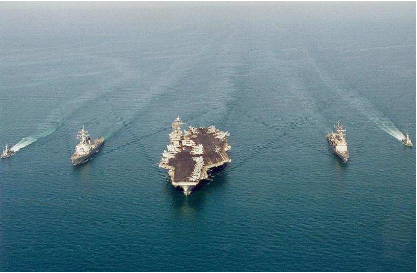

Figure $14.1$: Wakes at sea.1 (Public Domain; Christian Eskelund US Navy)

:::{figure} ../images/lt-32815-clipboard_eaae3208db2c1521bd56f4338731023b4.png
:label: fig-14-2
:enumerator: 14.2
:alt: A wake at sunset.

A wake at sunset.
:::

© Source unknown. All rights reserved. This content is excluded from our Creative Commons license. For more information, see [https://ocw.mit.edu/help/faq-fair-use](https://ocw.mit.edu/help/faq-fair-use).

like the approach to diffraction in chapter 13), and I think it gives a useful slant not just on the wake, but also on the crucial concept of group velocity.

### Linear analysis of the Kelvin wake

Consider an infinite ocean in the $x$-$y$ plane with a boat (duck, whatever) moving with constant velocity $v > 0$ along the $x$ axis. The path of the boat divides the surface of the ocean into two regions, related to one another by reflection in the path. We can therefore without loss of generality focus on the half-plane $y > 0$. We will not try to describe in detail what goes on near the $y = 0$ line. In many situations, this involves turbulance, and is well beyond the scope of a beginning waves course. But away from $y = 0$, it is possible to apply a linear analysis, and think of the waves for $y > 0$ as linear combinations of plane waves with appropriate boundary conditions along the $y = 0$ line.3 We will assume that whatever happens near $y = 0$ produces a localized disurbance on the $y$ axis that moves along with the boat. This is necessarily a wave packet involving a range of frequencies. The integration over all these frequencies gives rise to the wake. That is the plan. We will do this for some simple illustrative boundary conditions, and we will argue that much can be understood about the system that is independent of the details of the boundary condition. The idea is to make use of the fact that the disturbance is a wave packet, and understand the appropriate analog in this two dimensional situation of the group velocity by which wave packets move.

This system is invariant under simultaneous translations in space and time. 
$$
t \rightarrow t+\tau \quad x \rightarrow x+v \tau
$$

We are looking for a steady-state solution in which the only things going on are the waves induced by the motion of the boat. This solution should depend only on the combination 
$$
x-v t
$$

and be invariant under (14.1). This means that the wake wave is stationary in a frame of reference moving along with the boat.

An equivalent (and perhaps more physical) way to say this is that the solution that describes only the waves produced by the moving boat is a linear combination of plane waves which are moving along with the boat in the $x$ direction — that is they have $k_{x}=\omega / v$.

Either way, the general solution looks like 
$$
\int d \omega f(\omega) e^{-i\left[\omega(t-x / v)-k_{y} y\right]}
$$

The function $f(\omega)$ describes the wave packet in frequency, and it is determined by the displacement of the wave packet at $y = 0$ and $t = 0$, through the Fourier transform 
$$
\psi(x)=\int d \omega f(\omega) e^{i \omega x / v} \Rightarrow f(\omega)=\frac{1}{2 \pi} \int d \tau \psi(v \tau) e^{-i \omega \tau}
$$

The relation between $\omega$ and 
$$
k=\sqrt{k_{x}^{2}+k_{y}^{2}}
$$

is given by the dispersion relation for water waves. It will turn out that it is usually a good approximation to ignore surface tension, so will use a simple approximation in which the dispersion relation depends only on gravity. We will also assume that the water is deep. Then the dispersion relation is simply 
$$
\omega^{2}=g k
$$

The magnitude of the phase velocity is thus 
$$
v_{\phi}=\frac{\omega}{k}=\frac{g}{\omega}
$$

Note that coefficient of the right hand side in the dispersion depends on the details of the physics, but the overall structure of the relation follows simply from dimensional analysis. The only combination of $g$ and $k$ with units of $\omega^{2}$ is $g$ $k$.

For (14.3), we have 
$$
k=\left(k_{x}^{2}+k_{y}^{2}\right)^{1 / 2}
$$

with 
$$
k_{x}=\omega / v
$$

Thus 
$$
\begin{gathered}
\omega^{4}=g^{2}\left(\omega^{2} / v^{2}+k_{y}^{2}\right) \\
k_{y}=\left(\omega^{4} / g^{2}-\omega^{2} / v^{2}\right)^{1 / 2}
\end{gathered}
$$

where the sign of the square-root is determined by the boundary condition at $y = +\infty$. If $k_{y}$ is real, $k_{y} / \omega$ is a positive number so that the phase waves in (14.3) propagate out from the $y = 0$ line. If $k_{y}$ is imaginary, it is i times a positive number, so that that the amplitude vanishes as $y \rightarrow+\infty$ for $y > 0$. These signs are opposite for $y < 0$, but nothing else in the analysis changes, so the solution is symmetrical about $y = 0$, as it must be.

Thus for $y > 0$, we have 
$$
\vec{k}=\left(k_{x}, k_{y}\right)=\left(\omega / v,\left(\omega^{4} / g^{2}-\omega^{2} / v^{2}\right)^{1 / 2}\right)
$$

and 
$$
\vec{k}=\left(k_{x}, k_{y}\right)=\left(\omega / v,\left(\omega^{4} / g^{2}-\omega^{2} / v^{2}\right)^{1 / 2}\right)
$$

This is the key to the Kelvin wake. The different frequency components of the wave packet at $y = 0$ travel in different directions as they move away from the boat for $y > 0$.

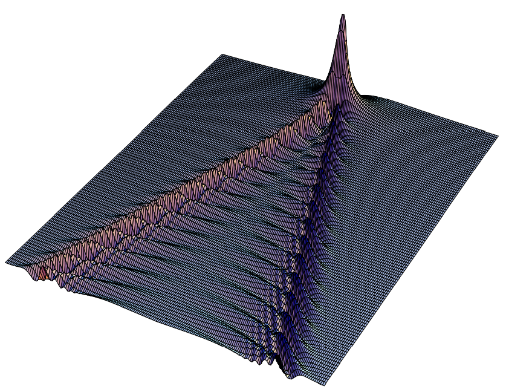

Figure $14.3$: A wake constructed numerically from (14.3) for $f(\omega)=e^{-\omega^{2} v / g}$.

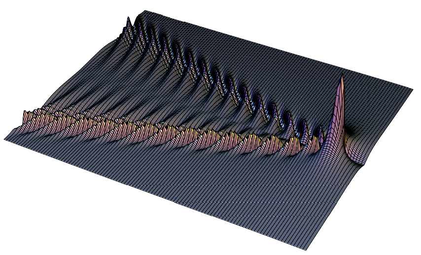

Figure $14.4$: Another view of the wake in Figure $14.3$.

We note in passing that the vector quantity $\vec{k} / \omega$ is a very important one, and it should probably have some important sounding name. It is sometimes called the “slowness vector” in the literature. This is the object that most naturally appears in the description of a plane wave with frequency $\omega$: 
$$
e^{-i \omega(t-\vec{r} \cdot \vec{k} / \omega)}
$$

“Slowness vector” does not seem to me to capture adequately the relation of this with the phase velocity, so I plan to start a campaign to call $\vec{k} / \omega$ the “phase segnocity” 
$$
\vec{s}_{\phi}=\frac{\vec{k}}{\omega}
$$

from the Latin *segnis* meaning slow, because the segnocity increases in magnitude as the points of constant phase on the wave move more slowly.4 The phase velocity itself can be easily constructed from the phase segnocity, (14.13), but it is really (14.13) that appears naturally in the equations.

We can calculate $f(\omega)$ given a boundary condition at $t = y = 0$, and then construct the wake numerically using (14.3). For illustration, consider a Gaussian $f(\omega)$, 
$$
f(\omega)=e^{-\omega^{2} v / g}
$$

which corresponds to a gaussian disturbance along $y = 0$. The resulting wake pattern is shown in $Figures \text { } 14.3$ and $14.4$. This looks like a wake! Thus we seem to have captured some of the essential physics of the wake in (14.3).

But what we are really interested in are the more general properties that will allow us to understand the key features of the wake without any numerical integration. We will look at how the various plane-wave components propagate. (14.11) implies that the wake waves propagate away from $y = 0$ only for 
$$
\omega^{2}>g^{2} / v^{2}
$$

We now need to think carefully about the physics of (14.3) and (14.12)-(14.13). In any small range of $\omega$, the integration over $\omega$ will produce some kind of wave packet that moves along with the boat. Different $\omega$ ranges are associated with wave packets moving out at different angles from the $x$ axis. **The envelope of a wave packet in a narrow range of frequency centered on $\omega$ will move at the effective group velocity, $v_{g}$, constructed as follows**
$$
\vec{s}_{g}=\frac{\partial \vec{k}}{\partial \omega}=\frac{\hat{v}_{g}}{\left|\vec{v}_{g}\right|}=\left(\frac{1}{v}, \frac{2 \omega^{3} / g^{2}-\omega / v^{2}}{\left(\omega^{4} / g^{2}-\omega^{2} / v^{2}\right)^{1 / 2}}\right)
$$

**and this determines the angle of the wave packet as a function of $\omega$**. Again, as with (14.13), the object in (14.18) is **very important** and deserves a fancy name. I am going to call it the “group segnocity,” $\vec{s}_{g}$, because the envelope of the wave group moves more slowly as $\vec{s}_{g}$ increases. Suggestions for better names for $\vec{s}_{\phi}$ and $\vec{s}_{g}$ are welcome.

At this point, the reader may (justifiably) wonder why the group velocity is not the conventional group velocity for water waves, 
$$
V_{g}=\frac{\partial \omega}{\partial k}
$$

where the relation between $\omega$ and $k$ is given by (14.6) so that 
$$
V_{g}=\frac{g}{2 \omega}=\frac{v_{\phi}}{2}
$$

This gives a group velocity in the same direction as the phase velocity and just half the magnitude. To understand the difference, we must generalize the the formula for group velocity in section 10.2.1. There we saw that simplest way to understand group velocity is to think about the superposition of two plane waves that are close together in both $\omega$ and $\vec{k}$ 
$$
\begin{gathered}
\cos \left(\omega_{1} t-\vec{k}_{1} \cdot \vec{r}\right)+\cos \left(\omega_{2} t-\vec{k}_{2} \cdot \vec{r}\right) \\
=2 \cos \left(\frac{\omega_{1}-\omega_{2}}{2} t-\frac{\vec{k}_{1}-\vec{k}_{2}}{2} \cdot \vec{r}\right) \cos \left(\frac{\omega_{1}+\omega_{2}}{2} t-\frac{\vec{k}_{1}+\vec{k}_{2}}{2} \cdot \vec{r}\right)
\end{gathered}
$$

If the $\omega s$ and $\vec{k} s$ are close together, the first factor is a slowly oscillating envelope, like the envelope of the wave packet, with segnocity vector 
$$
\vec{s}_{-}=\frac{\vec{k}_{1}-\vec{k}_{2}}{\omega_{1}-\omega_{2}}
$$

The second factor describes the more rapidly oscillating carrier wave, with segnocity vector 
$$
\vec{s}_{+}=\frac{\vec{k}_{1}+\vec{k}_{2}}{\omega_{1}+\omega_{2}}
$$

If $\vec{k}_{1}$ and $\vec{k}_{2}$ arise from a well defined smooth function $\vec{k}(\omega)$, 
$$
\vec{k}_{1}=\vec{k}\left(\omega_{1}\right) \quad \text { and } \quad \vec{k}_{2}=\vec{k}\left(\omega_{2}\right)
$$

then 
$$
\lim _{\omega_{1}, \omega_{2} \rightarrow \omega} \vec{s}_{-}=\vec{s}_{g} \quad \text { and } \quad \lim _{\omega_{1}, \omega_{2} \rightarrow \omega} \vec{s}_{+}=\vec{s}_{\phi}
$$

as expected from (14.18). But this depends on what is being held fixed between $\vec{k}_{1}$ and $\vec{k}_{2}$ as $\omega$ changes. The point is the usual one that in one dimension, the dispersion relation determines $k(\omega)$ up to a sign. But in more than one dimension, infinitely many $\vec{k} s$ satisfy the dispersion relation for a given $\omega$. We must specify exactly how the function $k(\omega)$ is determined before the limit in (14.25) is well defined. Thus (14.18) is the general formula for the group velocity. But what the derivative means (in more than one dimension) depends on the situation. The conventional physics assumes that all the frequency components of the wave are in the same direction. Then the direction of the $\vec{k}$ vector does not change with $\omega$, and (14.18) reduces to (14.19).5 But for a wave driven by the moving boat, what is held fixed is not the direction of the waves, but rather the $x$ component of the segnocity vector, $k_{x} / \omega$, because all the components of the wave packet move along with the boat that produces them. Then the condition (14.9) and the dispersion relation (14.6) taken together force the direction of the $\vec{k}$ vector to change as a function of $\omega$. Thus we must use the general form, (14.18). As we will see, this implies that the effective group velocity not only has a very different magnitude from the conventional (14.20), but also that the effective group velocity and the phase velocity are not even in the same direction.

The red lines in Figure $14.5$ show the position of the wave packet corresponding to $\omega = 1.05 g / v$. The cyan vectors show the group velocities for $y > 0$ and $y < 0$. These are perpendicular to the lines of the wave packets. If we take the origin to be the position of the boat (either instantaneously or by going to a moving coordinate system in which the boat is stationary at the origin), The points $\vec{r}$ on the wave packet satisfy 
$$
\vec{r} \cdot \hat{v}_{g}=0
$$

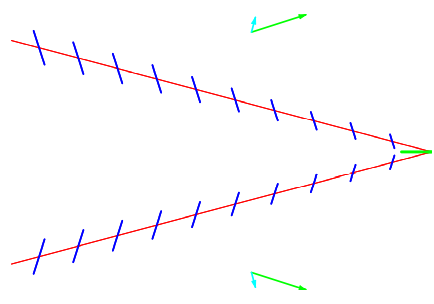

Figure $14.5$: Wave packets (red) and phase waves (blue) for $\omega \approx 1.05 \mathrm{~g} / \mathrm{v}$.

Note also that because of (14.18), 
$$
\vec{r} \cdot \frac{\partial \vec{k}}{\partial \omega}=0
$$

But there is additional structure within the wave packet because of the phase waves. The phase velocities are shown by the green vectors, and are not in the same direction as the group velocity. Thus there are oscillations along the wave packet corresponding to maxima and minima of the phase waves. Assuming that the maximum occurs at the position of the boat (that we are taking to be the origin), the other maxima occur at 
$$
\vec{r}_{j} \cdot \vec{k}=-2 \pi j \quad \text { for } j=1 \text { to } \infty
$$

These maxima represent the interaction of the plane wave with frequency $omega$ (and moving along with the boat) and the group wave packet, so we indicate them in the figure by blue lines of constant phase perpendicular to $\vec{k}$.

Now we can build up a picture of the wake by putting these together for the range of important $\omega$. As $\omega$ changes, the direction of the red wave packet lines and the blue phase waves will change according to (14.27) and (14.12). For $\omega \approx g / v$, the wave packets are nearly horizontal and the phase waves are moving nearly horizontally. This is shown in Figure $14.6$ for $\omega=1.001 \mathrm{~g} / \mathrm{v}$: As $\omega$ increases, the angle of the wave packets increases for a while, giving a situation like that shown in Figure $14.5$. But the interesting thing is that there is a critical value of $\omega$ that gives the maximum angle for the group velocity.

It is particularly simple to analyze (14.18) because $\partial k_{x} / \partial \omega$ is constant. The $\omega$ dependence of $\partial k_{y} / \partial \omega$ is shown in Figure $14.7$ Because it goes to infinity as $\omega \rightarrow g / v$ and as $\omega \rightarrow \infty$, in these two limits the group velocity goes to zero, and its direction goes to $\hat{y}$. The minimum of $\partial k_{y} / \partial \omega$ corresponds to the maximum of $\left|\vec{v}_{g}\right|$, and also to the maximum angle of the wake wave propagation from the $y$ direction. This maximum angle is particularly important for two reasons. Not only does the maximum angle correspond to the edge of the

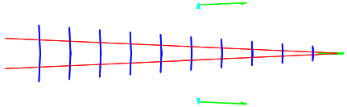

Figure $14.6$: Wave packets (red) and phase waves (blue) for $\omega \approx 1.001 \mathrm{~g} / \mathrm{v} .$.

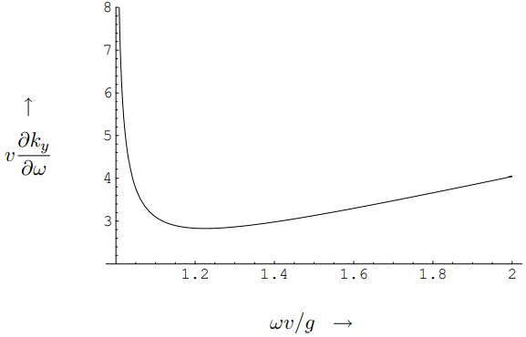

Figure $14.7$:

disturbance produced by the boat, but more importantly, at all smaller angles, the energy is spread over neighboring angles. At the maximum, because the angle is stationary with respect $\omega$, neighboring $\omega$ contribute constructively and the wave at the edge is generically much more intense than for smaller angles.6

To determine the maximum angle explicitly, we differentiate $\partial k_{y} / \partial \omega$ again, which gives 
$$
\frac{\partial^{2} k_{y}}{\partial \omega^{2}}=\frac{\left(\omega^{2} / g^{2}\right)\left(2 \omega^{4} / g^{2}-3 \omega^{2} / v^{2}\right)}{\left(\omega^{4} / g^{2}-\omega^{2} / v^{2}\right)^{3 / 2}}
$$

so the minimum occurs at 
$$
\omega^{2}=\frac{3 g^{2}}{2 v^{2}}
$$

corresponding to wave number 
$$
k=\frac{3 g}{2 v^{2}}
$$

and magnitude of phase velocity 
$$
v_{\phi}=\sqrt{\frac{2}{3}} v
$$

The direction of the phase velocity is is 
$$
\hat{v}_{\phi}=\left(\sqrt{\frac{2}{3}}, \sqrt{\frac{1}{3}}\right)
$$

at an angle from the $x$ axis of 
$$
\theta_{\max }=\arcsin (1 / \sqrt{3})=35.26^{\circ}
$$

The wavelength is 
$$
\lambda=\frac{4 \pi v^{2}}{3 g}
$$

Even at low speeds like a meter per second (about 2 knots), this wavelength is large compared to the scale (a few centimeters) at which surface tension becomes important in the dispersion relation, so (14.6) is usually a good approximation.

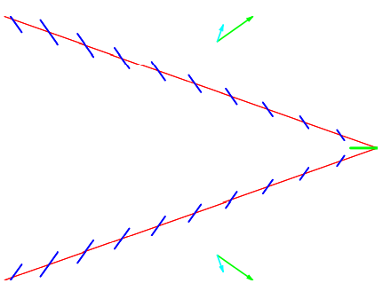

Figure $14.8$: Wave packets (red) and phase waves (blue) for the critical value $\omega \approx \sqrt{3 / 2} g / v$.

At the critical angle, our wave packets and phase waves are shown in Figure $14.8$. Often, as in the wakes in Figure $14.1$, the phase waves along the maximum angle are all you see.

For $\omega$ larger than $\sqrt{3 / 2} g / v$, the wave packet angles starts to decrease again but the phase waves continue to get closer together, as shown in Figure $14.9$ for $\omega=2 g / v$.

We can now put these together for a range of $\omega$ from $g / v$ up past the critical value. The result is shown in Figure $14.10$. It may be easier to see what is happening if we do not draw the wave packets, but just the phase waves. These, after all, show the places where the oscillation is a maximum. The result is shown in Figure $14.11$. This gives nearly the same

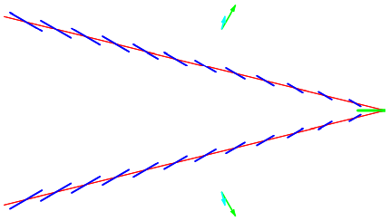

Figure $14.9$: Wave packets (red) and phase waves (blue) for $\omega \approx 2 g / v .$

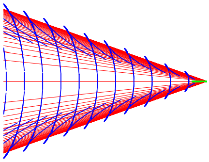

Figure $14.10$: Combined wave packets and phase waves for a range of frequencies.

picture as a parametric plot of the points on the waves packets where the phase waves have there maxima, which is shown in Figure $14.12$. You should be able to recognize the basic features of Figure $14.11$ both in our numerical construction, Figure $14.3$ and in the beautiful picture of a real wake from Wikipedia shown in Figure $14.13$ on page 436. We can make this even more obvious by rotating Figure $14.12$ in three dimensions, as shown in Figure $14.14$. In the wake in Figure $14.13$, the phase waves are clearly visible both for small $\omega$ (the forwardmoving waves in the center) and for large $\omega$ (the outward-moving and closely spaced waves just inside the maximum angle). From Figure $14.11$ and $14.13$ you should be able to see why the phase waves are sometimes called “featherlet waves.” The phase waves for $\omega>\sqrt{3 / 2} g / v$ look like delicate feathers on the wing of the wake.

It is worth making one more comment about Figure $14.11$. You have probably already noticed that the phase waves fit together into continuous curves. This is not an accident. Physically, of course, the position at which the oscillation is maximum must certainly vary

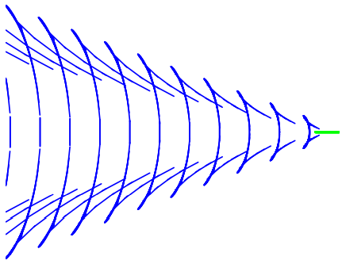

Figure $14.11$: Combined phase waves for a range of frequencies.

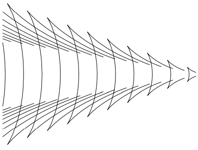

Figure $14.12$: Parametric plot of the phase maxima.

continuously as a function of $\omega$. But also, we can see that the tangent to the curve that describes the maxima is perpendicular to $\vec{k}$, and thus our phase waves in the figures are just these tangents. To see this, note that from (14.27) and (14.28), $\vec{r}_{j}$ satisfies 
$$
\vec{r}_{j} \cdot \vec{k}=-2 \pi j \quad \text { and } \quad \vec{r}_{j} \cdot \frac{\partial \vec{k}}{\partial \omega}
$$

Differentiating the first with respect to $\omega$ and using the second gives 
$$
\frac{\partial \vec{r}_{j}}{\partial \omega} \cdot \vec{k}=0
$$

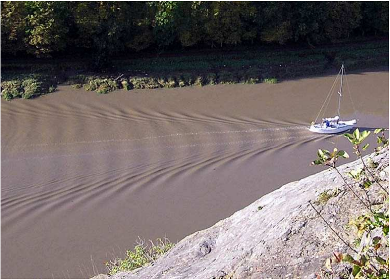

Figure $14.13$: Compare $Figures \text { } 14.3 \text {, } 14.11 \text {, } 14.12$ and $14.14$ with a real wake.

© Source unknown. All rights reserved. This content is excluded from our Creative Commons license. For more information, see [https://ocw.mit.edu/help/faq-fair-use](https://ocw.mit.edu/help/faq-fair-use).

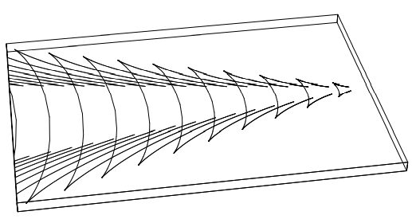

Figure $14.14$: 3D Parametric plot of the phase maxima.

which says that the tangent to the curve described parametrically by $\vec{r}_{j}(\omega)$ is perpendicular to $\vec{k}$ and thus parallel to the phase waves.7

2 This is one of many beautiful photographs by Ian Alexander - [http://easyweb.easynet.co.uk/](http://easyweb.easynet.co.uk/) iany/patterns/wake.htm.

3 One could, if necessary, look only at y > a > 0 for some fixed a. This would not change the analysis in any essential way.

4 The inspiration for this comes from paleontologists, who have fossil evidence for the segnosaurus - “slow lizard” and also the velocisaurus - “fast lizard.”

5 It looks different because in (14.18) we are looking at the group segnocity rather than the group velocity, but it is an elementary exercise in calculus to get from one to the other.

6 This pile-up at a stationary point is the same phenomenon that picks out the angle at which we see the rainbow.

## 14.2: Chapter Checklist

You should now be able to:

1. ****

### Problems
